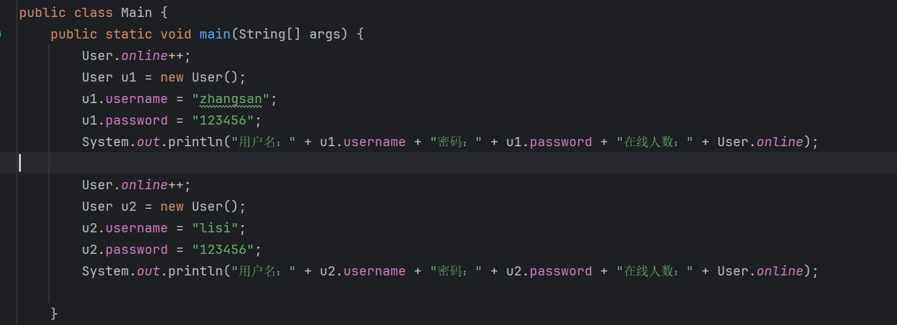
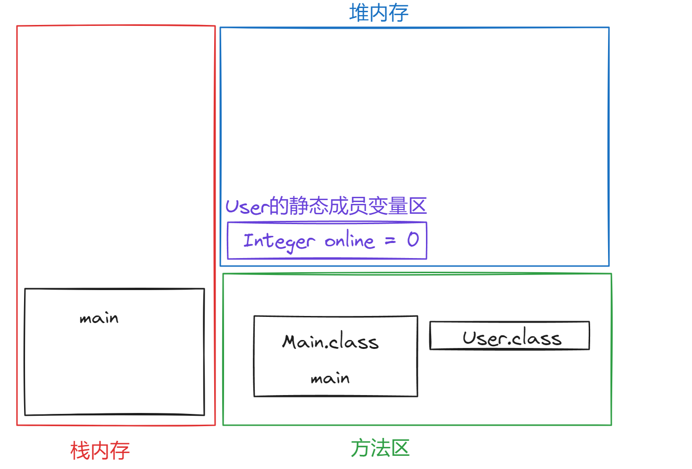

# static的特点

`static`是一个修饰符，可以修饰类的属性和方法。被修饰后的变量和方法有以下3中特点：

- 被类的所有对象所共享
- 多了一种调用方式，可以用类名调用(推荐用类名调用)
- 随着类的加载而加载，优先于对象存在


# 案例

创建一个student类：


创建两个对象，并赋值：


结果：


分别打印出了两个学生的信息。现在，想象一种情况，假设你承包了一个项目，这个项目是专门为清华大学定制的。这个项目需要为清华大学中的学生信息做管理，这是不是也就意味着每个学生的学校都是清华大学。

如果我们的代码是这样写的话，就会造成内存浪费：

```java
s1.school = "清华大学";
s2.school = "清华大学";
```

创建s1对象，堆内存开辟一个空间，产生一块地址，s1的三条数据都会存在空间中，s2对象同理。思考一个问题，两个对象的school属性的值都是一样的，但是它们都会在两块空间中占用地方，将来如果创建一万个学生对象，一万个对象就会有一万块空间，而他们的school属性都是一样的，但是却占了一万块地方。这就会造成内存浪费。

于是需要对代码优化，想象一下，school在这种情景下是不是共享的一份数据？根据static的特点1，被所有对象共享，因此我们可以用static来修饰school：


s1赋值school，s2共享：


结果：


static的特点2，直接用类名来调用：


也更推荐用类名来调用，因为这样有提示：

有提示：


无提示：


先于对象存在，随着类的加载而加载：

在创建对象之前就能调用，因为static数据，类的字节码一加载其实就已经存放在内存中了。


当类加载时，school也会加载：


# 变量何时加static

只需要考虑一个点，这份数据是否需要被所有对象共享。如果需要，那么就加static，如果不需要，那么没必要加static。

上面的school是一点，再举个例子，同时在线人数这个数据，也需要加static，想想看，同时在线人数是不是应该被所有用户所共享？我这里显示上线几人，你那边是不是也是一样的情况。


# static的内存情况

就用user对象来举例，创建一个User类：


其中，online表示同时在线人数，用static修饰。

测试代码：



每次实例化用户之前，让online自增，模拟用户登录的情况。

运行结果：


内存中的情况，首先准备栈内存、堆内存和方法区：


main是主方法，是程序的入口，所以先加载Main类的字节码到方法区：


随后main方法被虚拟机调用执行，进入栈内存：


接着执行main方法中第一行代码：


调用User类的静态变量自增，可是现在没有User类，所以用到就要去加载，将User的字节码文件加载到方法区：


User类加载之后，我们回忆一下static的特点3，随着类的加载而加载，所以只要User字节码进入内存，那么静态成员就已经存在了，因此staic修饰的online就会存在，它会存在哪里？在堆内存中有一块空间叫做User类的静态成员变量区：



online就存在在这块区中。由于是在堆内存中存放，因此存放的数据是有默认值的，Interger的默认值是null，此处为0是我手动修改的：


此时并没并没有new对象，online就已经存在，所以静态成员是优先于对象存在的。

第一行将online自增，onlien的值由0变成1：


第二行，先声明了User类型的u1变量，在main方法内部创建一个u1：


接着new一个User对象，有new进堆，所以堆中开辟空间产生地址，这块空间是根据User类创建的，User包含两个成员变量username和password，那么这块空间中也包含两个变量：


online有自己的区域，所以不会进入到对象区域中，username和password出现后有默认值null(毕竟在堆中)，然后将地址赋值给u1：


然后代码继续，username和password赋值，u1就根据这块地址找到这个对象的空间将username和password的值改为"zhangsan"和"123456"：


User对象区和User的静态成员变量区是有关联的，否则User对象如何找到它？(毕竟可以用对象调用静态成员变量，肯定有关联)，所以User对象区是能找到User的静态区的：


然后打印出信息，u1根据地址找到对象区中的username和password，然后打印出来，User类找到静态区中的onlien打印出来，此时onlien为1，打印出来为1：


然后下一行，由执行了online++，所以静态区的onlien由1变为2：


下一行，在main方法中声明User类型的u2变量，开辟对象区，产生成员变量，赋予默认值，将对象区地址赋值给u2：


同理，新的User对象区也与静态区关联：


代码继续执行，u2根据地址找到对象区将username和password改为"lisi"和"123456"：


然后打印，u2根据地址找到对象区中的username和password打印，User找到静态区的online打印，此时online为2，所以打印出来为2：


以上就是将static在内存中的细节梳理了一遍，static的特点1，被static修饰的成员被该类所以对象共享，体现在：


两个对象区同时与静态区关联。

特点2静态成员会随着类的加载而加载，只要类的字节码进入内存，那么静态成员已经存在与堆中，就已经可以使用了。


# 方法何时加static

一般在编写工具类时会将方法修饰为static。

什么是工具类？先看一个案例：

编写一个类`ArrayUtil`，内部定义三个方法：

1. 从数组中找到最大值
2. 从数组中找到最小值
3. 打印数组所以元素，格式为[value1, value2, value3, ...]

```java
public class ArrayUtil {

    public Integer getMax(Integer[] arr) {
        int result = arr[0];
        for (int i = 1; i < arr.length; i++) {
            if (arr[i] > result) {
                result = arr[i];
            }
        }
        return result;
    }

    public Integer getMin(Integer[] arr) {
        int result = arr[0];
        for (int i = 1; i < arr.length; i++) {
            if (arr[i] < result) {
                result = arr[i];
            }
        }
        return result;
    }

    public void printArray(Integer[] arr) {
        String result = "[";
        for (int i = 0; i < arr.length - 1; i++) {
            result += arr[i] + ", ";
        }
        result += arr[arr.length - 1] + "]";
        System.out.println(result);
    }
}
```

使用这些方法：


结果：


执行没有问题。但想想看这个`ArrayUtil`存在的价值是什么？不就是创建对象调用方法操作数组吗？没错，但是这个类中的所有的方法是不是都是给别的类提供服务的？它完全就是一个打工人的角色，这个类能封装数据吗？显然不能，这个类的所有方法都是为别的类而存在，那么这种类就是工具类。

工具类既然是提供服务的，那么调用它提供的方法时自然是越方便越好。在上面的案例中，调用方法之前需要先创建`ArrayUtil`对象，这一步是不是可以省略，直接用类名调用会更加方便，所以将工具类的所有方法都用static修饰：


直接类名调用：


如果一个类中所有方法都是静态的，那么对象的创建还有意义吗？没有意义，方法都可以直接用类名调用，创建对象又有何用？而且还占内存。因此，当类中的所有方法都是静态时，通常会多做一步操作，私有该类的构造方法，目的就是防止别人创建该类的对象：


`System`类，它的方法`exit`，调用该方法能退出当前正在运行的JVM虚拟机。`exit`方法是通过类名直接调用的，因此该方法是一个静态方法：


另外`System`类中的所有方法都是静态的：


因此该类私有了构造方法：


# 注意

在一个静态的方法中，只能访问静态的成员(直接访问)。


这很好理解，`static`修饰的成员会随着类的加载而加载，也就是说，当类被加载到内存中时，它的静态成员就已经存在了，既然存在，他们之间自然能访问。但是非静态成员是随着对象的创建而创建，一个类在加载时，不一定创建了对象，即非静态成员不一定存在，既然不存在，静态成员自然不能访问非静态成员。

`static`中不允许使用`this`。`this`表示当前的实例的引用，实例是什么？是对象，也就是需要对象创建了`this`才会存在。`static`是优先于对象存在的，此时还没有创建对象，`this`还不存在，所以才不允许使用`this`。


# 重新认识main方法

```java
public static void main(String[] args){
    
}
```

- 为什么使用`public`？因为`main`需要被JVM调用，为了JVM能访问到，所以访问权限必须足够大。
- 为什么使用`static`？因为`main`需要被JVM调用，为了JVM调用方便，用`static`修饰可以直接类名调用
- 为什么是`void`？因为被JVM调用，不需要给JVM返回值。
- 为什么方法名是`main`？因为JVM只认识这个方法名
- 为什么用`String[] args`？以前用于接受键盘的录入，现在没用，但是习惯了，于是保留了下来。


# 总结

> 1. `static`的特点：
>    - 被类的所有对象所共享。
>    - 多了一种调用方式，可以用类名调用(推荐用类名调用)。
>    - 随着类的加载而加载，优先于对象存在。
> 2. 变量何时加`static`？
>    - 这份数据是否需要被所有对象共享。如果需要，那么就加static，如果不需要，那么没必要加`static`。
> 3. 方法何时加`static`?
>    - 一般在制作工具类时会加`static`。
> 4. 什么是工具类?
>    - 不是用来描述事物的，而是帮助完成事情的类叫做工具类。
> 5. 如果类中的所有方法都是静态的，那么会私有化构造，防止别人创建对象。
> 6. 注意：
>    - 在一个静态的方法中，只能访问静态的成员(直接访问)。
>    - `static`中不允许使用`this`