# 代码块

> 使用【{ }】括起来的代码被称为代码块。

代码块分类：

- 局部代码块
- 构造代码块
- 静态代码块
- 同步代码块

本章只介绍前三种代码块，同步代码块涉及到多线程，后续接触多线程再细说。

# 局部代码块

**局部**和方法有关系，因此局部代码块的位置就是方法中的一对【{ }】。

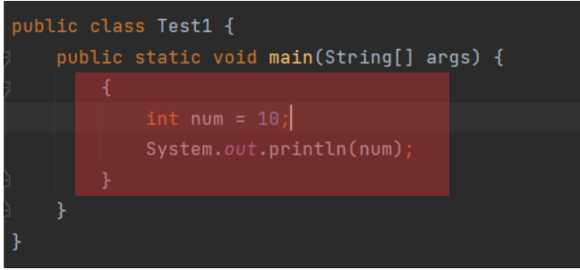

运行：

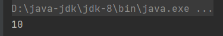

## 作用

> 限定变量的生命周期，提早释放内存。

当局部代码块中的代码执行完成后，内部声明的变量就会从内存中释放出去。即，无法在局部代码块外调用变量：

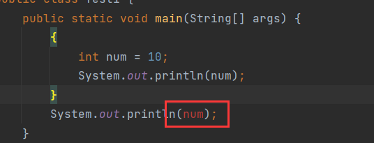

Debug执行，此时内存中还有【num】：

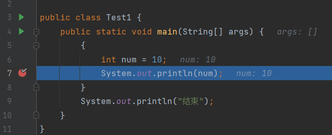

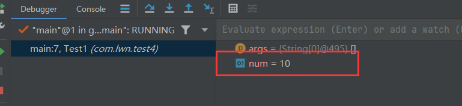

执行完成，释放【num】：
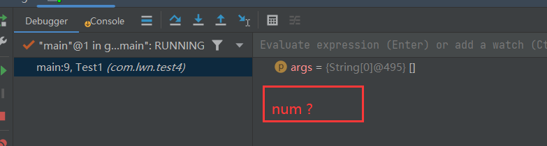

# 构造代码块

构造代码块的位置为类中方法外的一对【{}】。

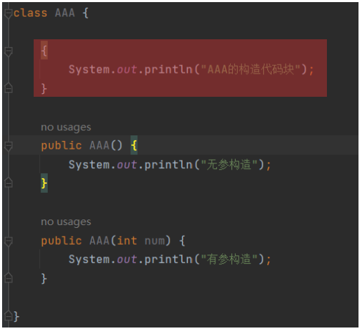

执行时机：

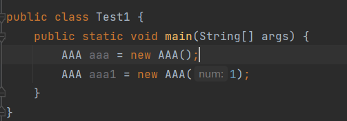

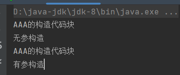

当创建对象，调用构造方法时执行构造代码块，且**优先**于**构造方法**执行。

在编译的字节码文件中：

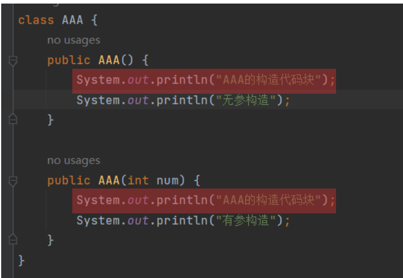

会将构造代码块中的内容分别插入所以构造方法中，且插入的位置在原构造代码之前，所以优先于构造执行。

## 作用

> 将多个构造方法中重复的部分抽取到构造代码块中，提高代码复用性。

# 静态代码块

位置：类中方法外的一对【{}】，且被【static】修饰：

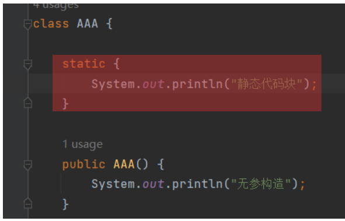

静态代码块会随着类的加载而加载，所以它的执行时机为：当类加载时，静态代码块执行。

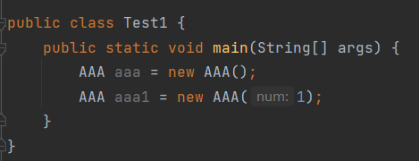

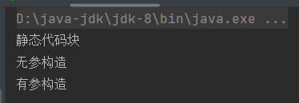

当创建【aaa】对象时，加载【AAA】字节码文件，静态代码块执行，而字节码文件只加载一次，所以静态代码块也只执行一次。

## 特点

> 随着类的加载而执行，且只执行一次。

## 作用

> 对数据进行初始化。

比如，【AAA】中有一个属性被所以对象共享，因此将其声明为静态，那么当【AAA】加载时，就确定下来该属性的值：

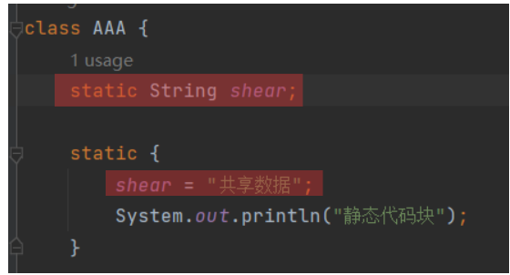

为何不直接赋值：

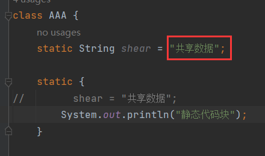

当前在静态代码块中赋值只是针对于字符串这种简单的数据，如果需要赋值的是一个对象类型，且对象的创建很赋值，那么可以借助于静态代码块。

比如，变量需要接收一个【HashMap】，并为其初始化。如果直接赋值给变量：
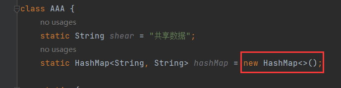

那么这个变量所引用的【HashMap】对象中并没有存储任何数据。此时可以继续在静态代码块中为【HashMap】对象初始化数据：
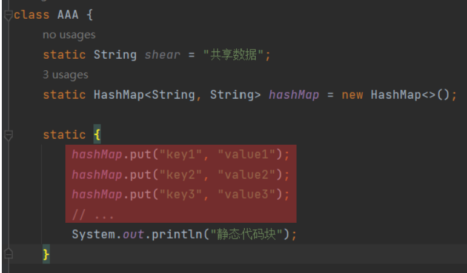