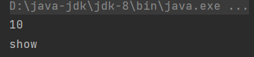

# 内部类

> 内部类就是定义在一个类里面的类。

比如：

```java
class A {
    // 内部类
    class B {
        
    }
}
```

## 内部类创建对象

内部类创建对象的语法：

```java
外部类名.内部类名 对象名 = new 外部类对象().内部类对象();
```

比如：

```java
A.B b = new A().new B();
```

- **为什么定义内部类对象如此复杂？**

  是为了区分同名内部类，比如两个类中都定义了同名内部类，那么就通过外部类名作为标识来区分内部类。

```java
/*
A 和 C 中都有 B 类，于是通过 A.B 和 A.C 类区分
*/
class A {
    class B {}
}

class C {
    class B {}
}
```


# 成员访问细节

内部类与外部类成员访问的细节，代码材料：


创建内部类对象：


调用内部类的成员：




## 内部类访问外部类成员

> 直接访问，包括私有成员。


## 外部类访问内部类成员

> 不能直接访问，需要通过内部类对象访问。


注意，在外部类中并没有通过外部类名标识创建内部类对象，而是直接创建，因为外部类能直接找到它内部的成员，不存在同名内部类的情况。


# 案例

当外部类和内部类中成员变量重名时，如何访问？

代码材料：


外部类、内部类和内部类方法中都存在同名变量`num`，需要输出30、20和10。

输出30很简单，就近原则，直接访问局部变量`num`：


20是内部类中的成员，当前方法是内部类的方法，所以可以通过`this`来访问20：


如何访问10？10是外部类的成员变量，访问20可以通过`this`即当前实例`Inner`。要访问10，也可以通过`Outer`实例。关键是如何获取`Outer`的实例，用`this`不行，因为此处的`this`指代的是`Inner`。所以要区分`this`，只需用`Outer`类名标识`this`即可表示`Outer`实例：


# 内部类种类

> 1. 成员内部类
> 2. 静态内部类
> 3. 局部内部类
> 4. 匿名内部类

上述所讲的就是成员内部类，它的位置和成员方法、变量是一个位置。


# 静态内部类

> 由`static`修饰的成员内部类。

比如：

```java
class Outer {
   	// static 修饰
    static class Inner {}
}
```

普通类不能被`static`修饰，只有内部类才能，因为内部类是外部类的一个成员，所以可以被修饰。

## 创建对象

```java
外部类名.内部类名 对象名 = new 外部类名.内部类对象();
```

比如：

```java
Outer.Inner in = new Outer.Inner();
```


如果调用的方法是静态的，可以直接类名调用：


## 注意

> 静态只能访问静态，所以在静态内部类中访问外部类的成员时，能直接访问静态成员，但是不能直接访问非静态成员，如果要访问非静态成员，需要外部类对象。


# 局部内部类

> 定义在方法、代码块、构造器等执行体中的类。

比如定义在方法中的类：


如何创建局部内部类的对象？用外部类标识吗？

不行，因为这个类存在于方法中，只有当方法执行时，这个类才会存在，所以要创建该对象需要在方法中创建：


调用其`method()`，也要在`show()`中：


而要执行还得调用`show()`：


可谓麻烦至极，这个语法非常鸡肋，用的人也很少。