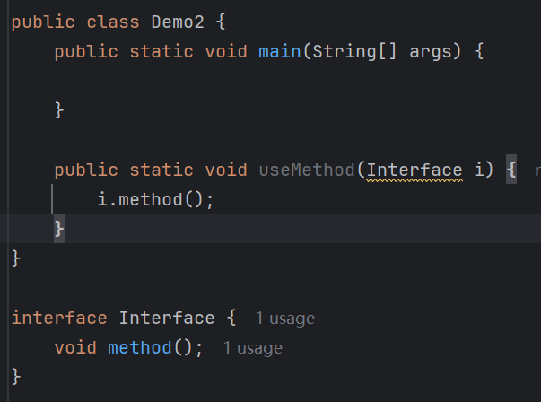
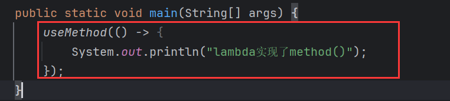
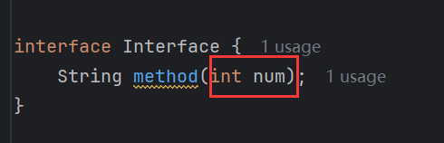

# Lambda

> Lambda表达式是JDK8开始后的一种新语法形式。

<font color='#F56C6C'>**作用**</font>：简化匿名内部类的写法，可以看作是匿名内部类的语法糖。

语法：

```java
() -> {}

(匿名内部类中被重写方法的形参列表) -> {
    被重新方法的方法体
}
// 注：->是语法形式，无实际含义
```


结果：


有形参的：


## 局限性

并不是任何时候都能用`lambda`来简化匿名内部类的声明，因为匿名内部类本质上是在实现接口或继承类，那么就要重写接口或类中的所有抽象方法，而`lambda`又是匿名内部类的语法糖，自然也是在实现接口或继承类，那么也需要重写接口或类中的所有抽象方法，观察`lambda`的语法结构，它不支持编写多个方法体，也就不支持实现多个抽象方法，只能实现一个抽象方法。所以当接口或类中只有一个抽象方法时，可以使用`lambda`，否则不能使用：

当接口有多个抽象方法时：


`lambda`报错：


# 函数式接口

> 有且只有一个抽象方法的接口就是函数式接口，`lambda`语法作用的接口只能是函数式接口。

## @FunctionalInterface

`@FunctionalInterface`，能校验一个接口是不是函数式接口，如果不是，则注解会报错：

注解报错，不是函数式接口：


是函数式接口：


# lambda省略规则

> 1. 参数类型可以省略不写。
> 2. 如果只有一个参数，参数类型可以省略，同时`()`也可以省略。如果`Lambda`表达式的方法体代码只有一行代码，可以省略大`{}`，同时省略`;`，此时，如果这行代码是`return`语句，必须省略`return`不写，同时也必须省略`;`不写。
> 3. 如果没有参数，`()`不能省略。

代码材料：



`lambda`表达式实现`method()`：



结果：


> 如果没有参数，`()`不能省略，否则报错。


> 如果`Lambda`表达式的方法体代码只有一行代码，可以省略大`{}`，同时省略`;`。


如果不省略`;`，会报错：


> 此时，如果这行代码是`return`语句，必须省略`return`不写，同时也必须省略`;`不写。


返回`String`，只有一句代码的情况下`Lambda`中如果省略掉`{}`，那么必须省略掉`return`和`;`，否则报错：

未省略`{}`情况：


省略`{}`报错：


这种情况下必须同时省略`return`和`;`：


> 参数类型可以省略，仅当只有一个参数时，可省略`()`，否则不能省略`()`。




# 和匿名内部类的区别

> 1. 使用区别
>    - 匿名内部类能操作类和接口
>    - `lambda`只能操作函数式接口，即不能操作类
> 2. 实现原理不同：
>    - 匿名内部类编译后会产生一份单独的`.class`文件
>    - `lambda`编译后不会产生单独的`.class`文件