# 窗体对象

构建一个窗体需要通过`JFrame`对象：

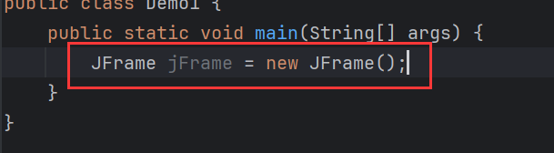

## setVisible()

窗体创建后并不会展示，需要通过`setVisible()`方法，设置窗体的可见性，传入`true`表示可见：
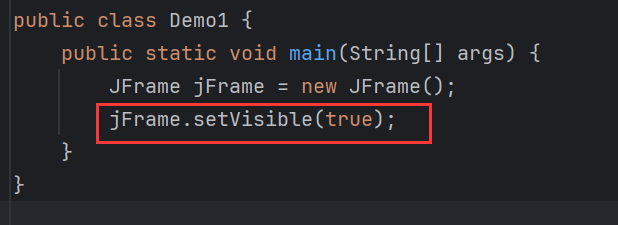

窗体：

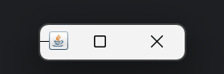

## setSize()

`setSize()`设置窗体的大小，接受两个参数：宽、高，单位是`px`：

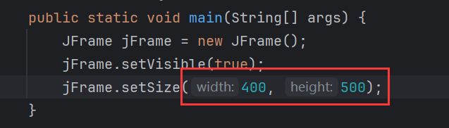

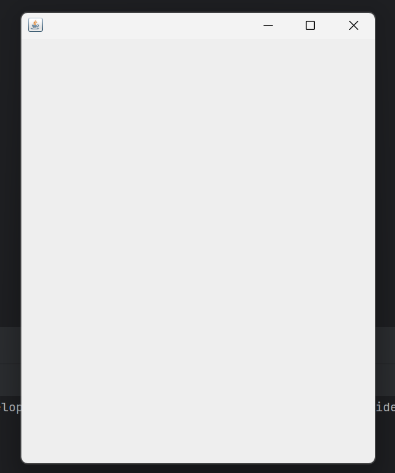

## setDefaultCloseOperation()

窗口关闭，程序不会关闭：

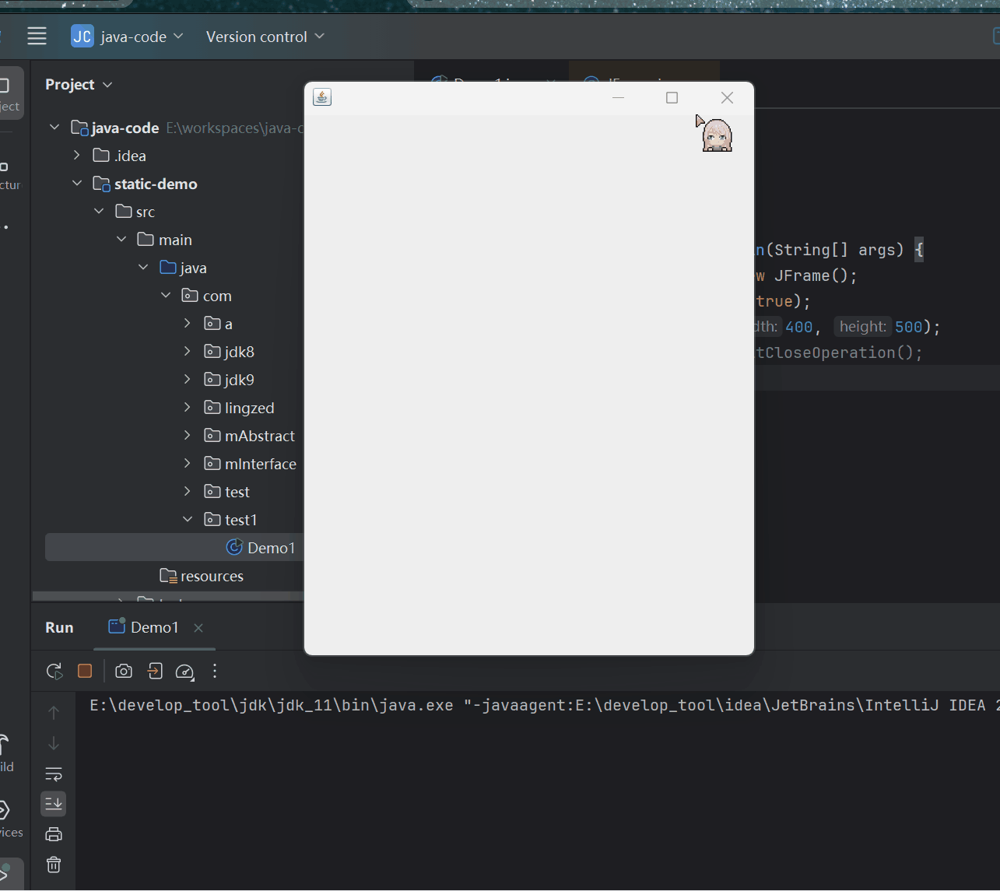

可以通过`setDefaultCloseOperation()`设置关闭项，方法接受`int`类型参数，值如下：

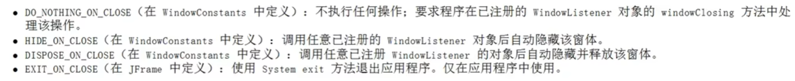

默认情况下，使用的是`HIDE__ON_CLOSE`，也就是有隐藏窗体，即关闭窗口并么有正在的关闭而是隐藏，要让窗口关闭同时停止程序，需要使用`EXIT_ON_CLOSE`，它直接调用`System.exit()`,通过关闭JVM来停掉程序，这些参数值在`WindowConstants`接口中：

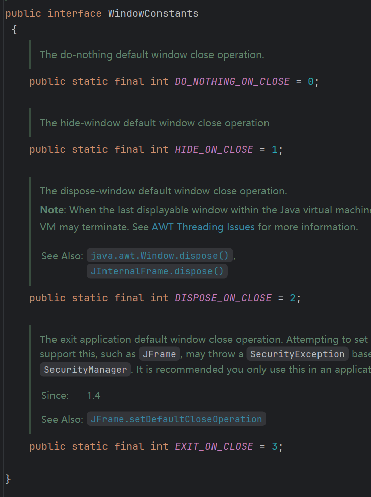

是常量，直接调用：

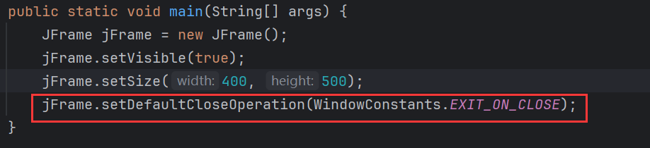

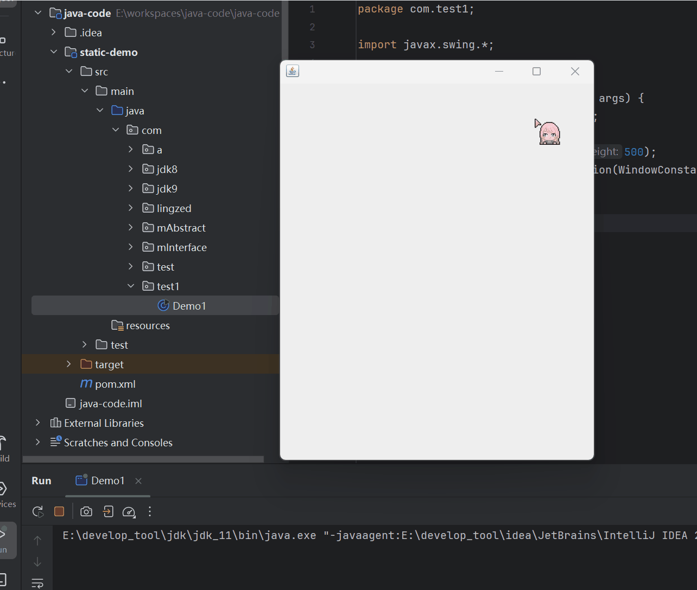

## setTitle()

`setTitle()`设置标题：

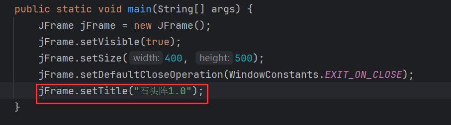

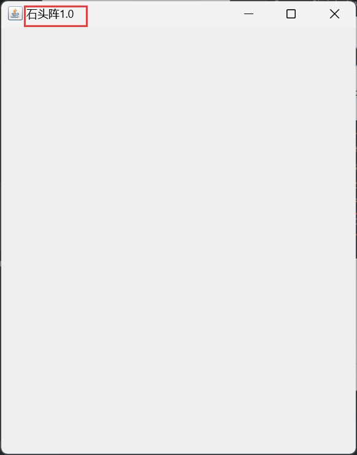

## 细节

`setVisible()`建议放到最后，等窗体中的元素都加载完成后再展示窗体：

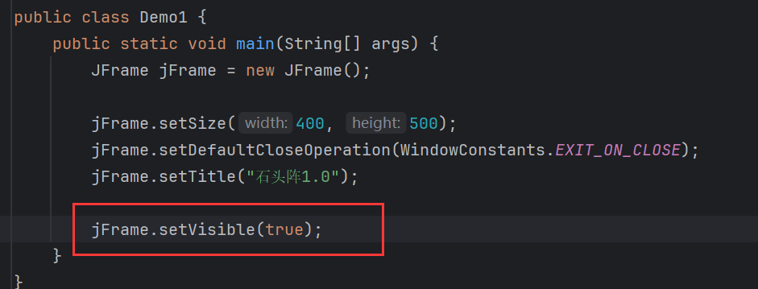


# 组件

> 在窗体中放置的内容都可以称为组件，比如按钮、图片、文本等。、

## 面板对象

组件需要放到面板对象中，而面板对象可以通过窗体对象获取：

```java
// 获取 面板对象
窗体对象.getContentPane();
```

添加组件：

```java
// 通过面板对象的 add() 将组件添加到面板中
面板对象.add(组件对象)
```

## 按钮组件

按钮通过`JButton`对象创建，它的构造方法：

|         构造         |            作用            |
| :------------------: | :------------------------: |
|      JButton()       | 创建一个无文本或图标的按钮 |
| JButton(String text) |    创建一个带文本的按钮    |

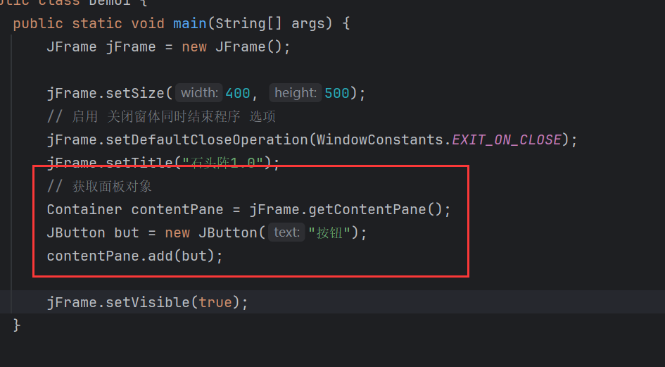

 效果：

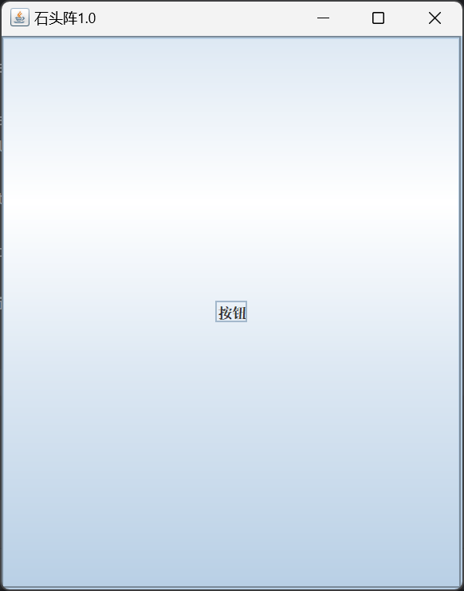

按钮撑满了整个窗体。

## 布局

> 窗体默认为面板制定布局方式，方式为撑满，如果要自定义布局，需要先关闭默认布局。

取消默认布局：

```java
// 调用窗体的 setLayout() 取消默认布局
窗体对象.setLayout(null);
```

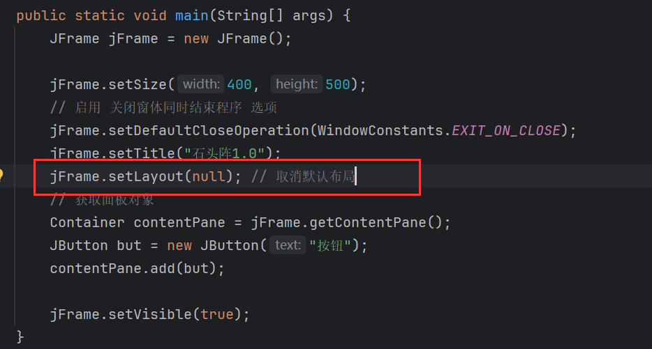

效果：

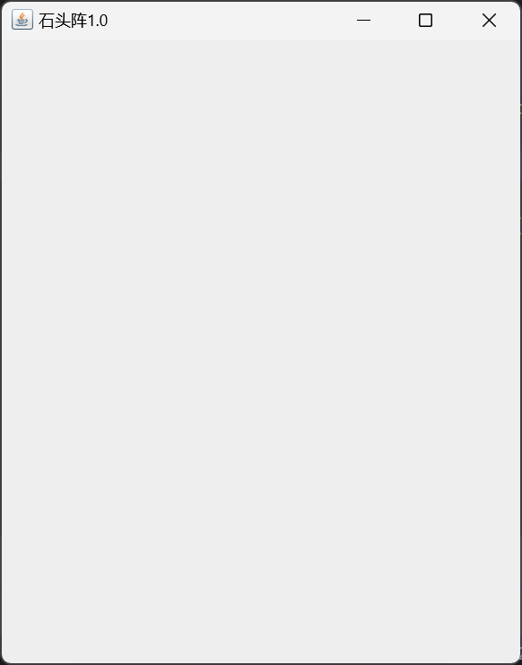

按钮消失了，因为一开始按钮是按照默认布局排布，现在默认布局被取消了，所以按钮不知道怎么排布，因此面板才中没有按钮。取消了默认布局，就需要手动布局才能显示组件。

手动布局不是通过窗体对象设置，而是组件对象本身来设置，即有组件告诉面板自己应该放到哪个位置：

```java
/* 
通过组件对象 setBounds() 来设置组件在面板中的布局
x，y 指定组件的 横纵坐标，原点 在组件的 左上角
width，height 指定组件的 宽高
*/
组件对象.setBounds(int x, int y, int width, int height);
```

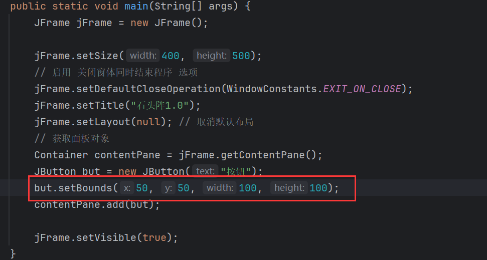

效果：

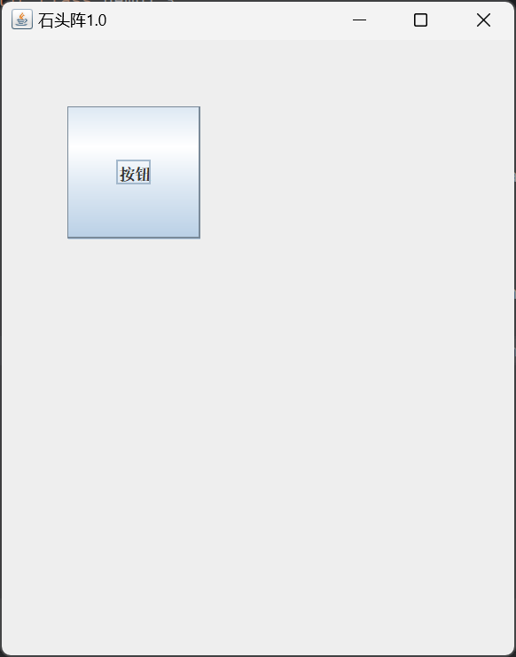

## JLabel组件

> 用于展示<font color='#F56C6C'>**文本**</font>和<font color='#F56C6C'>**图片**</font>。

`JLabel`是窗体中的一块区域，创建一个`JLabel`就是在窗体中开辟了一块区域，文本和图片不能直接放到面板中，必须放在`JLabel`中。

`JLabel`的构造：

|        构造         |                作用                |
| :-----------------: | :--------------------------------: |
| JLabel(String text) |  使用指定的文本创建一个JLabel对象  |
| JLabel(Icon image)  | 创建一个具有指定图像的JLabel对象。 |

展示文本：

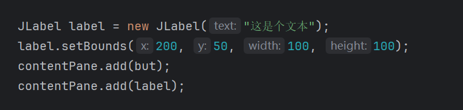

效果：

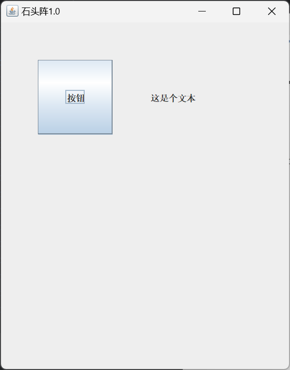

文本是放在`JLabel`中的，`JLabel`是一块区域，文本默认居中，背景颜色默认是透明的。

展示图片：

用`JLabel(Icon image)`，接受`Icon`类型的参数，其是一个接口，它有一个实现类`ImageIcon`，这个类的构造接受一个`String`类型的参数，就是图片的路径：

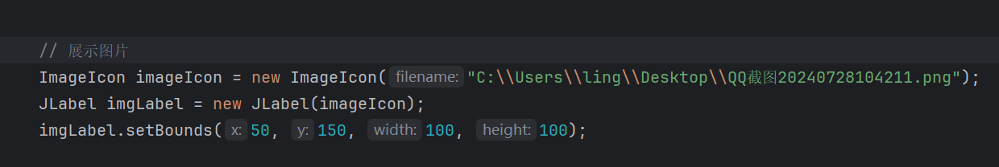

效果：

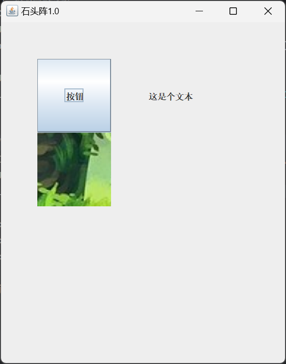

组件覆盖，当多个组件在同一个位置时，覆盖层次为：最先添加的组件在最上面。

两张图片位置一样：

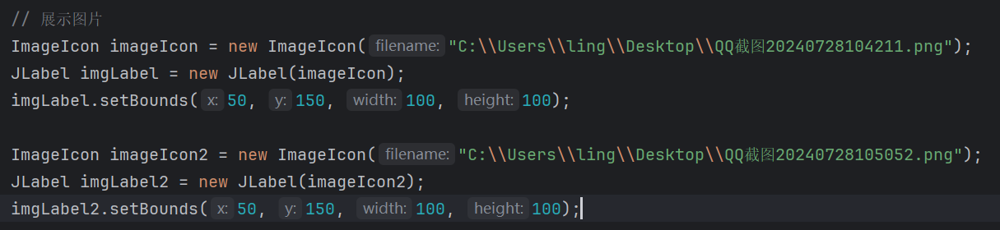

第一张图片在最上面，因为它先添加：


错位：

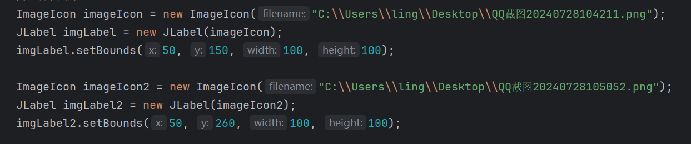

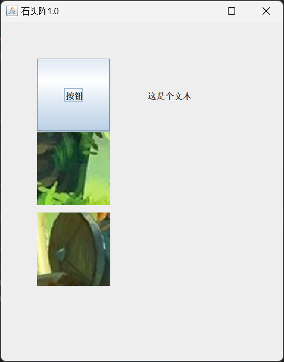


# 事件

> 事件是可以被组件识别的操作，当触发了某个事件，就会执行对应代码。

事件中的一些概念：

1. **事件源**：哪个组件监听的事件，如，按钮、图片、窗体...
2. **事件操作**：对组件进行了什么样的操作有逻辑触发，如，鼠标点击、键盘按下...
3. **绑定监听**：当事件源上发生了事件操作，触发执行某段代码。

绑定监听需要监听器，本节介绍两种监听器：

1. `ActionListener`：动作监听，监听鼠标点击和空格按键。
2. `KeyListener`：键盘监听，监听键盘按键操作。

## ActionListener

`addActionListener()`为事件源绑定动作监听，`addActionListener()`接收一个`ActionListener`类型变量，`ActionListener`是一个函数式接口，当触发动作监听事件时，执行的逻辑需自定义实现：

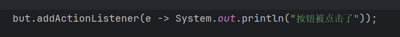

效果：

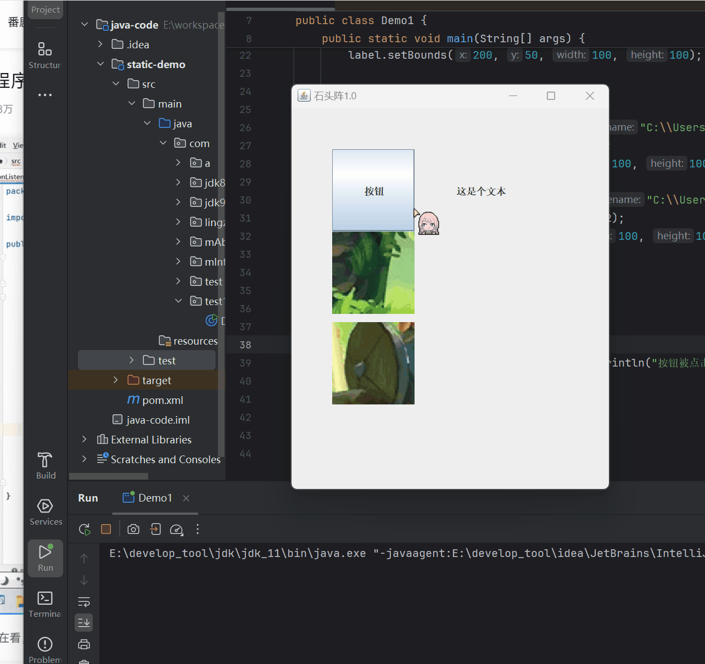

细节：空格也会触发按钮点击。

## KeyListener

键盘监听的事件源是窗体，`addKeyListener()`注册键盘监听事件，接受一个`KeyListener`类型的变量，`KeyListener`是一个接口，但不是函数式接口：

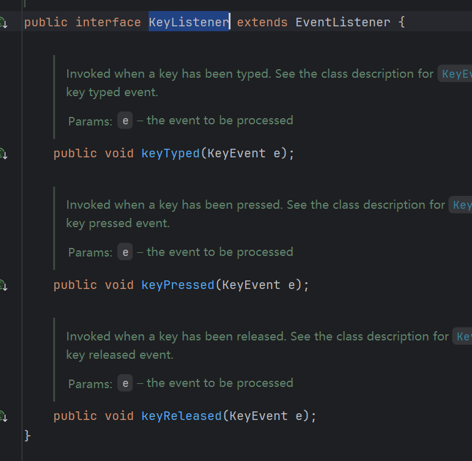

有3个方法：

|     方法      |      执行时机      |
| :-----------: | :----------------: |
| keyPressed()  | 按下某个按键时执行 |
| keyReleased() | 释放某个按键时执行 |
|  keyTyped()   | 键入某个按键时执行 |

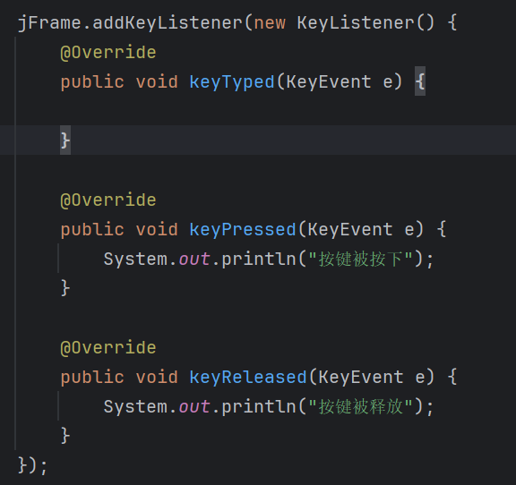

效果：

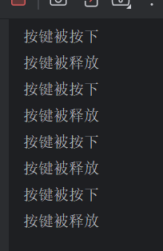

如果没有效果，那么需要获取窗体焦点，`addWindowListener()`为窗体注册窗体事件，重写`windowOpened()`，在方法中获取请求焦点：

```java
// 请求焦点
jFrame.addWindowListener(new WindowAdapter() {
    @Override
    public void windowOpened(WindowEvent e) {
        // 为窗体获取请求焦点
        jFrame.requestFocus();
    }
});
```

`keyTyped()`也能监听按键，到那时它无法监听`fn`、`esc`、`ctrl`、上下左右键。

### KeyEvent

`KeyEvent`是键盘事件对象，内部封装了很多方法：

`int getKeyCode()`，获取键盘的asc码：

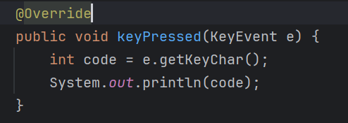

效果：

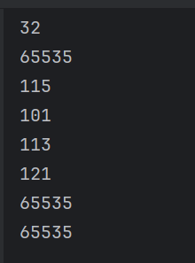

## 细节

当按键和动作事件同时存在时：
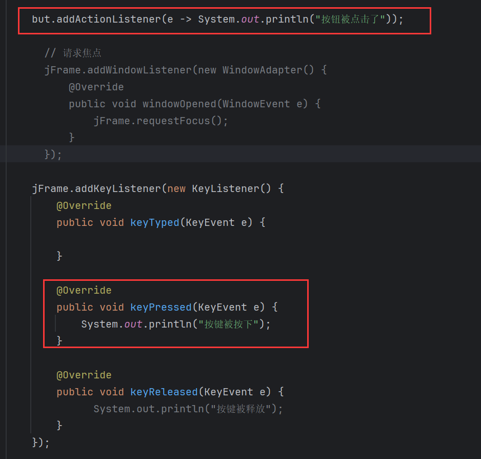

会造成事件冲突，动作事件可以通过空格触发，而空格又能触发按键事件，所以冲突：

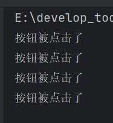

只执行了按钮的事件逻辑，按键逻辑没有执行。

> **焦点**：程序的注意力集中在某一个组件上。

按钮组件比较特殊，当按钮组件**创建**时，就自带焦点，也就是说当前程序中存在按钮组件，那么程序的注意力就会放在按钮上，如此便没有精力去监听其他事件，这也是为什么键盘监听事件没有触发。

事实上按钮并不需要焦点，因为按钮是和用户进行交互的，调用`setFocusable()`方法可以消除按钮的焦点，转入`false`表示不带焦点：

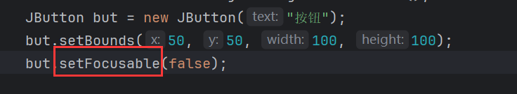

取消焦点后，程序注意力放在窗口上，事件不再冲突，效果：
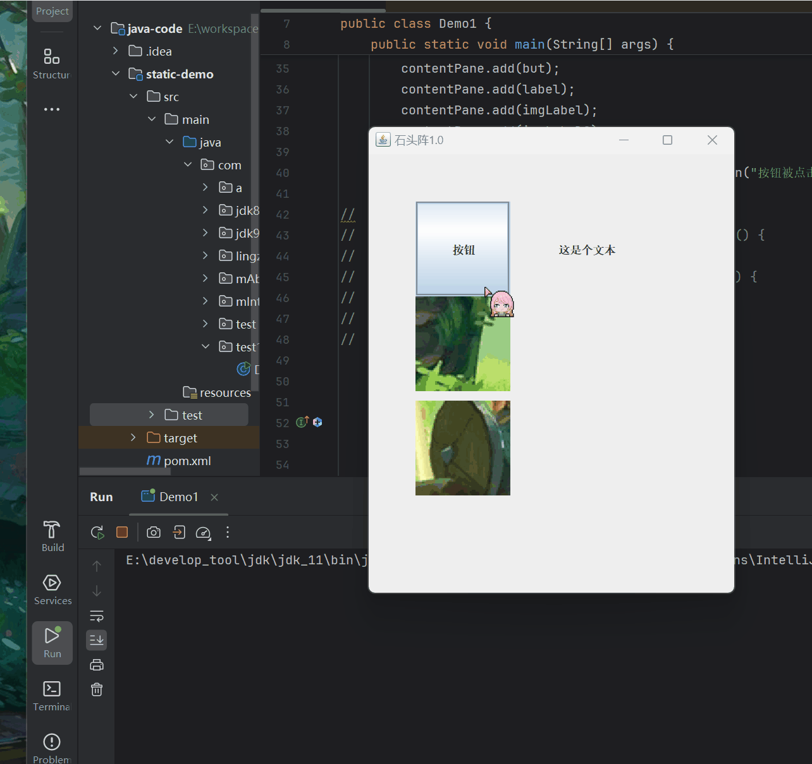