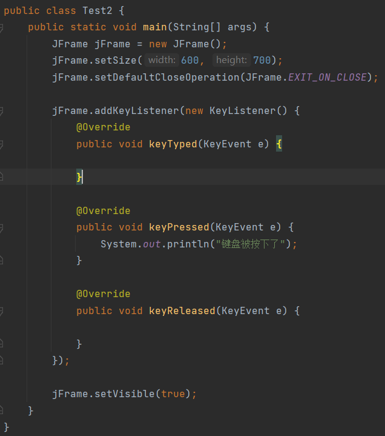
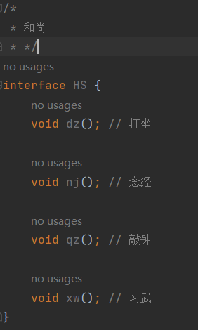
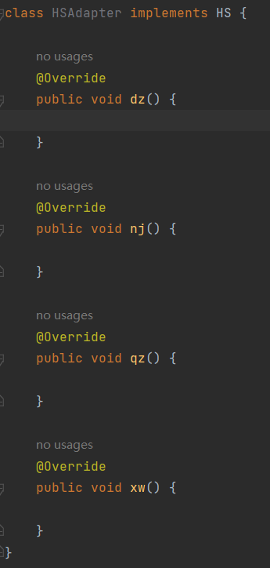
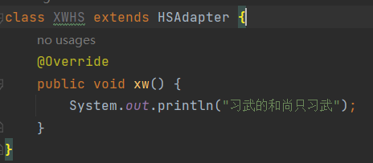
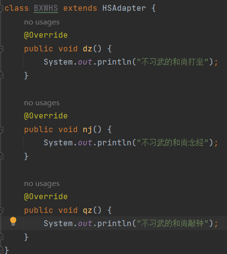
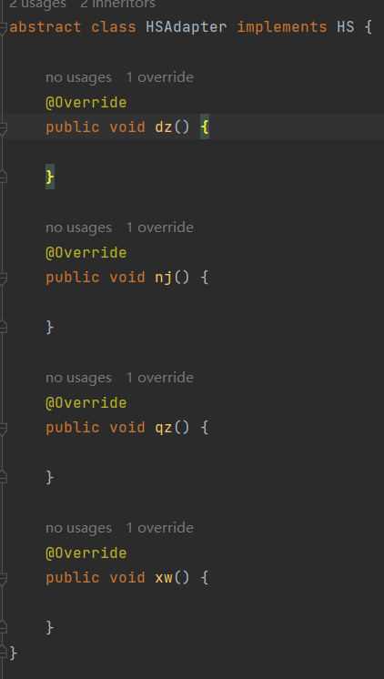
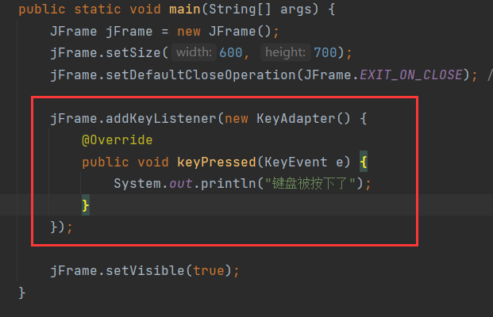

# 设计模式

> **设计模式(Design pattern)** ：是一套被反复使用、多数人知晓的、经过分类编目的、代码设计经验的总结。使用设计模式是为了可重用代码、让代码更容易被他人理解、保证代码可靠性、程序的重用性。

# 适配器(Adapter)设计模式

> 解决接口与接口实现类之间的矛盾问题。

代码材料：

在这份代码中，监听了窗体的键盘事件，但其实只有`keyPressed()`是实际使用的，另外两个方法并不会用到。但是由于`KeyListener`是一个接口，匿名内部类就必须实现它内部的所有方法，因此将另外两个方法也一并重写了，但这是没有必要的。接口中只有一部分方法是实际需要，这种情况就是接口与接口实现类之间的矛盾问题。针对这种情况就可以用适配器模式解决。

举例：

有一个和尚接口，它有四个方法：打坐、念经、敲钟、习武：

和尚实现`HS`，那么就用重写所有方法，但是并不是所有和尚都要做这四件事，比如某些和尚只习武，倘若这类和尚直接实现`HS`，在语义成面，他必重写现这4个方法，怎么样才能只重写习武方法呢？这就需要适配器类来充当中间类。

习武的和尚不再直接实现`HS`，而是用一个`HSAdapter`和尚适配器类去实现`HS`，但是`HSAdapter`并不提供方法的逻辑，而是空实现，就行这样：

`HSAdapter`是空实现，然后让习武和尚去继承`HSAdapter`而不是实现`HS`：

这样，习武的和尚就能选择只习武，而不用去重写其他方法。同时，不习武的和尚也去继承`HSAdapter`，那么这类和尚也可以选择不习武，而是重写另外三个方法：

可见，有了适配器类作为类和接口的中间类，类可以选择性的重写接口中的方法，而不必重写所有方法。

加工适配器，适配器类应该设计为抽象类，因为适配器类中的方法是空实现，如果不是抽象类，那么就能创建适配器类的对象，进而调用其中的方法，但是方法空实现没有具体的逻辑，所以调用是没有意义的，因此应该设计为抽象类：

对于`KeyListener`接口，java已经写好了一个适配器类`KeyAdapter`：

