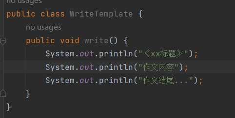
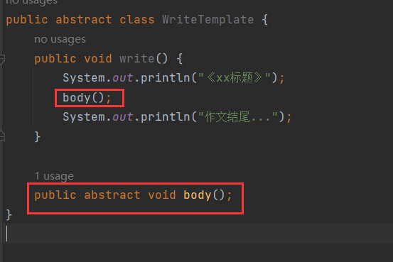
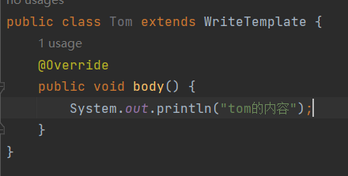
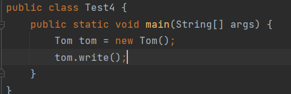
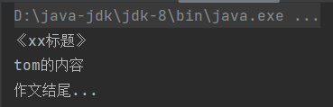
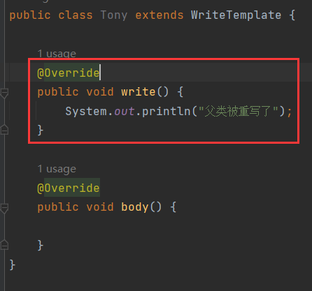
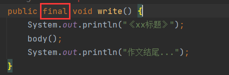
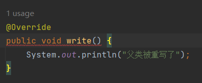

# 模板设计模式

> 把抽象类整体可以看做一个模板，模板中不能决定的东西定义成抽象方法，让使用模板的类(继承抽象类的类)去重写抽象方法实现需求。

案例：

写作文，作文就是一个很好的模板，假设作文的标题和结尾都是固定的模板，中间的内容部分因人而异，那么定义一个作文模板类：

内容部分，不同的人有不同的实现，因此抽取出一个内容的抽象方法：

子类继承并实现：

结果：

但是，有一些瑕疵，第2个子类继承，去重写了【write()】：

子类不应该去重写【write()】，因为【write()】中是重要的模板，模板是定义好的，不能被更改，因此可以将【write()】定义为最终方法：

子类重写就会报错：

