# 绘制界面

首先创建一个**514** * **595**的窗体：

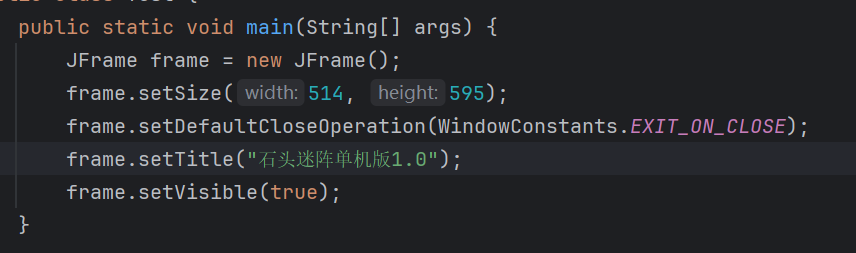

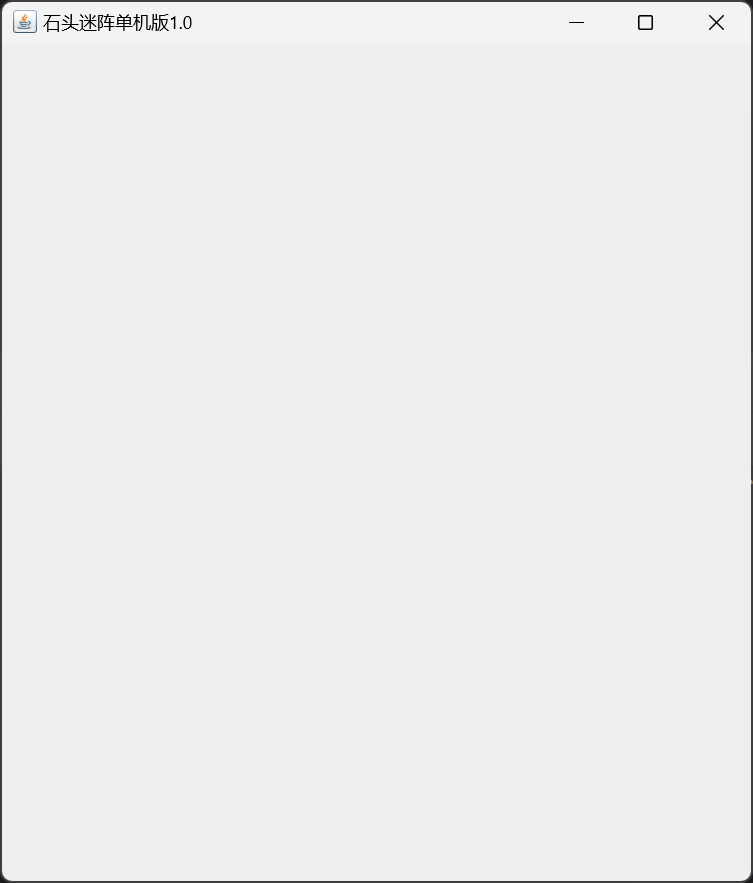

设置窗体置顶，类似于钉在桌面，并不是窗体在屏幕的最上方，而是在屏幕的最上层，不管点击那个层面，窗体永远在最顶层：

```java
// 设置窗体置顶
窗体对象.setAlwaysOnTop(true)
```

设置窗体开启时居中，默认在左上角：

```java
// 设置窗体开启时居中
窗体对象.setLocationRelativeTo(null)
```

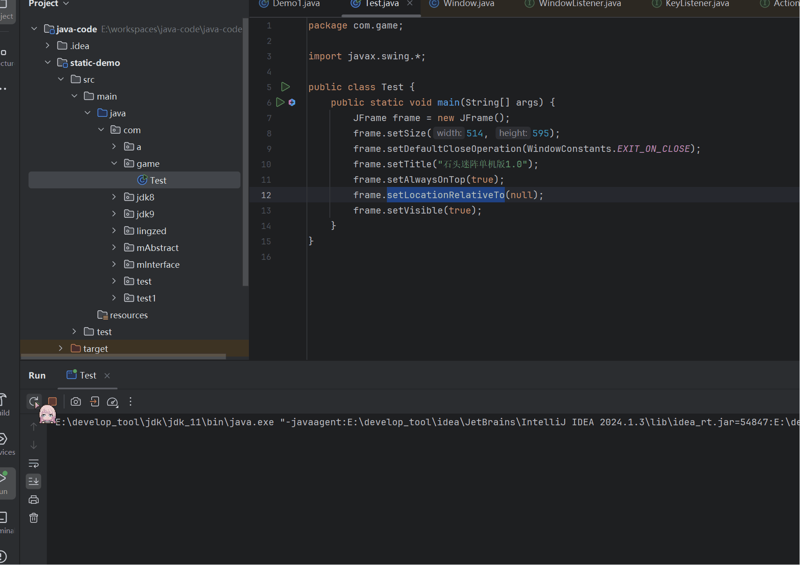

添加背景图和石头方块图，背景图为**450** * **484**，坐标为(26, 30)，每个石头方块为**100** * **100**，四行四列，15个石头方块，和一个空白块，第一个方块坐标为(50, 90)：

恶心的写法，一个一个写：

```java
JLabel label0 = new JLabel(new ImageIcon("E:\\workspaces\\java-code\\image\\0.png"));
label0.setBounds(50, 90, 100, 100);

JLabel label1 = new JLabel(new ImageIcon("E:\\workspaces\\java-code\\image\\1.png"));
label1.setBounds(150, 90, 100, 100);

JLabel label2 = new JLabel(new ImageIcon("E:\\workspaces\\java-code\\image\\2.png"));
label2.setBounds(250, 90, 100, 100);

JLabel label3 = new JLabel(new ImageIcon("E:\\workspaces\\java-code\\image\\3.png"));
label3.setBounds(350, 90, 100, 100);

JLabel label4 = new JLabel(new ImageIcon("E:\\workspaces\\java-code\\image\\4.png"));
label4.setBounds(50, 190, 100, 100);

JLabel label5 = new JLabel(new ImageIcon("E:\\workspaces\\java-code\\image\\5.png"));
label5.setBounds(150, 190, 100, 100);

JLabel label6 = new JLabel(new ImageIcon("E:\\workspaces\\java-code\\image\\6.png"));
label6.setBounds(250, 190, 100, 100);

JLabel label7 = new JLabel(new ImageIcon("E:\\workspaces\\java-code\\image\\7.png"));
label7.setBounds(350, 190, 100, 100);

JLabel label8 = new JLabel(new ImageIcon("E:\\workspaces\\java-code\\image\\8.png"));
label8.setBounds(50, 290, 100, 100);

JLabel label9 = new JLabel(new ImageIcon("E:\\workspaces\\java-code\\image\\9.png"));
label9.setBounds(150, 290, 100, 100);

JLabel label10 = new JLabel(new ImageIcon("E:\\workspaces\\java-code\\image\\10.png"));
label10.setBounds(250, 290, 100, 100);

JLabel label11 = new JLabel(new ImageIcon("E:\\workspaces\\java-code\\image\\11.png"));
label11.setBounds(350, 290, 100, 100);

JLabel label12 = new JLabel(new ImageIcon("E:\\workspaces\\java-code\\image\\12.png"));
label12.setBounds(50, 390, 100, 100);

JLabel label13 = new JLabel(new ImageIcon("E:\\workspaces\\java-code\\image\\13.png"));
label13.setBounds(150, 390, 100, 100);

JLabel label14 = new JLabel(new ImageIcon("E:\\workspaces\\java-code\\image\\14.png"));
label14.setBounds(250, 390, 100, 100);

JLabel label15 = new JLabel(new ImageIcon("E:\\workspaces\\java-code\\image\\15.png"));
label15.setBounds(350, 390, 100, 100);

JLabel labelBK = new JLabel(new ImageIcon("E:\\workspaces\\java-code\\image\\background.png"));
labelBK.setBounds(26, 30, 450, 484);


contentPane.add(label0);
contentPane.add(label1);
contentPane.add(label2);
contentPane.add(label3);
contentPane.add(label4);
contentPane.add(label5);
contentPane.add(label6);
contentPane.add(label7);
contentPane.add(label8);
contentPane.add(label9);
contentPane.add(label10);
contentPane.add(label11);
contentPane.add(label12);
contentPane.add(label13);
contentPane.add(label14);
contentPane.add(label15);

contentPane.add(labelBK);
```

效果：

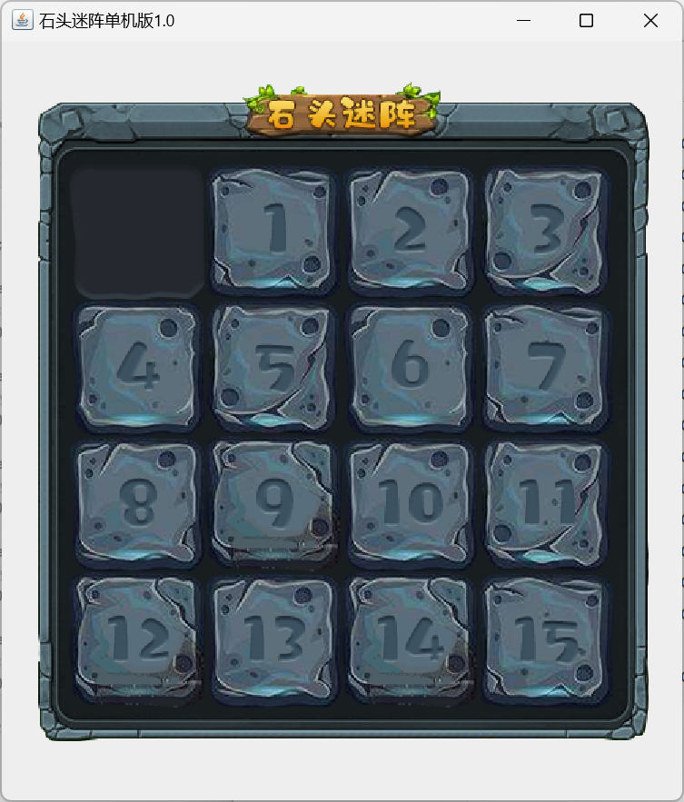

优化：

第一行的图片：

```java
JLabel label0 = new JLabel(new ImageIcon("E:\\workspaces\\java-code\\image\\0.png"));
label0.setBounds(50, 90, 100, 100);

JLabel label1 = new JLabel(new ImageIcon("E:\\workspaces\\java-code\\image\\1.png"));
label1.setBounds(150, 90, 100, 100);

JLabel label2 = new JLabel(new ImageIcon("E:\\workspaces\\java-code\\image\\2.png"));
label2.setBounds(250, 90, 100, 100);

JLabel label3 = new JLabel(new ImageIcon("E:\\workspaces\\java-code\\image\\3.png"));
label3.setBounds(350, 90, 100, 100);
```

x坐标规律为等差数列：`50 + 100 * (n - 1)`

可以用循环优化：

```java
for (int i = 0; i < 4; i++) {
    JLabel jLabel = new JLabel(new ImageIcon("E:\\workspaces\\java-code\\image\\" + i + ".png"));
    jLabel.setBounds(50 + i * 100, 90, 100, 100);
    contentPane.add(jLabel);
}
```

用4个循环表示：

```java
// 第1行，y坐标：90
for (int i = 0; i < 4; i++) {
    JLabel jLabel = new JLabel(new ImageIcon("E:\\workspaces\\java-code\\image\\" + i + ".png"));
    jLabel.setBounds(50 + i * 100, 90, 100, 100);
    contentPane.add(jLabel);
}
// 第2行，y坐标：190
for (int i = 0; i < 4; i++) {
    JLabel jLabel = new JLabel(new ImageIcon("E:\\workspaces\\java-code\\image\\" + i + ".png"));
    jLabel.setBounds(50 + i * 100, 190, 100, 100);
    contentPane.add(jLabel);
}
// 第3行，y坐标：290
for (int i = 0; i < 4; i++) {
    JLabel jLabel = new JLabel(new ImageIcon("E:\\workspaces\\java-code\\image\\" + i + ".png"));
    jLabel.setBounds(50 + i * 100, 290, 100, 100);
    contentPane.add(jLabel);
}
// 第4行，y坐标：390
for (int i = 0; i < 4; i++) {
    JLabel jLabel = new JLabel(new ImageIcon("E:\\workspaces\\java-code\\image\\" + i + ".png"));
    jLabel.setBounds(50 + i * 100, 390, 100, 100);
    contentPane.add(jLabel);
}
```

观察，第二行，第三行和第四行，y坐标在上一行的基础上+100，因此y坐标是按照行数的等差数列：`90 + 100 * (n - 1)`

也可以用循环优化，是一个嵌套循环：

```java
for (int i = 0; i < 4; i++) {
    for (int j = 0; j < 4; j++) {
        JLabel jLabel = new JLabel(new ImageIcon("E:\\workspaces\\java-code\\image\\" + i + ".png"));
        jLabel.setBounds(50 + j * 100, 90 + i * 100, 100, 100);
        contentPane.add(jLabel);
    }
}
```

效果：

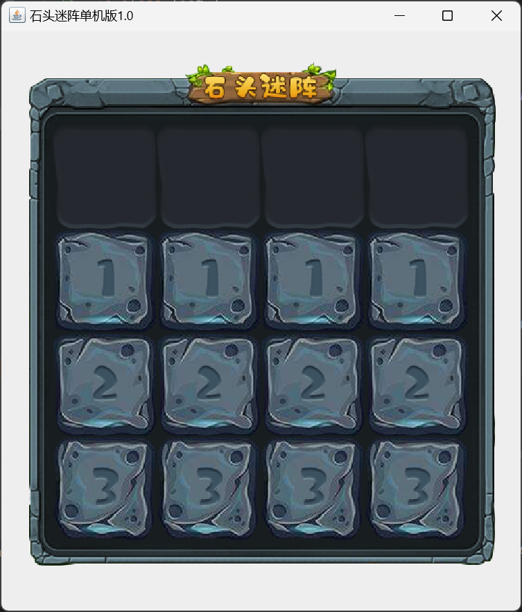

然后优化图片，图片和图片编号是一一对应的，因此可以将图片编号存储到一个数组中，然后遍历数组，比如：

```java
int[] nums = {1, 2, 3, 4, 5, 6, 7, 8, 9, 10, 11, 12, 13, 14, 15, 0};
```

但是用一维数组来存储很不方便，因为还要判断哪些编号属于第一行，哪些编号属于第二行等，所以可以考虑二维数组，将每一行的编号放到一个一维数组中，然后将每一行的一位数组放到一个二维数组中，即二维数组的中元素代表一行：
```java
int[][] nums = {
    {1, 2, 3, 4}, 
    {5, 6, 7, 8}, 
    {9, 10, 11, 12}, 
    {13, 14, 15, 0}
};
```

与上面的嵌套循环结合，可以优化为：

```java
int[][] nums = {{1, 2, 3, 4}, {5, 6, 7, 8}, {9, 10, 11, 12}, {13, 14, 15, 0}};

for (int i = 0; i < nums.length; i++) {
    for (int j = 0; j < nums[i].length; j++) {
        JLabel jLabel = new JLabel(new ImageIcon("E:\\workspaces\\java-code\\image\\" + nums[i][j] + ".png"));
        jLabel.setBounds(50 + j * 100, 90 + i * 100, 100, 100);
        contentPane.add(jLabel);
    }
}
```

效果：

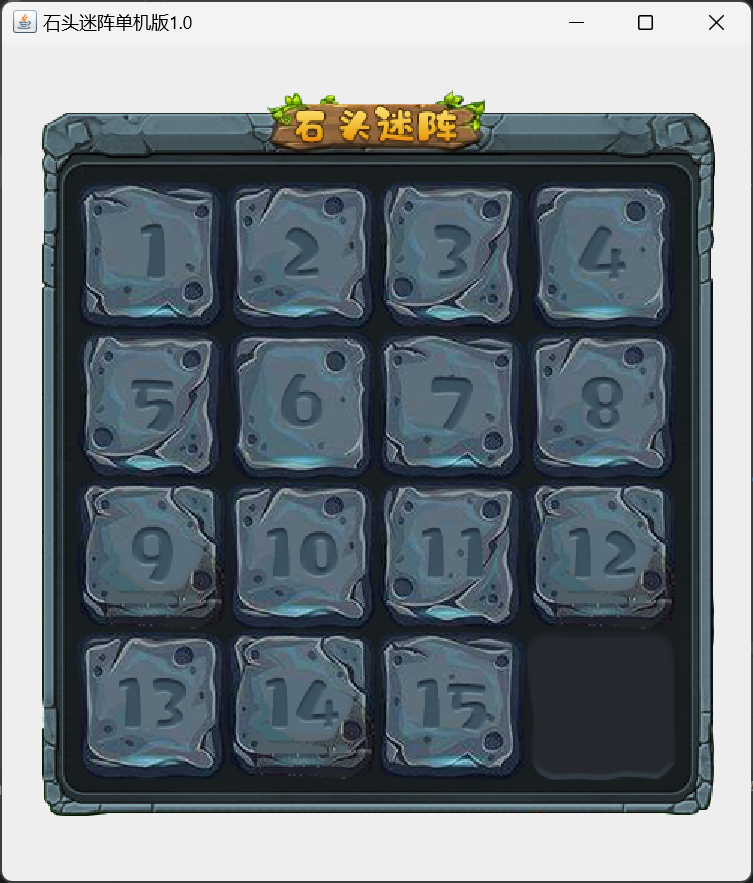


# 继承优化

为什么要继承`JFrame`呢？因为`JFrame`是java已经写好的类，内部的功能是写死的，无法做扩展，而且源码也是只读，所以如果想要窗体拥有某个功能而这个功能源码中没有实现，那么就自定义一个类去继承窗体，去扩展。

创建一个`MainFrame`类继承`JFrame`：

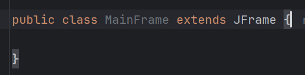

`MainFrame`已经是一个窗体类了，定义一个初始化方法，来初始化窗体：

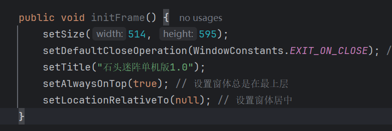

父类中的方法可以用`super`来访问，又因为子类中没有同名方法，所以`super`能省略。然后再定义一个绘制方法来绘制界面：

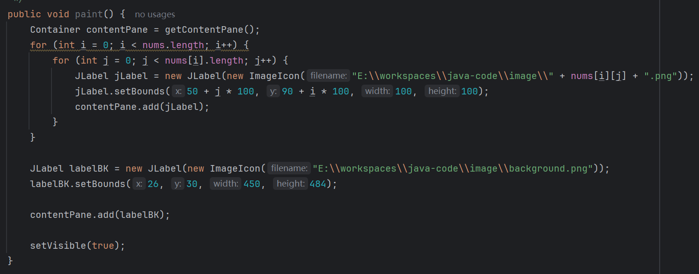

变量`nums`需要提升作用域，才能被绘制方法使用：

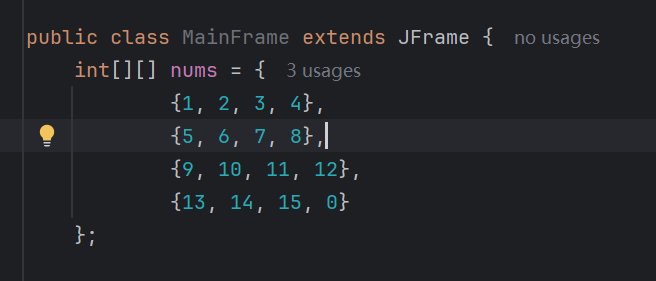

思考，这两个方法什么时候执行？一定是窗体创建的时候执行，所以在构造方法中调用这两个方法：

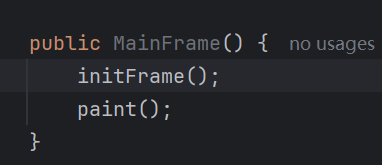

可以将窗体可见提取到构造中最后执行，让绘制方法更加专注于画图的逻辑：

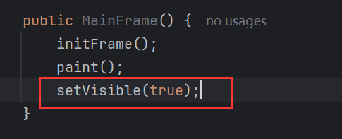

创建窗体，直接创建对象，就能创建窗体：

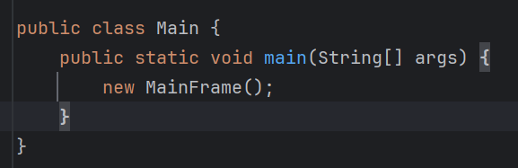

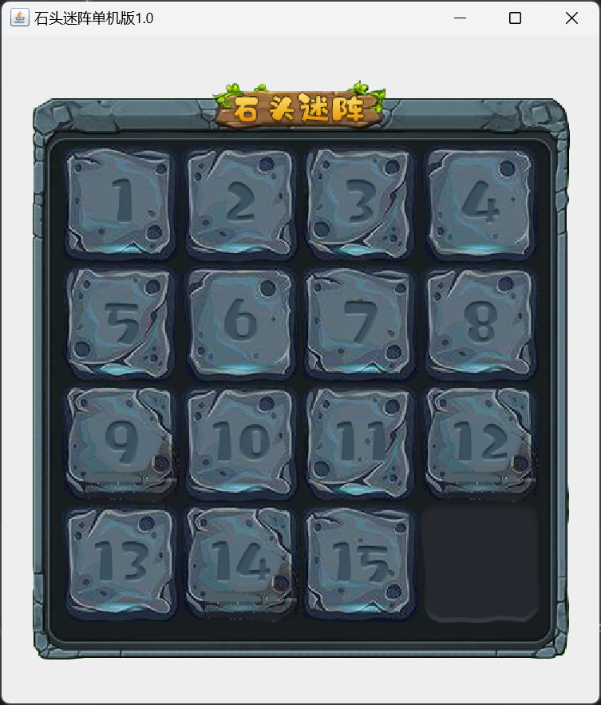

`MainFrame`有很强的扩展性，既保留了`JFrame`的方法，又能自定义方法。

总结优化的思路与步骤：

1. 定义`MainFrame`继承`JFrame`。
2. 在原实现中又一部分代码是初始化窗体，有一部分代码是绘制界面，所以定义两个方法`initFrame()`和`paint()`将代码抽取到方法中。
3. 抽象代码时，变量`nums`的作用域不够，所以将其作为成员变量，以便`paint()`访问。
4. `MainFrame`继承`JFrame`，那么`JFrame`中的方法就能通过`super`调用或直接调用。
5. 在构造方法中调用`initFrame()`和`paint()`，因为窗体对象在创建的时候，就需要初始化和绘制。
6. `setVisible(true)`设置窗体可见应该最后执行，因此抽取到构造中最后一行。


# 打乱方块

打乱方法非常简单，因为方法的排放位置和图片有关，而图与编号对应，编号存储在`nums`中，因此只需打乱`nums`就能打乱方块。

打乱方块的核心思路是将某两个元素进行交换，二维数组中，每个元素由两个下标确定，可以将其看作是横纵坐标x、y，那么可以定义两个随机变量`randomX`，`randomY`，他们的取值范围都是[0, 1, 2, 3]，遍历二维数组的每个元素，将每个元素与随机坐标x、y对应的元素进行交互，最终形成的数组就是打乱的数组。(这种交换存在交换后与交换前元素布局一样的情况，只是概率几乎为0)

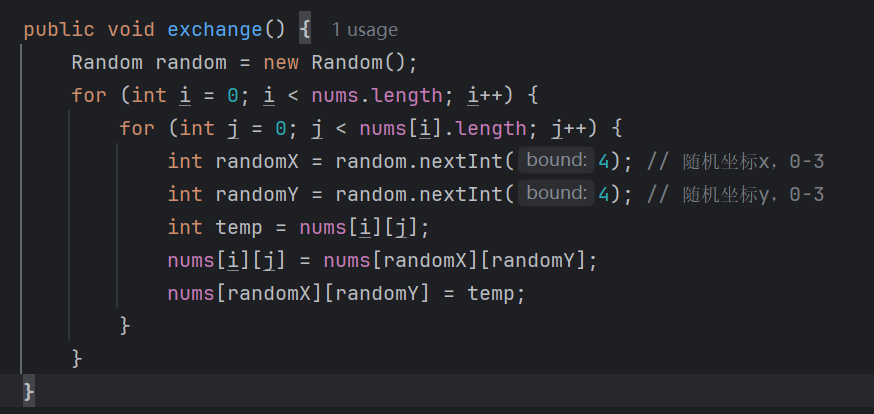

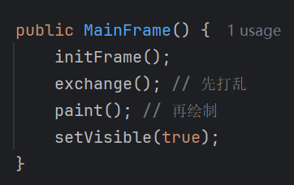

效果：

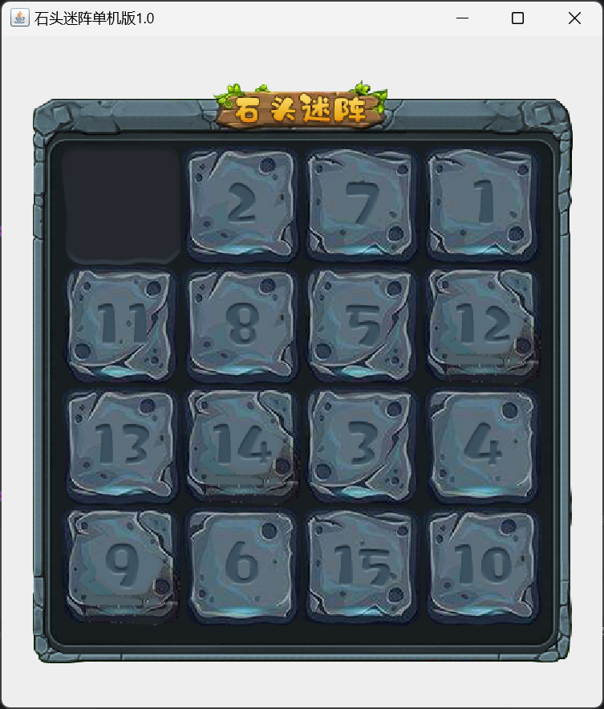


# 移动方块

注册监听，为窗体对象注册监听，`MainFrame`继承`JFrame`，那么它自身就能注册监听事件，当前实例用`this`表示：

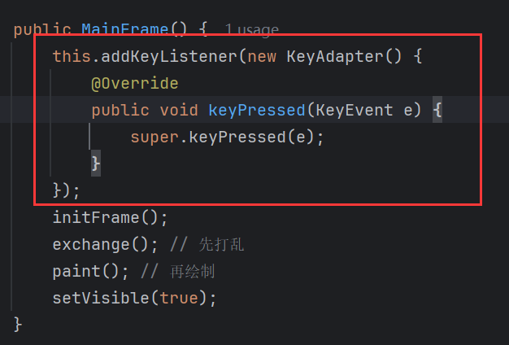

监听事件需要一个接口`KeyListener`，由于只用到`keyPressed()`所以用了适配器类`KeyAdapter`。但是这样写导致构造方法很雍总，那么可以这样来优化，一个类在继承另一个类的同时，还可以实现其他的接口，不妨让`MainFrame`去实现`KeyListener`，那么`MainFrame`就是`KeyListener`的实现类，当前实例能用`this`指代，而当前实例又是实现类对象，所以代码可以优化为：

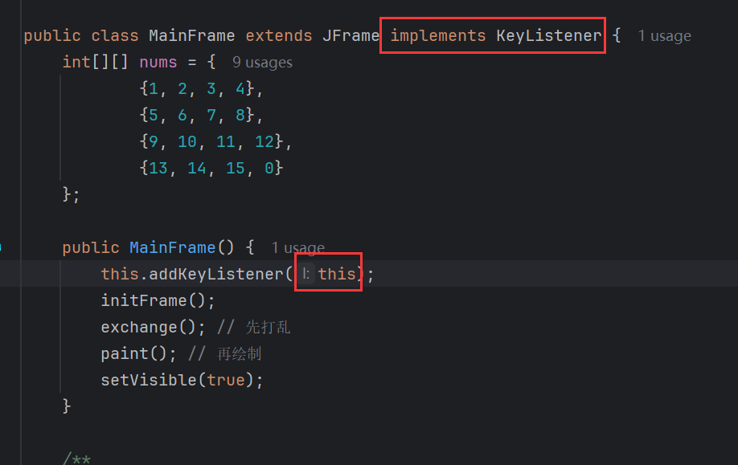

监听键盘输入，通过`getKeyCode()`获取键码，来判断上下左右，上下左右键码分别为38、40、37、39：

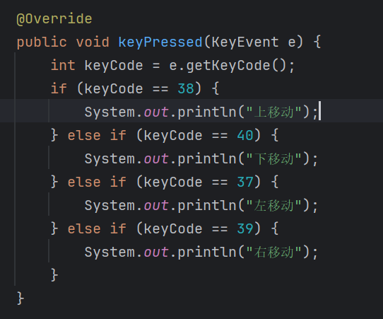

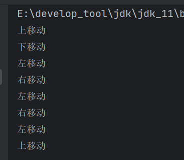

将移动功能抽取：

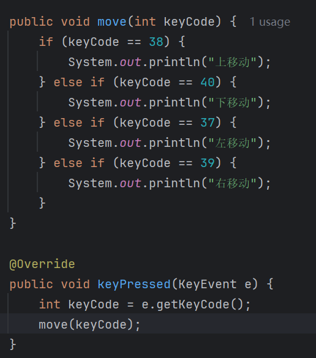

本游戏中，移动的本质不是真正的移动，而是数组中元素进行交换，再刷新界面让界面重新绘图，达到移动的效果。移动的规则是：

**上移动**：空白块与下方的方块交换。

**下移动**：空白块与上方的方块交换。

**左移动**：空白块与右方的方块交换。

**右移动**：空白块与左方的方块交换。

可见，移动规则操作的是空白块按照移动的反方向与元素进行互换，因此首先要做的就是确定空白块，也就是0号编码元素的位置。而查找0号元素，最简单粗暴的方式就是遍历整个二维数组：

定义两个变量用于记录0号元素的下标：

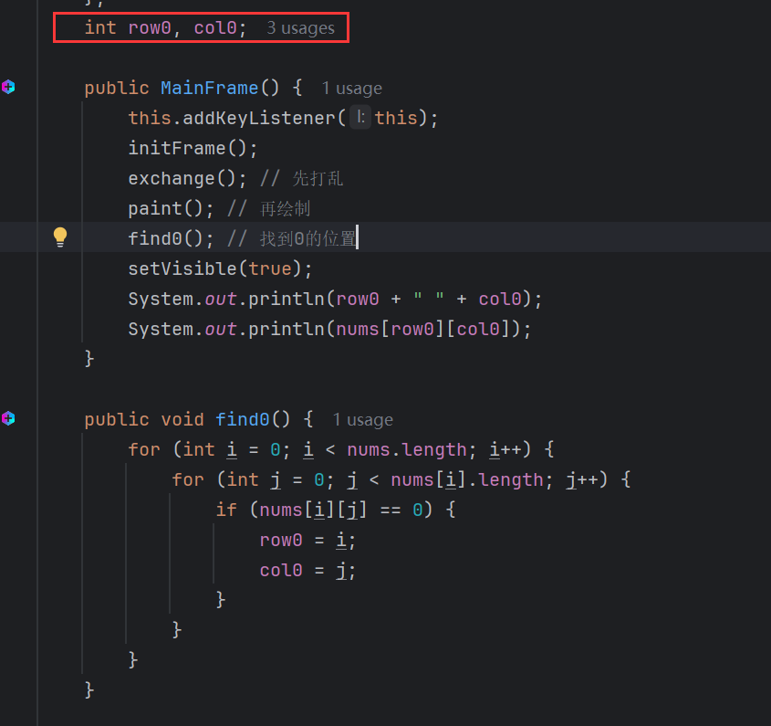

效果：

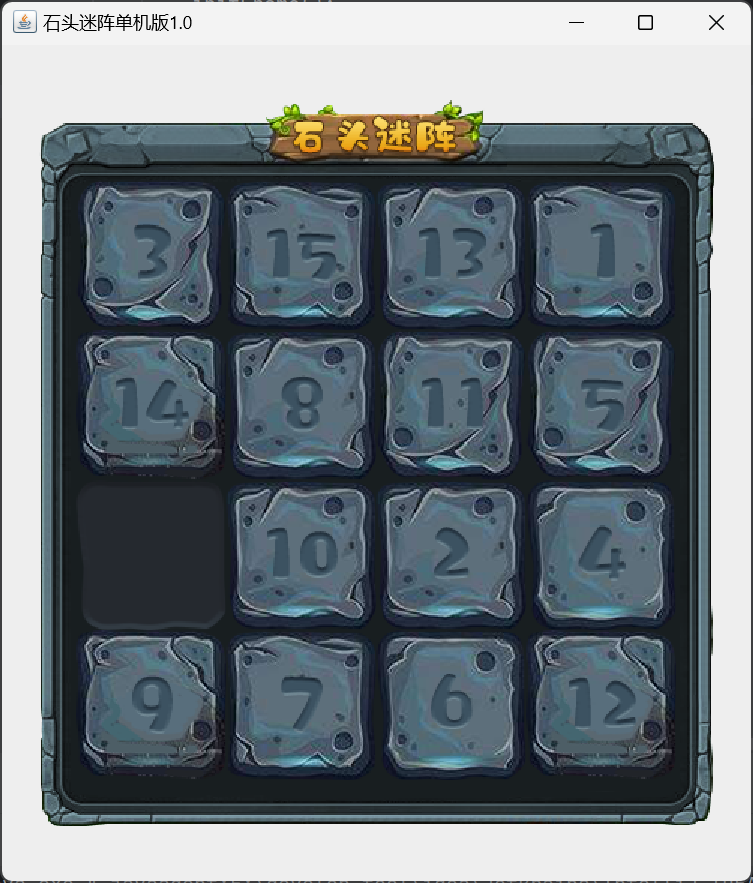

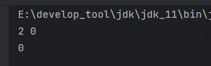

然后根据移动需求，不难发现，移动的本质是让0号元素与其他元素进行交换，因此再定义两个变量存储被交换元素的下标：

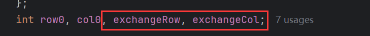

上下左右移动规律，或者说交换规律，可以总结为：

**上**：0点与**下**面的元素进行交换，因此被交换元素下标为：

```java
exchangeRow = row0 + 1;
exchangeCol = Col0;
```

**下**：0点与**上**面的元素进行交换，因此被交换元素下标为：

```java
exchangeRow = row0 - 1;
exchangeCol = Col0;
```

**左**：0点与**左**侧的元素进行交换，因此被交换元素下标为：

```java
exchangeRow = row0;
exchangeCol = Col0 + 1;
```

**右**：0点与**右**侧的元素进行交换，因此被交换元素下标为：

```java
exchangeRow = row0;
exchangeCol = Col0 - 1;
```

为了简化代码，可以将其全部转换为加法，这样用一个通用的方法就能处理4个方向的移动：

```java
// 上
exchangeRow = row0 + 1;
exchangeCol = Col0 + 0;
// 下
exchangeRow = row0 + (-1);
exchangeCol = Col0 + 0;
// 左
exchangeRow = row0 + 0;
exchangeCol = Col0 + 1;
// 右
exchangeRow = row0 + 0;
exchangeCol = Col0 + (-1);
```

那么移动的方法可以表示为：

```java
public void moveHandel(int keyCode) {
    if (keyCode == 38) {
        System.out.println("上移动");
        move(1, 0);
    } else if (keyCode == 40) {
        System.out.println("下移动");
        move(-1, 0);
    } else if (keyCode == 37) {
        System.out.println("左移动");
        move(0, 1);
    } else if (keyCode == 39) {
        System.out.println("右移动");
        move(0, -1);
    }
    System.out.println(Arrays.deepToString(nums));
}

public void move(int row, int col) {
    // 需要与0点交换的元素位置
    exchangeRow = row0 + row;
    exchangeCol = col0 + col;
    int temp = nums[exchangeRow][exchangeCol];
    nums[exchangeRow][exchangeCol] = nums[row0][col0];
    nums[row0][col0] = temp;
}
```

监听方向中统一调用`move()`，由它来处理0点与元素的交换，先通过不同方向的增量计算出被交换的元素下标，然后再与0点进行交换。但是这样并没有结束，因为还存在边界的情况。

当0点处于顶层时，`row0 = 0`，如果执行下移动命令，那么`row0 - 1 = -1`，此时的被交换元素下标越界。

当0点处于底层时，`row0 = 3`，如果执行上移动命令，那么`row0 + 1 = 4`，此时的被交换元素下标越界。

当0点处于最左侧时，`col0 = 0`，如果执行右移动命令，那么`col0 - 1 = -1`，此时的被交换元素下标越界。

当0点处于最右层时，`col0 = 3`，如果执行左移动命令，那么`col0 + 1 = 4`，此时的被交换元素下标越界。

因此，在执行上下移动时，`moveRow`的范围为[0, 3]，在执左右移动时，`moveCol`的范围为[0, 3]：

```java
public void move(int row, int col) {
    // 需要与0点交换的元素位置
    exchangeRow = row0 + row;
    exchangeCol = col0 + col;
    // 下标越界，直接结束方法
    if (exchangeRow < 0 || exchangeRow > nums.length - 1) return;
    if (exchangeCol < 0 || exchangeCol > nums[0].length - 1) return;
    int temp = nums[exchangeRow][exchangeCol];
    nums[exchangeRow][exchangeCol] = nums[row0][col0];
    nums[row0][col0] = temp;
}
```

还有一种情况没有考虑，当0点与被交换元素交换后，此时0点已经站在了被交换元素的位置上，因此0点的坐标也发生了改变，所以在交换完成后，需要对0点的坐标进行更新：

```java
public void move(int row, int col) {
    // 需要与0点交换的元素位置
    exchangeRow = row0 + row;
    exchangeCol = col0 + col;
    // 下标越界，直接结束方法
    if (exchangeRow < 0 || exchangeRow > nums.length - 1) return;
    if (exchangeCol < 0 || exchangeCol > nums[0].length - 1) return;
    int temp = nums[exchangeRow][exchangeCol];
    nums[exchangeRow][exchangeCol] = nums[row0][col0];
    nums[row0][col0] = temp;
    // 更新0点坐标
    row0 = exchangeRow;
    col0 = exchangeCol;
}
```

完整的交换逻辑就实现了。

虽然完成了数组元素的交换，但是改变数组并么有影响到界面，所以在每一次移动后都应该重新绘制界面：

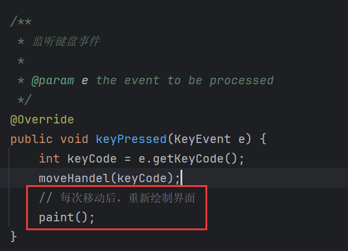

但是这样并不会产生移动效果，因为`paint()`方法中是创建`JLabel`对象形成的图片，而每一次移动都会重新调用`paint()`，即重新创建新的`JLabel`对象添加到面板中，根据组件覆盖规则，当多个组件在同一个位置时，覆盖层次为：最先添加的组件在最上面，在第一次加载窗体完成后，就已经绘制了图片，而后续新创建新的`JLabel`对象都会排在第一次创建的`JLabel`后面，相当于第一次的`JLabel`挡住了后续创建的`JLabel`，导致看不见移动效果。

解决方法也很简单，在每次绘制之前，清空之前创建的`JLabel`，调用面板对象的`removeAll()`：

```java
面板对象.removeAll(); // 清空面板中的所有组件
```

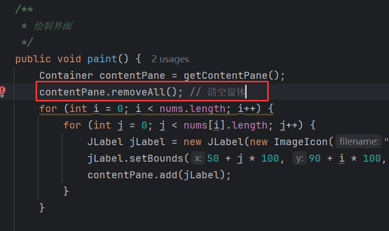

清空组件后，需要刷新面板以便新的`JLabel`展示，调用面板对象的`repaint()`：

```java
面板对象.repaint(); // 刷新面板
```

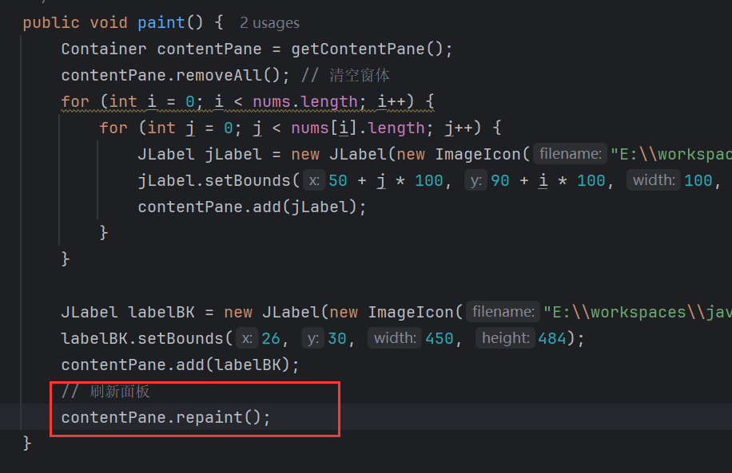

最终效果：

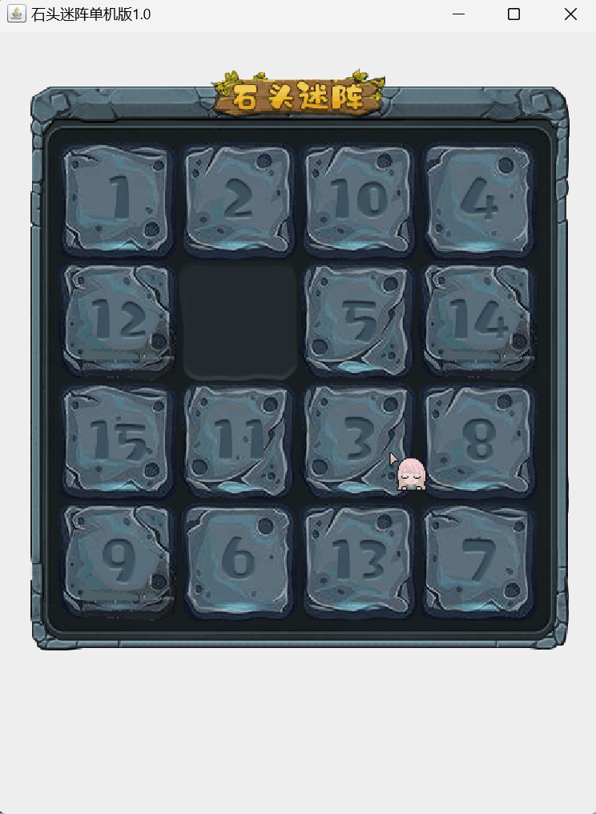
