# 继承介绍

> 所谓继承，就是<font color='#E0361A'>**类与类产生关系**</font>，什么样的关系？子类与父类的关系，<font color='409EFF'>**子类**</font>可以<font color='409EFF'>**直接使用父类**</font>中<font color='409EFF'>**非私有成员**。</font>

为什么要让类与类之间产生关系？举个例子，有两个类：`Coder` 和 `Manager`，分别是程序员类和项目经理类：

```java
class Coder{
    String name;	// 姓名
    Integer age;	// 年龄
    Double salary;	// 薪资
}

class Manager{
    String name;	// 姓名
    Integer age;	// 年龄
    Double salary;	// 薪资
}
```

观察这两个类，会发现它们都有相同的成员，`name`、`age`、`salary`。这两个类维护的信息都是一样的，假设现在正在开发一款人员管理系统，需要对员工信息进行管理，此时已经创建好了一个程序员类 `Coder`，管理程序员相关信息，一个项目经理类 `Manager` 管理项目经理的相关信息，将来是不是还需要编写一个`Hr`类来管理人事的相关信息？那么这个 `Hr` 类是不是也是维护 `name`、`age`、`salary`？然后把重复的内容再写一遍：

```java
class Hr{
    String name;	// 姓名
    Integer age;	// 年龄
    Double salary;	// 薪资
}
```

不觉得这样写显得代码很臃肿吗？那么这个时候就需要优化代码了。现在发现多个类之间存在相同的类容，或者说共性的内容。那么可以考虑将相同的内容向上进行抽取，将相同的内容向上抽取到一个员工类`Employee`中：

```java
class Employee {
    String name;	// 姓名
    Integer age;	// 年龄
    Double salary;	// 薪资
}

class Coder{

}

class Manager{

}
```

然后让 `Coder` 和 `Manager` 与 `Employee` 建立关系，当关系建立后，`Employee` 中的 `name`、`age`、`salary` 在 `Coder` 和 `Manager` 中就可以直接使用。只需让 `Employee` 充当父类， `Coder` 和 `Manager` 充当子类，那么 `Employee` 中非私有的成员，`Coder` 和 `Manager` 就可以直接访问。这就是所谓的继承，就是让类与类产生父子关系。

可是类与类如何产生父子关系？


# extends

`extends` 关键字能让类与类产生父子关系。

格式：

```java
public class 子类名 extends 父类名 {}
```

比如：

```java
public class Zi extends Fu {}
```

- `Fu`：是父类，也被称为基类、超类
- `Zi`：是子类，也被称为派生类


# 案例

准备一个测试类和两个子类：

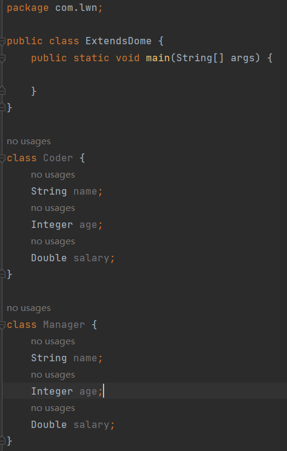

这里有个细节：`Coder` 和 `Manager` 是直接写在 `ExtendsDome` 中的。以前的写法是一个 `.java` 文件对应一个 `class` 但其实一个 `.java` 文件中可以编写多个 `class` 。不过需要保证多个类之间是平级关系，即不能写成嵌套关系：

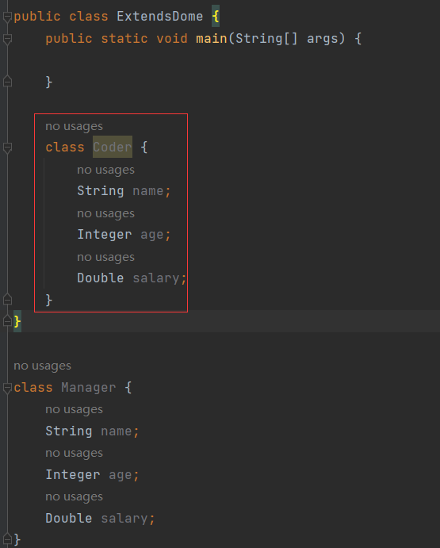

这样写不会报错，事实上这样的写法使用了一种叫做内部类的技术，这种写法创建对象不再是之前的格式：

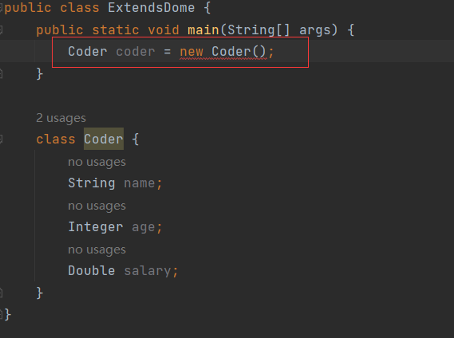

会报错，这种内部类创建对象的格式为：

```java
外部类名.内部类名 对象名 = new 外部类名().new 内部类名()
```

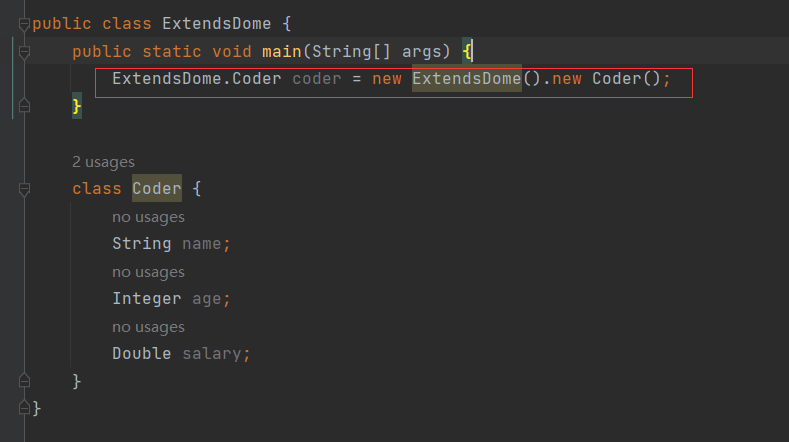

只有保证是平级关系，才能使用之前创建对象的方法：

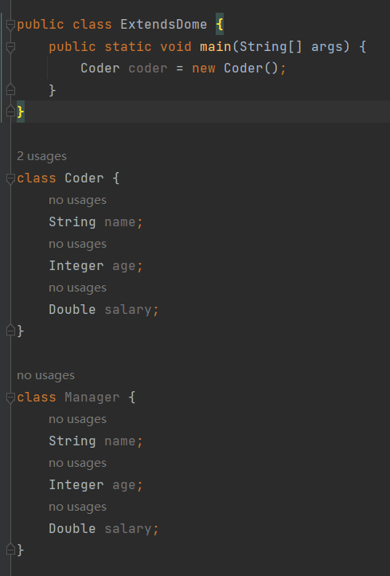

除此之外，还需要保证，多个 `class` 中只能有一个类被 `public` 修饰，如果有多个会报错：

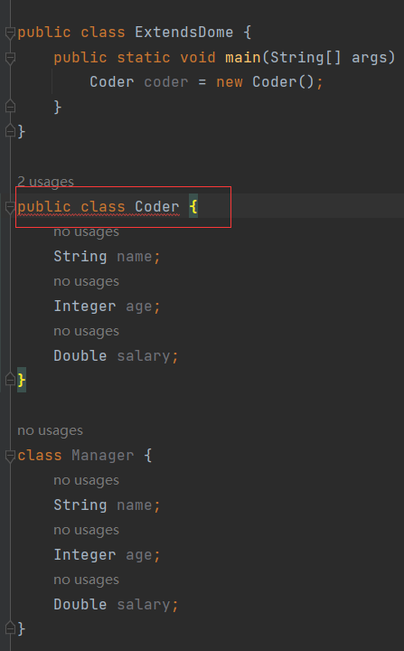

原因：如果类用 `public` 修饰，那么就限制了类名与 `.java` 文件名必须保持一致。现在的类有3个，而文件名只有1个，是不可能保持一致的，所以 `.java` 文件中如果编写了多个类，只能由一个被 `public` 修饰。

其实这种写法是不规范的，规范的写法是：一个 `.java` 文件对应一个 `class` 。之所以这样写，是为了演示继承更加方便。

`Coder` 和 `Manager` 都有共性的内容：

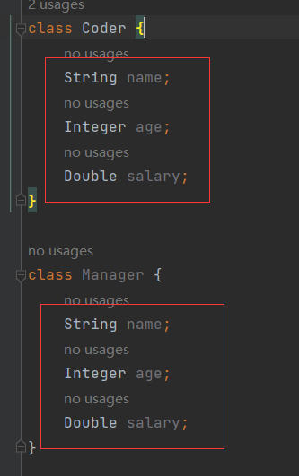

因此向上抽取到一个员工类中：

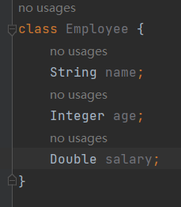

然后 `Coder` 和 `Manager` 继承至 `Employee` 与之建立父子关系：

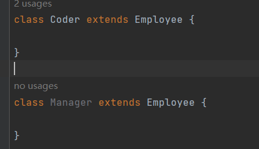

现在产生关系后，子类就能直接使用父类中非私有成员：

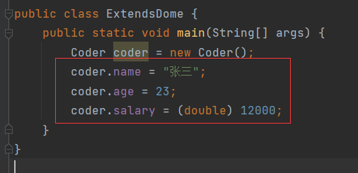

如果是私有成员，子类不能使用：

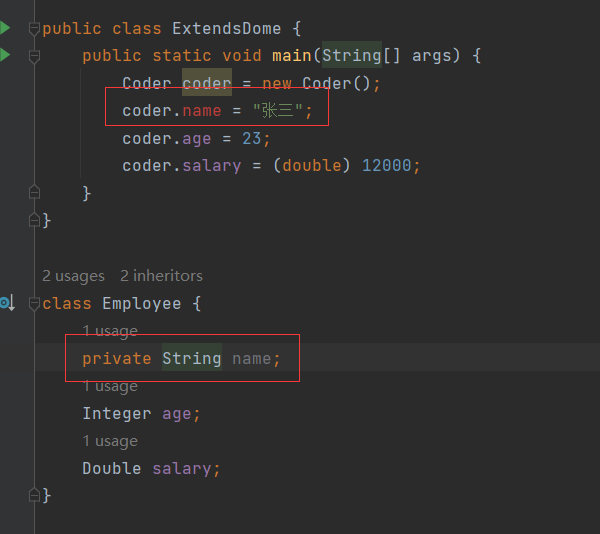

一个标准的实体或者 `java bean` 成员变量都是要求私有的，如果都私有就意味着子类无法使用，为了避免这种情况，在私有变量的同时，也要求为其提供 `getter` 和 `setter` 以供子类或其他类能访问：

```java
// Employee属性私有，但是提供了getter和setter
class Employee {
    private String name;
    private Integer age;
    private Double salary;

    public String getName() {
        return name;
    }

    public void setName(String name) {
        this.name = name;
    }

    public Integer getAge() {
        return age;
    }

    public void setAge(Integer age) {
        this.age = age;
    }

    public Double getSalary() {
        return salary;
    }

    public void setSalary(Double salary) {
        this.salary = salary;
    }
}
```

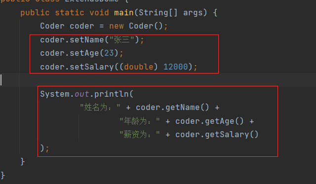

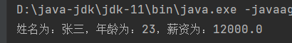

虽然成员变量被私有，但是可以提供 `getter` 和 `setter` 方法，这些方法是公共的，子类是可以继承使用的。


# 继承的好处

> 提高代码的复用性，重复的内容在父类中定义，子类继承即可，无需重复定义。


# 继承使用时机

继承不可盲目使用，需要存在一定的合理性。举个例子：共性的内容，并没有定义在 `Employee` 中，而是定义在 `Coder` 中，由 `Manager` 去继承 `Coder` ：

```java
class Coder {
    private String name;
    private Integer age;
    private Double salary;

    public String getName() {
        return name;
    }

    public void setName(String name) {
        this.name = name;
    }

    public Integer getAge() {
        return age;
    }

    public void setAge(Integer age) {
        this.age = age;
    }

    public Double getSalary() {
        return salary;
    }

    public void setSalary(Double salary) {
        this.salary = salary;
    }
}

class Manager extends Coder {

}
```

虽然， `Manager` 也可以使用 `Coder` 的成员：


那为什么还要向上抽取出一个共同的父类呢？其实这种设计是不合理的， `Manager` 继承至 `Coder` ，想想看 `Manager` 是子类， `Coder` 是父类，项目经理难不成还要继承至程序员吗？这合理吗？这明显不合理。所以继承体系设计要存在合理性。不管是项目经理继承至程序员，还是程序员继承至项目经理都不合适，但是向上抽取出一个员工类，项目经理是员工的一种，程序员也是员工的一种，这种设计就合理多了。

> 当类与类之间，<font color='E0361A'>**存在相同(共性)的内容**</font>，并且产生了<font color='E0361A'>**谁是谁的一种**</font>这样的关系时，可以考虑继承优化代码

比如， `Student` 类和 `Teacher` 类，它们都有共同的属性如姓名、年龄等，那么可以向上抽取出一个 `People` 类。又比如， `Dog` 类和  `Cat` 类，可以向上抽取出 `Animal` 类。


# 继承中成员访问特点

## 成员变量

在父子类中，如果出现重名的属性，优先使用谁呢？比如， `Fu` 类中有属性 `num` ， `Zi` 类中也有属性 `num` ，同时`Zi`中还要方法`method`，在`method`中输出`num`属性。`Zi` 类继承至`Fu`类，那么调用`Zi`的`method`，会输出什么呢？

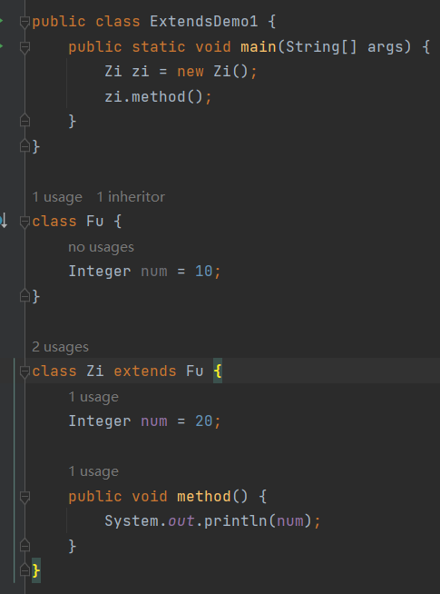

结果：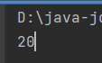

会输出20，也就是输出的是子类中的属性。这是为什么？这是因为本类中的方法调用成员变量时，实际上是使用`this`来调用的，也就是说这样的调用方法：

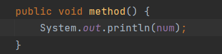

等效于：

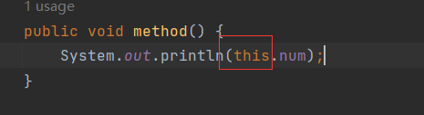

只不过通常都将`this`省略掉了。而`this`指代的是当前的实例，这行代码是写在`Zi`类中的，即当前实例就是`Zi`对象，那么调用的`num`自然也是`Zi`的`num`，所以输出结果为20。

### super

如果非要用父类的`num`呢？就需要使用关键字`super`了。如同`this`指向的是当前实例一样，`super`指向的就是父类实例。

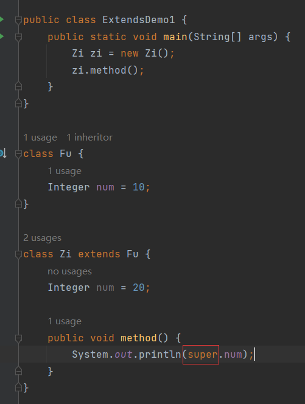

结果：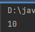

问题：

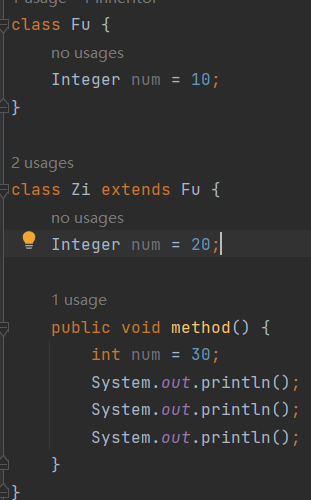

父类的`num`为10，子类为20，在`method`方法中又定义了局部变量`num`为30，如何打印出30、20、10？

打印30直接访问局部变量，打印20要访问当前实例的变量，打印10要访问父类的变量，所以答案为：

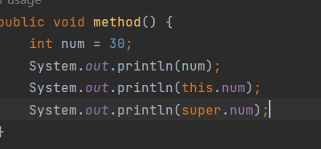

结果：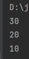


## 成员方法

子类继承父类，子类是否可以自己继续定义方法？答案是肯定的。

既然子类可以继续定义方法，那么如果子类定义了一个和父类方法名一样的方法，但是逻辑却不一样，此时调用子类的方法，是执行父类方法的逻辑还是子类方法的逻辑？

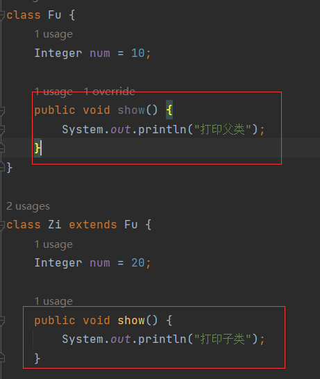

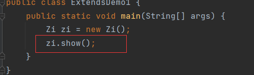

结果：

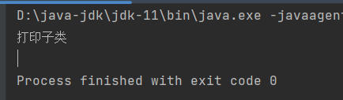

执行的是子类方法的逻辑。

> **方法声明一致：**
>
> ​	方法名一致，形参的个数、类型和顺序一致，返回值一致叫做方法声明一致，否则不一致。

父子类中，出现了方法声明一样的方法，在创建子类对象，调用对象方法时，会优先使用子类的方法逻辑。这虽然是就近原则现象，但其实是子类方法对父类方法进行了重写。

### 方法重写

与方法重载的对比，莫要混淆：

> **方法重载(Overload)：**
>
> ​	在同一个类中，方法名相同，形参不同(类型、个数和顺序不同)，与返回值无关
>
> **方法重写(Override)：**
>
> ​	在父子类中，方法声明一致的方法

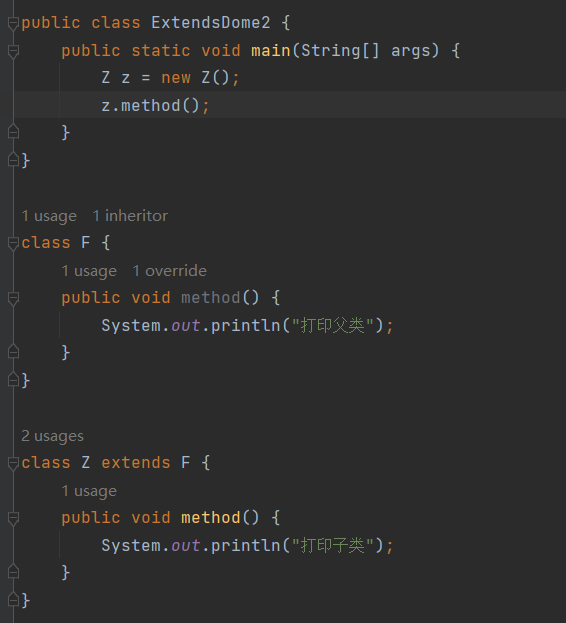

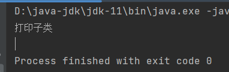

如果改变子类的方法：

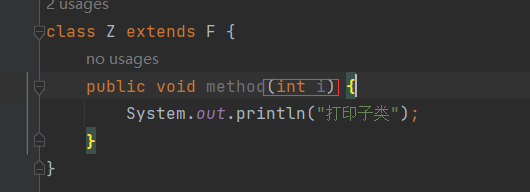

那么调用的就是父类的方法：

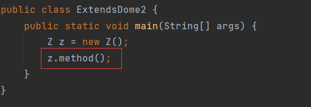

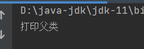

此时子类的方法与父类的方法就不再是重写关系，而是重载关系：

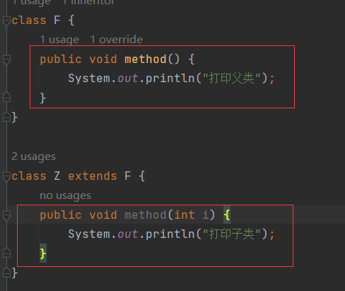

虽然不再同一个类中，但是它们存在继承关系，子类能继承父类的方法，想象成子类中也有父类的方法，然后对该方法进行了重载，等效于：

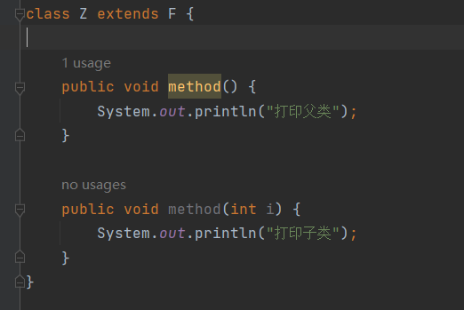

所以`Z`对象调用`method`方法，发现没有参数，于是就调用了没有参数的方法。

检查一个方法是否为重写，最简单的办法就加`@Override`注解，如果没有报错，那么该方法是重写方法，反之则不是：

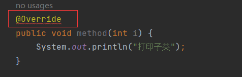


### 重写时机

方法重写的时机：

> 当子类需要使用父类的方法，但是觉得父类的方法不好，需要做一定的<font color='#409EFF'>**修改**</font>或<font color='#409EFF'>**增强**</font>时，可以重写父类的方法。

举个例子，`F`类有方法`love`，`Z`类继承`F`，也有`love`，但是子类觉得父类的谈恋爱方法还不够好于是在此基础上增加一些方法：

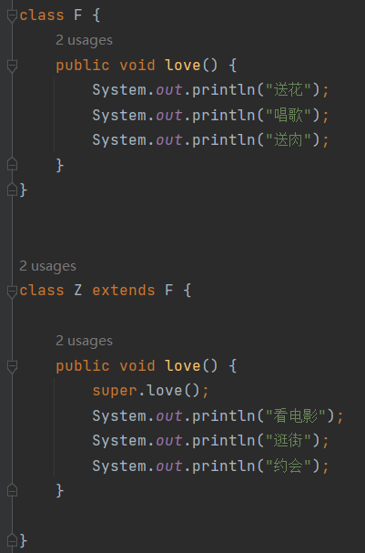

结果：

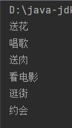

自生的逻辑执行的同时，也执行了父类方法的逻辑，在父类方法的基础上进行了逻辑增加，这就增强。

还有可能，子类觉得父类的谈恋爱方法已经完全过时，不适合当下的时代，于是直接覆盖了父类的方法：

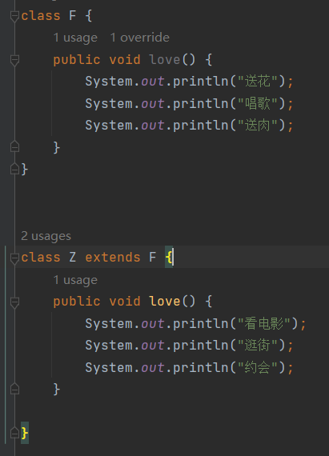

结果：

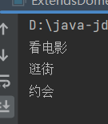

这就是修改。


### 注意

> - 父类中私有方法，子类不能重写
> - 子类重写父类方法时，访问权限必须<font color='409EFF'>**大于等于**</font>父类

父类方法私有，子类不能重写：

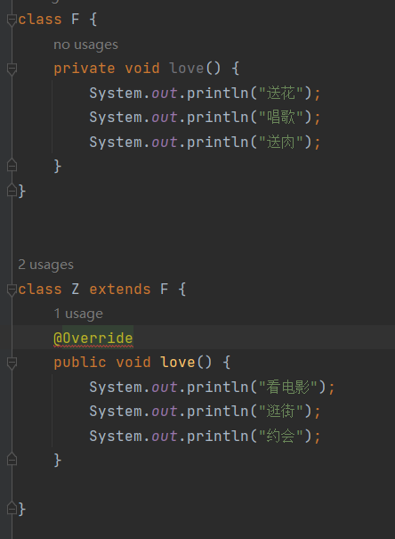

`@Override`报错，说明子类的`love`方法不是重写方法。这点很好理解，子类访问父类的成员只能访问非私有成员，方法已经私有，子类自然不能访问，也就无法对其进行重写。

子类重写父类方法，访问权限必须大于等于父类方法。如果父类的方法权限是默认：

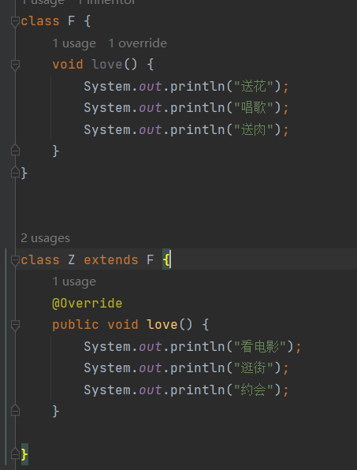

子类是`public`，权限比默认大，没有问题。如果子类也是默认：

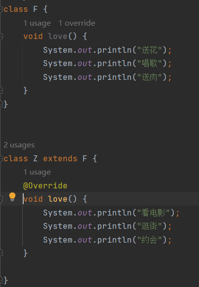

权限一样，也没有问题，但是一旦父类的权限是`public`，子类的权限就比父类小了，就会报错：

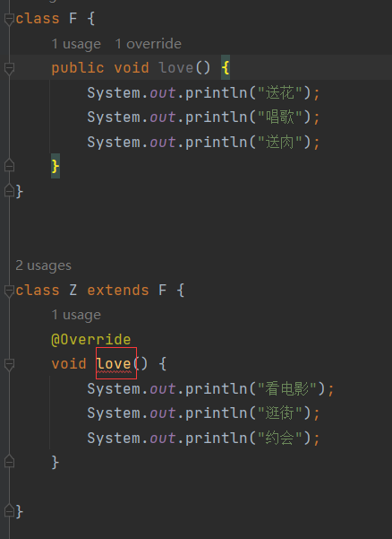


# 权限修饰符

| 权限修饰符 | 同类中 | 同包中 | 不同包的子类 | 不同包的无关类 |
| :--------: | ------ | ------ | ------------ | -------------- |
|  private   | ✔      | ❌      | ❌            | ❌              |
|  default   | ✔      | ✔      | ❌            | ❌              |
| protected  | ✔      | ✔      | ✔            | ❌              |
|   public   | ✔      | ✔      | ✔            | ✔              |

如何理解`protected`在不同包的子类中可以访问？

创建两个包：

在a包中创建父类`Fu`，创建`show`方法，用`protected`修饰：

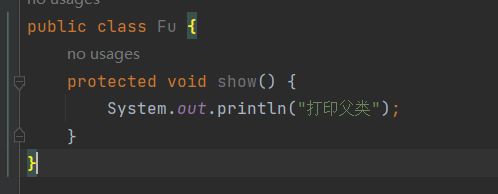

在b包中创建子类，继承`Fu`：

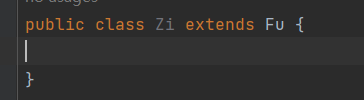

现在`Zi`是`Fu`不同包下的子类。然后再创建一个测试类：

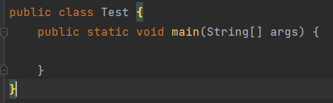

现在的目标是在`Test`中去访问`Fu`的`show`方法，`Test`和`Fu`的关系是不同包下的无关类，在`Test`中创建`Zi`对象，能用`Zi`访问`Fu`的`show`方法吗？

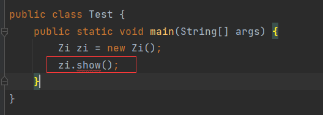

不能访问。为什么报错？需要清楚，`show`方法实际来源是`Fu`类，而且该方法权限是`protected`。目前的调用环境是`Test`中，`Test`和`Fu`的关系是不同包下的无关类，这是权限不足。所以访问才会报错。如果放开权限，则不会报错：

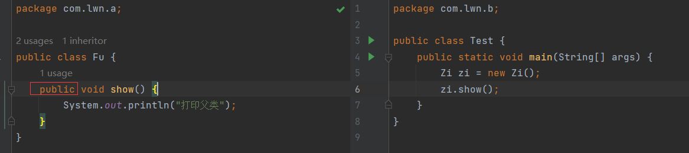

`protected`不同包下的子类可以访问指的是在`Zi`类的`{}`中允许访问：

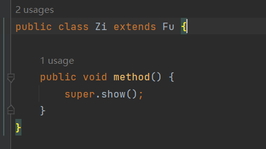

`Test`调用`Zi`的`method`方法，间接调用`show`方法：

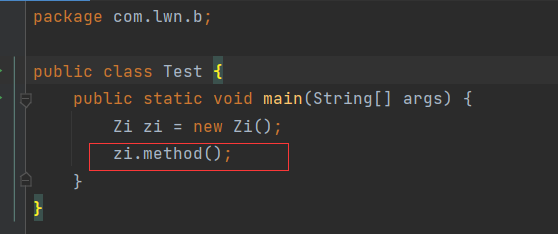

也就是说`protected`限制了不同包下的类，只有它的子类能访问它。

在同包下，任何类都能访问：


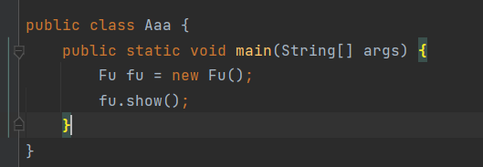

一旦不在同一个包下，那么只能在子类中访问：

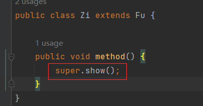

在其他类中，即便是创建子类对象，也不能访问：


# 继承的特点

> java中只支持<font color='409EFF'>**单继承**</font>，不支持<font color='409EFF'>**多继承**</font>，但支持<font color='409EFF'>**多层继承**</font>。

一个子类只能一个父类，它不能同时拥有多个父类，这叫只支持单继承，不支持多继承。子类继承父类，父类还可以继续继承父类，这叫多层继承。比如，`C`类继承至`B`类，`B`类又继承至`A`类。

`C`类不能同时继承`B`类和`A`类：


`C`类继承至`B`类，`B`类又继承至`A`类：


添加方法：


创建`C`对象，调用方法：


结果：


父类的方法都能调用。

但是`A`不能再去继承`C`，这会造成循环继承：


java不允许循环继承：


**问题：为什么不支持多继承？**

因为java为了避免逻辑冲突。假设java支持多继承，`C`类同时继承`A`类和`B`类，而`A`类和`B`类中都有相同的方法`method`，但是它们的执行逻辑不同，`A`类的`method`输出1，而`B`类的`method`输出2，那么`C`类通过继承调用父类的`method`它是输出1还是输出2呢？java无法识别，这就造成了逻辑冲突，所以为了避免这种情况，java不允许出现多继承。

**问题：为什么支持多层继承？**

因为不会造成逻辑冲突。`C`类继承`B`类，`B`类继承`A`类，`A`类和`B`类中都有相同的方法`method`，`C`类调用`method`，执行的是`B`类方法的逻辑，本质上是`B`类的`method`对`A`类的`method`进行了重写，覆盖了原来的逻辑，也就不会造成逻辑冲突。


# 继承中构造方法访问特点

**问题：子类是否能继承父类的构造方法？**

不能，因为构造方法要求方法名与类名保持一致，如果构造方法能被子类继承，那么继承的父类构造无法与子类名一致，所以不能。

> 构造方法不能被继承，子类的构造需要手动编写。

**问题：子类在初始化之前，有必要先完成父类的初始化吗？**

有必要，因为子类在初始化时，很有可能调用父类的成员，如果父类没有提前初始化，没有将成员数据准备好，子类如何访问父类成员？所以有必要。

**问题：子类如何完成父类的初始化？**

对象初始化用构造方法，父类要完成初始化，也是通过父类的构造方法完成，所以子类只要能调用父类的构造方法就能完成父类的初始化。

> 除`Object`类以外，所有的构造方法中第一行都默认隐藏了一句代码`super()`，通过这行代码来访问父类的无参构造。

准备`C`类和`B`类，`C`继承`B`，完善`C`类和`B`类的无参和有参数构造：


创建`C`的对象：


结果：


从结果可以看出，在初始化`C`的时候，会调用`B`的无参构造。这正是因为`C`的构造方法中，默认隐藏了`super()`。`super`指代父类实例，`super()`就是在调用父类的无参构造，即`C`的构造方法执行之前，会先执行`B`的无参构造方法。

`C`的构造：


等效于：


而且，从IDEA的提示中也可看出：


`B`的无参构造显示被引用两次，这两次正是`C`的无参构造和有参构造引用的：


所有的构造方法中第一行都默认隐藏了一句代码`super()`，即在父类的构造中也隐藏了这句代码，那么父类的`super()`调用谁的无参构造呢？

> java中所有的类，都直接或间接的继承到了`Object`类，`Object`类是所有类的父类。

可以看到`B`的`super()`指向`Object`类：


`Object`类的构造中第一行没有`super()`，因为它是所有类的父类，他是最顶层的类。


## 案例

准备两个类，学生类和老师类：

学生类：

- 属性：
  - 姓名
  - 年龄
  - 成绩
- 方法：
  - 学习方法

老师类：

- 属性：
  - 姓名
  - 年龄
- 方法：
  - 教学方法

学生类和老师类存在相同的属性，于是向上抽取出父类：

```java
package com.lwn.test;

public class Person {
    private String name;
    private int age;

    public Person(String name, int age) {
        this.name = name;
        this.age = age;
    }

    public Person() {
    }

    public String getName() {
        return name;
    }

    public void setName(String name) {
        this.name = name;
    }

    public int getAge() {
        return age;
    }

    public void setAge(int age) {
        this.age = age;
    }
}
```

学生类：


老师类：


创建老师类的构造，使用快捷键快速生成：


这里显示出了两个构造是父类`Person`提供的：


老师类的有参构造，它主要干的事就调用父类的有参构造，将参数交给父类的构造，让父类来完成初始化。

在测试类中创建老师类的对象，初始化流程是这样的：


创建老师类对象调用老师类的有参构造，将参数传递，有参构造调用`Person`类的有参构造，将参数传递，然后赋值给`Person`类的`name`和`age`属性。 由于继承，老师类继承`Person`类的`getter`和`setter`，就可以调用`getter`来访`Person`类的`name`和`age`。

`teach`通过父类调用属性：


调用`teacher`的方法：


结果：

    

这就是继承的一个好处，子类的构造方法中可以调用父类的构造方法，让父类来完成对象的初始化。

接着创建学生类的构造，学生类有三个属性，`name`和`age`父类有，那么可以让父类来初始化，但是`score`属性父类没有，所以只能由子类自己来完成初始化：


创建`getter`和`setter`：


`study`通过父类和自生调用属性：


测试：


结果：


了解了继承中构造方法的访问特点，对于代码的提升体现在，子类将数据接收后，父类有的数据，由父类去初始化，没有的则由子类自身初始化。
