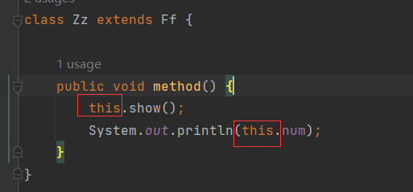

# this和super

在之前的学习中，频繁的出现`this`和`super`。用`this`可以调用到本类中的成员，用`super`可以调用到父类的成员。

> `this`：代表当前实例，也就是本类对象的引用
>
> `super`：代表父类存储空间的标识

如何理解父类存储空间的标识？需要结合内存图，在上一章中讲解案例图解时`Student`对象的内存图：

在创建子类对象的时候，对象区中有一块专门的区域叫做`super`，这块区域中存放父类的相关数据。`super`关键字代表的就是这块区域的存储标识。

通过`super`关键字就能找到这块空间，从而调用父类相关的数据。

# this和super对比

| 关键字 |    访问成员变量    |    访问成员方法     |                    访问构造方法                     |
| :----: | :----------------: | :-----------------: | :-------------------------------------------------: |
|  this  | this.本类成员变量  | this.本类成员方法() |      this()调用无参构造；this(...)调用有参构造      |
| super  | super.父类成员变量 | this.父类成员方法() | super()调用父类无参构造；super(...)调用父类有参构造 |

## super的省略规则

用`super`调用父类成员时，某些情况下可以省略`super`关键字。

`Zz`中调用父类的属性和方法，执行结果：

> 使用`super`调用父类的属性或方法时，被调用的属性或方法在子类中不存在，那么`super`可以省略。

`Zz`中没有`show()`和`num`，所以可以省略`super`：

编译没有报错，执行结果：

打印的是父类的成员，也没有问题。

**问题：为什么可以省略`super`？**

调用父类的成员，正常情况下应该写`super`，但是这里写`this`也不会报错：

编译是通过的。这就奇怪了，`this`调用的是本类成员，`Zz`类看起来是没有`show()`和`num`的，为什么不报错呢？其实是`Zz`继承了`Ff`，那么`Ff`中有的成员，`Zz`也会继承。结合内存中子类对象的空间布局就能看出来：

既然`Zz`继承了`Ff`的`show()`和`num`，那么自然能用`this`来调用。在当前的代码材料中，可以省略`this`吗？

是可以的，因为`method()`中没有重名的变量，这时候就不需要用`this`来区分：

`this`可以省略：

综上，其实`super`的省略规则真正省略的不是`super`，而是`this`。因为子类继承父类，子类可以继承父类的成员，那么子类中就可以用`this`进行调用，又根据`this`的省略规则对`this`进行了省略。

省略规则又一个前提，子类中不存在父类的属性或方法，才可以省略`super`，如果子类中存在：

正常情况下，用`super`去调用父类的属性和方法：

一旦省略`super`，那么调用的就是自生的属性和方法：

因为子类中有自己的`num`、自己的`show()`，那么根据就近原则，就会优先用自己的，而不会用父类的。

# this()的使用场景

类`A`：

创建对象：

假设这样的场景，当前的类`A`是项目1.0版本编写的，然后到了1.1版本，`A`中需要新增一个成员变量：

现在的属性有4个，但是有参构造中只初始化了3个，如果加一个属性：

那么创建对象的地方的就报错了：

**开闭原则：**

> 对功能扩展做开发，对修改代码做关闭

今后写代码，原有的代码尽量不要修改，就像这个案例，修改了构造方法，创建对象的地方就报错了。

不在原有的代码上修改，新功能怎么办呢？重写创建一份：

原来的代码没有报错，新对象也能创建：

这才是理想情况。活用开闭原则，如果有新功能，重新编写。

这两个构造，有相同的部分，重复编写了。这时候就可以用到`this()`来优化：

将参数传递给3个参数的构造来初始化，剩下的参数自生来初始化。

注意：

上文说过，构造的第一行默认都隐藏了`super()`。此处还是这种情况吗？

报错了，报错的原因：

`this()`必须在第一行，如果与`super()`交换：

也报错，原因是`super()`也必须在第一行。

> `this()`和`super()`都在争夺构造方法第一行的位置，所以二者不能共存。

没有`super()`，那么这个构造方法如何完成父类初始化？

其实不用担心，这个构造中调用了`this(a, b, c)`，也就是这个构造：

这个构造中是有`super()`的：

由它来完成父类的初始化。