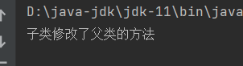
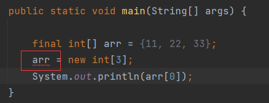

# 介绍

`final`是java中的关键字，意思是最终，可以修饰**方法、类、变量**。

# final修饰的特点

- 修饰方法：表示方法是最终方法，**不能被重写**。
- 修饰类：表示类是最终类，**不能被继承**。
- 修饰变量：表示变量是常量，**不能被再次赋值**。

# 案例

## 修饰方法

父类中的方法，子类将其重写：

结果：

如果父类希望子类重写它的方法，那么可以将方法声明为最终方法：

子类重写就会报错：

**细节**：`public`和`final`是没有顺序关系的，不过由于代码习惯，建议权限修饰符在第一位。

## 修饰类

如果一个父类中有很多方法，都很重要，都不希望子类重写，那么所有方法都加上`final`：

既然这个类不希望子类来重写它的所有方法，那就将这个类声明为最终类：

它不被继承，就没有子类，也就不会来重写它的方法。

在java有很多类都被`final`修饰，常见的如`String`类：

`final`修饰的类，虽然没有子类，但是它可以有父类：

## 修饰变量

被`final`修饰的变量就是一个常量，不能再次赋值：

什么样的变量需要被`final`修饰？举个例子，`Math`类：

这个类中有一个变量叫做`PI`，通过名字就能看出这是一个圆周率，它是被`final`修饰的，这很好理解，如果`PI`允许被修改，那么就可能造成计算圆相关数据时精度不一致。所以，对于哪些不希望被修改的数据可以用`final`修饰。

### 细节1

变量分为基本数据类型和引用数据类型，`final`修饰这两种类型效果是不一样的。

> 修饰基本数据类型：数据值不可改变
>
> 修饰引用数据类型：**地址值不可改变，内容可以改变**

引用数据类型用`final`修饰，以数组来说：

改变它的元素，执行结果：

内容是被修改的。但是重新创一个新数组，然后赋值给`arr`，即改变地址值会报错：

### 细节2

`final`修饰成员变量的细节：

`final`修饰成员变量报错了，错误原因：

`num`未初始化。

成员变量即便未赋值，也是有默认值的，但是这个默认值不能被`final`修饰，所以才报错。手动赋值就不会报错了：

也就是说`final`修饰成员变量，不能修饰默认值。

在构造方法中为成员赋值：

可以看到，`num`未初始化，但是在构造方法中初始化，这种情况下`final`是可以修饰的。

在普通的方法中初始化可以吗？

不写。

所以，`final`修饰成员变量初始化的时机：

- 要么定义变量时手动初始化。(推荐)
- 要么在构造方法中初始化。

# 命名规范

`final`修饰的变量叫做常量，常量有一个命名规范：

常量名所以字母大写，如果不是一个单词，单词与单词之间用 _ 分隔。比如，`MARK`或者`NUMBER_VALUE`。

这是开发习惯，不一定要遵守，只是这样做更好。 

# 总结

> `final`是java中的关键字，意思是最终，可以修饰**方法、类、变量**。
>
> - 修饰方法：表示方法是最终方法，**不能被重写**。
>
> - 修饰类：表示类是最终类，**不能被继承**。
> - 修饰变量：表示变量是常量，**不能被再次赋值**。
>
> `final`修饰数据类型的细节：
>
> - 修饰基本数据类型：数据值不可改变
> - 修饰引用数据类型：**地址值不可改变，内容可以改变**
>
> `final`修饰成员变量的细节：
>
> - `final`修饰的成员变量，其初始化的时机，要么在定义变量时手动初始化(推荐)，要么在构造方法中初始化。