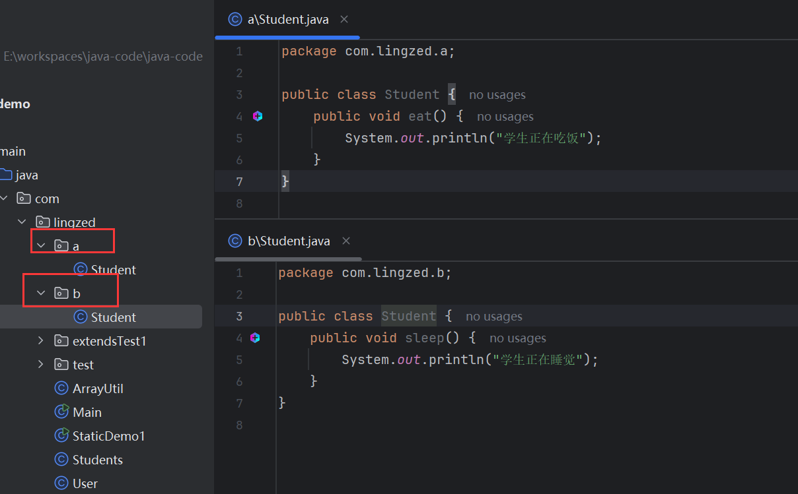
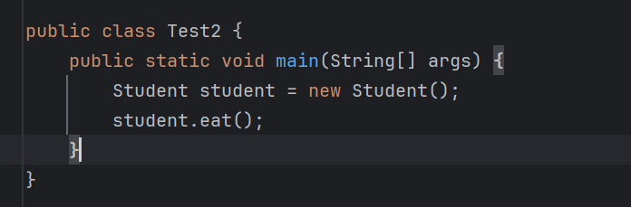
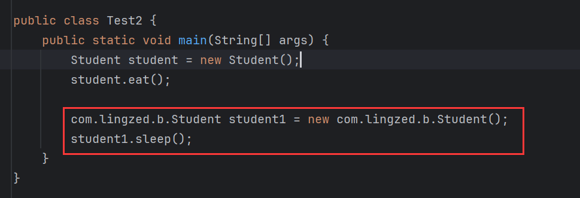
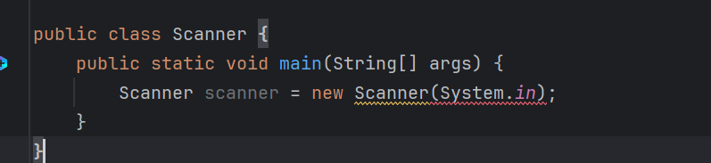
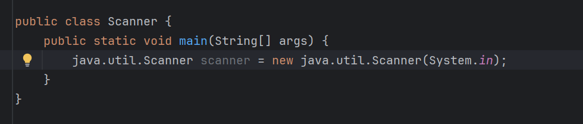

# 什么是包

包本质来说就是文件夹，用来管理类文件的。

## 建包

创建语法：

```java
package 公司域名倒写.技术名称;
```

例如：

```java
package com.lingzed.domain;
public class Student {
    
}
```

包名建议全部英文小写，且具备意义Package公司域名倒写。

虽然使用IDEA进行java开发，工具会自动建包，但是仍需注意，<font color='#F56C6C'>**建包语句必须放到第一行**</font>。

## 导包

相同包下的类可以直接访问，不同包下的类必须导包才可以使用。

导包语法：

```java
import 包名.类名;
```

### 细节

假如一个类中需要用到不同类，而这个两个类的名称是一样的，那么默认只能导入一个类，另一个类要带包名访问。

举例：

分别在a包和b包下，创建两个`student`类：



先创建a包下的`student`对象：



再创建b包下的`student`对象：



此时，b包下的`student`对象创建需要全类名。

再说一种情况，java中有很多写好的类，比如`Scanner`，现在创建一个和`Scanner`同名的类，创建对象：



报错了，此处想使用的是java的`Scanner`API的构造，但实际上使用的是自定义的`Scanner`构造，在本类中并没有声明这样的构造。

如果定义类名与java内库中的类名一致，优先使用自定义的类。想要用到内库中的类，需要采用全类名访问：



