# 什么是抽象类

所谓抽象类，就是一种特殊的父类。它特殊的点在于，它的内部可以编写抽象方法。


# 什么是抽象方法

将共性的方法，抽取到父类之后，发现这个方法在父类中无法给出具体明确的逻辑实现，而且这个方法，还是子类必须要有的方法，就可以设计为抽象方法。

举例：

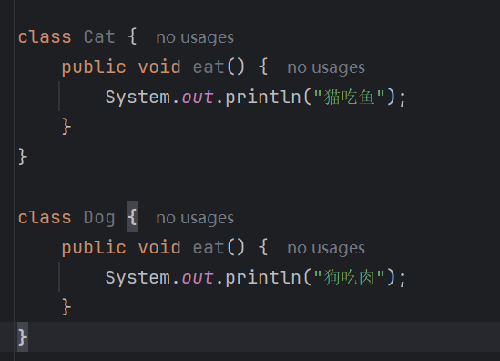

有两个类`dog`和`cat`，都有`eat()`，因此向上进行抽取出一个动物类，将`eat()`抽取到动物类中：

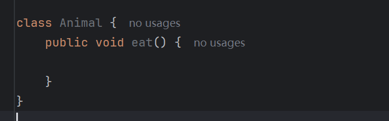

思考，动物类的`eat()`是否能描述？

不能描述或者说不能很好的描述，因为不同的动物吃的东西是不同的，根本不能描述清楚。既然不能描述清楚，那么干脆动物类的`eat()`就不要描述了，用`abstract`关键字来修饰这个方法：

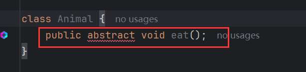

被`abstract`修饰的方法叫做抽象方法，此类方法不能有方法体，且必须声明在抽象类中，否则编译错误：

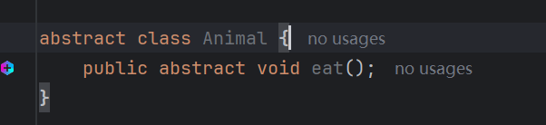

子类去继承抽象类，必须将父类中的抽象方法描述清楚(否则编译错误)，也就是重写该方法。由于父类的抽象方法没有方法体，子类对其进行重写的行为就像是实现了父类抽象方法的功能，因此也被称为对父类抽象方法的实现。

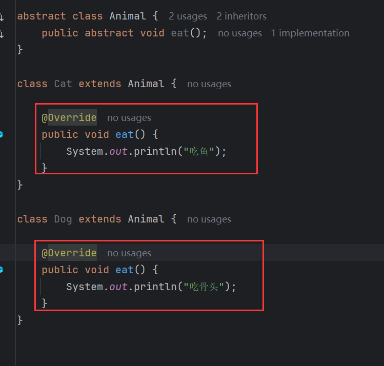


# 何时定义抽象方法

将<font color='#F56C6C'>共性的</font>方法抽取到父类之后，发现该方法的<font color='#409EFF'>逻辑</font>在父类中<font color='#F56C6C'>无法给出具体实现</font>，该方法就可以定义为抽象方法。


# 何时定义抽象方法

一但<font color='#F56C6C'>**类**中声明了抽象方法</font>，那么该类就要<font color='#F56C6C'>声明为抽象类</font>，否则编译错误。


# 语法

抽象类：

```java
public abstract class 类名{}
```

抽象方法：

```java
// 抽象方法不能有方法体
public abstract 返回值类型 方法名(形参列表);
```

> `abstract`不能修饰<font color='#F56C6C'>**变量**</font>


# 注意

1. 抽象类不能实例化
2. 抽象类存在构造方法
3. 抽象类中可以存在普通方法
4. 抽象类的子类
   - 要么重写抽象类中<font color='#F56C6C'>**所有**</font>抽象方法
   - 要么是抽象类

1、抽象类不能实例化

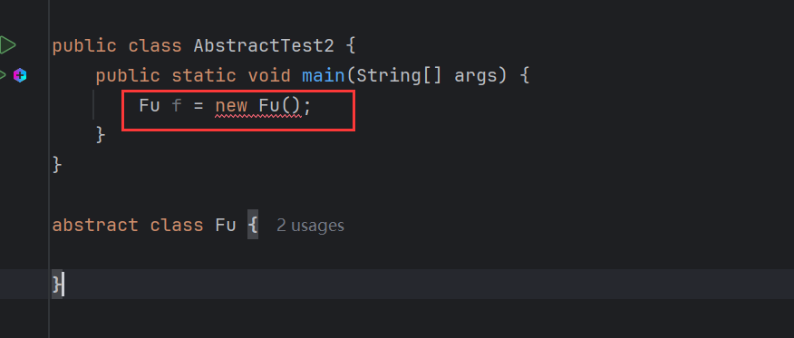

创建实例报错。原因是，如果抽象类允许实例化，那么就可以调用抽象方法中没有方法体的方法，这样做是没有意义的，所有为了避免这种情况，抽象类被设计为不能实例化。

2、抽象类存在构造方法

既然抽象类不能实例化，那么抽象类是否还有构造方法？抽象类是存在构造方法的：

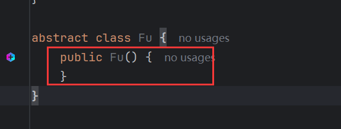

抽象类的构造方法存在的意义是，让子类通过`super`来访访问。在继承中提到过，所有类的构造方法中的第一行默认隐藏了`super()`，子类继承了抽象类，如果抽象类没有构造方法，子类构造中的`super()`就不知道该访问谁。

3、抽象类中可以存在普通方法

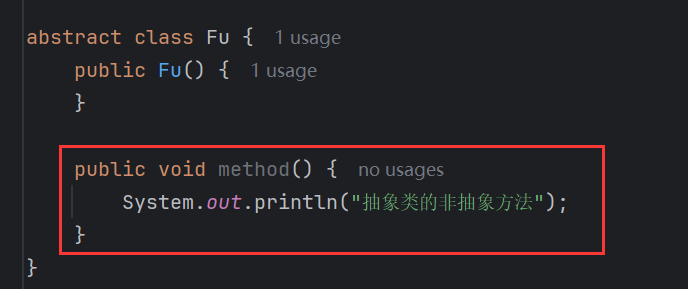

抽象类不能实例化，它内部的普通方法存在的意义是让子类继承使用：

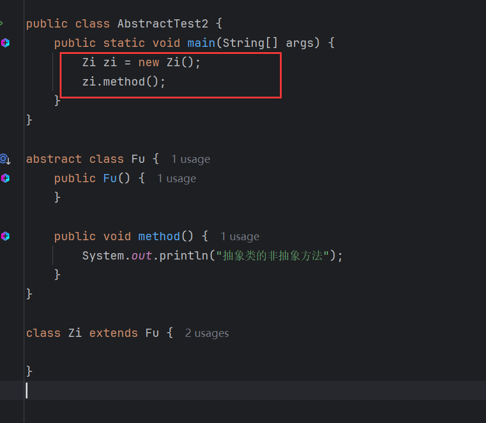

4、抽象类的子类：

- 要么重写抽象类中<font color='#F56C6C'>**所有**</font>抽象方法。
- 要么自身是抽象类。

子类继承抽象类，是强制要求重写抽象类的所有抽象方法，否则编译会报错：

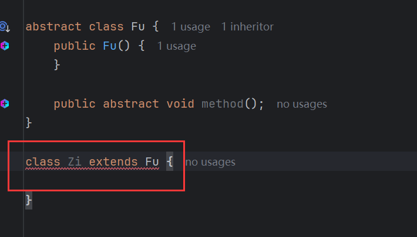

如果子类没有重写父类的抽象方法，那么它自身必须是抽象类：

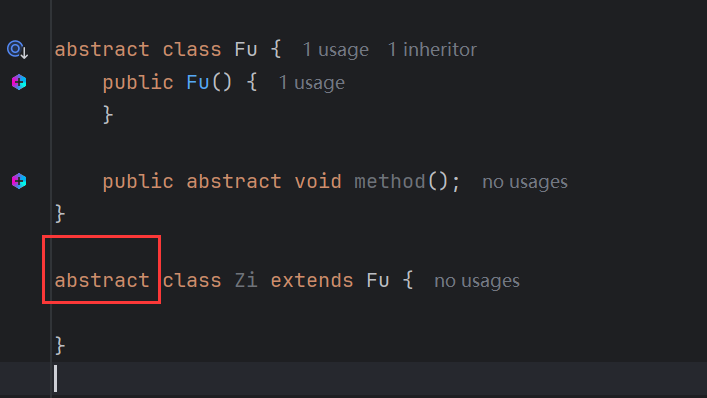

这很好理解因为子类继承抽象类，就会继承它的抽象方法，子类又没有对其进行重写，就相当于在子类中声明了一个抽象方法，一旦类声明了抽象方法，那么该类就要声明为抽象类。

子类声明为抽象类意义何在？举个例子：

类`A`，声明了一个抽象方法：

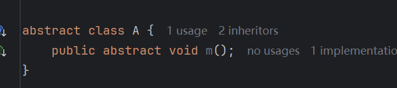

类`B`去继承，重写了该方法，然后类`B`也想为子类制定一些规范，于是声明了一个抽象方法：

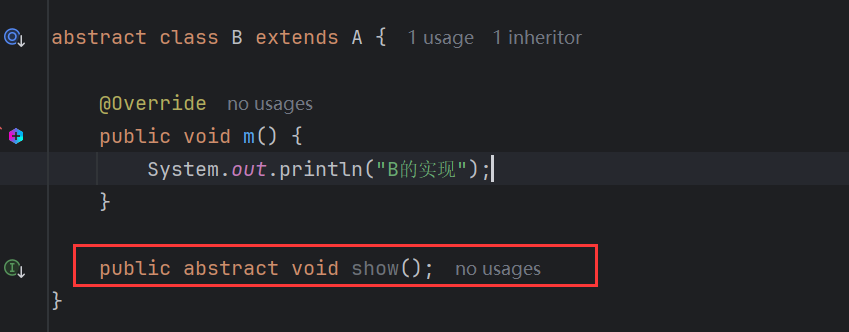

类`C`继承`B`，实现了规范：

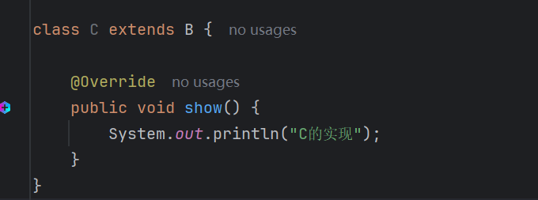

这就好比一个公司的老板指定了一个规范，然后由项目经理去落实了这个规范，但是项目经理又想为自己的组员制定一套规范，于是由项目经理的组员来落实这个规格。这里，老板相对与`A`，项目经理相当于`B`，组员相当于`C`。


# abstract冲突

与`final`冲突，因为`abstract`修饰的方法，强制要求子类重写，但是`final`修饰的方法不能被重写，于是冲突。

与`private`冲突，因为`abstract`修饰的方法，强制要求子类重写，但是`private`修饰的方法子类无法访问，也就不能重写，于是冲突。

与`static`冲突，因为`abstract`修饰的方法没有方法体，而静态方法又可以通过类名来访问，类名调用无方法体方法没有意义。


# 细节

1. 抽象类不能实例化，那么要在其他类中访问抽象类的抽象方法，只能通过子类来访问。由于子类会重写抽象方法，抽象类中的实例方法可以直接调用抽象方法而不会编译报错，因为抽象类不能实例化，所以也就不能通过对象来访问逻辑中带有抽象方法的实例方法，而通过子类来访问，子类必然重写了该抽象方法，也就不会编译报错。