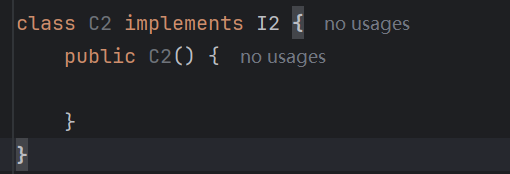
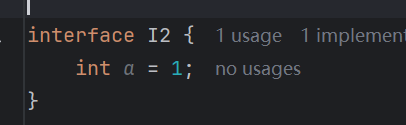
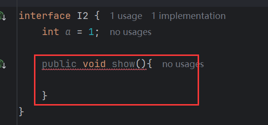

# 简介

生活中的接口又很多，常见的如，插座、适配器、type-C等等。以type-C接口为例，站在设计者的角度去思考，这个接口应该传达声明样的信息？没错，就是**规则**。type-C去连接设备，这些设备的生产厂商他们必须按照兼容type-C接口这套规则来生产设备，否则无法连接。所以这些设备要想和接口连接，就必须按照接口的规则去生产。站在设计者的角度去思考，接口就是在制定规则。

代码中如何制定规则呢？上一章中讲到抽象类，抽象类会强制要求子类去重写它的抽象方法，当一个抽象类中全部都是抽象方法，没有任何成员变量，也没任何普通方法时，这种类存在的价值是什么呢？这种类存在的唯一价值就只是在声明规则。因为这个类但凡有成员变量或者普通方法，那么子类都能继承使用，但是它内部全是抽象方法，那么对于这种类而言它的唯一价值就只是在声明规则了。

对于这种内部全是抽象方法的抽象类，通常会将该类设计为java中的接口。

> 接口，体现的思想是<font color='#F56C6C'>**对规则的声明**</font>，java中的接口更多体现的是<font color='#F56C6C'>**对行为(方法)的抽象**</font>。


# interface

声明接口类用关键字`interface`：

```java
// 与声明类类似，用interface替换class
public interface 接口名{
    
}
```

## 声明时机

如果该类中所有成员都是抽象方法，那么可以将该类声明为接口，因为该类存在的唯一价值只有制定规则。


# 演示

声明一个接口：


尝试添加一个普通方法：


报错了，因为接口是用来声明规则的，内部只允许存在抽象方法：


创建接口的对象：


报错了，接口不允许实例化。因为接口中的方法都是抽象方法，如果能实例化就能通过对象调用抽象方法。

## implements

要想使用接口，就需要类来实现接口，类与接口的关系是实现关系。实现可以通过`implements`关键字来完成，声明一个类实现接口，实现了接口的类叫做实现类：


报错了，因为类实现了接口，就要实现(重写)该接口中的所有抽象方法：


重写完成后，就可以创建实现类对象：


结果：


实现类除了实现接口的所有抽象方法，还可以选择将自身声明为抽象类，因为实现类可以看作是接口的子类，那么实现类自然继承了接口的抽象方法，如果不想实现这些方法，只能抽象自身，因为抽象方法只能声明在抽象类中：


# 接口的成员特点

## 构造方法

> 接口<font color='#F56C6C'>**没有构造方法**</font>。


声明接口的构造，编译报错，因为接口没有构造方法。接口的实现类有构造方法：



构造方法的第一行默认隐藏了`super()`，`super()`指向父类实例，实现类实现接口，可以看作是接口的子类，那么实现类的构造中`super()`是否指向接口，这是否与接口没有构造方法相违背？

其实不是，实现类的`super()`指向的是其父类，如果当前实现类没有显示的继承某个父类那么指向`Object`：


从这里可以看出，<font color='#F56C6C'>**接口不是实现类的父类，也不能将接口当作实现类的父类**</font>，只是接口与父类存在相似性，故将实现类类比为子类，方便理解。

## 成员变量

> 接口中成员变量只能定义<font color='#F56C6C'>**常量**</font>，因为系统会默认添加`public static final`。

接口中定义变量：



表面上是`int a = 1`，实际上，系统会默认添加`public static final`，等效于：


如果它被`static `修饰，那么可以直接通过接口名来访问：


如果它被`final`修饰，那么它的值只能赋值一次：


编译错误，提示被`final`修饰。如果它被`public`修饰，那么它能跨包访问：


综上，接口中的变量确实被`public static final`，只是被系统隐藏了。

## 成员方法

> 接口中的方法<font color='#F56C6C'>**只能是抽象方法**</font>，因为系统默认加入`public abstract`。

定义普通方法会报错：



只能是抽象方法：


另，方法可以省略`public abstract`，因为系统会默认加上：


# 接口和类的关系

类和类之间可以产生继承关系，且只能单继承，不能多继承，但是可以多层继承。

> 类和接口可以产生<font color='#F56C6C'>**实现**</font>关系，它可以<font color='#F56C6C'>**单实现**</font>，也可以<font color='#F56C6C'>**多实现**</font>，甚至可以在<font color='#F56C6C'>**继承一个类的同时实现多个接口**</font>。

定义两个接口：


定义实现类，同时实现`A`和`B`，那么就要实现`A`和`B`的所有抽象方法：


这打破了java只能单继承的局限性，而且多继承不存在逻辑冲突。因为没有逻辑就不会有逻辑冲突，即便`A`和`B`中都有相同的方法，但是因为他们都没有方法体，具体的实现还得实现类来完成，所以不存在逻辑冲突。

实现类同时继承一个父类：


没有实现接口的方法，但是没有报错，因为继承了父类的`show()`，相当于子类实现了接口的方法。


# 接口和接口的关系

> 接口和接口是<font color='#F56C6C'>**继承**</font>关系，可以<font color='#F56C6C'>**单继承**</font>，也可以<font color='#F56C6C'>**多继承**</font>

接口多继承：


类实现被继承的接口，就要实现包含父接口方法在内的所有接口方法：


如果父接口和子接口中方法相同，那么实现类不必重复实现：


# 接口对比抽象类

成员变量对比：

|   类   | 变量声明 | 常量声明 |
| :----: | :------: | :------: |
| 抽象类 |    ✔     |    ✔     |
|  接口  |    ❌     |    ✔     |

成员方法对比：

|   类   | 具体方法声明 | 抽象方法声明 |
| :----: | :----------: | :----------: |
| 抽象类 |      ✔       |      ✔       |
|  接口  |      ❌       |      ✔       |

构造方法对比：

|   类   | 是否存在构造 |
| :----: | :----------: |
| 抽象类 |      ✔       |
|  接口  |      ❌       |

## 两者使用场景

抽象类本质上还是对事物的描述，程序员、项目经理、人事可以向上抽取出以下共性：

- 成员变量：姓名、年龄、薪资
- 成员方法：【work()】

但是由于父类中的【work()】不能很好的描述具体逻辑，因此用抽象方法来表达，而由于抽象方法必须存在于抽象类中，所以才将父类定义为抽象类，其 本质还是在描述事务。

接口是用来制定规则的，举个例子：

经理派发任务给程序员，让他完成一个订单功能的开发，最终程序员写出了一个这样的代码：


这种代码是及其不规范的，方法名随意，而且一个订单模块甚至没有支付功能。规范的做法是

写业务之前，需要先制定业务接口，然后根据接口，再完成具体的业务。

订单接口：


根据这个接口，编写实现类：


这样的好处是，实现类实现订单接口，就不会存在业务丢失的问题，即不会丢失支付功能，而且方法名来自接口，不用担心方法名不规范的问题。

综上，接口的抽象类的区别：

> **接口**：对<font color='#F56C6C'>**行为**</font>做抽象(制定规则)
>
> **实现类**：对<font color='#F56C6C'>**事务**</font>做抽象(描述事务)