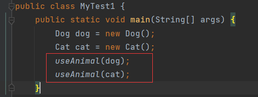
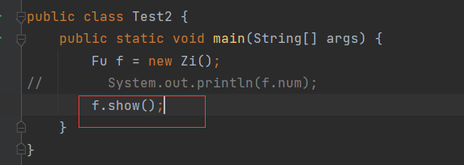
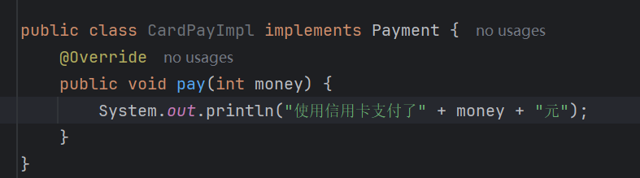

# 多态介绍

什么是多态？

> 多态：同一个行为具有多个不同表现形式或形态的能力。

举例，订单模块：

订单接口：

实现类：

随着公司的发展，业务越来越大，除了本土的订单，还承包了海外订单业务。需要对当前的订单模块进行扩展，是在原来的订单模块上修改，还是重新写一个海外订单模块？根据开闭原则，应该重新写一个海外订单模块来实现订单接口：

测试：

结果：

不同的选择执行不同的订单业务，虽然功能实现了，但是这部分：

存在高度重复项，因为订单的线路不同，国内和国外需要分别创建对象，然后调用相同的方法。

能否改进？能：

用一个接口类型的变量，去接收不同分支产生的实现类对象，将相同的代码逻辑提取出来，线路执行完毕后得到的对象一定是符合这个线路的，再用这个对象来执行：

结果与第一次执行一样。从上可以看出，第二次的执行中两次路线调用的都是相同的方法，但是执行了不同的结果，这就是多态现象。

这就是所谓的：同一个行为具有多个不同表现形式或形态的能力，同一个行为指方法相同，比如这里的订单的一系列方法，不同路线调用的方法是相同的，表现出不同的形式或形态的能力，比如这里虽然方法相同，但是根据线路不同执行了不同的逻辑。

# 多态前提

实现多态的前提条件：

> 1. 需要**继承**/**实现**关系
> 2. 需要**方法重写**
> 3. **父类引用**指向**子类对象**

# 对象多态

> **父类引用**指向**子类对象**

代码材料：

父类`Animal`，子类`Dog`和`Cat`，并重写了`eat()`，已经满足前两个条件。创建子类对象：

这叫做子类引用指向子类对象，如果用一个父类变量去接收子类对象：

这叫做父类引用指向子类对象。

并不是所有对象都能这样引用，比如：

因为`Cat`不是`Dog`的父类。对于这种创建对象的方式，叫做对象多态。

## 好处

声明一个方法，接收`Dog`参数：

再声明一个方法，接收`Cat`参数：

调用：

这个方法可以优化，让它既能接收`Dog`，也能接收`Cat`：

为什么这个方法能接收`Dog`和`Cat`，因为用到了对象多态，`useAnimal()`接收`Animal`参数，`Dog`和`Cat`是其子类，调用方法传入的参数是子类对象，方法中的形参是父类引用，即父类引用指向子类对象，所以能接收`Dog`和`Cat`。

综上，对象多态的好处：

> 方法的形参定义为父类，那么这个方法可以接收该父类任意的子类对象

# 行为多态

## 好处

其好处在订单案例已经展示过了：

> 同一个方法，具有多种不同表现形式，或形态的能力

以动物案例再展示一次：

执行：

传入狗对象，调用狗吃饭行为，传入猫对象，调用猫吃饭的行为，即同一个`eat()`，表现出了不同的行为，这就是行为多态。

# 多态的成员访问特点

代码材料：

## 成员变量

以多态创建子类对象：

访问`num`，调用父类还是子类？

结果：

很明显调用父类的成员变量。用多态创建对象时，创建内部的成员变量，调用的是父类成员。

但是细分来说需要从两个阶段来判断：**编辑阶段**和**运行阶段**。

多态创建完对象，调用成员变量时，在编译阶段，编译器会先检查父类中有没有这个数据，如果没有，编译阶段就会报错：

成员变量的特点是：

> 编译看左边(**父类**)，执行也看左边(**父类**)

这里左边是指父类，在多态创建对象情况下，以赋值表达式左右区分，左边是父类，右边是子类。

## 成员方法

调用成员方法：

结果：

可见，成员方法调用的是子类。在编译阶段会检查父类中有没有成员方法，如果没有，编译报错：

如果有，编译通过，但是在执行阶段，执行的是子类的方法逻辑。

成员方法的特点是：

> 编译看左边(**父类**)，执行看右边(**子类**)

为什么执行子类的方法逻辑？因为担心调用的父类方法，是一个抽象方法。

以接口多态进行演示：

多态的前提之一是继承或实现，此处是实现关系，且重写了方法，那么可以用对象多态：

然后调用方法：

编译时检查父类是否有方法，哪怕是接口中的抽象方法也可以，运行时执行子类中的方法逻辑：

如果调用接口的抽象方法是没有意义的。

## 静态成员

多态创建的对象调用静态方法：

结果：

调用父类的将他成员，看起来与调用成员变量的情况一致，其实这是一种假象，调用静态成员可以直接通过类名调用，用对象也可以调用，但用对象调用是一个假象，因为在编译后的字节码文件中，会将对象调用改为类调用：

所以类是谁肯定就调用谁的方法，当前是`Fu`，调用的就是`Fu`的方法。

# 多态的好处和弊端

## 好处

提高程序的扩展性：

- 对象多态，可以将方法形参定义为父类，以接收该父类的任意子类。
- 行为多态，同一个行为，具有多个不同表现形式或形态的能力。

## 弊端

> 多态声明的变量，不能调用子类特有的成员

因为，多态在编译时，会检查父类中有没有这个成员，如果没有则编译失败，子类中特有的成员，父类肯定没有，既然父类没有，那么调用会导致编译失败：

调用子类特有的成员，报错：

# 转型

多态对象不能直接调用子类的特有成员，但是可以使用转型技术来实现调用。转型分为两种：

> - 向上转型：从子到父(父类引用指向子类对象)
> - 向下转型：先从子到父，再从父到子

**向上转型**就是**子类对象**的**地址值赋值**给**父类变量**，内存地址图解为：

向下转型指将父类变量存储的子类对象的地址值，转交给子类变量。注意，此处一定是将子类对象的地址值转交给子类变量，它并不是**父类对象**的**地址值赋值**给**子类变量**。向下转型需要用到强转语法：

它的内存图解为：

为什么不能理解为**父类对象**的**地址值赋值**给**子类变量**？看这种情况：

创建父类对象`f1`，然后将父类地址值赋给子类变量`z`，编译没有报错，但是执行时报错：

表示类型转换异常。创建父类对象，这个对象是父类型，`z`是子类型变量，需要接收子类型的对象，用父类型对象肯定不能赋值给`z`：

为什么先向上转型，然后再向下转型可以：

因为用了对象多态将子类型的对象地址值赋值给了父类型变量，此时变量中存储的本来就是子类型，再次赋值给子类型变量自然不会产生类型转换错误。

## 案例

以订单模块为例，在海外业务中新增一个方法：

如果选择2分路，需要执行`IP()`，但是用`order`去调用会报错：

多态声明的变量，不能调用子类特有的成员，`IP()`是`OverseasImpl`类特有的，`order`不能去调用，因此需要用到向下转型，用转型后的变量去调用：

结果：

但是选择1的时候会报错：

依然是类型转换异常，当选择1时，走这条分支：

此时`order`存储`OrderImpl`对象的地址值，然后向下转型：

将`OrderImpl`类型转换为`OverseasImpl`，等号左右两边类型不一致，肯定报错。

### instanceof关键字

`instanceof`关键字用于校验左边的引用是否等于右边的类型，如果等于返回`true`，不等于返回`false`。因此案例可以改造成：

添加一个条件判断，只有当`order`的引用是`OverseasImpl`类型时才执行向下转型并执行相应的方法：

此时执行，不再报错。

# 注意

在使用多态时容易造成误解，用多态声明的对象到底属于父类还是子类，其实只需要看左边的类型是什么，左边声明的是父类，那么这个对象属于父类，只是它执行的是子类方法逻辑而已，左边声明的是子类，那么和右边类型一致，就和平时声明对象一样。

# 案例

有三种支付：

- 网银支付
- 信用卡支付
- 平台支付

用户输入不同的选项选择支付方式，输入相应的金额，打印出不同的结果：

- 网银支付：使用网银支付了？元
- 信用卡支付：使用信用卡支付了？元
- 平台支付：使用平台支付了？元

利用多态实现。

首先创建支付接口，定义一个支付方法，有实现类来实现具体支付逻辑：

有3种不同的支付方法，就创建3中实现类来实现支付接口，并实现支付方法：

平台支付：

网银支付：

信用卡支付：

根据不同的选择，采用对象多态创建父类引用，用行为多态调用子类的方法：

结果：

