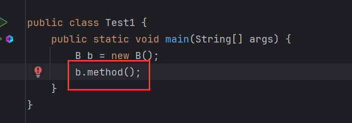
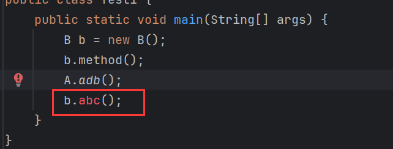

# 接口新特性

- <font color='#F56C6C'>**JDK8的新特性**</font>：接口中可以定义有方法体的方法。(可以编写<font color='#F56C6C'>**默认**</font>、<font color='#F56C6C'>**静态**</font>)

- <font color='#F56C6C'>**JDK9的新特性**</font>：接口中可以定义<font color='#F56C6C'>**私有方法**</font>。

**问题**：为什么接口多出了这些新特性？

新特性的出现，必然是为了解决一些问题，有这样的场景，有一个接口`A`、和两个实现类`B`和`C`，在项目版本1上线。后续项目要升级，准备在2版本中对`A`进行丰富，加入10个新的方法。接口的中方法只能是抽象方法，当10个方法加入后，也必须声明为抽象方法，这会导致所有的实现类都报错。能不能在丰富接口功能的同时，又不去更改现有的代码呢？只需要让接口中的方法非抽象，且实现类能直接继承使用而不去实现即可。通过这个场景能感受到，只要接口中的方法非抽象，就能解决接口升级带来的问题。所以，JDK8版本出现的新特性就是为了解决这个问题的。


# JDK8新特性

## 特性1

>  允许在接口中定义非抽象方法，但是需要使用关键字`default`修饰，表示方法为<font color='#F56C6C'>**默认方法**</font>。

<font color='#F56C6C'>**作用：解决接口升级的问题**</font>

接口中默认方法定义格式：

```java
public default 返回值类型 方法名(形成列表) {}
```

演示：

代码材料：


在接口中声明默认方法：


实现类能直接继承使用：


结果：

### 细节

> 接口中的默认方法，可以省略`public`，但是不能省略`default`。


虽然省略了`public`，但是它的权限依然是`public`，系统会默认加上`public`。

> 实现类可以重写接口中的 默认方法，重写时需要去掉`default`


重写接口的`method()`，并不是用`super`去调用接口的`method()`，而是用`A.super`调用。因为接口并不是实现类的父类，实现类的直接父类为用`extends`继承的类，没有显示的声明继承，也默认继承了`Object`，用`super`调用会报错，此处继承至`Object`，`Object`中没有`method()`：


从上可以看出：在实现类中要调用接口中的成员需要用`接口名.super`。

另外，实现类重写默认方法时，需要去掉`default`关键字：


接口允许多实现，如果一个实现类同时实现两个接口，而接口中又有相同的默认方法，是否会逻辑冲突？

接口`A`、`D`：


`B`实现`A`和`D`：


> 实现类实现多个接口，多个接口中有相同的默认方法，那么实现类必须强制重写该默认方法，否则编译报错。

如果`B`不重写，编译报错：


`B`在重写时，可以选择任一接口的逻辑：

选择`A`的`method()`逻辑：


选择`D`的`method()`逻辑：


还可以同时选择`A`和`D`的逻辑：


甚至不用`A`和`D`的逻辑：


> 类中不能用`default`修饰方法。


## 特性2

> 允许定义静态方法。

既然接口允许方法带有方法体，干脆放开，允许定义静态方法，直接通过接口名调用，这样更方便。

格式与类中定义静态方法相同：

```java
public static void 方法名(形参列表) {}
```


### 细节

> 接口定义静态方法时，`public`可以省略，`static`不能省略。

不写`public`，系统会默认就上：


`static`不能省略：


> 接口中的静态方法 ，只允许接口名调用，不允许实现类通过对象调用。



> 接口声明静态方法，`static`与`default`冲突，不需要声明`default`。


# JDK9新特性

> 从JDK9开始，接口中允许定义私有方法。

代码材料：


接口`A`，默认方法中有相同的部分，即执行日志输出。代码重复，复用性低，因此可以将相同的部分抽取到一个方法中：


分析可以看出，这个`log()`只是为`start()`和`end()`提供服务的，并不希望其他类来访问这个`log()`。因此，将`log()`私有化：


> 接口中方法声明`private`与`default`冲突，声明私有方法不需要`default`。


这就是接口私有方法存在的原因，当接口中多个方法存在共性内容，于是向上抽取出一个方法，又不希望其他类方法这个方法，因此将其私有化。

> 接口的私有方法可以是静态的。

当接口中多个方法存在共性内容，而这些方法是静态时，由于静态只能方法静态，所以为了能让静态方法访问，向上抽取出一个静态方法：

