# 1 日志

日志：

> 记录程序运行中的状态信息、运行信息、错误信息等等。

好处：

- 数据追踪
- 性能优化
- 问题排除
- 系统监控


# 2 日志框架

- **JUL**：java官方提供的日志框架，配置简单，但不够灵活，性能较差。
- **Log4j**：一个流行的日志框架，提供了灵活的配置选项，支持多种输出目标。
  - 可以输出到控制台。
  - 也可以输出到文件。
- **Logback**：基于Log4j升级而来，提供了更多的功能和配置选项，性能优于Log4j。

Log4j和Logback均实现了Slf4j。

**Slf4j(Simple Logging Facade for Java)**：简单日志门面，提供了一套日志操作的标准接口及抽象类，允许应用程序使用不同的底层日志框架。


# 3 Logback

## 3.1 快速入门

步骤：

1. 引入jar包。
2. 导入配置文件。
3. 获取日志对象使用。

Logback的jar包：

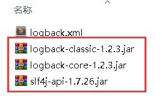

Logback的配置文件：

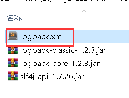

添加jar包：

首先创建lib目录，用于存放jar包：

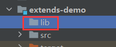

将jar复制进去：

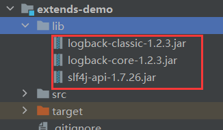

此时，jar包的左测没有展开图标，表示当前的jar还不能用。右键lib目录：

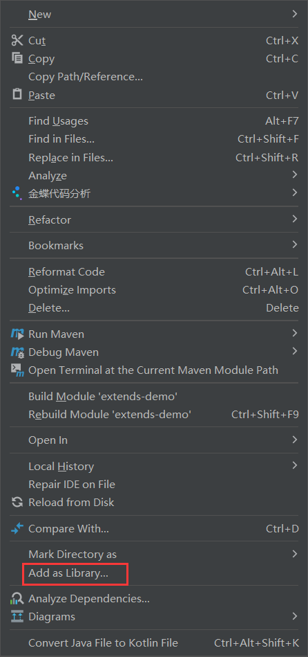

出现展开图标：

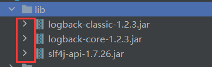

说明jar包可用使用了。

导入配置文件：

将xml文件复制到src的resource下，必须放到该目标下：

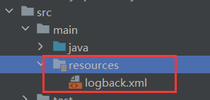

## 3.2 创建日志对象

通过`LoggerFactory`日志工厂调用`getLogger()`获取日志对象。

`getLogger()`需要接收字符串，一般传入当前类字节码对象字符串形式：

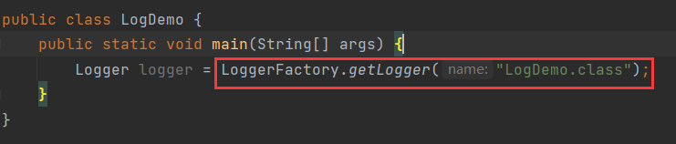

## 3.3 输出日志

调用日志对象的`info()`输出日志：

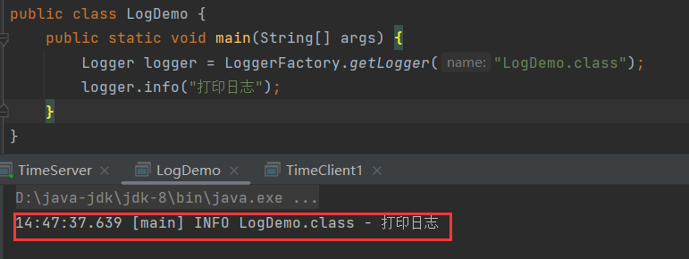

打印的信息包括：

- 时间。
- 所在线程。
- 日志级别。
- 日志对象名称。

其中，在`getLogger()`中传入的字符串，就是为日志对象取名，在打印的日志体现：

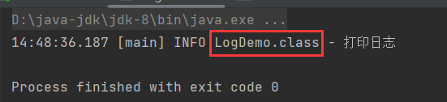

不过，一般都是所在类名加上`.class`，这样方便定位日志所在类。

在本地磁盘：

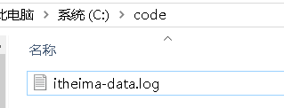

会生成一个日志文件，内容同控制台：

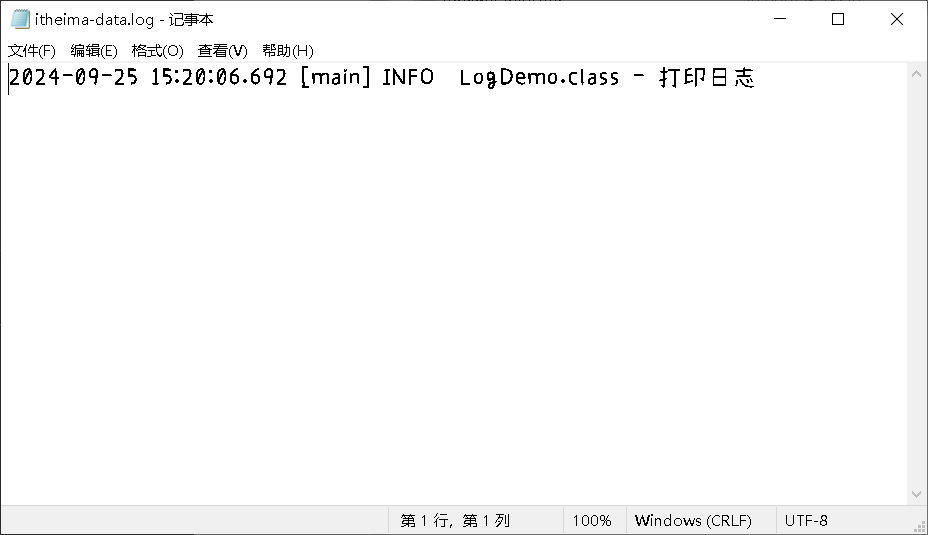

## 3.4 日志配置文件

Logback.xml：

该配置文件是对Logback日志框架输出的日志进行控制的，可以来配置输出的格式、位置及日志开关等。

整个配置文件分为3个模块：

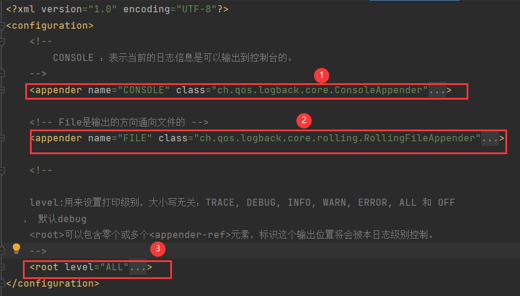

第一个`<appender>`中用于配置控制台的日志输出格式，第二个用于配置文件中的日志输出格式，而第三个`<root>`则是总开关，引用前两个配置：

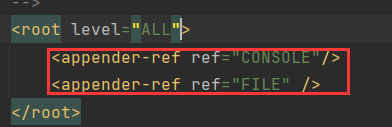

属性`level`指定日志级别：

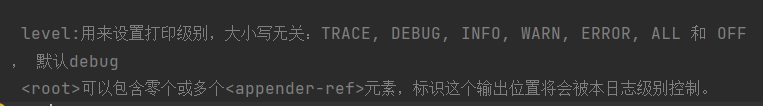

`ALL`表示记录所有级别，`OFF`表示所有级别都不记录：

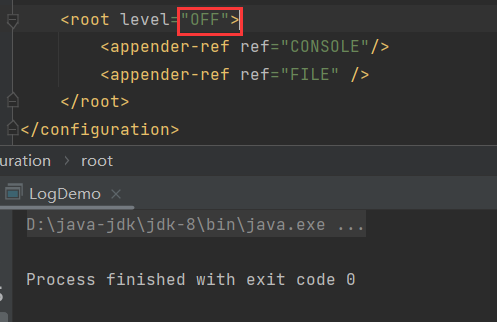

指定特定的级别，表示比它小的都不记录，比如`INFO`：

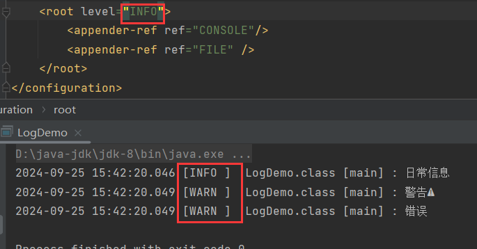

`TRACE`和`DEBUG`就没记录。

默认级别为`DEBUG`。

控制台配置：

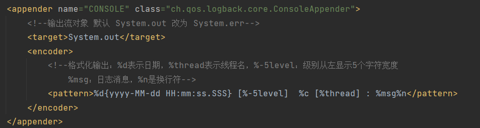

`<target>System.out</target>`表示标准输出流，目标是控制台。还可以使用`err`，以标准错误输出流进行打印。

下面则是配置日志的打印格式：

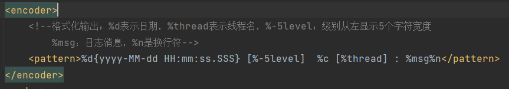

```java
%d 			// 日期
%thread 	// 线程名
%-n 		// 从左显示n个字符宽度，-5是因为日志级别最多5个字母
%msg 		// 日志消息
%n 			// 换行符
%c			// 获取日志对象时getLogger()中指定的名字
```

文件配置：

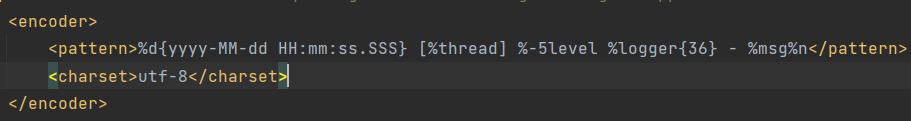

也是在配置在文件中的日志格式，其中`%logger`同上述的`%c`都表示指定的名字，而`{36}`表示字符个数，最大36个。而下面则是在指定字符集编码。

接下来指定日志文件保存路径：

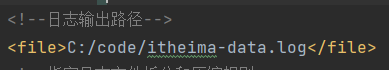

## 3.5 日志等级

日志级别从小到大为：

- `TRACE`
- `DEBUG`
- `INFO`
- `WARN`
- `ERROR`

日志级别越小，表示的详细程度越高：

`TRACE`：最详细的日志级别，通常用于追踪程序执行的每一个细节。它通常用于开发和调试阶段，记录非常细致的信息。

`DEBUG`：用于开发时的调试信息，提供调试过程中的有用信息，通常用于标记程序执行中的关键点和变量的状态。

`INFO`：用于记录程序正常运行过程中的重要信息，例如程序启动、配置状态等。这是一般运行时的日志级别。

`WARN`：用于表示潜在的问题或需要注意的情况，但不会阻止程序的正常运行。例如，某个操作可能失败，但不会影响后续操作。

`ERROR`：表示程序运行中发生的错误或异常，这些错误可能会影响程序的正常运行，但程序仍然会继续执行。

每个日志级别都对应一个方法，方法名同级别名：

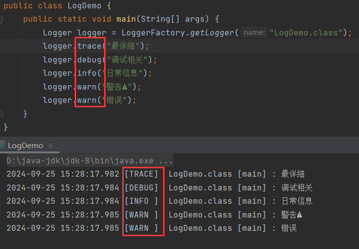