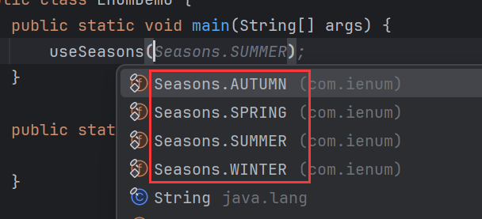
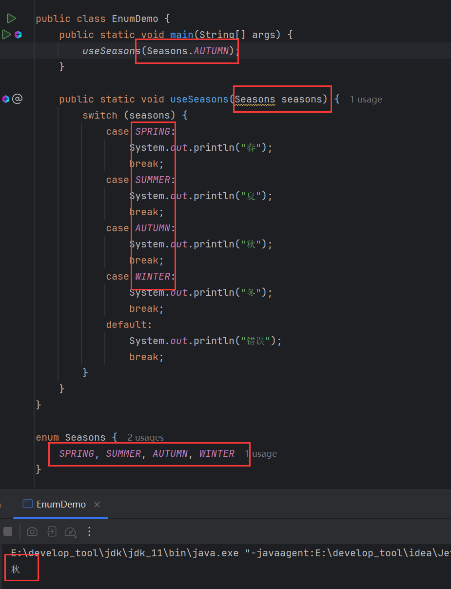
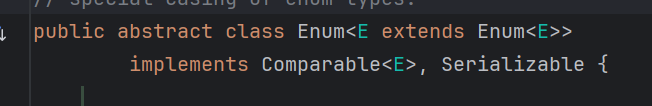
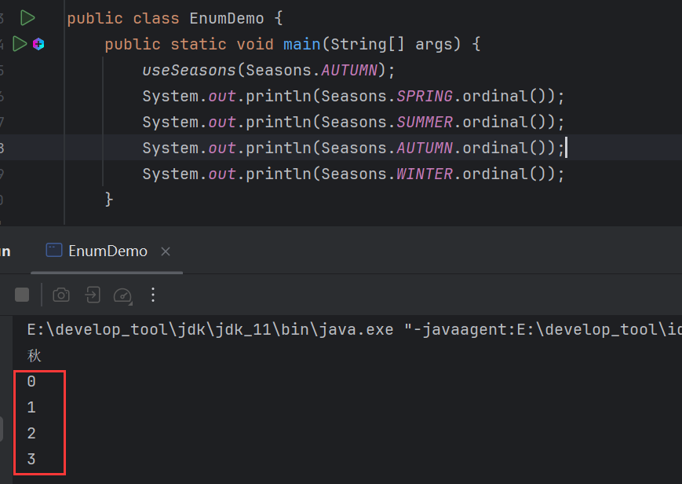
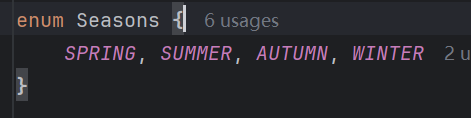
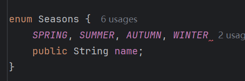
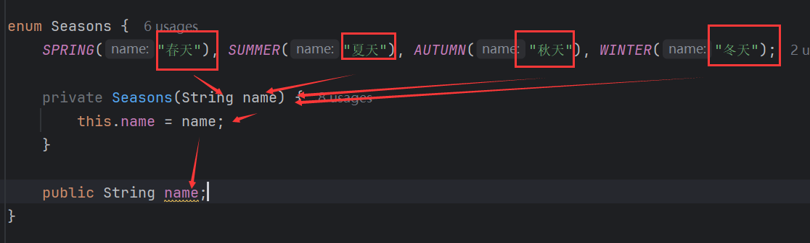
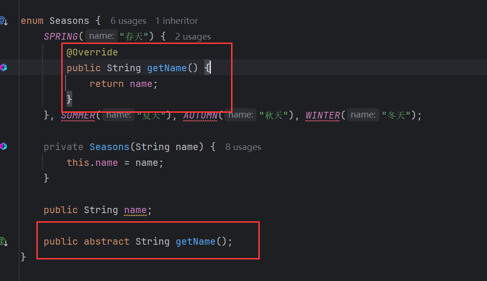

# 1 枚举

> java中特殊的类型，用于信息的**标志**和**分类**。

## 1.1 举例

用一个标志来区分春、夏、秋、冬，一般的做法是定义一个季节类，定义4个变量表示季节：

```java
class Season{
    int spring = 1;
    int summer = 2;
    int autumn = 3;
    int winter = 4;
}
```

但是在使用这些变量时还需要`new`对象，为了方便使用，设计成常量：

```java
class Season{
    public static final int SPRING = 1;
    public static final int SUMMER = 2;
    public static final int AUTUMN = 3;
    public static final int WINTER = 4;
}
```

但是常量来做分类有一些弊端，比如这样的例子：

```java
public static void useSeason(int season){
    switch (season) {
            case 1: 
                System.out.println("春");
            	break;
			case 2: 
                System.out.println("夏");
            	break;
            case 3: 
                System.out.println("秋");
            	break;
            case 4: 
                System.out.println("冬");
            	break;
            default:
                System.out.println("错误");
            	break;
    }
}
```

根据传入的数字来判断季节，可读性很差，`useSeason()`对于调用者来说，并不一定知道数字意味着什么，即便是知道，也可能写错。

用基本数据类型不能很好的提示调用者，改为用引用数据类型：

```java
public static void useSeason(Season season){}
```

这样在调用`useSeason()`时，调用者就知道需要传入季节对象，可读性提高了。

但是季节对象只能有4份，因为季节只有4个，因此可以这样来设计：

```java
class Season{
    private Season(){};
    
    public static final Season SPRING = new Season();
    public static final Season SUMMEER = new Season();
    public static final Season AUTUMN = new Season();
    public static final Season WINTER = new Season();
}
```

像设计单例类一样，设计为4例类。

但是这样写还比较费劲，但是用枚举来做只需这样：

```java
enum Season {
    SPRING, SUMMER, AUTUMN, WINTER;
}
```

 定义一个枚举类，再定义4个枚举项。

每个枚举项都是这个枚举类的对象，且各个枚举项全局唯一。

这样当再调用`useSeason()`，就会有提示：



而且只能给枚举项的参数，其他参会直接报错。

枚举的作用是做信息的标记和分类，用常量能做，但是用枚举更严谨，提示性好。



## 1.2 格式

定义格式：

```java
修饰符 enum 枚举类名 {
    枚举项1, 枚举项2, 枚举项3, 枚举项4...;
}
```

## 1.3 特点

- 每一个枚举项其实就是该枚举的一个对象。
- 通过枚举类名去访问指定的枚举项。
- 所有枚举类都是`Enum`的子类。
- 枚举也是类，可以定义成员变量。
- 枚举类的第一行上必须是枚举项，最后一个枚举项后的分号是可以省略的，但是如果枚举类有其他的东西，这个分号就不能省略（建议不要省略)。
- 枚举类可以有构造器，但必须是`private `的，它默认也是`private`(保证枚举型全局唯一)。
- 枚举类也可以有抽象方法，但是枚举项必须重写该方法。

`Enum`是一个抽象类：



它有一个方法`ordinal()`，返回枚举项的索引：



分号省略：



不能省略：



在枚举项目中为成员变量赋值，需要用到构造：



构造必须私有，主要是为了保证枚举项的有限个数，防止其他类中创建新的对象。

枚举类可以定义抽象方法，但是必须在枚举项中重写方法：

