# 1 类加载器

> 类加载器的作用是负责将类的字节码文件加载到内存中(方法区内存)。

编写好的java文件经过javac编译后会产生一份字节码文件，当运行程序，字节码文件会加载到方法区内存中。而类加载器就是负责把字节码文件加载到方法区中。

## 1.1 加载时机

类加载器的加载时机：

加载时机总结就是：用到即加载。

- `new`对象。
- 调用静态成员。
- 初始化继承体系，加载子类时，先加载父类。
- 反射加载类的字节码时。

## 1.2 加载过程

加载过程分为3个步骤：

1. 加载
2. 链接
3. 初始化

**一、加载**

- 通过包名+类名准确获取这个类，准备用流进行传输。

  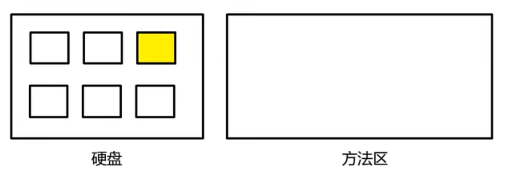

- 将类加载到内存中。

  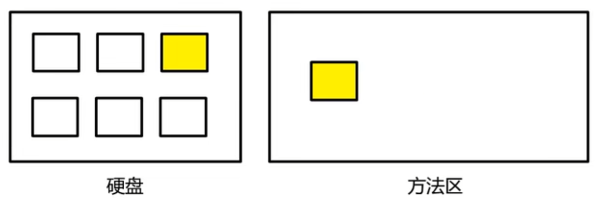

- 加载完毕，创建一个`Class`对象。

​	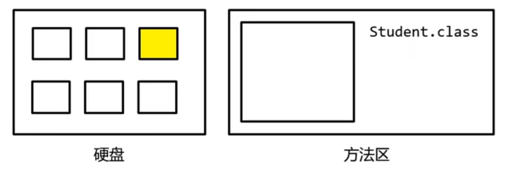

java中万物皆对象，字节码文件也存在表示它的对象，就是`Class`。

`Class`对象保存了类的结构信息，例如类的属性、方法、父类等：

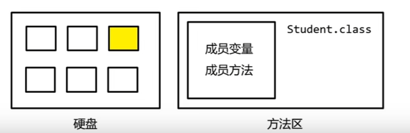

**二、链接**

链接又分为3个小步骤：

1. **验证**：验证类是否符合JVM规范，安全性检查，防止恶意篡改字节码文件。
2. **准备**：为类的**静态变量**分配空间，并设置**默认值**。
3. **解析**：将常量池中的符号引用解析为直接引用。

**准备**步骤的细节：

设置静态变量的默认值，并非赋值，比如这样的静态变量：

```java
class Student{
    static String school = "北大";
}
```

在**准备**阶段仅仅是让`school`为`null`(引用类型默认值)：

```java
school = null;
```

而赋值为"北大"是在后面的**初始化**阶段。

**解析**步骤的细节：

**Q.什么是将符号引用解析为直接引用？**

A.举例：

```java
class B {
    C c = new C();
}

class C {
    
}
```

有两个类`B`和`C`，`B`中的成员`c`赋值为对象`C`。

```java
public static void main(String[] args) {
    ClassLoader classLoader = B.class.getClassLoader();
	// 死循环，让程序一直执行
    while (true) {

    }
}
```

拿到`B`的类加载器。`B.class`表示`B`的字节码对象，而字节码对象会在类被加载到内存时创建，也就是说这一步会触发`B`类的加载。

**注意**：用`class`或**类加载器**触发类的加载行为，仅仅只完成类加载过程中的第一步：即**加载**过程。而**链接**和**初始化**过程并没有执行。

类加载到内存中就会生成`Class`对象，该对象记录了类的结构，包括成员变量等， 也就是说会记录`B`的成员变量`c`，但是`c`现在还只是一个**符号**，因为`B`仅仅完成了**加载**过程，并没有执行**链接**过程，在**连接**过程中才会将符号引用解析为直接引用。

而完整的加载过程在加载时机中已经说过了，所以当`B`创建对象时：

```java
public static void main(String[] args) {
    ClassLoader classLoader = B.class.getClassLoader();
    new B();
    while (true) {

    }
}
```

会触发完整的类加载过程，然后执行**链接**过程，然后将符号引用解析为直接引用，也就是现在`c`不再是一个符号，而是一个引用，一个能接受`C`类型的引用地址的能力。

这就是**解析**。在这个过程中将符号引用解析为直接引用。

**注意**：解析并不是赋值，而是将符号引用解析为直接引用，可以这样来理解，只有解析为直接引用，这个变量才有能力去接收某某类型的地址值。

**三、初始化**

> 根据程序员程序编码制定的主观计划去初始化类变量和其他资源。

在准备阶段，为静态变量开辟了空间，设置了默认值，而初始化就是为这些变量赋值为程序员指定的值，比如：

```java
static String school = "北大";
```

"北大"就是在初始化阶段赋值给`school`变量的。

**注意**：初始化只针对于**静态成员**。

## 1.3 getClassLoader()

```java
public ClassLoader getClassLoader(){};
```

> 字节码对象的方法，获取该类的类加载器。


# 2 类加载器分类

类加载器分很多种，每种加载器的功能不同。

类加载器种类：

- **Bootstrap class loader**：虚拟机的内置类加载器，也叫**启动类加载器**，通常表示为`null`，因为是C++实现，所以获取到的只能是`null`。
- **Platform class loader**：称为**平台类加载器**，负责加载JDK中一些特殊的模块。
  - **Extension Class Loader**：称为**扩展类加载器**，**Pcl**在jdk9之后才开始使用，在9之前，使用的是**Ecl**。
- **Application class loader**：称为**应用类加载器(系统类加载器)**。

## 2.1 加载范围

加载器负责加载的类：

- **Bootstrap class loader**：负责加载JDK自带的类，如`String`、`Integer`、`Double`等。
- **Platform class loader**：负责加载jdk根目录下 lib/modue 文件中的类。
  - **Extension Class Loader**：在jdk9之前，负责加载 jre/lib/ext 目录下的jar包。
- **Application class loader**：负责加载自己编写的类。

## 2.2 上下级

类加载器有上下级之分，最上级是**Bootstrap class loader**、下一级是**Platform class loader**，再下一级是**Application class loader**。

演示上下级：

用jdk自带的类获取**Bootstrap class loader**：

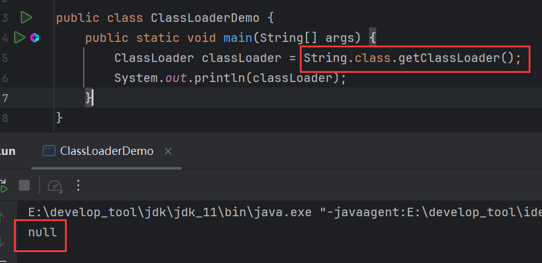

获取**Application class loader**：

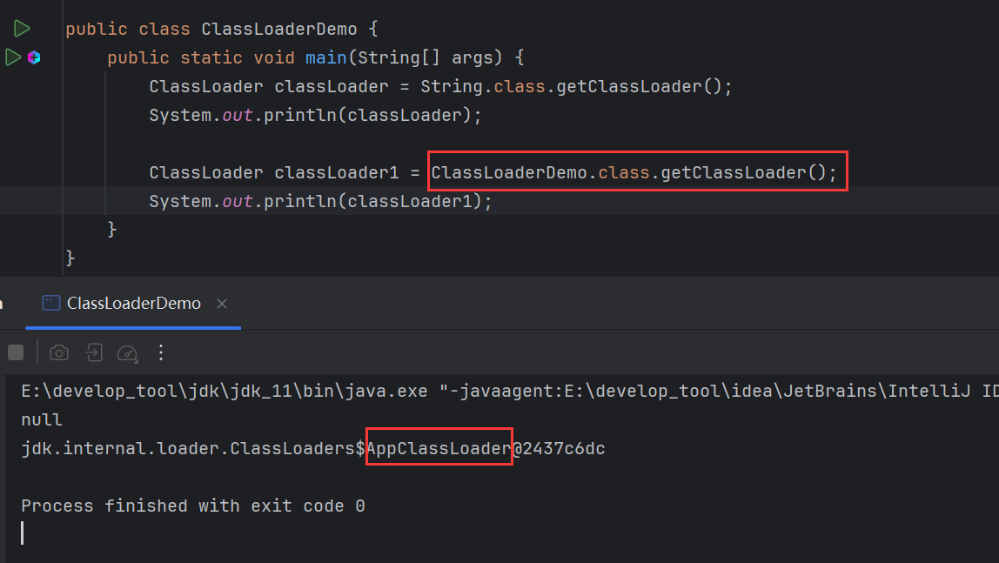

### 2.2.1 getParent()

```java
public ClassLoader getParent(){};
```

> 类加载器的方法吗，获取当前加载器的上级加载器。

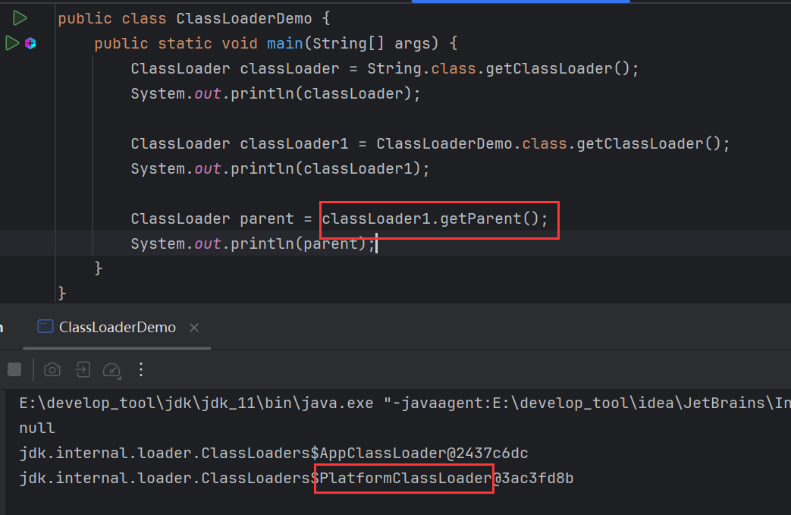

**Application class loader**的上级是**Platform class loader**。

再通过**Platform class loader**获取上级加载器：

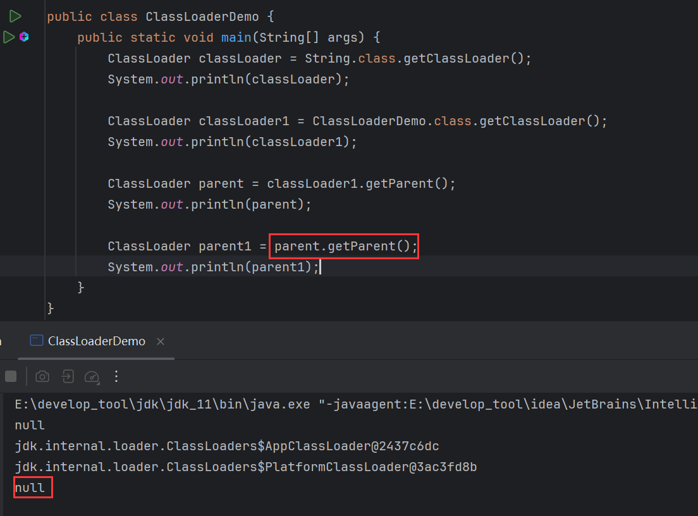

**Platform class loader**的上级是**Bootstrap class loader**。

在JDK8以前，没有**Platform class loader**，而是**Extension Class Loader**，而它加载的是 jre/lib/ext 目录下的jar包，其中有一个类`DNSNameServer`，用这个类可以看到这个加载器：

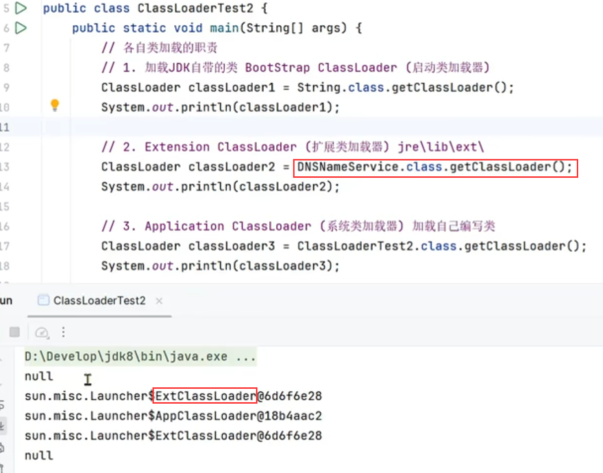


# 3 双亲委派模式

- 如果一个类加载器收到了类加载请求，它并不会自己先去加载而是把这个请求委托给上级加载器去执行。

- 如果上级加载器还存在其上级加载器，则进一步向上委托，依次递归请求，最终将到达顶层的启动类加载器。

- 如果上级加载器可以完成类加载任务，就成功返回。

- 倘若上级加载器无法完成此加载任务，下级加载器才会尝试自己去加载，这就是双亲委派模式。

比如加载`String`，无论是什么类，都会先请求到**Application class loader**，再由它委托给上级**Platform class loader**，然后再委托给**Bootstrap class loader**，最终都会委托到最顶层，才会判断该类是否属于自己的加载范围。`String`属于**Bootstrap class loader**的加载范围，因此由启动类加载器完成加载。

再比如加载自己编写的类，也是先请求到**Application class loader**，然后委托给**Platform class loader**，再委托给**Bootstrap class loader**，到最顶层才开始判断，该类不属于自己的加载范围，因此委派给下级**Platform class loader**，经它判断也不属于自己的加载范围，再委派给**Application class loader**，最终由**Application class loader**完成加载。

综上：

- 无论这个类属于哪个加载范围，一开始都会先请求到**Application class loader**。
- 一定是层层委托到最顶层，到**Bootstrap class loader**，才开始由上至下层层判断，该类是否由自己来加载。

## 3.1 图解

以下是详细过程：

类加载分为两种情况：加载过的类 和 未加载的类。

加载过的类不需要再次加载。

当类加载，请求到**Application class loader**，它会判断类是否被加载，如果加载过，不必再加载，也不会委托到上级加载器：

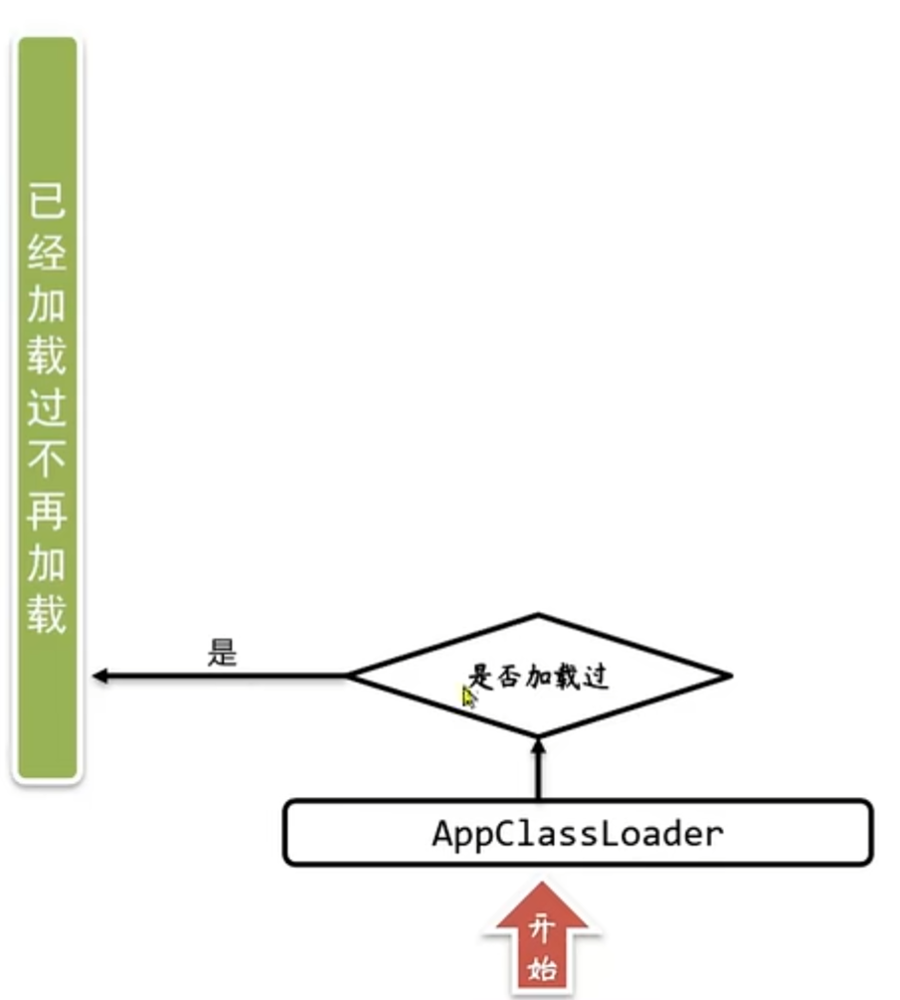

如果没有加载过，就把加载请求委托到上级：

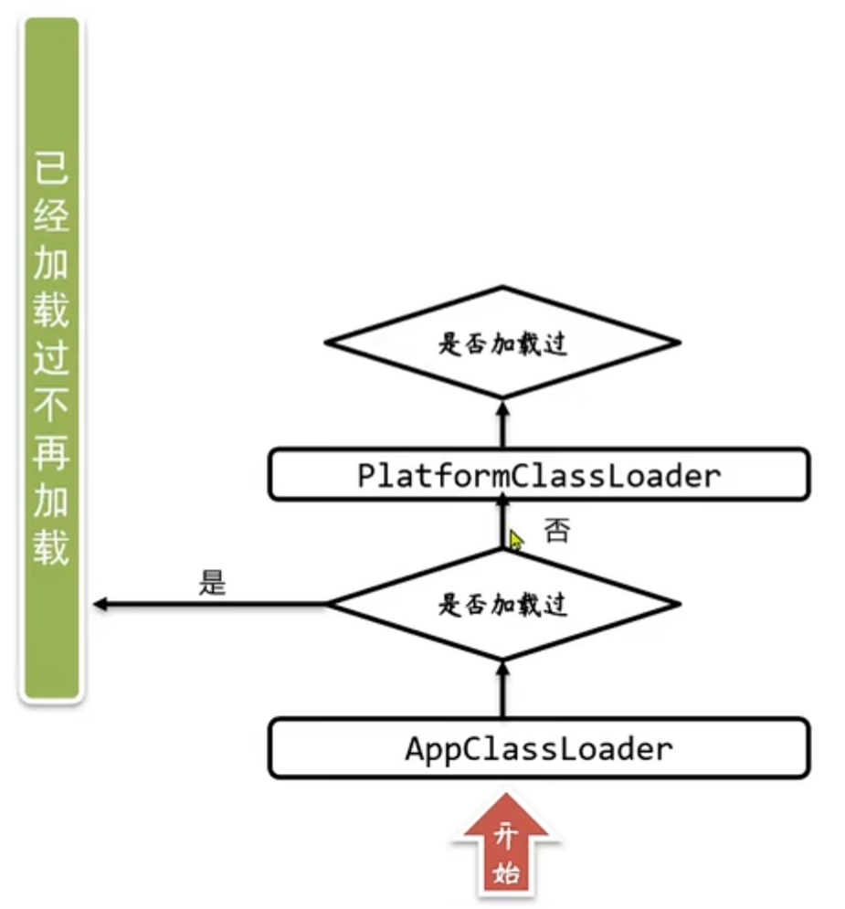

如法炮制：

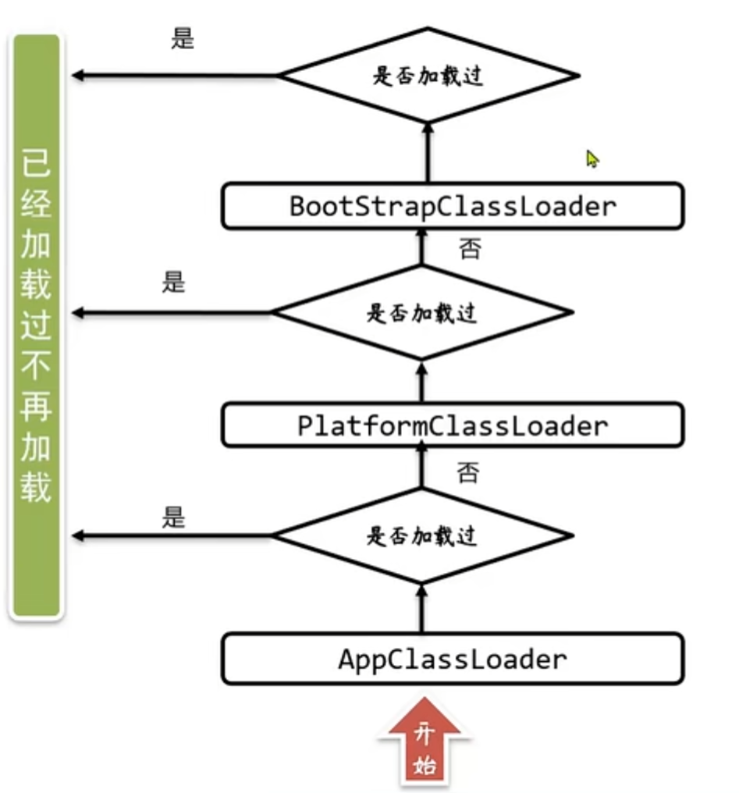

假如请求已经到达了最顶层的加载器，且类未加载，就会判断类是否由自己加载：

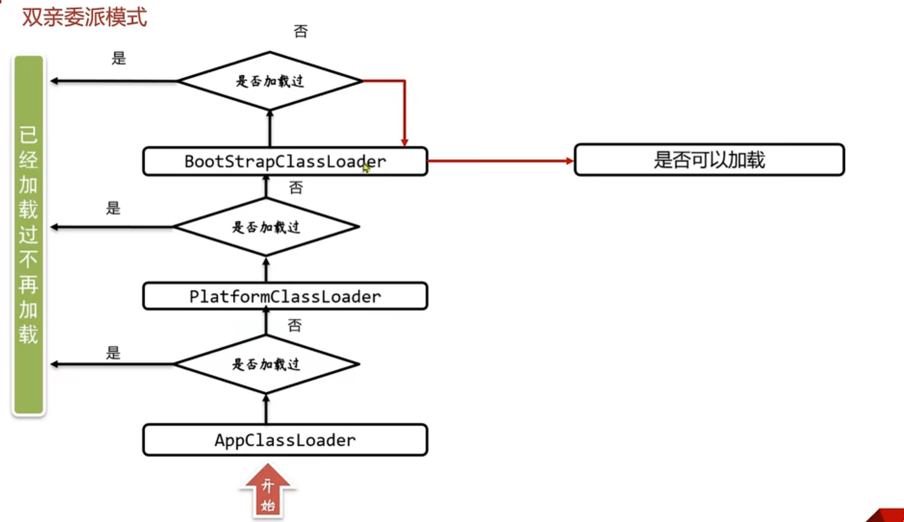

如果可以加载，就由自己加载：

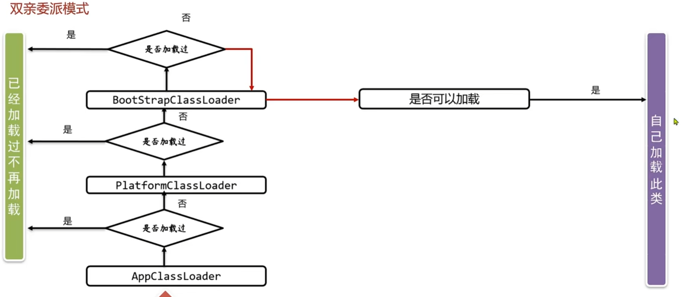

否则就委派给下级加载器：

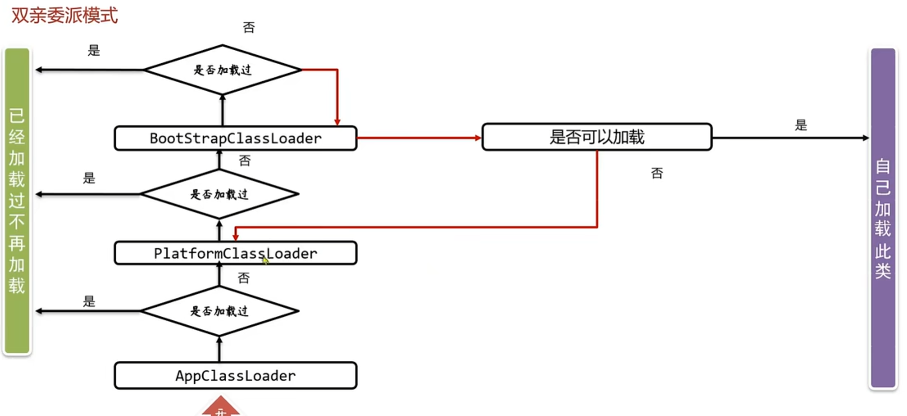

如法炮制：

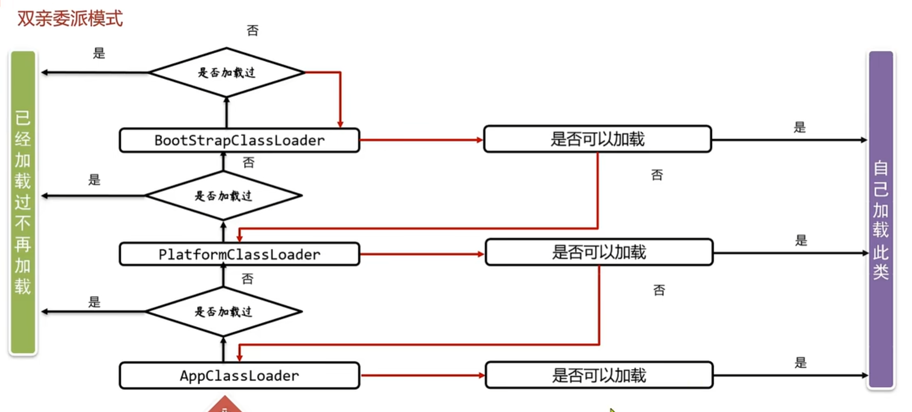

假设委派到**Application class loader**，发现类也不是由自己加载，就会抛出异常`ClassNotFoundException`：

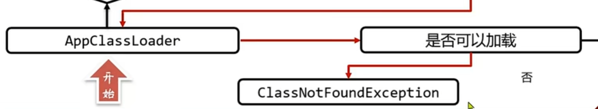

## 3.2 优点

避免类重复加载。


# 4 类加载器方法

## 4.1 getSystemClassLoader()

```java
public static ClassLoader getSystemClassLoader(){};
```

> 类加载器的静态方法，获取**Application Class Loader**加载器。

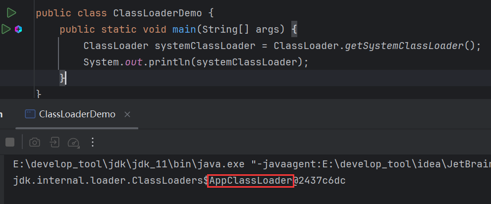

## 4.2 getResourceAsStream()

```java
public InputStream getResourceAsStream(String name){};
```

> 加载某一个资源文件，传入资源文件路径，返回该资源文件的输入流。

这个方法的好处就是可以直接用文件名加载，不必写全路径：


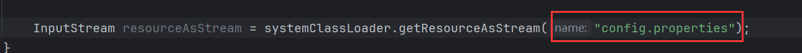

原理：因为**Application Class Loader**加载器加载的是自己编写的类，而自己编写的类都放在src 目录下，而config.properties这个文件也放在src 目录下，也就是说**Application Class Loader**加载器能访问src 目录那么自然能访问到该目录下的任意文件，所以不必写出全路径也能加载。

但是该文件必须放到src 下面。

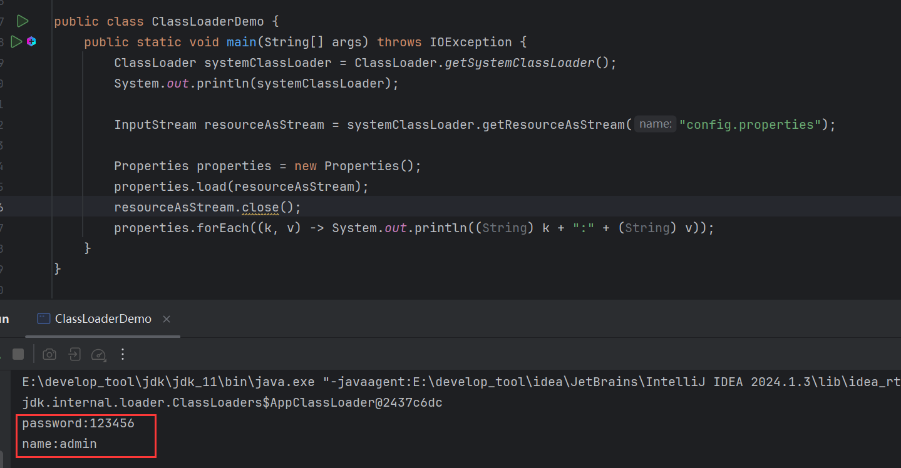