# 1 反射

> 在<font color=red>运行状态</font>中，对于任意一个类，都能够知道这个类的所有属性和方法，对于任意一个对象，都能够调用它的任意属性和方法。

这种**动态获取信息**以及**动态调用对象方法**的功能称为Java语言的反射机制。

反射的应用时机是在运行状态中，换句话说此时已经过了编译阶段，java文件经过编译后会生成字节码文件，也会对应生成一个`Class`对象，这个对象记录这这个类的结构，包括属性和方法，既然`Class`记录着属性和方法，那么自然可用通过`Class`来访问这些属性和方法。

这些属性和方法也通过对象表示，要访问这些属性和方法，就要访问对应的对象，其中：

- 构造方法对应的对象：`Constructor`。
- 属性对应的对象：`Field`。
- 方法对应的对象：`Method`。

综上，反射就是在操作字节码对象`Class`，从中剖析出对应类的构造方法对象、属性对象、方法对象等，然后访问这些对象来完成某些操作，比如通过构造方法对象创建对象，通过属性对象赋值、取值，或者通过方法对象调用方法。

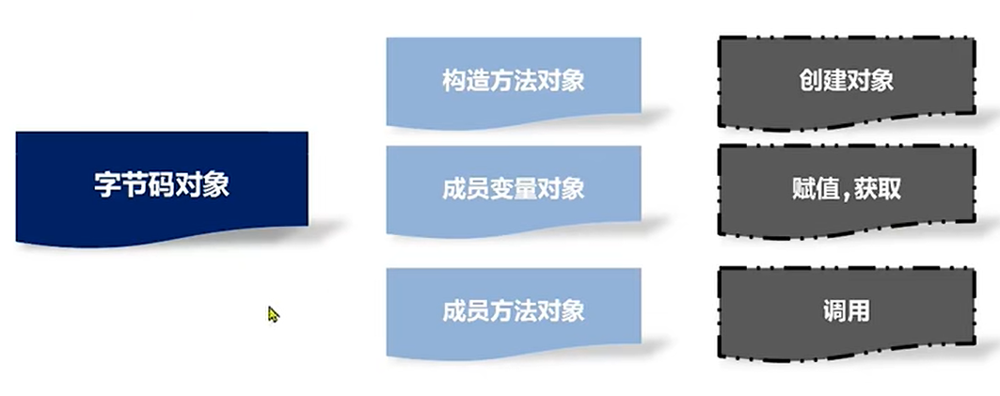


# 2 获取Class

反射是通过字节码对象反射出对象的结构信息进行操作，那么第一步就是获取`Class`对象。

## 2.1 forName()

```java
public static Class<?> forName(String className){};
```

> `Class`的静态方法，通过类的全类名获取字节码对象。

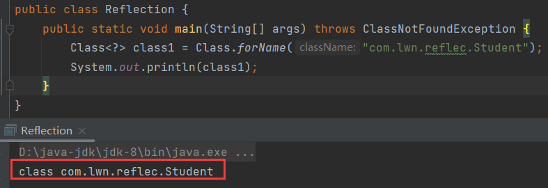

如果知道了类的全类名，那么可用这种方式获取`Class`对象，另外这种方式还很灵活，因为`forName()`接收一个字符串作为参数，那么可以通过改变字符串来改变获取的`Class`对象。

## 2.2 class关键字

```java
类名.class
```

> 通过`class`关键字获取字节码对象。

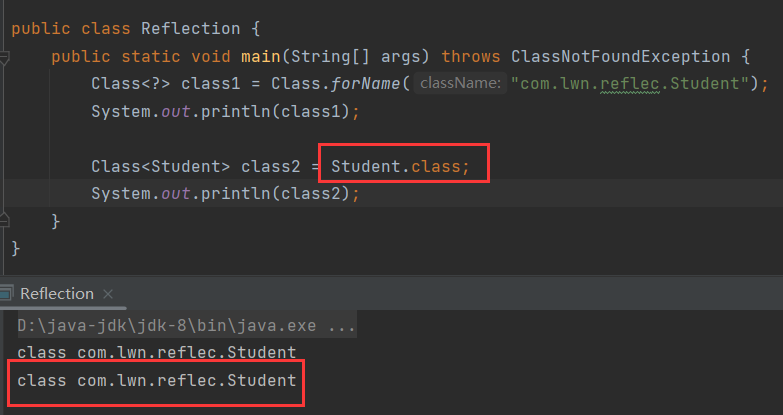

## 2.3 getClass()

```java
public Class<?> getClass(){};
```

> `Object`中的方法，通过对象获取字节码对象。

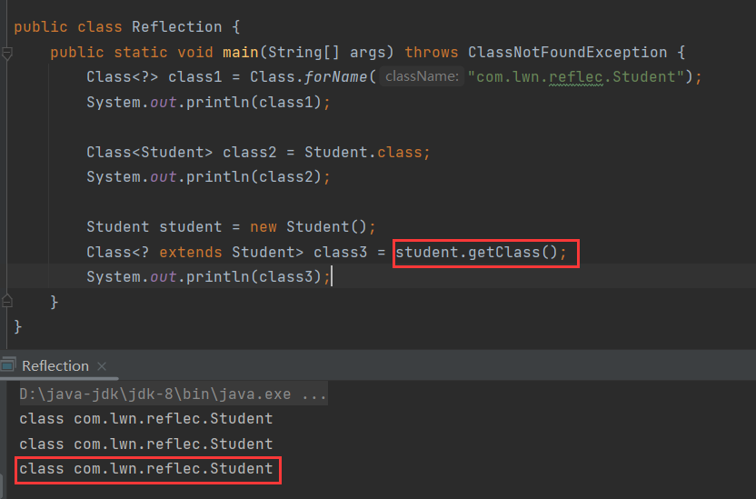

因为字节码在内存中只有一份，所以字节码对象也只有一个：

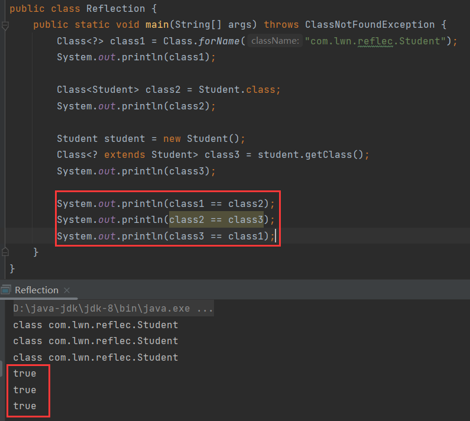


# 3 反射构造方法

通过字节码对象反射出类的构造方法进行使用。在java中有一个类专门来表示构造方法：`Constructor`。

## 3.1 getConstructors()

```java
public Constructor<?>[] getConstructors(){};
```

> 返回所有**公共**构造方法对象的数组。

**注意**：只返回`public`修饰的构造。

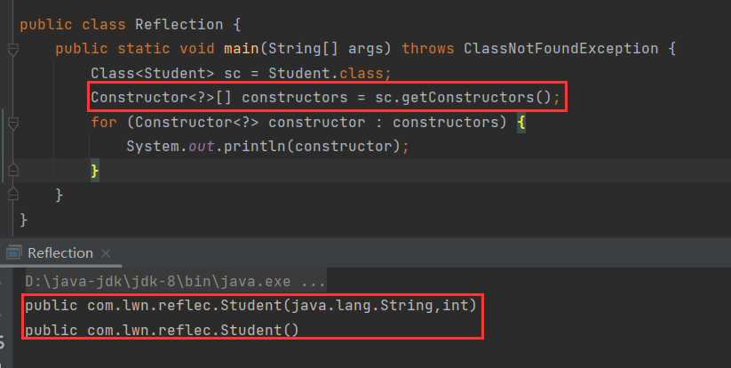

## 3.2 getDeclaredConstructors()

```java
public Constructor<?>[] getDeclaredConstructors(){};
```

> 返回所有构造方法对象的数组。

私有权限的构造也能反射出来，也称为暴力反射。

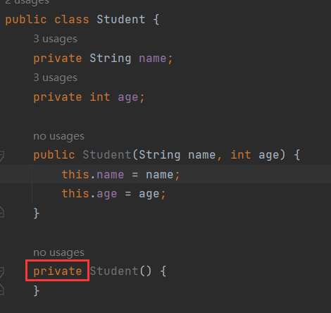

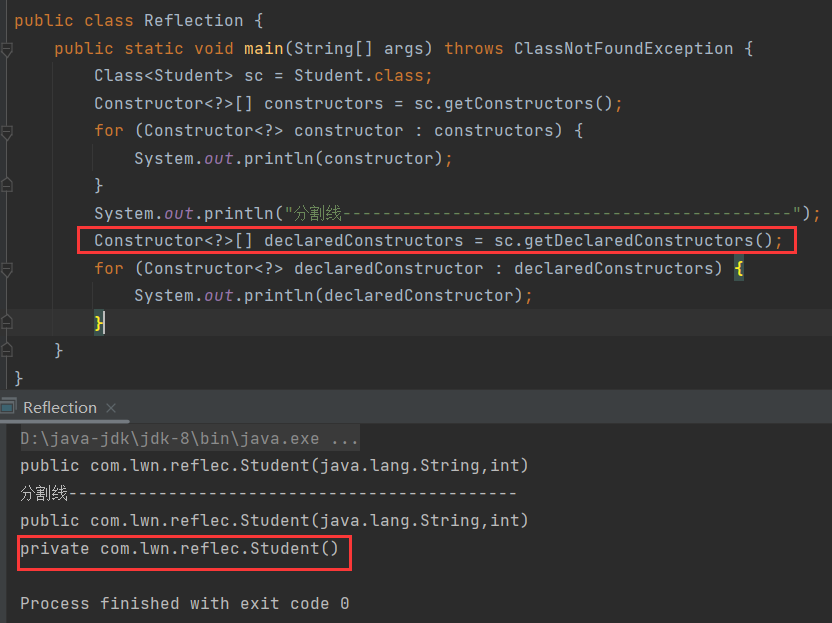

## 3.3 getConstructors()

```java
public Constructor<T> getConstructor(Class<?>... parameterTypes){};
```

> 返回单个**公共**构造。

接收的是可变参数，每个参数是一个字节码对象，因为类的构造有很多，每个构造的参数都不相同，因此用可变参数来接收。jvm会根据传入的参数来动态匹配合适的构造。

比如，无参就对应无参构造：


`Student`的有参构造，一个是`String`，一个是`int`：

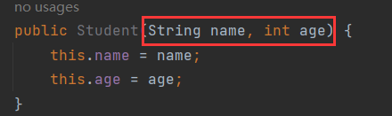

所以根据这个构造的参数传入对应类型的字节码匹配这个构造：

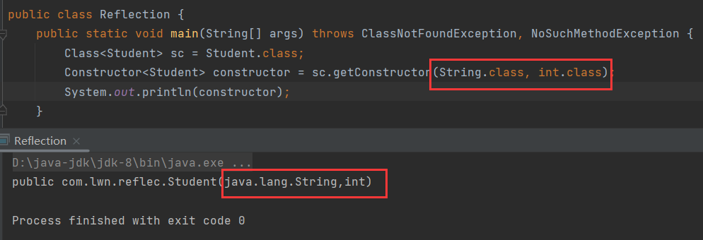

同样，这个方法也只能返回`public`修饰的构造。

## 3.4 getDeclaredConstructor()

```java
public Constructor<T> getDeclaredConstructor(Class<?>... parameterTypes)
```

> 暴力反射，返回单个构造。

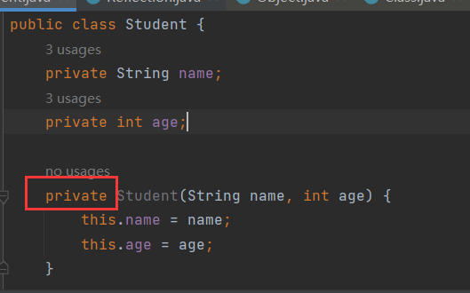

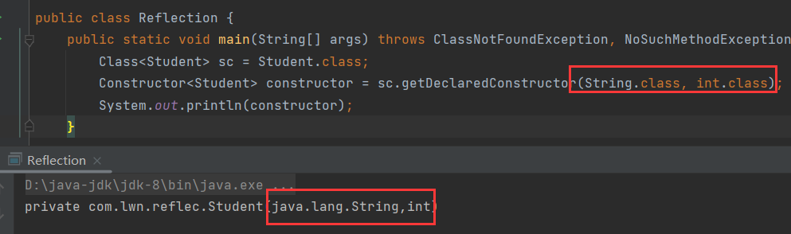

## 3.5 newInstance()

```java
public T newInstance(Object ...initargs){};
```

> 构造方法对象的方法，创建对象。

通过反射将类的构造反射出来后，就可以此构造方法对象来创建该类的对象。

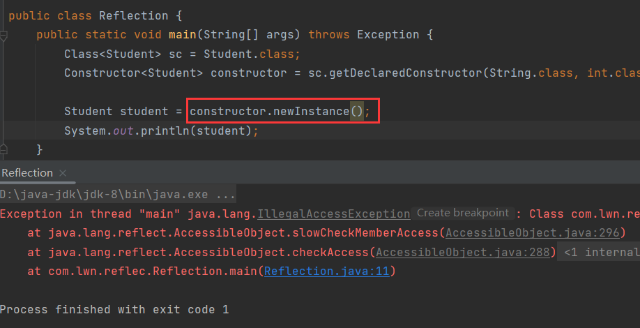

运行时抛出了`IllegalAccessException`，这个异常表示：

> 当应用程序尝试反射创建实例( 数组除外)，设置或获取字段或调用方法时，抛出IlegalAccessException， 但当前正在执行的方法**无法访问**指定类的**字段，方法或构造函数**。

简单来说就是权限不够，因为当前获取的构造是私有权限：

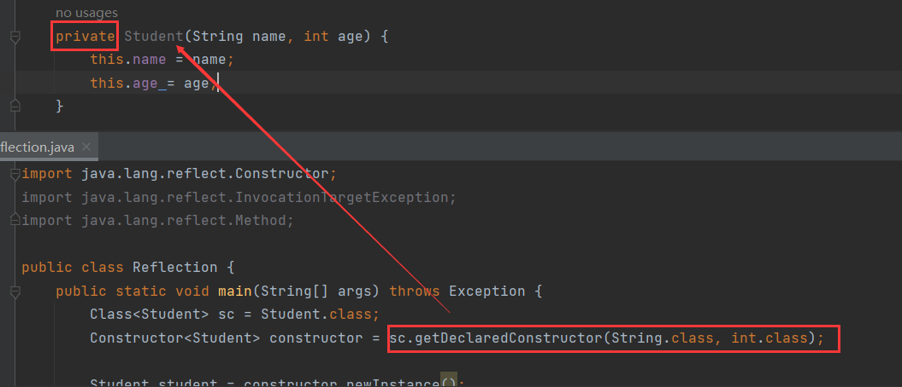

## 3.6 setAccessible()

```java
public void setAccessible(boolean flag){};
```

> 构造方法对象的方法，放开访问权限。

通过这个方法放开权限，就能使用私有的构造：

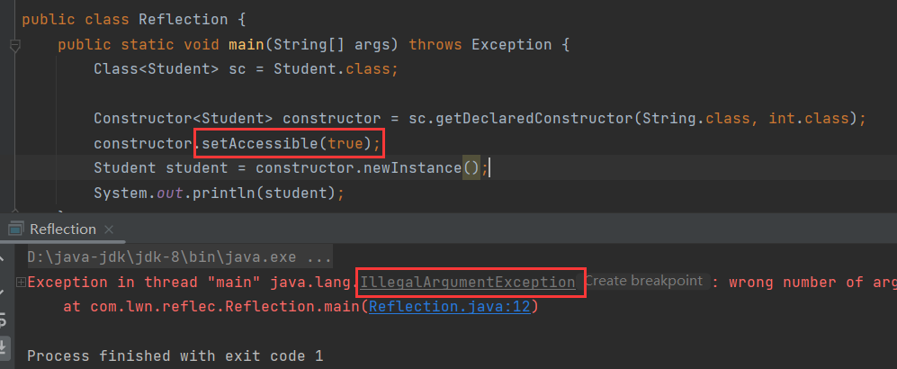

`IllegalArgumentException`跟参数有关的异常，因为上面反射获取的是有参构造，所以这个构造需要传递参数：

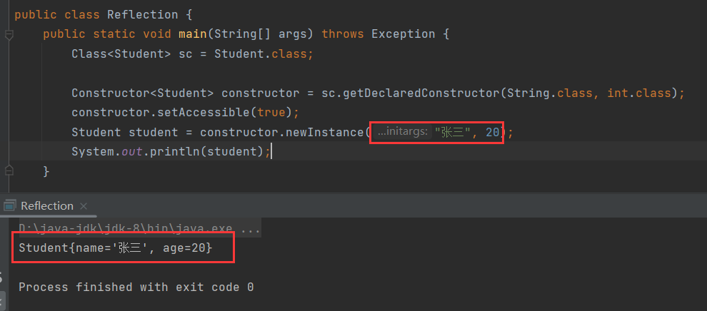

一般在暴力反射之后，都会调用`setAccessible()`，就是为了避免出现权限访问问题。


# 4 反射属性

通过字节码对象反射出类的属性进行使用。在java中有一个类专门来表示属性：`Field`。

## 4.1 getFields()

```java
public Field[] getFields(){};
```

> 返回所有**公共**属性的数组。

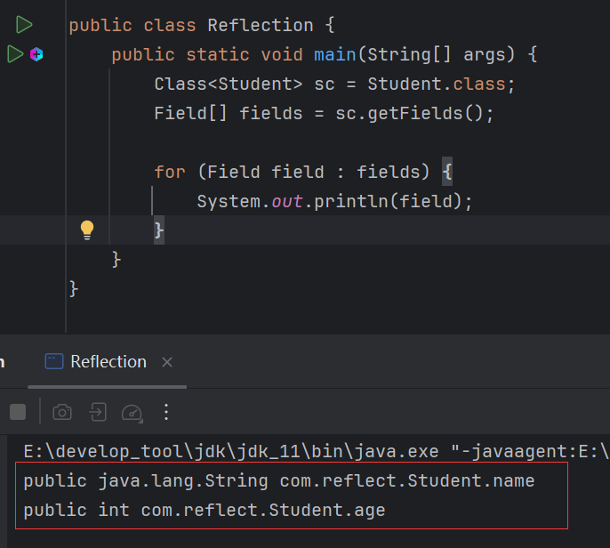

返回的属性格式为：

```java
权限修饰符 + 类型全类名 + 类全类名.属性名
```

## 4.2 getDeclaredFields()

```java
public Field[] getDeclaredFields(){};
```

> 暴力反射，返回所有属性的数组。

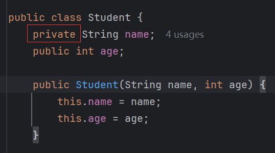

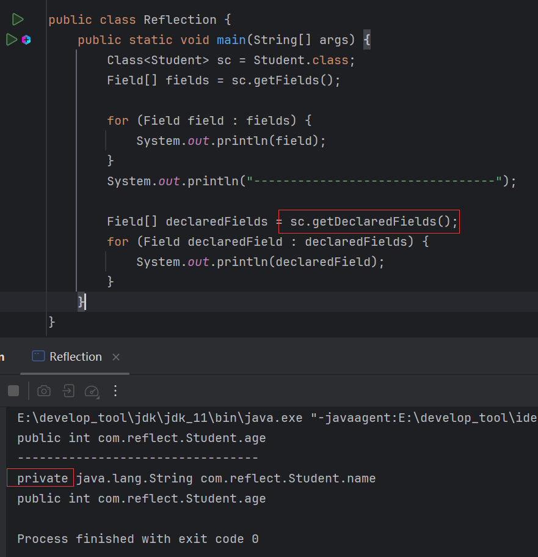

## 4.3 getField()

```java
public Field getField(String name){};
```

> 返回单个**公共**属性，通过属性名拿到对应的属性对象。

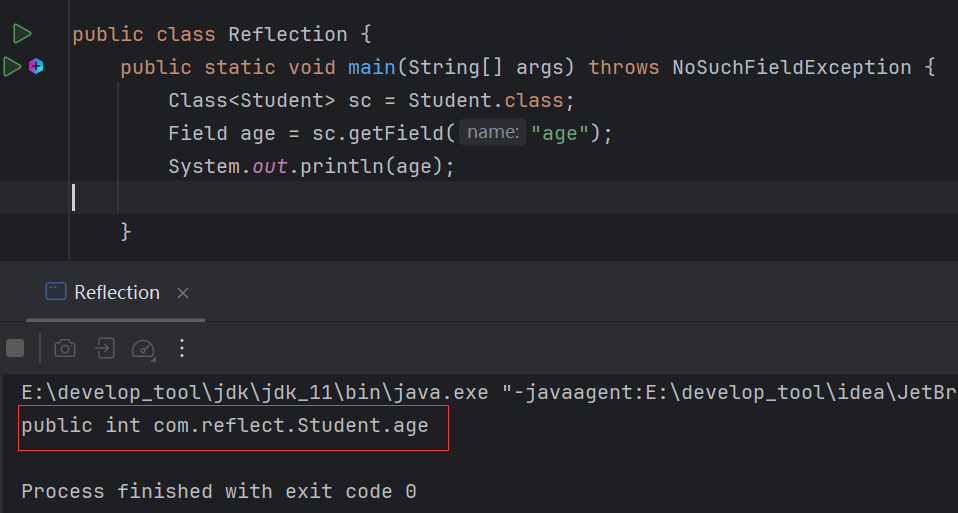

## 4.4 getDeclaredField()

```java
public Field getDeclaredField(String name){};
```

> 暴力反射，返回单个属性，通过属性名拿到对应的属性对象。


能获取私有的属性。

## 4.5 set()

```java
public void set(Object obj, Object value){};
```

> 为属性赋值。

拿到了属性对象，自然能操作属性，也就是赋值与取值。

**Q**：为什么`set()`的第一个参数需要传入一个`Object`的对象？

**A**：因为一个类的对象可以有很多的副本，比如学生类，它可以有`stu1`，也可以有`stu2`，它们都是`Student`，而`Field`管理着这个类的属性，第一个参数主要是为了告诉`Field`为哪个对象的属性赋值，比如传入`stu1`，则代表为`stu1`的属性赋值。

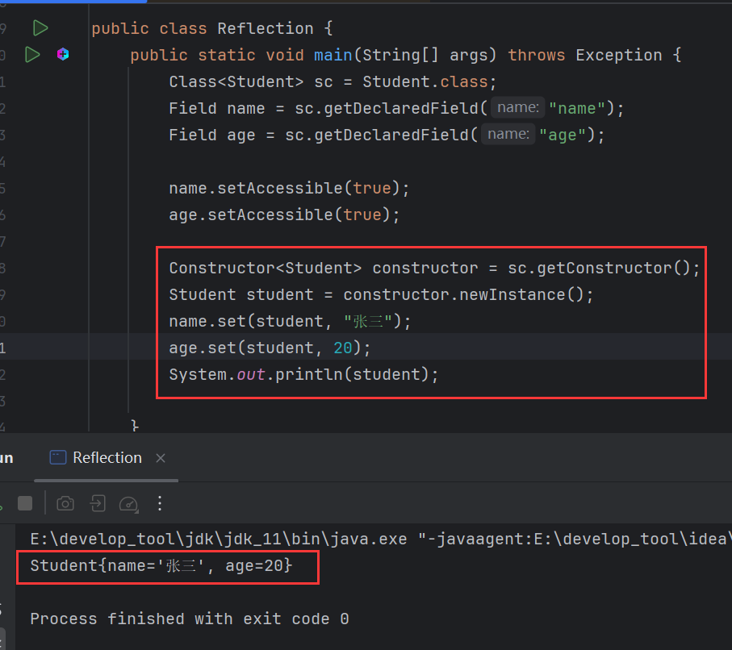

使用暴力反射后，不要忘记调用`setAccessible()`来放开访问权限。

## 4.6 get()

```java
public Object get(Object obj){};
```

> 返回对象的属性值。

同样，传入`Object`是为了告诉`Field`将哪个对象的属性值返回。

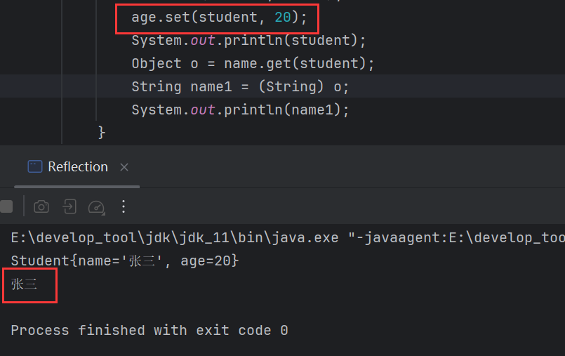


# 5 反射方法

通过字节码对象反射出类的方法进行使用。在java中有一个类专门来表示方法：`Method`。

## 5.1 getMethods()

```java
public Method[] getMethods(){};
```

> 返回所有**公共**方法对象的数组，包括继承的方法。

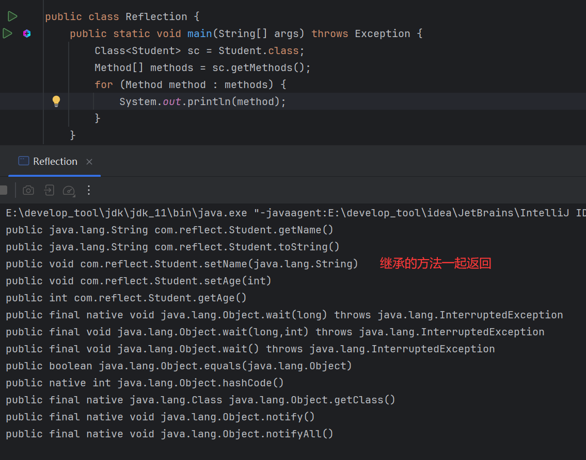

## 5.2 getDeclaredMethods()

```java
public Method[] getDeclaredMethods(){};
```

> 返回所有方法对象的数组，**不包括**继承的方法。

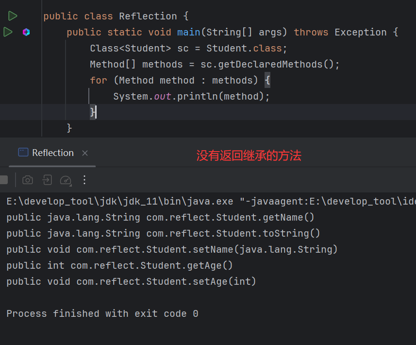

## 5.3 getMethod()

```java
public Method getMethod(
    String name, 
    Class<?>... parameterTypes
){};
```

> 返回单个**公共**方法对象，传入方法名和形参。

JVM会根据传入的方法名和形参匹配对应的方法。

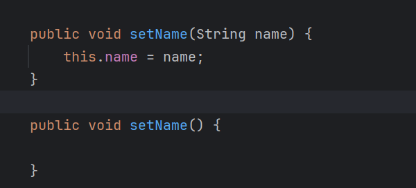

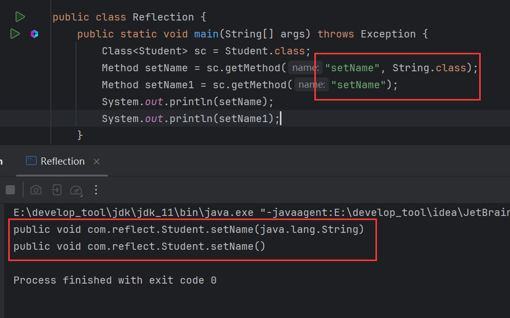

## 5.4 getDeclaredMethod()

```java
public Method[] getDeclaredMethods(){};
```

> 返回单个方法对象，传入方法名和形参。

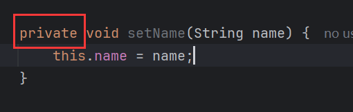

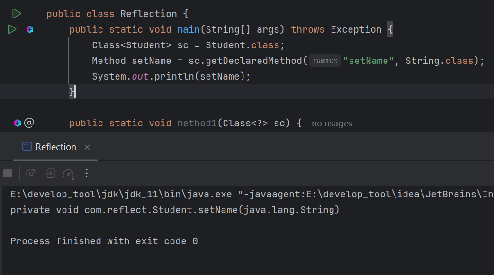

## 5.5 invoke()

```java
public Object invoke(Object obj, Object... args){};
```

> 方法对象的方法，执行反射的方法。

第一个`Object`是告诉`Methed`执行哪个对象中的方法：

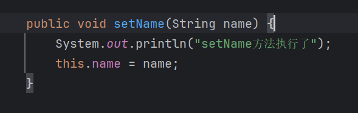

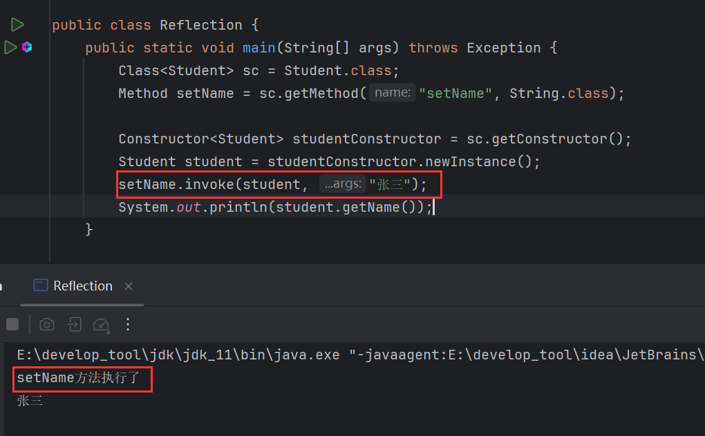

**<font color=red>注意</font>**： 如果调用的是静态方法，那么第一个参数可以传入【null】。

# 6 练习

1、向泛型为`Integer`的集合中添加字符串。

java中的泛型是伪泛型，只在编译阶段生效，字节码文件中没有泛型。也就是说可以通过反射在运行阶段向集合中添加字符串：

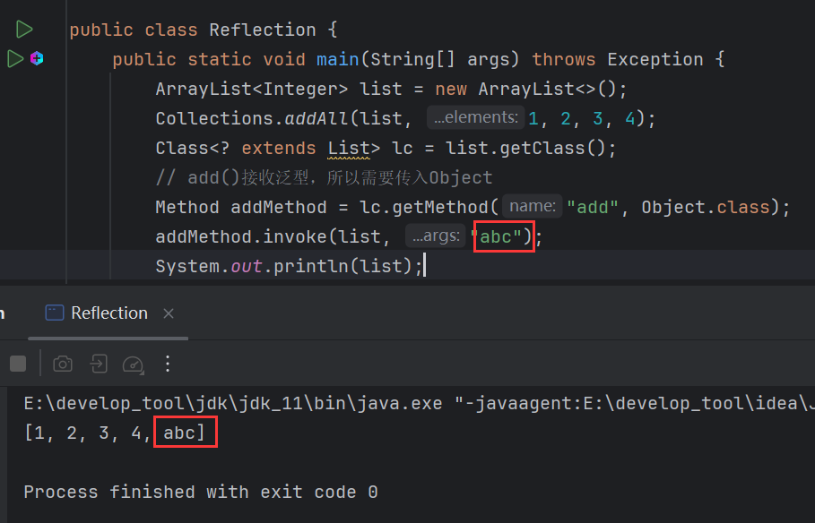

2、编写三个任意的Javabean类，`Student`类，`Teacher`类，`Worker`类。属性均为: `name`，`age`。

方法要求:

- `Student`里面写学习`study()`和吃饭`eat()`的方法(方法无参无返回)

- `Teacher`里面写上课`teach()`和吃饭`eat()`的方法(方法无参无返回)
- `Worker`里面写工作`work()`和睡觉`sleep`的方法(方法无参无返回)
- 本地新建配置文件properties
- 属性：className=Student类的全类名，methodName=study
- 在测试类中读取properties文件中的两个属性值
- 利用反射创建对象学生类的对象，并调用方法
- 修改配置文件，不修改代码，运行老师类中的上课方法
- 修改配置文件，不修改代码，运行工人类中的工作方法

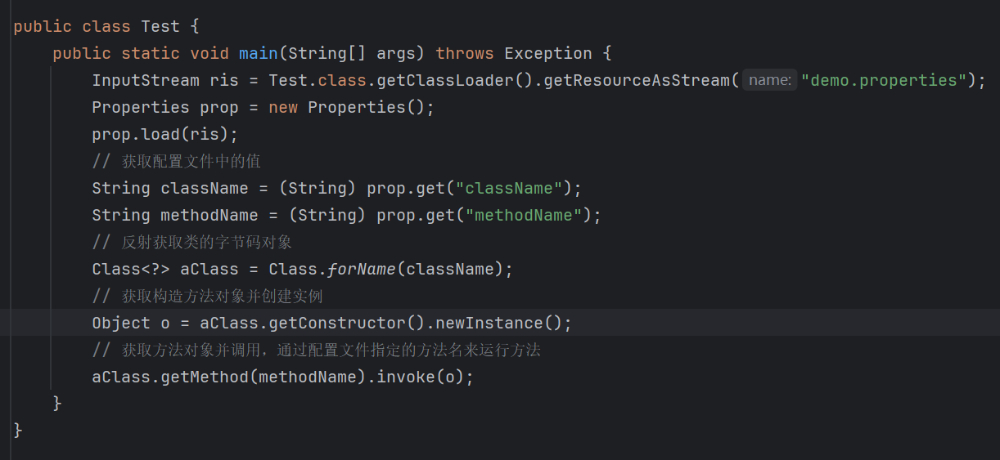

配置文件中定义的是类名和方法名，利用类加载器将配置文件中的内容读取出来，就能拿到类名和方法名，然后利用反射通过类名来创建类的字节码对象，进而获取类的构造方法对象来创建类的对象，然后再通过字节码对象获取方法对象，通过方法名运行对应的方法。

唯一的变动就是类名和方法名，这些在配置文件中控制，就可以做到不改动代码，只改动配置文件运行不同的方法：

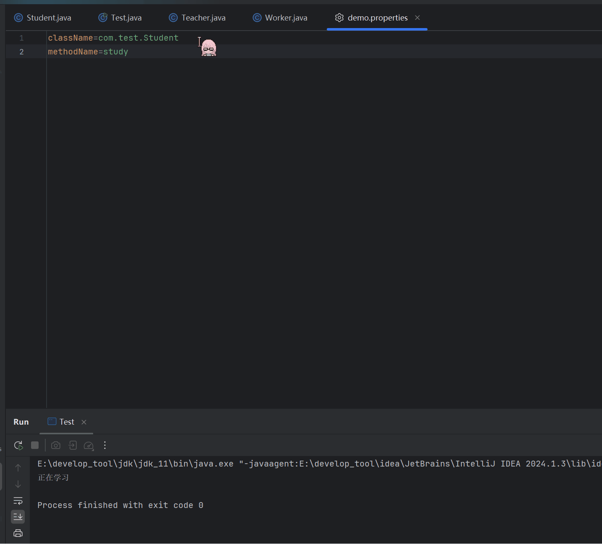