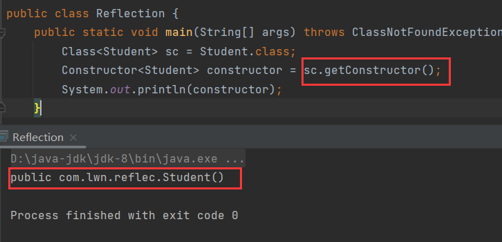

# 1 反射

> 在<font color=red>运行状态</font>中，对于任意一个类，都能够知道这个类的所有属性和方法，对于任意一个对象，都能够调用它的任意属性和方法。

这种**动态获取信息**以及**动态调用对象方法**的功能称为Java语言的反射机制。

反射的应用时机是在运行状态中，换句话说此时已经过了编译阶段，java文件经过编译后会生成字节码文件，也会对应生成一个【Class】对象，这个对象记录这这个类的结构，包括属性和方法，既然【Class】记录着属性和方法，那么自然可用通过【Class】来访问这些属性和方法。

这些属性和方法也通过对象表示，要访问这些属性和方法，就要访问对应的对象，其中：

- 构造方法对应的对象：【Constructor】。
- 属性对应的对象：【Field】。
- 方法对应的对象：【Method】。

综上，反射就是在操作字节码对象【Class】，从中剖析出对应类的构造方法对象、属性对象、方法对象等，然后访问这些对象来完成某些操作，比如通过构造方法对象创建对象，通过属性对象赋值、取值，或者通过方法对象调用方法。


# 2 获取Class

## 2.1 forName()

```java
public static Class<?> forName(String className){};
```

> 【Class】的静态方法，通过类的全类名获取字节码对象。


## 2.2 class关键字

```java
类名.class
```

> 通过【class】关键字获取字节码对象。


## 2.3 getClass()

```java
public Class<?> getClass(){};
```

> 【Object】中的方法，通过对象获取字节码对象。


因为字节码在内存中只有一份，所以字节码对象也只有一个：


# 3 反射构造方法

通过字节码对象反射出类的构造方法进行使用。在java中有一个类专门来表示构造方法：【Constructor】。

## 3.1 getConstructors()

```java
public Constructor<?>[] getConstructors(){};
```

> 返回所有**公共**构造方法对象的数组。

**注意**：只返回【public】修饰的构造。


## 3.2 getDeclaredConstructors()

```java
public Constructor<?>[] getDeclaredConstructors(){};
```

> 返回所有构造方法对象的数组。

私有权限的构造也能反射出来，也称为暴力反射。


## 3.3 getConstructors()

```java
public Constructor<T> getConstructor(Class<?>... parameterTypes){};
```

> 返回单个**公共**构造。

接收的是可变参数，每个参数是一个字节码对象，因为类的构造有很多，每个构造的参数都不相同，因此用可变参数来接收。jvm会根据传入的参数来动态匹配合适的构造。

比如，无参就对应无参构造：



【Student】的有参构造，一个是【String】，一个是【int】：


所以根据这个构造的参数传入对应类型的字节码匹配这个构造：


同样，这个方法也只能返回【public】修饰的构造。

## 3.4 getDeclaredConstructor()

```java
public Constructor<T> getDeclaredConstructor(Class<?>... parameterTypes)
```

> 暴力反射，返回单个构造。


## 3.5 newInstance()

```java
public T newInstance(Object ...initargs){};
```

> 构造方法对象的方法，创建对象。

通过反射将类的构造反射出来后，就可以此构造方法对象来创建该类的对象。


运行时抛出了【IllegalAccessException】，这个异常表示：

> 当应用程序尝试反射创建实例( 数组除外)，设置或获取字段或调用方法时，抛出IlegalAccessException， 但当前正在执行的方法**无法访问**指定类的**字段，方法或构造函数**。

简单来说就是权限不够，因为当前获取的构造是私有权限：


## 3.6 setAccessible()

```java
public void setAccessible(boolean flag){};
```

> 构造方法对象的方法，放开访问权限。

通过这个方法放开权限，就能使用私有的构造：


【IllegalArgumentException】跟参数有关的异常，因为上面反射获取的是有参构造，所以这个构造需要传递参数：


一般在暴力反射之后，都会调用【setAccessible()】，就是为了避免出现权限访问问题。


# 4 反射属性

通过字节码对象反射出类的属性进行使用。在java中有一个类专门来表示属性：【Field】。