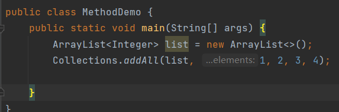
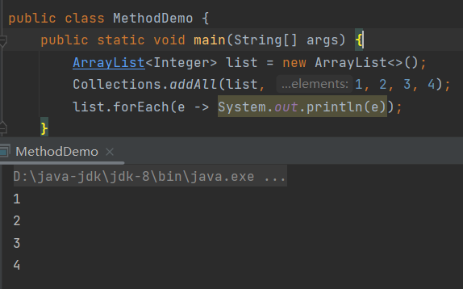
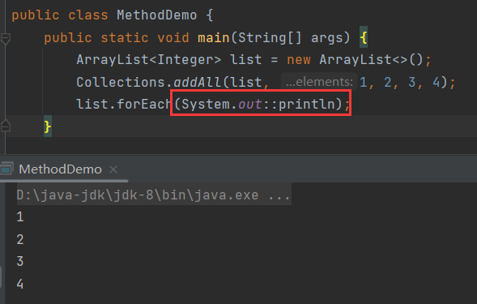
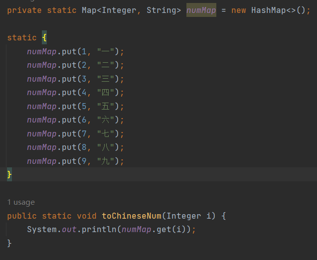

# 1 方法引用

> 方法引用是JDK8开始出现，主要的作用，是对Lambda表达式进行进一 步的简化。

- 方法引用使用一对冒号::。
- 通过方法名来指向一个方法。
- 可以使语言的结构更紧凑简洁，减少冗余代码。

## 1.1 演示

代码材料：



遍历集合，用lambda表达式：



改为方法引用：



## 1.2 格式

`System.out`是获取打印流对象，然后去引用它的`println()`方法。

```java
System.out::println
```

这就是这句代码的含义。

不难发现方法引用的格式为：

```java
// 引用实例方法
对象::方法名
// 引用静态方法
类::方法名
```

同样的，对于自己写的类，也可以参与方法引用，比如这个数字转大写数字的方法：



观察这个方法，这个方法接收一个参数，无返回值，与`Consumer`接口的`accept()`一样。

lambda表达式是简化匿名内部类的书写，lambda表达式的形参去替换抽象方法的形参，lambda表达式的方法体作为抽象方法的方法体。

而方法引用又是来简化lambda表达式的书写，方法引用可以被看作是将一个现有的方法用作函数式接口的实现，即它把这个方法用来**替代**抽象方法。

由于`toChineseNum()`与`accept()`都接收一个参数，且`accept()`的形参接收泛型，能包括`Integer`类型的参数，同时它们都没有返回值，因此可以把`toChineseNum()`替代`accept()`来当作`Consumer`的实现。

## 1.3 参数省略原则

方法引用没有要求声明参数，这是因为可推导，可省略原值，省略了参数。

方法引用能够推导出参数，是因为函数式接口的抽象方法已经规定了参数列表和返回值类型。编译器根据函数式接口的签名推断出被引用方法的参数类型和数量，因此在方法引用中可以省略这些参数的声明。

## 1.4 优点与缺点

**优点：**

- **简洁性**：方法引用能够让代码更简洁，省去了写 Lambda 表达式的代码。

- **可读性强**：当方法引用很明确时，它能让代码更容易理解，尤其是在处理已有的标准库方法时，如 `System.out::println`。

- **减少冗余**：如果逻辑完全复用，方法引用能避免重复实现已有逻辑。

**缺点：**

- **无法扩展逻辑**如果在现有方法的基础上做扩展，方法引用无法满足需求。方法引用严格依赖于原方法的实现，无法插入额外逻辑。

  例如，需要在调用 `println` 之前或之后执行一些其他操作，那么方法引用不能满足这种需求，要使用 Lambda 表达式。

```java
// 需要扩展的情况
MyFunction func = (s) -> {
    System.out.println("扩展逻辑之前");
    System.out.println(s);
    System.out.println("扩展逻辑之后");
};
```

- **耦合性高**：方法引用要求方法签名完全一致，即形参和返回值必须与抽象方法匹配。这意味着不能对方法做额外的调整，也不利于将来修改。

- **不够灵活**：如果需要稍微调整参数、返回类型，或者要进行类型转换等操作，方法引用的使用场景会变得有限。

## 1.5 应用场景

**什么时候适合用方法引用？**

- **直接复用逻辑**：如果完全不需要对方法进行扩展或调整，只想直接调用现成的方法，那么方法引用是一个理想的选择。
- **简化代码**：当方法非常明确、常用，且可直接用于抽象方法时，方法引用能够显著简化代码，提高可读性。

**什么时候不适合用方法引用？**

- **需要扩展方法逻辑**：如果需要在已有逻辑上增加前置或后置操作，方法引用就不合适了，Lambda 表达式更灵活。
- **方法不完全匹配抽象方法的签名**：如果方法签名不匹配，则无法使用方法引用，此时需要用 Lambda 表达式手动调整。