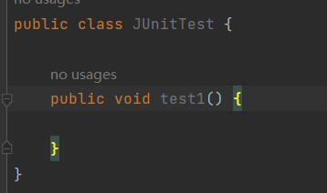
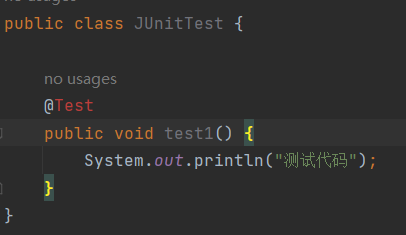
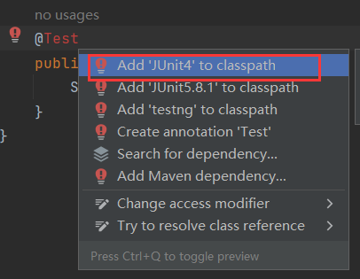
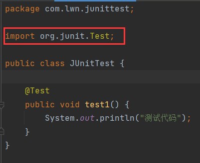
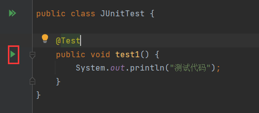
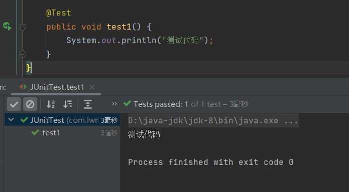
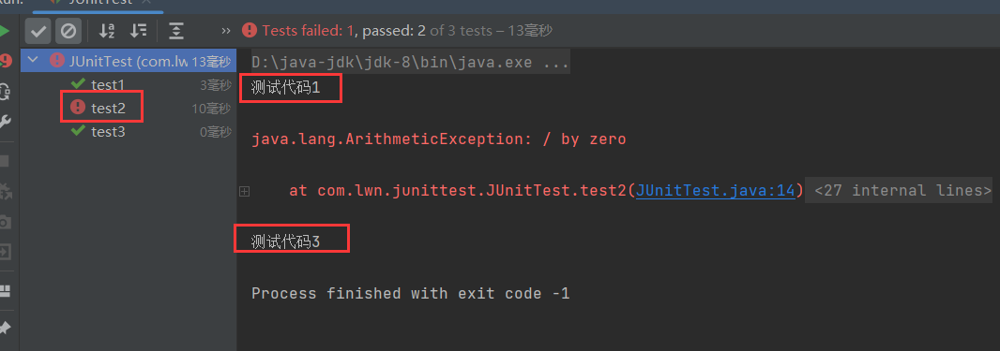

# 1 单元测试

> 针对最小的功能单元(方法)，编写测试代码对其正确性进行测试。

JUnit：最流行的Java测试框架之一，提供了一些功能，方便程序进行单元测试(第三方公司提供)。

## 1.1 JUnit快速入门

**步骤**：

1. 在测试方法上添加`@Test`。
2. 引入jar包。

**规范**：

- 测试类命名格式为：`xxxxTest`。
- 方法必须声明为`public void`。
- 方法不能有形参。

演示：

在方法上加上`@Test`：

报错，是因为没有引入jar包，鼠标放在注解上Alt+回车：

选择第一个，将会下载JUnit的jar包，Alt+回车导入类：

此时，方法左边出现绿色箭头，表示方法可以运行：

多个单元测试并行运行，如果某些测试失败，不会影响其他测试：

