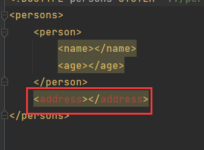
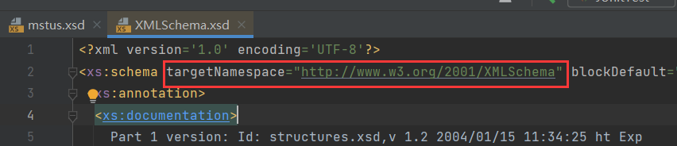
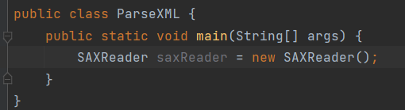

# 1 XML

> **可扩展**标记语言(Extensible Markup Language，简称: XML)是一种**标记语言**。

标记语言简单来说就是标签语言，由标签`<>`组成：


可扩展，表示XML中的标签名可以自定义。

## 1.1 作用

XML的作用，一般是用作配置文件，存储数据。

**Q：properties文件也是配置文件，为什么还需要XML？**

**A**：因为properties文件用于存储一对一的数据，如果要存储一对多的数据，用XML更合适。

## 1.2 语法

1. 创建一个XML文件，后缀为.xml。

2. 第一行第一列必须是文档声明，格式如下：

   ```xml
   <?xml versison="1.0", encoding="UTF-8" ?>
   ```

   `<>`中的内容叫做属性，其中：

   `versison`必须存在，`encoding`不是必须。

   另外，还要其他属性如`standalone`，这个属性用于描述XML是否依赖于其他XML，取值为yes/no，非必须。

3. 编写根标签，必须存在一个根标签，有且只有一个，标签必须成对出现，如：`<student> </student>`，`</>`是结束标记。

4. 特殊的标签可以不成对出现，但是必须要有结束标记，这种标签称为自闭合标签，如：`<address/>`。

5. 标签中可以定义属性，属性和标签名空格隔开，属性值必须用引号引起来，如：`<student id="1"> </student>`。

6. 标签可以嵌套，但需要正确嵌套，如：

   正确嵌套：

   ```xml
   <student id="1">
       <name>张三</name>
   </student>
   ```

   错误嵌套：

   ```xml
   <student id="1">
       <name>张三
   </student>
       </name>
   ```

## 1.3 注释

XML文件中可以定义注释信息，格式：

```xml
<!-- 这是注释 -->
```

## 1.4 特殊字符

XML文件中可以存在以下特殊字符：

```xml
&lt;		<!-- < 小于 -->
&gt;		<!-- > 小于 -->
&amp;		<!-- & 和 -->
&apos;		<!-- ' 单引号 -->
&quot;		<!-- " 双引号 -->
```

如果想写出以下效果：

```xml
<name><张三></name>
```

直接写<>会报错，因为语法检查认为这个对<>是标签，且没有结束标记。

正确的写法应该是这样：

```xml
<name>&lt;张三&gt;</name>
```

需要用到特殊字符。

### 1.4.1 CDATA区

如果需要写出大量的特殊字符，可以定义一个CDATA区，在这个区域内不用写晦涩的字符(\&lt;)，直接写出原始字符(<)即可。

CDATA区格式：

```xml
<![CDATA[ ... ]]>
```

比如：

```xml
<![CDATA[ < > & '' "" ]]>
```

## 1.5 演示

创建XML文件：


第一行第一列必须是文档声明：


必须存在一对根标签：


根标签内嵌套子标签：


标签中可以定义属性，每个学生都有id，所以定义id属性：


写入特殊字符：


在浏览器中查看：


用CDATA区直接写字符：


在浏览器中依旧以CDATA格式展示：


## 1.6 练习

需求：编写一个城市对应区的xml文件

- 城市：city
- 区域：area

北京市∶

- 东城区
- 西城区
- 朝阳区
- 海淀区
- 昌平区

```xml
<?xml version="1.0" encoding="UTF-8" ?>
<city name="北京">
    <area id="1">东城区</area>
    <area id="2">西城区</area>
    <area id="3">朝阳区</area>
    <area id="4">海淀区</area>
    <area id="5">昌平区</area>
</city>
```

一个XML只能有一个根标签，所以这样写会报错：


得这样写：


将它们包裹在一个根标签中。


# 2 XML约束

XML约束，了解即可，一般都是去引入第三方约束，所以只需要掌握引入的方法即可。

XML是一种弱类型语言，它的语法检测不严格，比如，在XML中可以自定义标签，而约束就是用来限定XML文件中可以使用的标签和属性。

约束分类：

- dtd约束。
- schema约束。

## 2.1 dtd约束

1. 创建一个文件，这个文件的后缀名为.dtd。
2. 用`<!ELEMENT>`即element来定义元素(标签)，这一步就是在约束XML中的标签。

比如这个例子：

```dtd
<!ELEMENT persons (person)>
<!ELEMENT person (name,age)>
<!ELEMENT name (#PCDATA)>
<!ELEMENT age (#PCDATA)>
```

第一个`<!ELEMENT>`中定义的是根标签，即XML中的根标签只能是`<persons>`，后面的`()`中定义根标签的子标签，即子标签只能是`<person>`。

第二个`<!ELEMENT>`中定义的是普通标签`<person>`，它的子标签只能是`<name>`和`<age>`。

第三、四个`<!ELEMENT>`中定义的是普通标签`<name>`、`<age>`，`#PCDATA`表示标签中写文本类型，不再嵌套其他标签。

综上，`<!ELEMENT>`限定XML中的标签，第一个`<!ELEMENT>`定义的是根标签，其他`<!ELEMENT>`定义的是普通表，`()`中定义该标签的子标签，`#PCDATA`表示该标签不再嵌套，而是需要写入文本。

## 2.2 dtd引入方式

dtd引入方式有3种：

**1、本地引入**：

```xml
<!DOCTYPE 根元素名称 SYSTEM 'dtd文件的路径'>
```

创建约束文件：


引入约束：


现在写入标签就有提示了：


直接回车，就会把标签结构给写出来：


如果不满足约束，就会报错：



**2、内部引入**：

```xml
<!DOCTYPE 根元素名称 [ dtd文件内容 ]>
```

在XML文件内部编写约束：


**3、网络引入**：

```xml
<!DOCTYPE 根元素名称 PUBLIC "dtd文件名称" "dtd文档的URL">
```

这个是Mybatis框架的dtd约束：

```dtd
<?xml version="1.0" encoding="UTF-8" ?>
<!DOCTYPE configuration
  PUBLIC "-//mybatis.org//DTD Config 3.0//EN"
  "https://mybatis.org/dtd/mybatis-3-config.dtd">
```


## 2.3 schema约束

- schema约束文件也是一个XML文件，符合XML的语法，这个文件的后缀名. xsd。
- 一个XML中可以引用多个schema约束文件，多个schema使用名称空间区分(名称空间类似于java包名)。
- dtd里面元素类型的取值比较单一常见的是PCDATA类型， 但是在schema里面可以支持很多个数据类型。
- schema语法更加的复杂。


编写步骤：

1. 创建一个文件，后缀名为.xsd。
2. 定义文档声明。

3. schema文件的根标签为： `<schema>`。

4. 在`<schema>`中定义属性：

  ```xml
  <!-- 引入上层约束 -->
  xmlns=http://www.w3.org/2001/XMLSchema
  ```

5. 在`<schema>`中定义属性：

  ```xml
  <!-- 
  该地址是唯一的url地址，指定当前这个schema文件的名称空间。其他schema需要引入约束时，引入的就是这个地址
  -->
  targetNamespace=url地址
  ```

6. 在`<schema>`中定义属性：

  ```xml
  <!-- 表示当前schema文件是一个质量良好的文件 -->
  elementFormDefault="qualified"
  ```

7. 通过element定义元素。

8. 判断当前元素是简单元素还是复杂元素。

演示：

创建文件，文档声明：


根标签`<schema>`：


IDEA智能补全，自动补全上级约束。

然后指定该文件的名称空间，要唯一，一般是个网址，可以根据包名来定义：


定义`elementFormDefault`属性：


通过element定义元素，首先是根标签：


`name`属性定义标签名。

然后判定这个标签是简单类型还是复杂类型，复杂类型就是这个标签还会嵌套其他标签。

复杂类型用`<complexType>`定义：


然后需要指定标签顺序，用`<sequence>`定义：


然后再通过`<element>`定义子标签：


这个也是一个复杂标签，所以如法炮制：


学生的名字这个标签是一个简单类型，不会嵌套，所以自闭和：


然后再定义一个年龄标签：


接着定义这个标签写入内容的类型，用`type`属性：


## 2.4 引入单个schema约束

然后引入这份约束，在编写这个份约束时，引入了上级约束，是在根标签中引入，通过`xmlns`属性。


访问这个URL：



发现指向一份xsd文件，而且这个URL正好是这份约束的名称空间。

那么可以确定引入schema约束的方式是在根标签中通过`xmlns`引入名称空间地址：

```xml
<根标签 xmlns="名称空间地址">
```


### 2.4.1 引入多个约束

引入多个schema约束：

假设两份schema约束，文件名为p.xsd和a.xsd，名称空间是：

```xml
http://www.lwn.com/person
http://www.lwn.com/address
```

引入多份约束时需要引入上级约束：

```xml
http://www.w3.org/2001/XMLSchema-instance
```

然后再引入这两份约束，格式如下：

```xml
<students xmlns:xsi="http://www.w3.org/2001/XMLSchema-instance"
          xmlns:per="http://www.lwn.com/person"
		  xmlns:add="http://www.lwn.com/address"
          xsi:schemaLocation="
                        http://www.lwn.com/address ../p.xsd
                        http://www.lwn.com/person ../a.xsd"
        >
```

这里为多个`xmlns`起别名，否则属性重复冲突，格式：`:别名`。


**Q**：为什么要引入上级约束`XMLSchema-instance`？

**A**：因为需要用到这个约束中的属性`schemaLocation`：


也就是在这里用到：


因为这个约束起了别名`xsi`，所以它的属性使用也要通过别名。

除了在根标签中引入这两份约束的名称空间，还需要在`schemaLocation`中引入名称空间：


同时还要指定约束文件的文件路径：


这就是引入多个约束的完整格式。

演示：


## 2.5 细节

如果想让`<student>`标签出现多次，那么在它的上级顺序标签中定义次数，通过`maxOccurs`属性：


它有两个值，一个是1表示只能有一个，一个是unbounded，表示无穷个：


如果要定义`<student>`标签的属性，需要在它的下级与顺序标签平级的地方定义`<attribute>`标签：


`name`定义这个属性的名称，`type`定义这个属性的类型，`use`定义属性是否必须，required表示必须：


# 3 解析

将XML中的内容读取到java中。分为两种：

- **SAX解析**：不会把整体的XML文件都加载到内存，而是从上往下逐行进行扫描。
  - **缺点**：只能读取，不能添加，不能删除(添加、删除依赖于父标签，逐行无法读取到父标签)。
  - **优点**：因为是逐行扫描不需要把整体的XML文件都加载到内存，所以他可以解析比较大的XML文件。
- **DOM解析**：会把整体的XML文件都加载到内存，形成DOM树，通过这个树去解析XML文件。
  - **优点**：可以读取，可以添加，可以删除，可以做任何事情。
  - **缺点**：需要XML文件全部加载到内存，所以不能解析非常大的XML文件。

DOM树有一些对象：

- `Document`：整个文档对象。
- `Element`：元素对象，也就是标签。
- `Attribute`：属性对象，标签中的属性。
- `Test`：文本对象，标签包裹的文本内容。

对于这个XML：


它的DOM树是这样的：


## 3.1 Dom4j

解析XML的框架：

| 名称  | 说明                                                         |
| ----- | ------------------------------------------------------------ |
| JAXP  | SUN公司提供的一套XML解析的API。                              |
| JDOM  | JDOM是一个开源项目，它基于树形结构，利用java对XML文档实现解析、生成、序列化以及多种操作。 |
| Dom4j | 是JDOM的升级品。具有性能优异、功能强大和极其易使用的特点，它的性能超过SUN公司官方的DOM技术，同时也是一个开源的软件，Hibernate也用它来读写配置文件。 |
| jsoup | 功能强大DOM方式的XML解析开发包，尤其对HTML解析更加方便。     |

## 3.2 使用Dom4j

1. 导入jar包。
2. 关联要解析的XML文件，获取`Document`对象。
3. 解析，`getRootElement()`获取根标签。

添加jar包：


然后创建读取器`SAXReader`：



调用`read()`传入XML文件路径，获取该文件的`Document`对象，路径需要写入绝对路径：


## 3.3 getRootElement()

```java
public Element getRootElement(){};
```

> 获取根标签对象。


## 3.4 elements()

```java
public List elements(){};
```

> 返回当前标签的所以子标签。

返回的子标签中不包含孙子标签，若要获取孙子标签，由子标签再调用`elements()`。

返回根标签的所以子标签：


## 3.5  attributeValue()

```java
public String attributeValue(String var1){};
```

> 根据属性名返回标签的属性值。

获取每个`<student>`的`id`属性：


## 3.6  element()

```java
public Element element(String var1){};
```

> 通过标签名获取单个子标签。


## 3.6  getText()

```java
public String getText(){};
```

> 获取标签包裹的文本内容。

