# 1 注解

> Annotation表示注解，是JDK1. 5的新特性。注解的主要作用：对程序进行标注。

注释是给人看的，注解是给虚拟机看的，通过注解可以给类增加额外的信息。编译器或JVM可以根据注解来完成对应的功能。

之前接触过的注解：

`@Override`，用于校验方法是否重写。

除此之外，JDK还有其他常用注解，如：

`@Depercated`，标识方法为过时方法。

在方法上加上`@Depercated`：

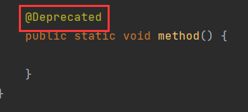

调用该方法时，就会有过时提示：

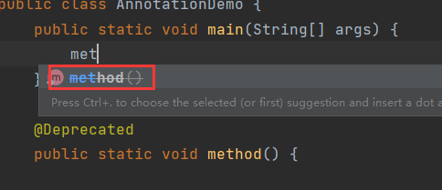

再比如`@SuppressWarnings`，用于压制警告：

一般情况下的警告：

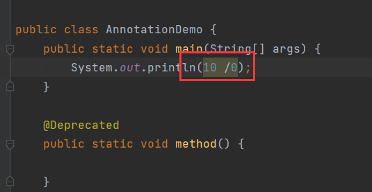

用`@SuppressWarnings`压制警告：

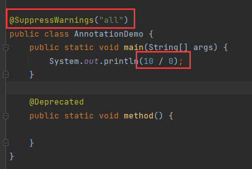

## 1.1 自定义注解

> 自定义注解单独存在意义不大，一般会跟反射结合起来使用。

格式：

```java
public @interface 注解名 {
    public 属性类型 属性名() default 默认值;
}
```

如：

```java
public @interface MyAnno {
    public String show() default "show...";
}
```

与接口很想，一个简单的接口：

```java
public interface Inter {
    String show();
}
```

注解中的属性有一对`()`，容易看成方法，但其实它不是方法。属性需要属性类型，就像类中的属性一样。

注解的属性类型有这些：

- 基本数据类型。
- `String`。
- `Class`。
- 注解。
- 枚举。
- 以上类型的一维数组。

注解的属性可以不加`public`关键字，因为默认被`public`修饰，所以格式可以简化为：

```java
public @interface 注解名 {
    属性类型 属性名 default 默认值;
}
```

`default`关键字是给属性赋值，就像在类中给类的属性赋值一样：

```java
public MyClass {
    String name = "张三";
}
```

只不过在注解中不使用`=`而使用`default`。

## 1.2 自定义注解的使用

注解可以用在任意位置，但一般用在**类**或**方法**上。

创建一个注解：

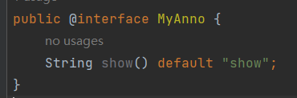

作用在类、方法、属性上：

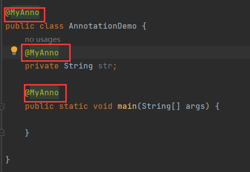

在使用`@SuppressWarnings`的时候给注解传入了一个值：

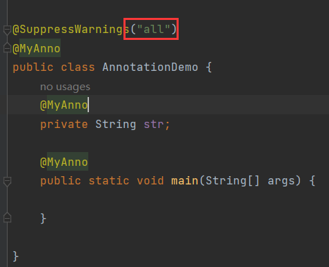

查看这个注解的源码：

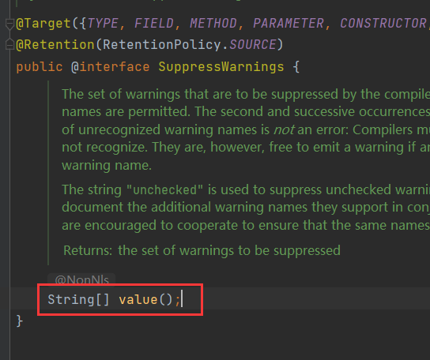

它的属性是一个字符串数组，但是它没有默认值，所以当前属性没有声明默认值时，在使用注解时必须给注解的属性赋值：

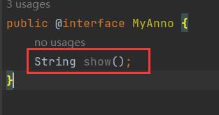

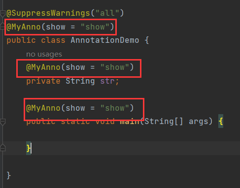

格式为：

```java
属性名 = 属性值
```

这是为了方便区分多个属性的赋值，哪个值赋给哪个属性。

比如：

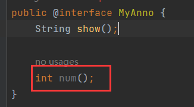

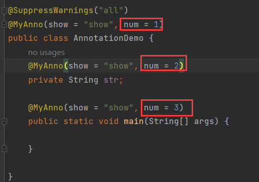

但是有一个特殊情况，观察`@SuppressWarnings`，它在赋值时并没有定义属性名，它的属性叫做`value()`：

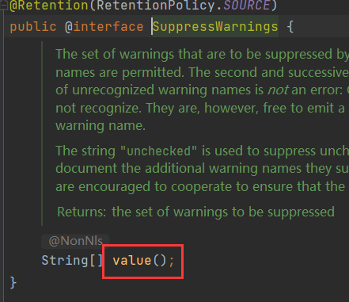

当属性名为`value()`时，在给属性赋值时，属性名可以省略：

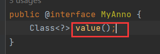

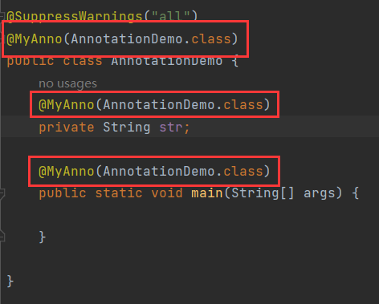

但是如果多加一个属性：

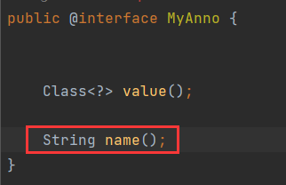

就必须显示声明`value`：

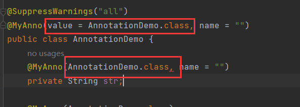

综上：

> 当注解的属性**有且只有一个，且名为**`value()`，在使用注解赋值时可以省略属性名。

## 1.3 案例

通过一个案例来加深对注解作用的理解：

自定义一个注解`@MyTest`，定义于方法上，如果类中的某个方法使用了该注解，那么就执行这个方法：

首先创建`@MyTest`：

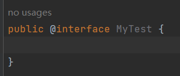

然后创建测试方法，使用该注解：

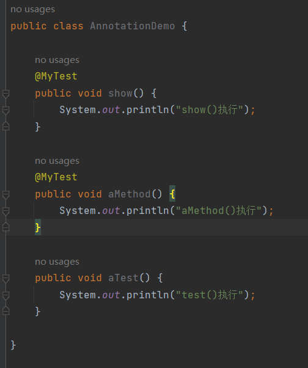

然后再编写一个测试类，通过反射拿到这些待执行方法：

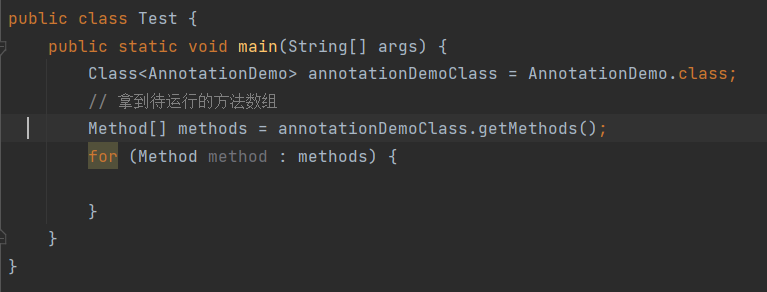

然后进行进一步判定，看这个方法是否被`@MyTest`注解标识，如果标识说明是待执行方法，就调用`invoke()`执行。

## 1.4 isAnnotationPresent()

```java
public boolean isAnnotationPresent(
    Class<? extends Annotation> anno){};
```

> 判定方法上是否存在指定的注解。

方法接收一个注解的字节码对象，要判断方法上是否存在某个注解，就传入该注解的字节码对象：

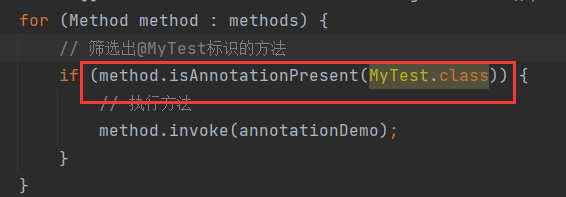

最终代码：

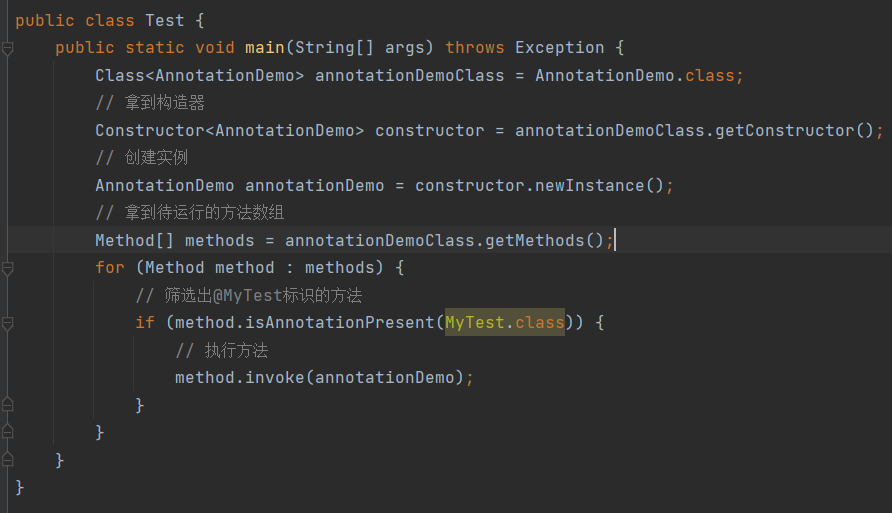

效果：

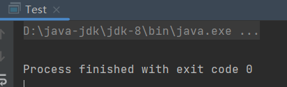

方法没有执行。

## 1.5 注解的生命周期

这是因为注解没有活到运行阶段，反射的执行时机在运行阶段，而注解在运行阶段不存在，因此`isAnnotationPresent()`就找不到目标方法，也就没有方法执行。

注解的生命周期分为：

- 源代码阶段。
- 字节码阶段。
- 运行时阶段。

如果没有设置注解的生命周期，那么注解默认活到字节码阶段。

### 1.5.1 元注解

元注解就是注解上的注解。

常用：

| 元注解     | 说明                 |
| ---------- | -------------------- |
| @Target    | 指定注解能在哪里使用 |
| @Retention | 设置生命周期         |

`@Target`：用来标识注解使用的位置，如果没有使用该注解标识，则自定义的注解可以使用在任意位置。

`@Target`使用时需要赋值，类型是`ElementType`枚举，其值如下：

| 枚举项         | 指定注解标识的位置 |
| -------------- | ------------------ |
| TYPE           | 类、接口           |
| FIELD          | 属性               |
| METHOD         | 方法               |
| PARAMETER      | 方法形参           |
| CONSTRUCTOR    | 构造方法           |
| LOCAL_VARIABLE | 局部变量           |

`@Retention`：用来标识注解的生命周期(有效范围)。

`@Retention`使用时也需要赋值，类型是`RetentionRolicy`枚举，其值如下：

| 枚举项  | 指定注解声明周期                                             |
| ------- | ------------------------------------------------------------ |
| SOURCE  | 注解只作用在**源码阶段**，生成的字节码文件中不存在。         |
| CLASS   | 注解作用在**源码阶段**，**字节码文件阶段**，运行阶段不存在，为**默认生命周期**。 |
| RUNTIME | 注解作用在**源码阶段**，**字节码文件阶段**，**运行阶段**。   |

改造`@MyTest`：

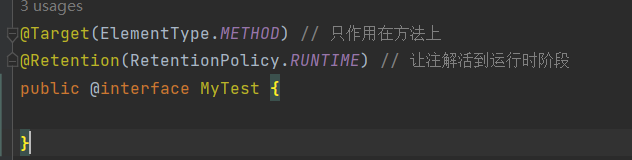

然后再次执行：

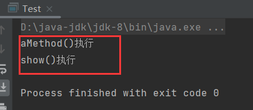

方法成功执行。

综上，如果只是自定义注解，没有与反射结合，那么注解没有多大的意义。

注解更像是一种标记，能让反射定位到被它标记的类、方法、属性，从而进行一些特殊操作，而没有被他标记的就会被排除。当然定位和排除的逻辑需要程序员自己完成。

而注解的属性更像是一种元数据，在进行特殊操作时可以使用这些元数据，这些元数据可以是默认值，也可以是使用注解时赋予的值，比如定义`@MyTest`的属性：

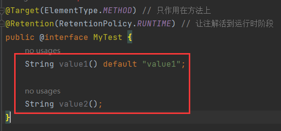

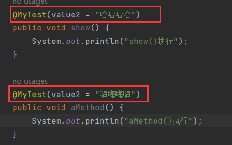

然后获取注解的属性值，并使用：

### 1.5.2 getAnnotation()

```java
public <T extends Annotation> T getAnnotation(Class<T> annotationClass) {};
```

`getAnnotation()` 是 Java 反射 API 中用于获取某个类、方法、字段或构造函数上的注解实例的方法。传入对应注解的字节码对象，返回该注解的实例。

- 从类上获取，用字节码对象调用。
- 从构造上获取，用构造方法对象调用。
- 从方法上获取，用方法对象调用。
- 从属性上获取，用属性对象调用。

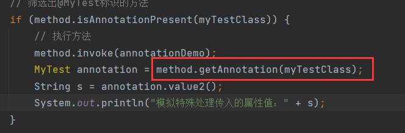

注解的属性，可以理解为注解的方法，那么使用属性的方式就是去调用方法：

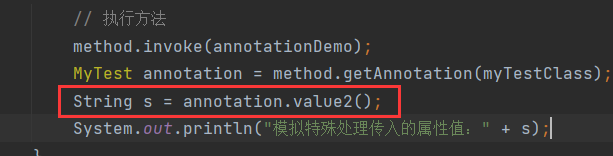

返回的值就是属性的值：

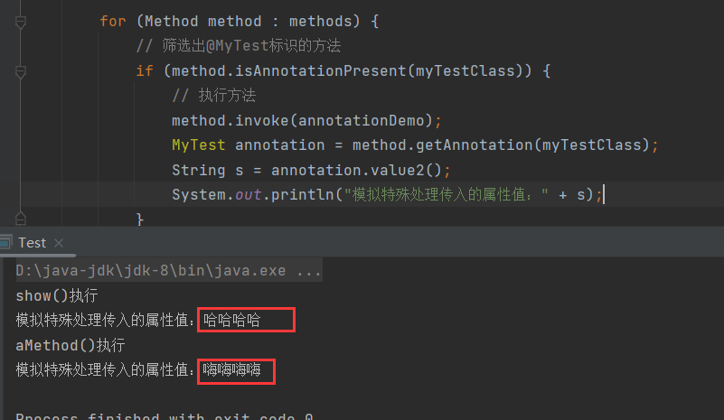

这就是元数据传递信息。

再比如，可以传递方法执行次数：

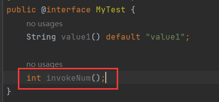

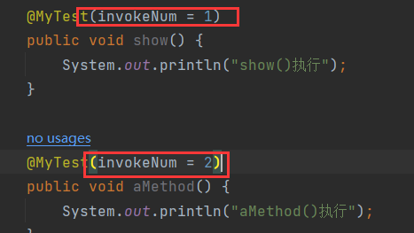

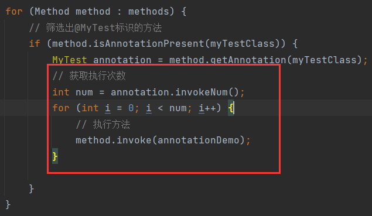

效果：

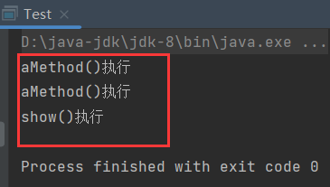