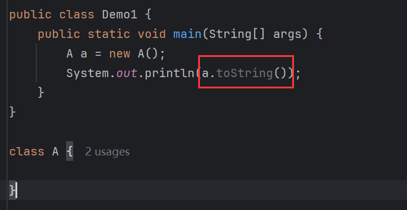
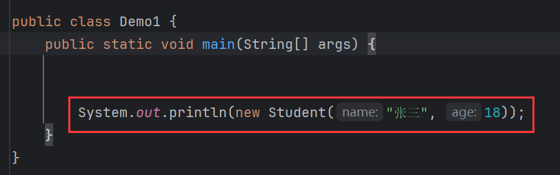

# Object类

> 所有的类，都直接或者间接的继承了0bject类(祖宗类)。object类的方法一切子类都可以直接使用的。

下面简单介绍Object类的方法。


# toString(Object obj)

```java
String toString(Object obj);
```

> 返回该对象的字符串表示。

默认情况下，【toString()】返回的是对象的地址值字符串表示：




而直接打印对象，也能打印出地址值：


> 打印语句中，println()在源码层面会自动调用toString()。

【println()】源码：


将对象传入【valueOf()】中，其源码：


在三元运算中调用了【toString()】。所以【println()】在源码层面会自动调用toString()。

【Object】的【toString()】源码：


```java
public String toString() {
    return getClass().getName() + "@" + Integer.toHexString(hashCode());
}
```

【getClass().getName()】获取类的全类名，【Integer.toHexString()】接受一个整数，然后将该整数转换为16进制数，并返回该数的字符串表示。而【hashCode()】则返回对象的内存地址通过哈希算法算出来的整数，这个整数也叫哈希值。即 **哈希值** = **哈希算法( 对象内存地址 )**。

所以，打印出地址值，严格意义上来说，并不是真正的地址值：


而是地址值通过哈希算法算出来的整数的16进制表示。不过由于习惯等原因还是将该值叫做内存地址。

## 重写toString()

大多数情况下，原生【toString()】的返回值没有多大用处，一般会选择子类重写【toString()】让其返回一个更有意义的值。比如，有一个学生类，它有两个成员：


重写【toString()】将成员值返回：


打印时，就能直接打印出对象的成员值，非常直观：




# equals(Object obj)

```java
boolean equals(Object obj);
```

> 判断其他某个对象是否与此对象"相等"。

【==】比较：


【==】比较在比较引用数据类型时，比较的是地址值，【new】了两个对象，所以不相等。如果要比较两个对象的内容是否相等如何处理？【equals()】能比较吗？


还是不行。在【equals()】的源码中，默认使用的还是【==】比较：


> Object的equals，默认使用==比较，即比较内存地址。

因此，要比较对象的内容，需要重写【equals()】：


这里用到了多态，子类中有的成员，父类中没有，编译看左边，那么编译就会报错，所以要强转，现在比较就是相等的：


但是存在一个BUG，因为【equals()】接受【Object】类型的参数，所以可以接受任意类型的对象，如果和【Student】类型不同，那么在强转的时候就会报错：


所以，需要用【instanceof】判断是否是同类型，若不是，则直接返回【false】：


