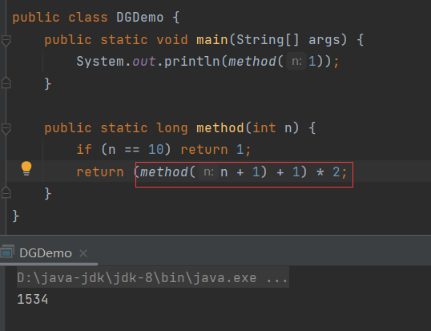

# 递归

> 方法直接或间接调用自身。

直接调用：


间接调用：


若不加以边界限定，让递归无限调用下去，则会出现栈溢出异常：


## 使用场景

> 通常用于一些算法题中。


# 案例

使用递归实现阶乘：

n! = n * (n-1) * (n-2) * ... * 1。

n的阶乘可以变形为：n * (n-1)!，而(n-1)!，也可以变形为：(n-1) * (n-2)!，可以依次变形下去，直到变为1!，1! = 1。分析可得，阶乘是有规律的，如果将计算阶乘看作是一个方法`method()`，那么从n开始到1的每个数可以表示为：

```java
method(n) = n * method(n - 1);
method(n - 1) = (n - 1) * method(n - 2);
method(n - 2) = (n - 2) * method(n - 3);
......
method(1) = 1;
```

在`method()`中出现了调用自生的情况，这就是使用阶乘在计算下一个数的阶乘，直到计算1的阶乘为止，边界条件就是计算1的阶乘：


## 内存图

.gif)


# 案例：递归求和


# 斐波拉契数列

斐波拉契数列为：

```
1 1 2 3 5 8 13 21 ...
```

其规律为：

```java
f(n) = f(n - 1) + f(n - 2)	// n > 2
f(1) = 1					// n = 1
f(2) = 1					// n = 2
```

求第20位的数为多少，用递归实现：


# 猴子摘桃

猴子第一天摘下若干个桃子，当即吃了一半，还不过瘾，又多吃了一个。第二天早上又将剩下的桃子吃掉一半，又多吃了一个。以后每天早上都吃了前一天剩的一半零一个到第10天早上想再吃时，见只剩下一个桃子了。求第一天共摘了多少桃子?

第10天时，还剩1个桃子，每天吃一半零一个，那么第9天还剩：(1 + 1) * 2 = 4个，同理第8天还剩：(4 + 1) * 2 = 10个。其规律为：

```java
f(10) = 1
f(9) = (f(10) + 1) * 2
f(8) = (f(9) + 1) * 2
...
f(1) = (f(2) + 1) * 2
```

用递归实现：

