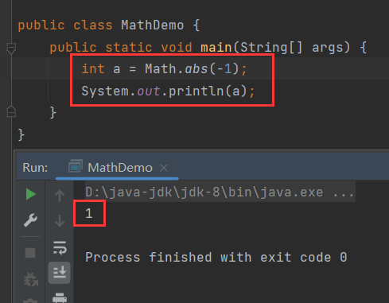
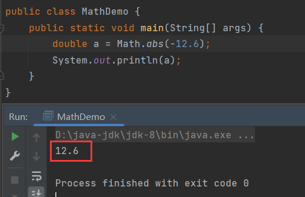
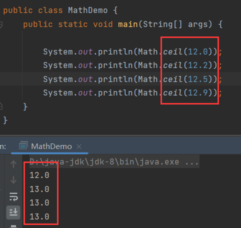
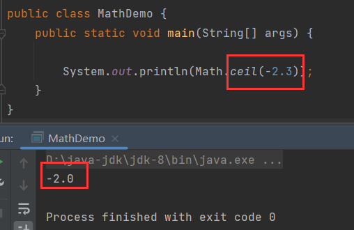
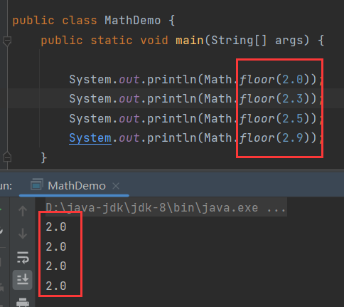
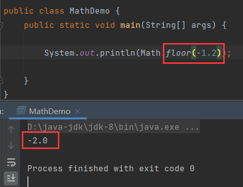
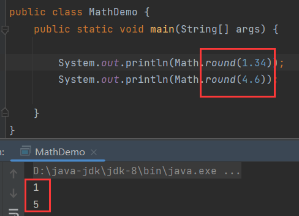
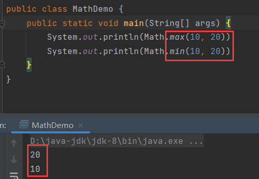
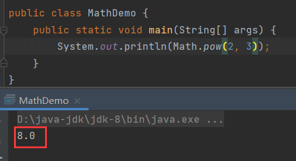
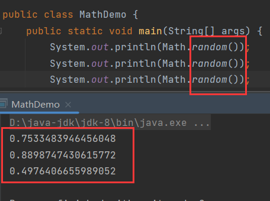

# Math类

> 包含执行基本数字运算的方法。

`Math`是一个工具类，内部的方法都是静态方法。


## abs()

```java
public static int abs(int a){};
```

> 获取参数的绝对值。



方法可以接收小数：



## ceil()

```java
public static double ceil(double a){};
```

> 向上取整。



向上取整，重点在取整，得到结果一定是整点数，它没有四舍五入的概念，只要这个小数不是整点数，那么就返回它在坐标轴右边的第一个整数。对于负数，比如-2.3，它在坐标轴上右边的第一个整数是-2，所以返回-2.0：



## floor()

```java
public static double floor(double a){};
```

> 向下取整。

与`ceil()`相反，若自身不是整点数，则返回自身在坐标轴左边的第一个整数，否则返回自身：





## round()

```java
public static int round(float a){};
```

> 四舍五入。




## max()、min()

```java
public static int max(int a, int b){};
public static int min(int a, int b){};
```

> 返回两个数中的较大值/较小值。




## pow()

```java
public static double pow(double a, double b){};
```

> 返回a的b次幂。

$$
a^b
$$



## random()

```java
public static double random(){};
```

> 返回随机数，范围为[0.0, 1.0)。

