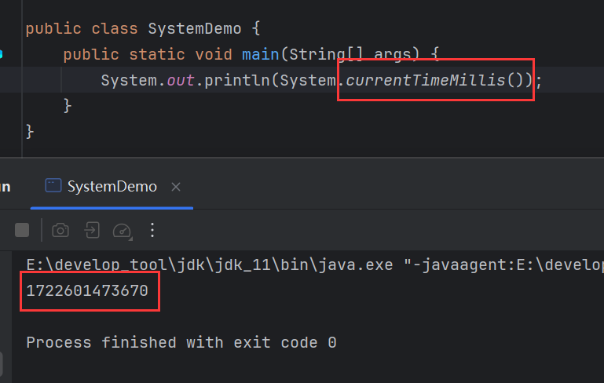
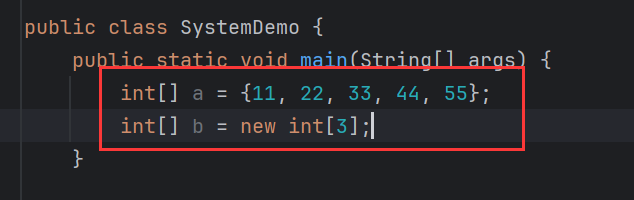
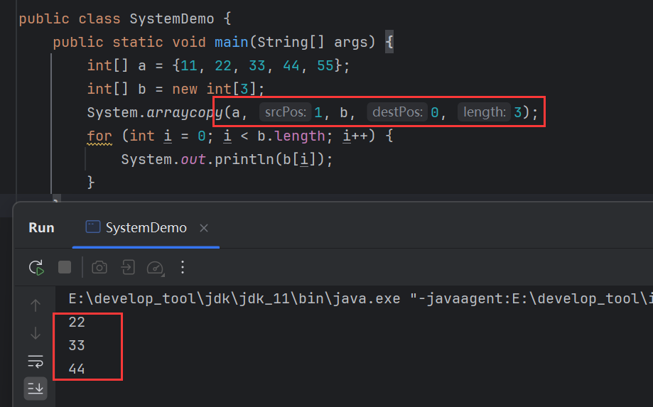

# System类

> System的功能是静态的，都是直接用类名调用即可。

下面介绍常用方法。


## exit()

```java
public static void exit(int status){};
```

> 终止当前正在运行的JVM，非0表示异常终止。

该方法需要一个【int】类型的参数，随便一个【int】值都能终止JVM，只是非0的数表示异常终止，因此建议传入0


## currentTimeMillis()

```java
public static long currentTimeMillis(){};
```

> 返回当前系统的时间毫秒值形式。



返回的是从1970年1月1日，0时0分0秒到当前系统时间所经历过的毫秒值。

用途一般是测试方法的执行时机：

```java
public void method() {
    long start = System.currentTimeMillis(); // 开始时间
    for (int i = 0; i < 1000000; i++) {
        System.out.println(i);
    }
    long end = System.currentTimeMillis();	// 结束时间
    System.out.println(end - start); // 做差得执行时间
}
```

## arraycopy()

```java
public static void arraycopy(
	Object src,
    int srcPos,
    Object dest,
    int destPos,
    int length
){};
```

> 数组拷贝。

其参数介绍如下：

|  参数   |                      介绍                      |
| :-----: | :--------------------------------------------: |
|   src   |          数据源数组，即被copy的数组。          |
| srcPos  |    起始索引，即从源数组的哪个位置开始拷贝。    |
|  dest   |   目的地数组，即从原数组拷贝到哪个数组中去。   |
| destPos | 起始索引，即拷贝到目的地数组中从哪个索引开始。 |
| length  |                  拷贝的个数。                  |

准备两个数组：



将【a】中的22，33，44拷贝到【b】中去：
原数组是【a】，从【a】的第二个元素开始拷贝，所以起始索引是1，目标数组是【b】,拷贝到【b】的第一个元素位置，所以起始索引是0，长度为3：




# 细节

1. 为什么获取系统的当前时间毫秒值是从1970年1月1日，0时0分0秒开始算起？因为从1970年1月1日，0时0分0秒是**计算机时间原点**，这个时间算是C语言的生日。
2. 严格意义上来说，获取的系统当前时间毫秒值并非从1970年1月1日，0时0分0秒开始算起，而是从从1970年1月1日，8时0分0秒开始算起.因为中国位于东8区，有时差。