# BigDecimal类

> 用于解决小数运算中,出现的不精确问题。

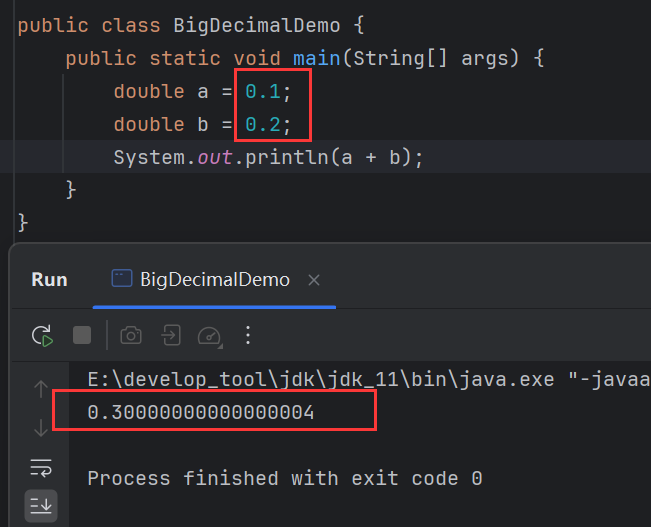

0.1+0.2预期的结果，应该是0.3，但是计算出来的值存在精度缺失。

## 创建对象

构造方法创建：

```java
// 将小数传入，创建BigDecimal对象
public BigDecimal(double value);
// 将小数以字符串传入，创建BigDecimal对象
public BigDecimal(String value);
```

静态方法创建：

```java
// 将小数传入，创建BigDecimal对象
public static BigDecimal valueOf(double value);
```

推荐使用第2、3种方式创建`BigDecimal`对象。

通过方式1创建：

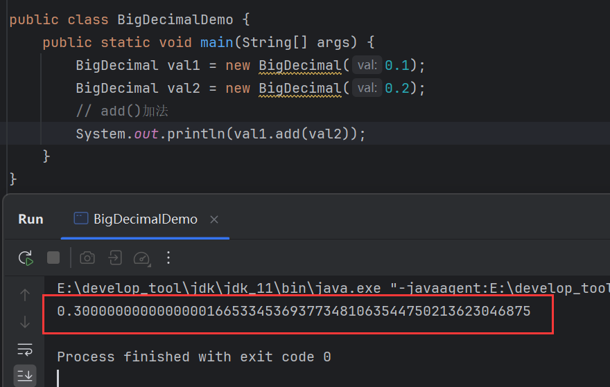

做加法，依旧有精度缺失问题。所以不推荐使用第1种方式创建`BigDecimal`对象。因为它无法保证小数运算的精确性。

通过方式2创建：

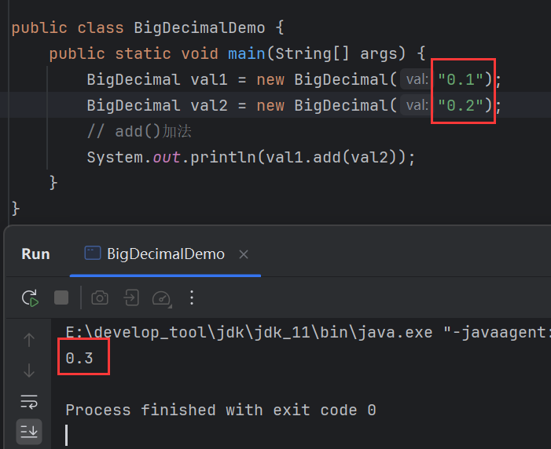

通过方式3创建：

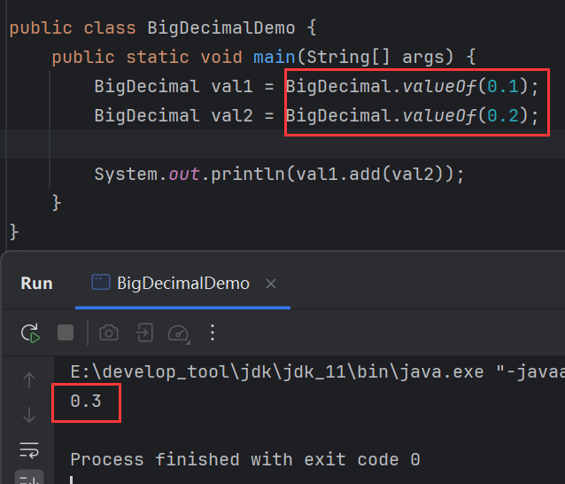

## add()

```java
public BigDecimal add(BigDecimal b);
```

> 加法。

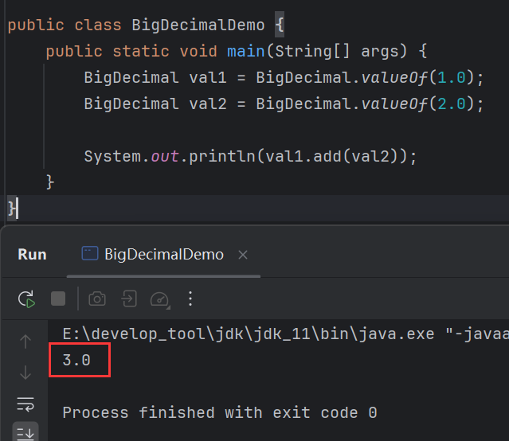

## subtract()

```java
public BigDecimal subtract(BigDecimal b);
```

> 减法。

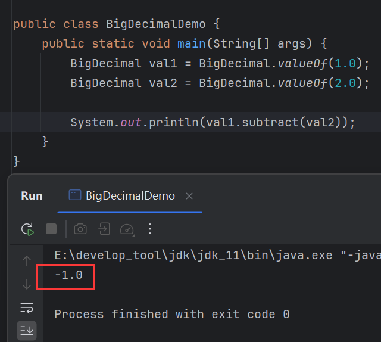

## multiply()

```java
public BigDecimal multiply(BigDecimal b);
```

> 乘法。

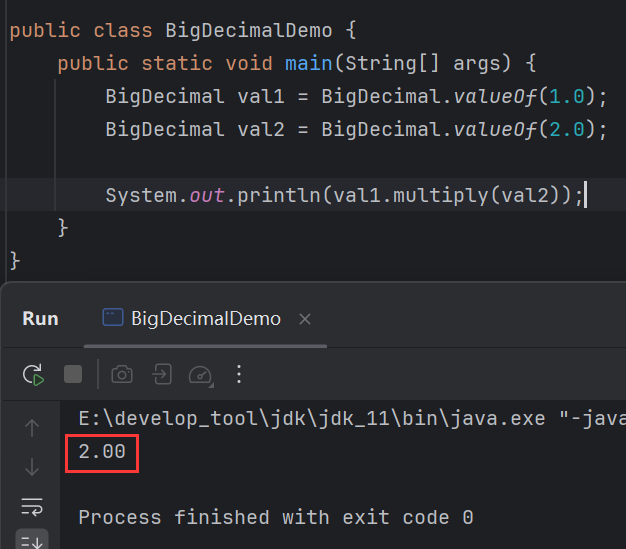

## divide()

```java
public BigDecimal divide(BigDecimal b);
```

> 除法。

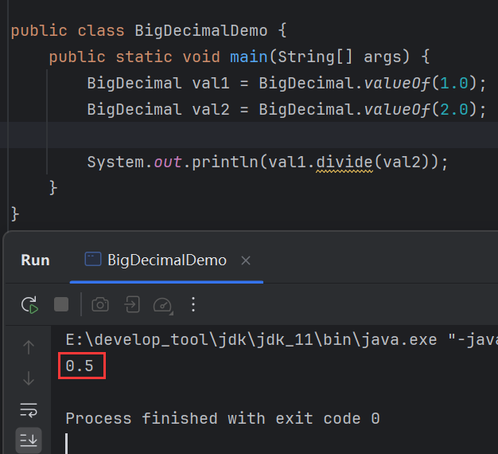

### 无法除尽

针对无法除尽的数，比如10 / 3，是除不尽的：

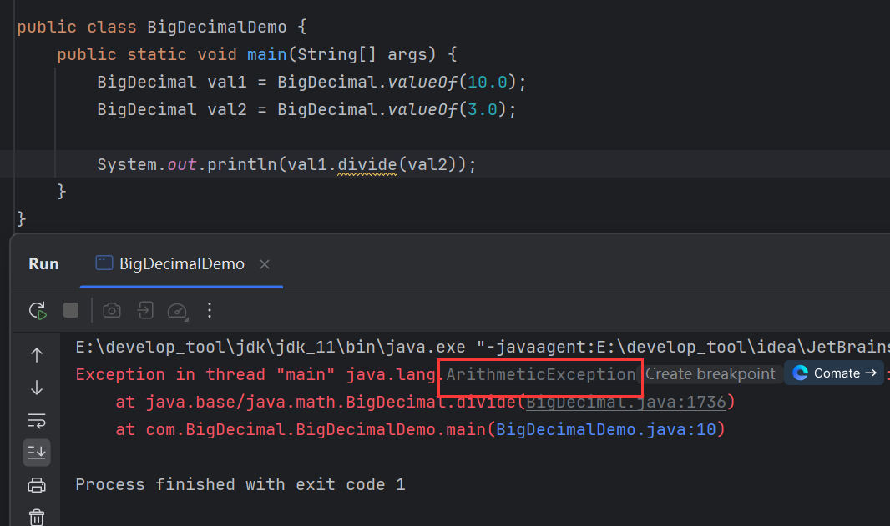

直接采用`divide()`会报错。这时候就得采用`divide()`的重载：

```java
public BigDecimal divide(
    BigDecimal b,
	int scale, 
    int roundingMode
);
```

`scale`是精确几位，`roundingMode`是舍入模式，常用的模式有：

|         模式         |             解释              |
| :------------------: | :---------------------------: |
| RoundingMode.HALF_UP |           四舍五入            |
|   RoundingMode.UP    | 舍去精确位之后的数，并向前进1 |
|  RoundingMode.DOWN   |    直接舍去精确位之后的数     |

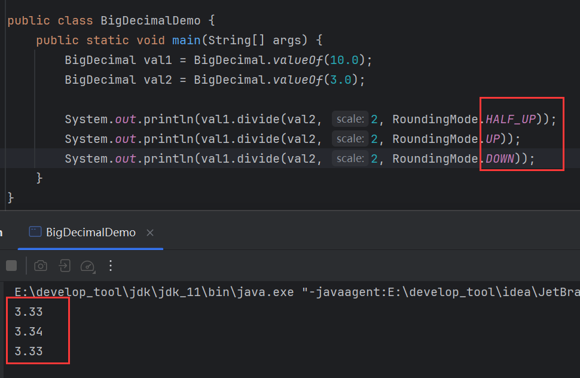

在示例中，指定精确位为2，`HALF_UP`表示四舍五入，所以结果为3.33。`UP`表示舍去精确位后的数，并向前进1，精确位为2，于是保留前2位小数，并在最后位数上+1。`DOWN`表示直接舍去精确位之后的数，精确位为2，于是保留前2位小数，舍去剩下的小数。

## doubleValue()

```java
public double doubleValue(){};
```

> 将`BigDecimal`转换为`double`。

`BigDecimal`的四则运算返回的都是`BigDecimal`，而一些方法不会接收`BigDecimal`，而是接收`double`，所以`doubleValue()`能将其转换为`double`类型：

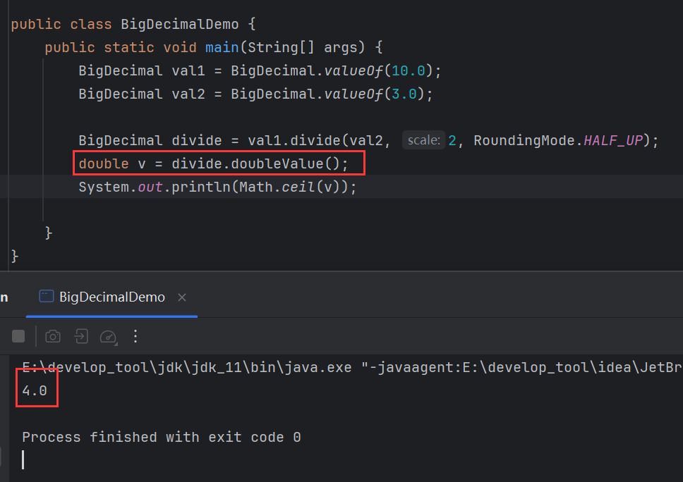