# 包装类

> 将**基本数据类型**，包装成**类**(变成引用数据类型)

## 好处

> 1. 将基本数据类型转换为类，就可以调用其中的方法更加方便的完成一些事。

比如，将数字字符串转换成数字，或者计算除10进制数的其他进制表示，都能直接调用包装类的方法来完成。

## 8大包装类

| 基本数据类型 | 引用数据类型 |
| ------------ | ------------ |
| byte         | Byte         |
| short        | Short        |
| int          | Integer      |
| long         | Long         |
| char         | Character    |
| float        | Float        |
| double       | Double       |
| boolean      | Boolean      |

除`int`和`char`以外，其他都是首字母大写。


# Integer

下面以`Integer`为例讲解包装类，其他类的方法大同小异，配合API文档能更清晰的理解。

## 手动包装成Integer

> 1. **手动装箱**：调用方法，手动将基本数据类型，包装成类。
> 2. **手动拆箱**：调用方法，手动将包装类转换成基本数据类型。

将基本数据类型，手动包装为类：

1. 通过构造方法：

   ```java
   public Integer(int value){};
   ```

2. 通过静态方法`valueOf()`：

   ```java
   public static Integer valueOf(int value){};
   ```

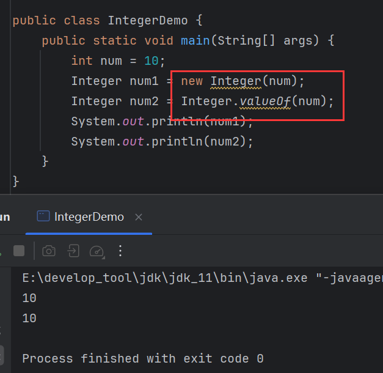

通过构造方法包装已经过时了，所以如果需要手动包装成`Integer`，推荐使用`valueOf()`。

## 手动拆箱

```java
public int intValue(){};
```

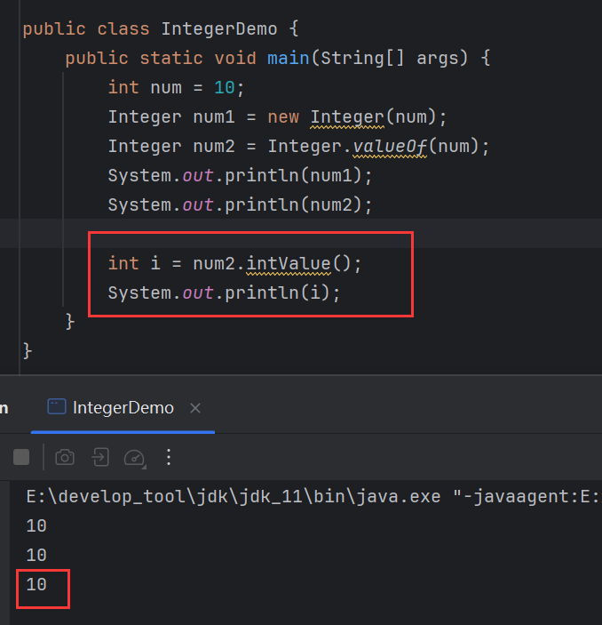

## 自动装箱/拆箱

> 从JDK1.5开始，出现了自动装箱/拆箱：
>
> 1. **自动装箱**：将基本数据类型直接赋值给包装类变量。
> 2. **自动拆箱**：将包装类直接赋值给基本数据类型变量。

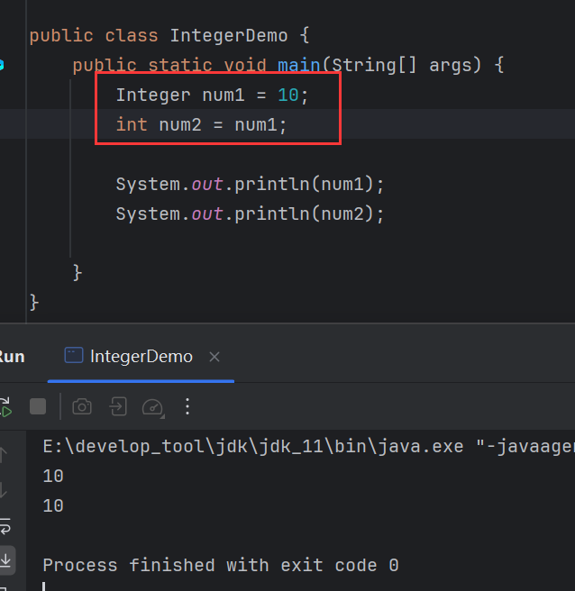

## toBinaryString()

```java
public static String toBinaryString(int i){};
```

> 将`int`转换为**2进制**，以字符串返回。

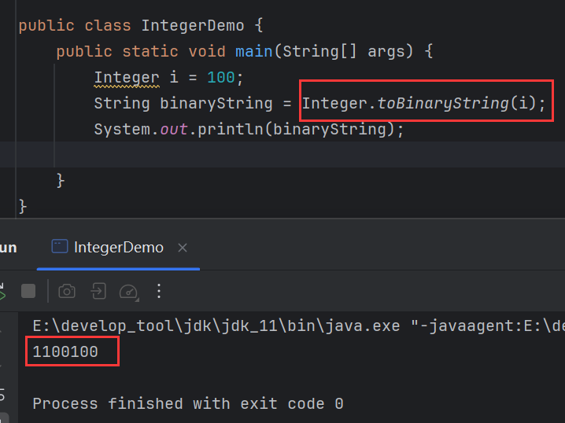

## toOctalString()

```java
public static String toOctalString(int i){};
```

> 将`int`转换为**8进制**，以字符串返回。

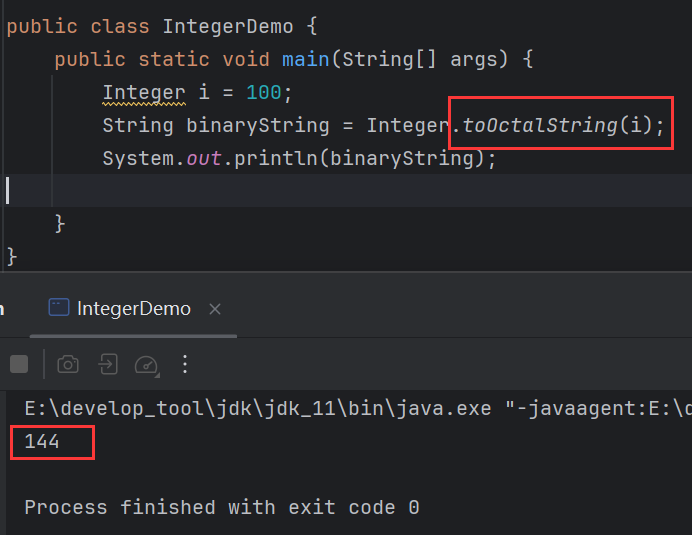

## toHexString()

```java
public static String toHexString(int i){};
```

> 将`int`转换为**16进制**，以字符串返回。

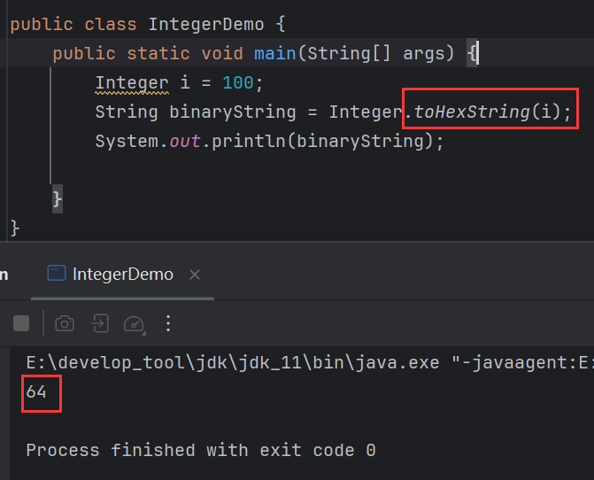

## parseInt()

```java
public static int parseInt(String s){};
```

> 将数字字符串转换成数字。

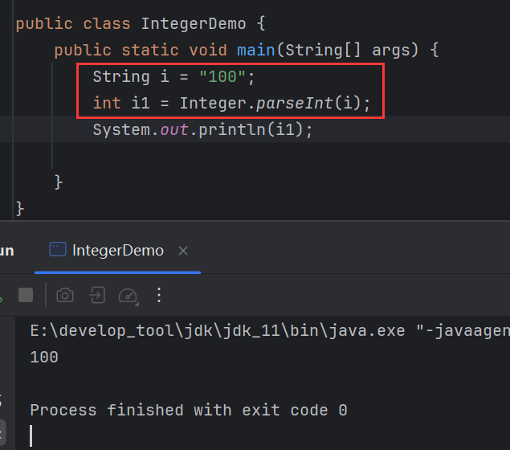

## 案例

己知字符串String s = "10,50,30,20,40"，请将该字符串转换为整数并存入数组
随后求出最大值打印在控制台：

```java
public static void main(String[] args) {
    String s = "10,50,30,20,40";
    String[] split = s.split(",");
    // 转换成整数数组
    int[] arr = new int[split.length];
    for (int i = 0; i < split.length; i++) {
        arr[i] = Integer.parseInt(split[i]);
    }
    // 求最大值
    int max = arr[0];
    for (int i = 1; i < arr.length; i++) {
        if (arr[i] > max) max = arr[i];
    }
    System.out.println(max);
}
```

## 自动装箱范围

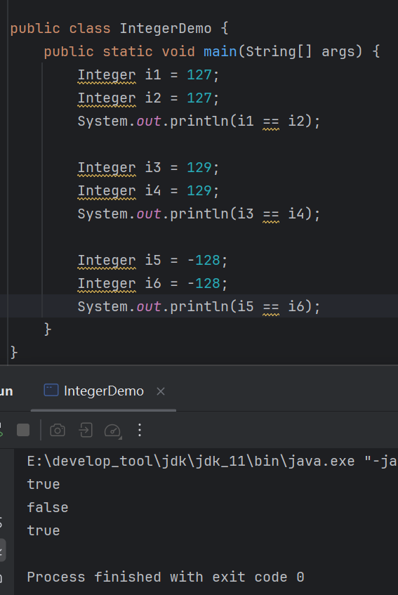

在这段代码材料中，分别比较了127，129和-128，得到的结果是`true`、`false`、`true`。自动装箱也是在创建对象，为什么127和-128是`true`呢？

自动装箱的底层是系统调用了`valueOf()`，而`valueOf()`底层实现是这样的：

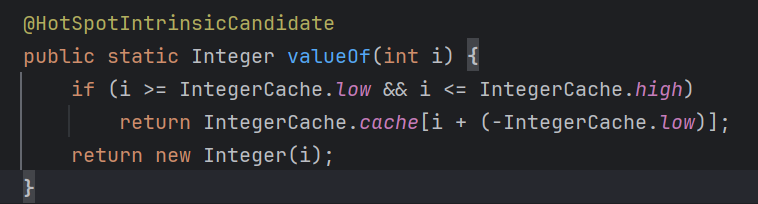

这个方法中，首先判断了数字的范围：

```java
i >= IntegerCache.low && i <= IntegerCache.high
```

而`IntegerCache.low`和`IntegerCache.high`分别是-128和127：

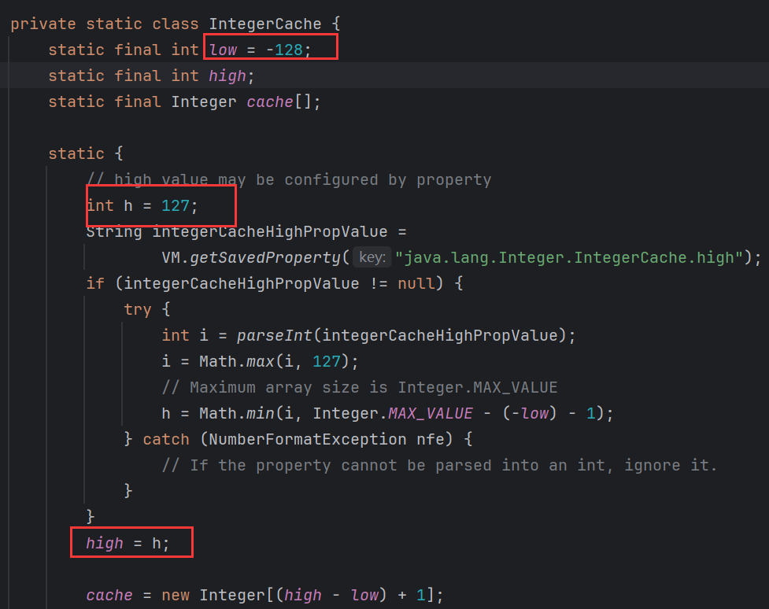

如果数字在[-128, 127]之间，那么走这段逻辑：

```java
return IntegerCache.cache[i + (-IntegerCache.low)];
```

很明显`cache`是一个数组，而且装的是`Integer`对象：

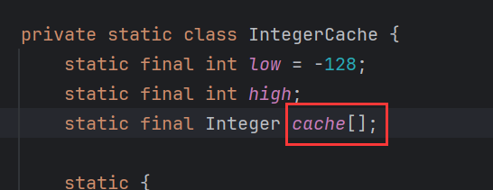

这段逻辑就是通过`i`与`IntegerCache.low`也就是-128计算出索引取出对应的值，假设传入的数字是127，那么`i`为127，计算得127 -(-128) = 255，即取出`cache[255]`的值，第二次转入的数字也是127，即也会取出`cache[255]`的值，所以两次既然都取出了同一个`Integer`对象，那么地址值自然相等，`==`比较自然也相等。

如果数字不是这个范围，那么走这段逻辑：

```java
return new Integer(i);
```

有`new`两次地址值自然不相等，所以`==`比较自然不等。

> 1. 自动装箱，或者说`valueOf()`的范围为：[-128, 127]，在这个范围外，会重新创建对象返回，在这个范围内，不会创建对象，而是从底层的缓存数组中取出一个提前创建好的`Integer`对象返回。
> 2. `Integer`类中，底层存在一个长度为256的`Integer`数组，名为`cache`，它存储了256个`Integer`对象，分别是-128 - 127，以及一个0。
