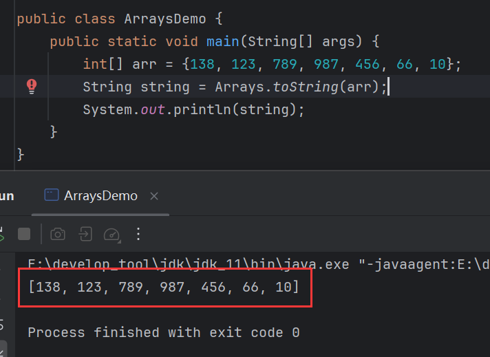
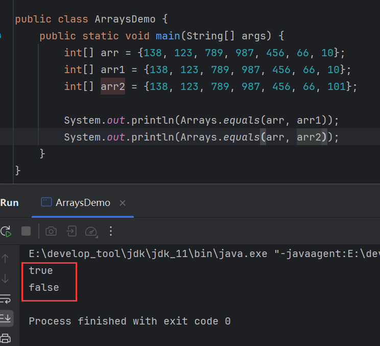
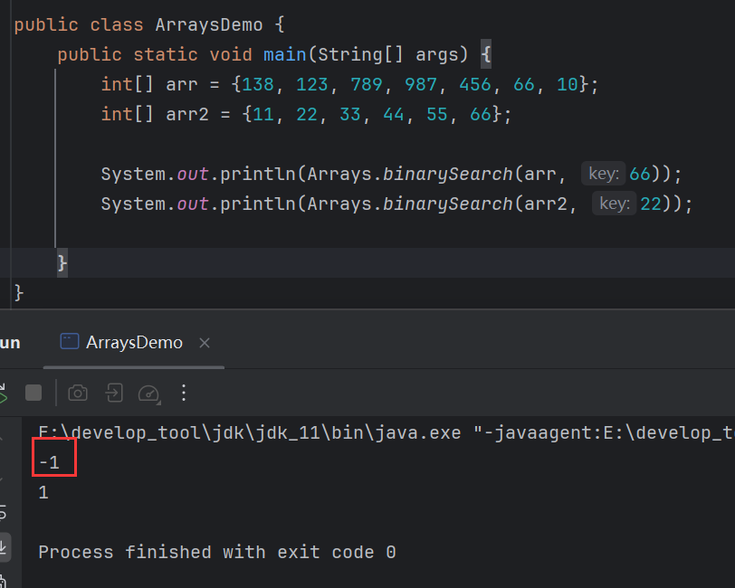
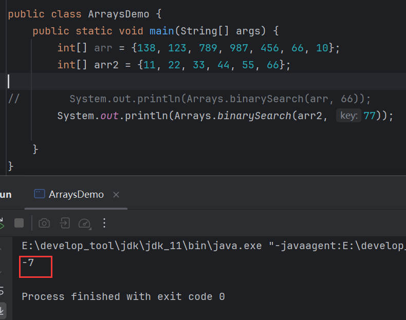
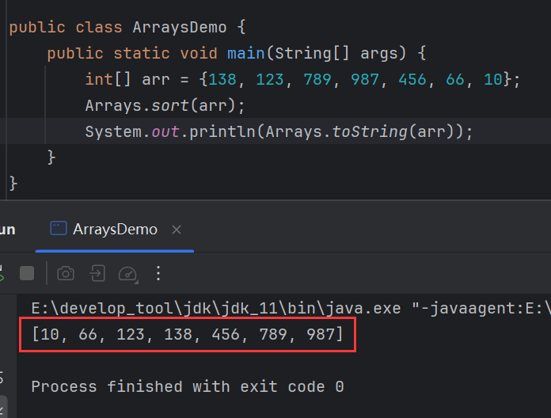
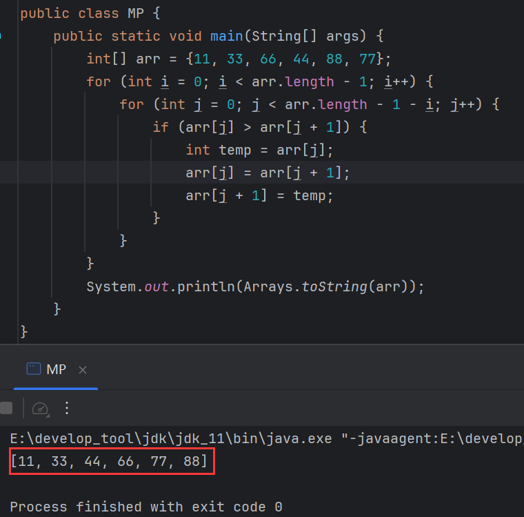
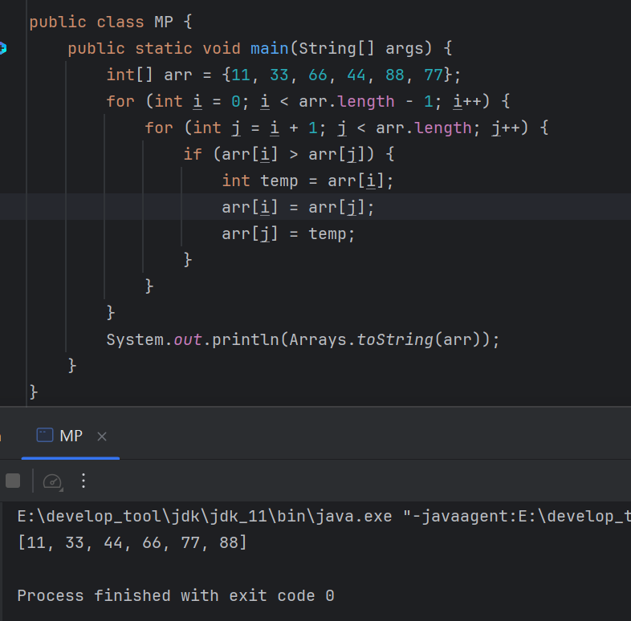
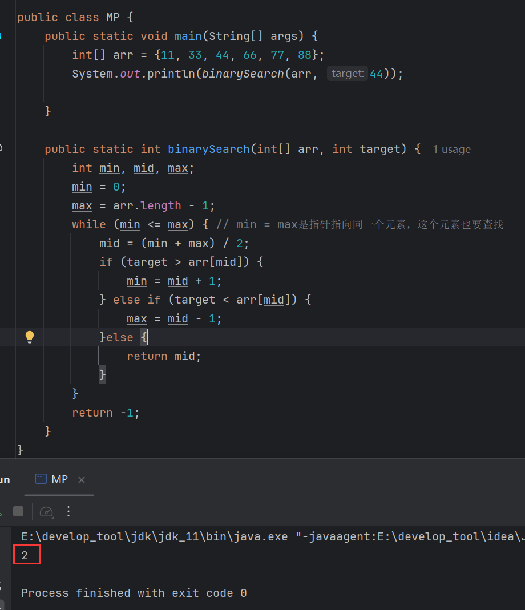
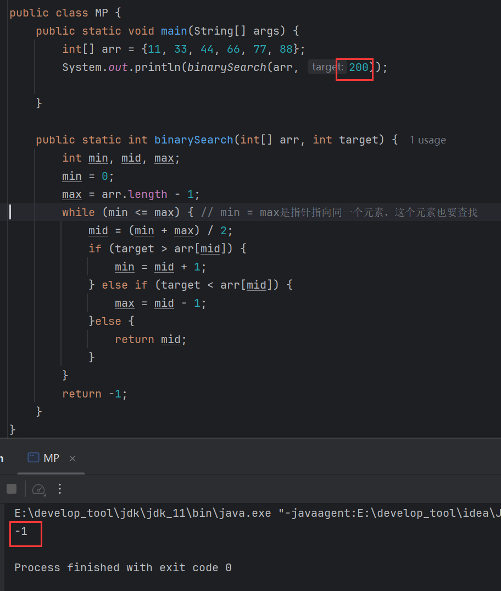

# Arrays

> 数组操作工具类，专门用于操作数组元素。

## toString()

```java
public static String toString(类型[] a){};
```

> 将数组元素拼接为带有格式的字符串。



这就是带有格式的数组：

```java
[138, 123, 789, 987, 456, 66, 10]
```

## equals()

```java
public static boolean toString(类型[] a, 类型[] b){};
```

> 比较两个数组内容是否相同。



## binarySearch()

```java
public static int binarySearch(int[] a, int key){};
```

> 查找元素在数组中的索引，该方法使用二分查找法，需要保证数组是排好序的，否则将大概率返回错误索引。



`binarySearch()`返回的错误索引的计算公式为：(-插入点) - 1。什么意思呢？`binarySearch()`内部用的是二分查找，而二分查找需要保证数组是排好序的，所以在这个方法中会按照排序的逻辑来查找数字的索引，这个案例中传入的是66，它比二分987小，所以在左边继续二分得123，比之小，二分得138，比之小无法再二分了，也就是没有找到，而当发现没有找到时，由于66<138，因此该方法判断如果66存在那么应该在138的位置也就是0号索引，这个判断出来的索引就是插入点，由公式计算得-1，因此返回-1。

再举个例子：



在该数组中没有77元素：

```java
[11, 22, 33, 44, 55, 66]
```

也就是找不到该元素，而由于二分后，方法判断77如果存在，那么应该在66后面，所以它的索引应该为6，即插入点为6，因此才算出 (-6) - 1 = -7。

因此，如果`binarySearch()`返回的是负数，那就代表找不到元素或者数组未排序。

## sort()

```java
public static void sort(类型[] a){};
```

> 对数组进行排序，默认升序。



**注意**：如果一个数组是乱序的，用`sort()`排序后，再去用`binarySearch()`可能会出现错误，比如一开始这个元素在1号索引，排序后变到了0号索引，那么查找出来的索引就是0，并不是1，因为数组在排序的时候，被查找的元素就已经打乱位置了。因此`binarySearch()`需要保证所操作的数组，一开始就是排好序的。


# 冒泡排序

> 相邻的两个数进行比较，如果第一个比第二个大，就交换。

第一轮比较会将最大的数找出来，放到数组的最右边，然后继续查找第二轮找出第二大的数，依次执行下去，如果数组的长度为n，那么，总共查询n - 1轮，每轮比较n - j次，j为当前轮次。

假设数组长度为5，那么其比较详情为：

| 轮次 | 比较1次        | 比较2次        | 比较3次        | 比较4次        | 总次数 |
| ---- | -------------- | -------------- | -------------- | -------------- | ------ |
| 1    | arr[0]比arr[1] | arr[1]比arr[2] | arr[2]比arr[3] | arr[3]比arr[4] | 4      |
| 2    | arr[0]比arr[1] | arr[1]比arr[2] | arr[2]比arr[3] | ❌              | 3      |
| 3    | arr[0]比arr[1] | arr[1]比arr[2] | ❌              | ❌              | 2      |
| 4    | arr[0]比arr[1] | ❌              | ❌              | ❌              | 1      |

这种结构可以用嵌套循环处理，外层循环是轮次，内层循环是比较次数：

```java
int[] arr = {11, 33, 66, 44, 88, 77};
// 外层循环控制轮次，总共循环n - 1轮，n为数组长度
for (int i = 0; i < arr.length - 1; i++) {
    // 内层循环控比较环次数，每轮比较次数为n - j次，j为轮次
    for (int j = 0; j < arr.length - 1 - i; j++) {
        if (arr[j] > arr[j + 1]) {
            int temp = arr[j];
            arr[j] = arr[j + 1];
            arr[j + 1] = temp;
        }
    }
}
```




# 选择排序

> 从0索引开始，拿着每一个索引上的元素跟后面的元素依次比较。

第一轮，从0索引开始与后面的元素依次比较，在第一轮中只用0索引与其他元素比较，如果0索引小不交换，反之交换，第一轮完成后，可以确定最小的元素。

第二轮同理，从1索引开始，只用1索引与后面的元素依次比较，确定第二小的元素。以此类推。

最终，一共比较n - 1轮，n为数组长度，每轮比较n - j次，j为当前轮次。

假设数组长度为5，那么其比较详情为：

| 轮次 | 比较1次        | 比较2次        | 比较3次        | 比较4次        | 总次数 |
| ---- | -------------- | -------------- | -------------- | -------------- | ------ |
| 1    | arr[0]比arr[1] | arr[0]比arr[2] | arr[0]比arr[3] | arr[0]比arr[4] | 4      |
| 2    | arr[1]比arr[2] | arr[1]比arr[3] | arr[1]比arr[4] | ❌              | 3      |
| 3    | arr[2]比arr[3] | arr[0]比arr[4] | ❌              | ❌              | 2      |
| 4    | arr[3]比arr[4] | ❌              | ❌              | ❌              | 1      |

观察表格，左边的数，其索引的规律为：

第一轮：arr[0]	arr[0]	arr[0]	arr[0]

第二轮：arr[1]	arr[1]	arr[1]

第三轮：arr[2]	arr[2]	

第四轮：arr[3]	

与轮次有关，为当前轮次 - 1。

而右边的数，其索引规律为：

第一轮：arr[1]	arr[2]	arr[3]	arr[4]

第二轮：arr[2]	arr[3]	arr[4]

第三轮：arr[3]	arr[4]	

第四轮：arr[4]	

索引的开始与轮次相等。

结构与冒泡一致，用嵌套循环：

```java
int[] arr = {11, 33, 66, 44, 88, 77};
// 外层循环控制轮次，总共循环n - 1轮，n为数组长度
for (int i = 0; i < arr.length - 1; i++) {
    /*
    	内层循环控制比较次数，每轮比较次数为n - 当前轮次
    	左边的数的索引为当前轮次 - 1，当前轮次为i + 1，索引为i
    	右边的数起始索引为当前轮次i + 1
    */ 
    for (int j = i + 1; j < arr.length; j++) {
        if (arr[i] > arr[j]) {
            int temp = arr[i];
            arr[i] = arr[j];
            arr[j] = temp;
        }
    }
}
```




# 二分查找

> 查找元素在数组中的索引，每次折半查找，前提是数组是有序的。

二分的思路是准备3个指针，分别为`min`、`max`和`mid`。`min`记录左边界， `max`记录右边界，而`mid`记录每次二分过后的索引，在一开始，`min`记录0号索引，`max`记录最终索引。每次二分由`min`和`max`计算出`mid`，由于Java的整数运算不会得到小数，所以偶数二分取下位，如4.5取4。然后将目标值与`arr[mid]`对比，如果比`arr[mid]`小，那么只考虑`arr[mid]`左边的部分，`max`需要改变位置，指向`mid`-1，反之则考虑`arr[mid]`右边部分，改变`min`位置，指向`mid`+1，如果相等则直接返回`mid`。存在一种情况是当前`min`或`max`经过二分后指向同一个位置，那么`mid`也会指向该位置，这种情况也需要考虑。当`min`或`max`经过变化导致`min`>`max`时，停止查找，如果这时候都未找到，则返回-1。

```java
int min, mid, max;
min = 0; 								// 起始索引
max = arr.length - 1;					// 结束索引
while (min <= max) { 					// min = max是指针指向同一个元素，这个元素也要查找
    mid = (min + max) / 2;				// 中间索引
    if (target > arr[mid]) {
        min = mid + 1;					// 中间值比目标值小，min指向中间值下一位
    } else if (target < arr[mid]) {
        max = mid - 1;					// 中间值比目标值大，max指向中间值上一位
    }else {
        return mid;
    }
}
return -1;
```



找不到：

