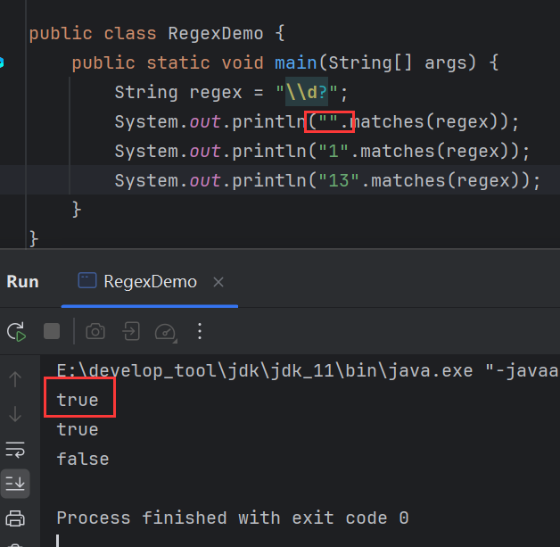

# 正则表达式

> 本质是字符串，只不可以在这个字符串中指定规则，用规则来校验其他数据。

## 规则

1、**字符类**(默认匹配**一个**字符)：

| 规则           | 说明                                 |
| -------------- | ------------------------------------ |
| [abc]          | 只能是a，b，或c                      |
| [^abc]         | 除了a，b，c之外的任何字符            |
| [a-zA-Z]       | a到z，A到Z，包括（范围)              |
| [a-d[m-p]]     | a到d，或m到p，同[a-dm-p]             |
| [a-z&&[def]]   | d，e，或f，即a-z与def的交集，同[def] |
| [a-z&&\[^bc]]  | a到z，除了b和c：同[ad-z]             |
| [a-z&&\[^m-p]] | a到z，除了m到p：同[a-lq-z]           |

2、**预定义的字符类**(默认匹配**一个**字符)

| 规则 | 说明                             |
| ---- | -------------------------------- |
| .    | 任何字符                         |
| \d   | 一个数字：[0-9]                  |
| \D   | 非数字：\[^0-9]                  |
| \s   | 一个空白字符串：[\t\n\x0B\f\r]   |
| \S   | 非空白字符串：\[^\s]             |
| \w   | [a-zA-Z_0-9]：英文、数字、下划线 |
| \W   | [^\w]一个非单词字符串            |

3、**贪婪的量词**(配合匹配**多个**字符)

| 规则   | 说明                    |
| ------ | ----------------------- |
| x?     | x，一次或根本不         |
| x*     | x，零次或多次(任意次数) |
| x+     | x，一次或多次           |
| x{n}   | x，正好n次              |
| x{n, } | x，至少n次              |
| x{n,m} | x，至少n但不超过m次     |

## matches()

```java
public boolean matches(String regex){};
```

> `String`类的方法，校验字符串是否匹配定义的正则规则，匹配返回`true`、否则返回`false`。

## 演示

1、[abc]，只能是a，b，或c：


`[]`表示只匹配一个字符，如果不加`[]`，则严格按照定义的字符个数匹配：


这等效于\[a]\[b][c]：


2、\[^abc]，^代表异或，有取反之意：


3、[a-zA-Z]，a到z，A到Z：


4、[a-zA-Z0-9]，a到z，A到Z，0到9：


5、点，任意字符：


一个点只能匹配一个字符，如果多个字符则不能匹配：


可以多个点：


6、\d，数字：

直接写\d会报错：


因为\是转义的意思，\d表示对d进行转义，但是d没有特殊含义，所以转义会失败，而转义失败就会报错，因此需要再对\进行转义：


7、\D，非数字：


8、\s，空白字符：


9、\S，非空字符：


10、\w，字母、数字和下划线：


11、\W，非字母、数字和下划线：


12、点+，出现任意字符，1一次或多次：


13、x?，出现1次或0次：



14、x*，任意次数：


15、x+，1次或多次，0次不行：


16、x{n}，正好n次：


17、x{n}，至少n次：


18、x{n,m}，n到m次：


## 案例

1、QQ号，规则如下：

1. 不能以0开头
2. 全部都是数字
3. 5-12位

不能以0开头，那么异或取反即^0，且占据第一个位置，而总共5-12位，那么减去开头一共4-11位，且全部是数字，那么开头就不能写成^0，因为无法排除非数字情况，所以最终的规则为：[1-9]\d{4-11}：


2、手机号，规则如下：

1. 必须以1开头
2. 第2位：3 4 5 6 7 8 9
3. 全部是数字，必须是11位

第1位是1，第2位3-9，这就占了两位，全部11位，还剩下9位，且全是数字，那么规则为：1[3-9]\d{9}：


3、邮箱正则，规则如下：

1. 邮箱必须有@
2. @左边可以是数字、大小写字母、_，数量至少一位
3. @右边在.之前，可以是数字、大小写字母，但没有_，数量至少一位
4. 必须有.
5. .右边必须是小写字母，数量至少两位

举几个例子：

zhangSan@itcast.cn

zhangsan@163.com

123456@qq.com

zhangsan@sina.com

zhangsan@itcast.qq.com

zhangsan@xxx.edu

zhangsan@xxx.org

首先，必须要有@，且@左边可以是数字、大小写字母、\_，数量至少一位，那么可以写成：\w+@，然后@右边在.之前，可以是数字、大小写字母，但没有_，数量至少一位，与\w相比少了\_，可以用[a-z&&\[^bc]]规则，取反再做交集即：\w+@[\w&&\[^\_]]+，然后是点，只写点代表任意字符，所以需要转义：\w+@[\w&&\[^\_]]+\\.，.右边必须是小写字母，数量至少两位，所以：\w+@[\w&&\[^\_]]+\\.[a-z]{2,3}，但是还没有完，因为有特殊的情况比如这个邮箱：

zhangsan@itcast.qq.com，出现了.qq.com，其实可以将.qq和.com，分成两个组，观察这两个组他们的规则都是\\.[a-z]{2,3}，其至少存在一组，而正则中可以用()来分组，所以最终的规则为：\w+@[\w&&\[^\_]]+(\\.[a-z]{2,3})+：

