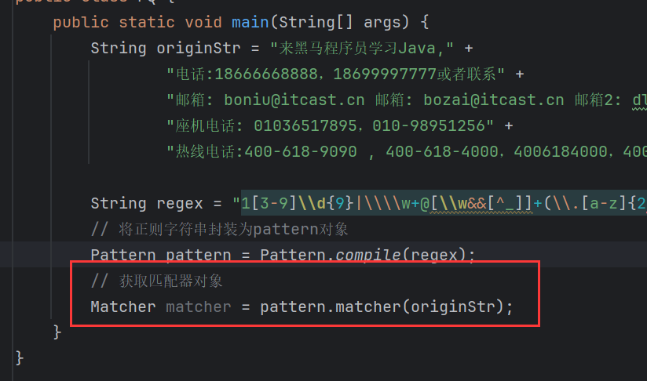
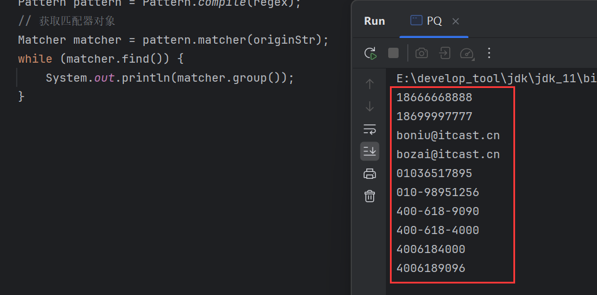

# 正则表达式

> 本质是字符串，只不可以在这个字符串中指定规则，用规则来校验其他数据。

## 规则

1、**字符类**(默认匹配**一个**字符)：

| 规则           | 说明                                 |
| -------------- | ------------------------------------ |
| [abc]          | 只能是a，b，或c                      |
| [^abc]         | 除了a，b，c之外的任何字符            |
| [a-zA-Z]       | a到z，A到Z，包括（范围)              |
| [a-d[m-p]]     | a到d，或m到p，同[a-dm-p]             |
| [a-z&&[def]]   | d，e，或f，即a-z与def的交集，同[def] |
| [a-z&&\[^bc]]  | a到z，除了b和c：同[ad-z]             |
| [a-z&&\[^m-p]] | a到z，除了m到p：同[a-lq-z]           |

2、**预定义的字符类**(默认匹配**一个**字符)

| 规则 | 说明                             |
| ---- | -------------------------------- |
| .    | 任何字符                         |
| \d   | 一个数字：[0-9]                  |
| \D   | 非数字：\[^0-9]                  |
| \s   | 一个空白字符串：[\t\n\x0B\f\r]   |
| \S   | 非空白字符串：\[^\s]             |
| \w   | [a-zA-Z_0-9]：英文、数字、下划线 |
| \W   | [^\w]一个非单词字符串            |

3、**贪婪的量词**(配合匹配**多个**字符)

| 规则   | 说明                    |
| ------ | ----------------------- |
| x?     | x，一次或0次            |
| x*     | x，零次或多次(任意次数) |
| x+     | x，一次或多次           |
| x{n}   | x，正好n次              |
| x{n, } | x，至少n次              |
| x{n,m} | x，至少n但不超过m次     |

## matches()

```java
public boolean matches(String regex){};
```

> `String`类的方法，校验字符串是否匹配定义的正则规则，匹配返回`true`、否则返回`false`。

## 演示

1、[abc]，只能是a，b，或c：


`[]`表示只匹配一个字符，如果不加`[]`，则严格按照定义的字符个数匹配：


这等效于\[a]\[b][c]：


2、\[^abc]，^代表异或，有取反之意：


3、[a-zA-Z]，a到z，A到Z：


4、[a-zA-Z0-9]，a到z，A到Z，0到9：


5、点，任意字符：


一个点只能匹配一个字符，如果多个字符则不能匹配：


可以多个点：


6、\d，数字：

直接写\d会报错：


因为\是转义的意思，\d表示对d进行转义，但是d没有特殊含义，所以转义会失败，而转义失败就会报错，因此需要再对\进行转义：


7、\D，非数字：


8、\s，空白字符：


9、\S，非空字符：


10、\w，字母、数字和下划线：


11、\W，非字母、数字和下划线：


12、点+，出现任意字符，1一次或多次：


13、x?，出现1次或0次：


14、x*，任意次数：


15、x+，1次或多次，0次不行：


16、x{n}，正好n次：


17、x{n}，至少n次：


18、x{n,m}，n到m次：


## 案例

1、QQ号，规则如下：

1. 不能以0开头
2. 全部都是数字
3. 5-12位

不能以0开头，那么异或取反即^0，且占据第一个位置，而总共5-12位，那么减去开头一共4-11位，且全部是数字，那么开头就不能写成^0，因为无法排除非数字情况，所以最终的规则为：[1-9]\d{4-11}：


2、手机号，规则如下：

1. 必须以1开头
2. 第2位：3 4 5 6 7 8 9
3. 全部是数字，必须是11位

第1位是1，第2位3-9，这就占了两位，全部11位，还剩下9位，且全是数字，那么规则为：1[3-9]\d{9}：


3、邮箱正则，规则如下：

1. 邮箱必须有@
2. @左边可以是数字、大小写字母、_，数量至少一位
3. @右边在.之前，可以是数字、大小写字母，但没有_，数量至少一位
4. 必须有.
5. .右边必须是小写字母，数量至少两位

举几个例子：

```
zhangSan@itcast.cn

zhangsan@163.com

123456@qq.com

zhangsan@sina.com

zhangsan@itcast.qq.com

zhangsan@xxx.edu

zhangsan@xxx.org
```

首先，必须要有@，且@左边可以是数字、大小写字母、\_，数量至少一位，那么可以写成：\w+@，然后@右边在.之前，可以是数字、大小写字母，但没有_，数量至少一位，与\w相比少了\_，可以用[a-z&&\[^bc]]规则，取反再做交集即：\w+@[\w&&\[^\_]]+，然后是点，只写点代表任意字符，所以需要转义：\w+@[\w&&\[^\_]]+\\.，.右边必须是小写字母，数量至少两位，所以：\w+@[\w&&\[^\_]]+\\.[a-z]{2,3}，但是还没有完，因为有特殊的情况比如这个邮箱：

zhangsan@itcast.qq.com，出现了.qq.com，其实可以将.qq和.com，分成两个组，观察这两个组他们的规则都是\\.[a-z]{2,3}，其至少存在一组，而正则中可以用()来分组，所以最终的规则为：\w+@[\w&&\[^\_]]+(\\.[a-z]{2,3})+：


# String类中与正则有关的方法

| 方法名       | 作用                                                         |
| ------------ | ------------------------------------------------------------ |
| split()      | 按照正则表达式匹配的内容进行分割字符串，反回一个字符串数组。 |
| replaceAll() | 按照正则表达式匹配的内容进行替换。                           |

## split()

```java
public String[] split(String regex){};
```

`split()`其实转入的不是简单的字符串，而是一个正则表达式字符串，它会根据正则表达式来匹配，切割匹配字串左右两边的字串，并形成新数组返回。

## replaceAll()

```java
public String replaceAll(String regex, String newStr){};
```

> 按照正则表达式匹配的内容进行替换。

`replaceAll()`对满足正则表达式的字串做替换，会替换成传入的第二个参数，也就是`newStr`。

比如，对数字做替换：


# 正则爬取

从一段文本中爬取出需要的数据，比如这段文本：

```
"来黑马程序员学习Java， 
 电话:18666668888，18699997777或者联系
 邮箱: boniu@itcast.cn 邮箱: bozai@itcast.cn 邮箱2: dlei00090163.com
 座机电话: 01036517895，010-98951256
 热线电话:400-618-9090 , 400-618-4000，4006184000，4006189096"
```

从中爬取出以下信息：

```
18666668888
18699997777
boniu@itcast.cn
bozai@itcast.cn
dlei00090163.com
01036517895
010-98951256
400-618-9090
400-618-4000
4006184000
4006189096
```

那么就可以定义一个满足目标内容的正则表达式，取匹配这些内容，然后将其爬取出来。

那么首先需要定义满足这些内容的正则规则，先从手机号开始：

```java
String regex = "1[3-9]\\d{9}";
```

然后是邮箱：

```java
String regex = "\\w+@[\\w&&[^_]]+(\\.[a-z]{2-3})+";
```

两者结合，能够满足同时匹配手机号和邮箱，且手机号和邮箱并非同时匹配，这符合或运算，在正则中可以使用`|`符号：

```java
String regex = "1[3-9]\\d{9}|\\w+@[\\w&&[^_]]+(\\.[a-z]{2-3})+";
```

座机电话，规则如下：

1. 以0开头
2. 前3位或前4位是区号
3. 区号后面可以跟上-
4. 后面跟上7-8位数字

所以其正则规则为：

```java
String regex = "0\\d{2,3}-?\\d{7,8}";
```

最后是热线电话，其规则如下：

1. 以400开头
2. 400后可以加-
3. 后面跟上3次数字
4. 3次数字后面可以加-
5. 后跟上4为数字

所以其正则规则为：

```java
String regex = "400-?\\d{3}-?\\d{4}";
```

综上，完整的正则规则如下：

```java
String regex = "1[3-9]\\d{9}|\\w+@[\\w&&[^_]]+(\\.[a-z]{2-3})+|0\\d{2,3}-?\\d{7,8}|400-?\\d{3}-?\\d{4}";
```

在正式爬取之前，先介绍一个类。

# Pattern类

> `Pattern`类，专门为正则表达式做了封装。其指定为正则表达式的编译表示形式，可以简单的理解为，正则表达式类。

## compile()

```java
public static compile(String regex){};
```

> 接收一个正则字符串，返回`Pattern`对象，即将正则表达式字符串封装成`Pattern`对象。


为什么一定要封装成`Pattern`对象？

因为这样就可以调用`Pattern`对象`matcher()`，一个专门用于做匹配的方法。

## matcher()

```java
public Matcher matcher(String content){};
```

> 用于返回一个匹配器对象`Matcher`，只有`Matcher`才有爬取的方法。它接受字符串参数，这个参数表示需要被爬取的内容。

根据被爬取内容创建`Matcher`：



### find()

```java
public boolean find(){};
```

> 查找被爬取的内容是否存在满足正则表达式的数据，存在返回`true`，不存在返回`false`。


### group()

```java
public String group(){};
```

> 爬取出满足正则表达式的内容，一次只返回一个内容，即调用一次，返回一个。

调用一次：


调用多次：


发现获取的都是同一个内容，这是因为`group()`不能单独使用，它必须配合`find()`使用，如果单独使用`group()`，会报错：


`group()`配合`find()`，由`find()`先找到内容，再通过`group()`返回内容，也就是说每一次调用`group()`之前，都得先调用`find()`，上面的演示中，由于只调用了一次`find()`，所以获取的就是第一个满足的内容，所以后续无论调用多少次`group()`，获取的都是第一个内容，只有再调用一次`find()`让其查找下一个内容，才能返回新的满足内容：


同时还有一个细节如果再调用`group()`之前，已多次调用`find()`，那么`group()`会获取最后一次满足匹配的`find()`：


### 循环爬取

既然`group()`和`find()`是找到一次，获取一次，那么如何知道被爬取内容中有多少满足的内容呢？

先看一个现象，把被爬取内容修改一下：


很明显可以看出，满足的正则规则的内容只有两个，现在查找三次：


第三次，由于没找到所以返回了`false`：


所以，很容易想到用一个`while`循环来遍历查询，这类似于一个迭代器，查找的过程可以看作指针在内容中移动，如果找到就返回`true`没找到就返回`false`：


完整爬取：

