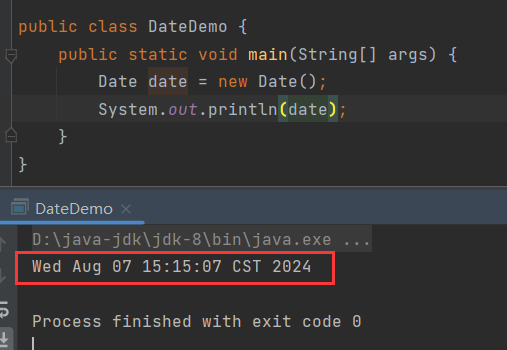
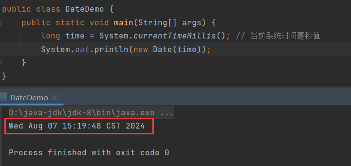
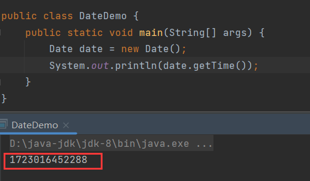
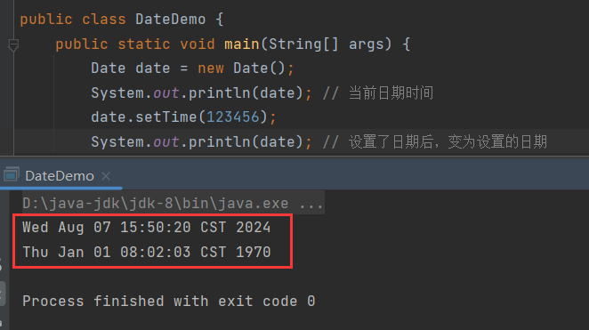
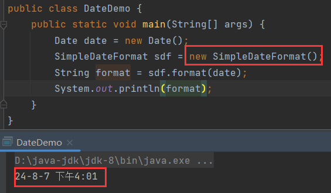
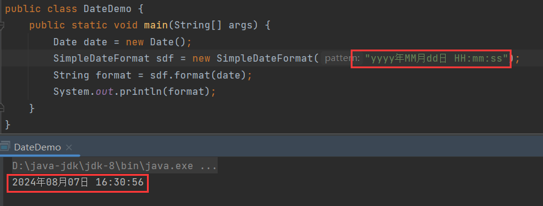
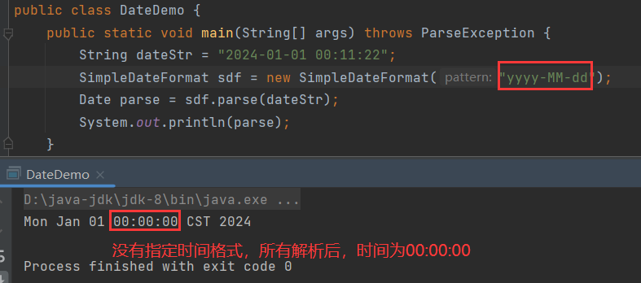
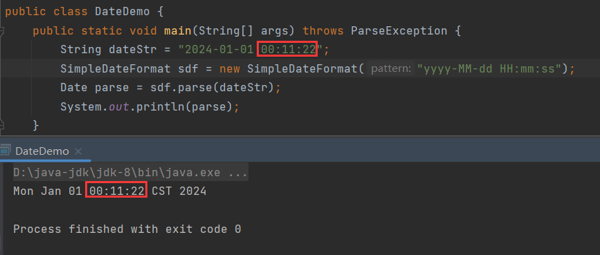
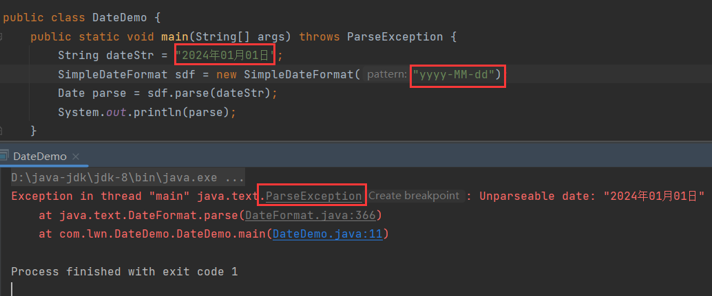
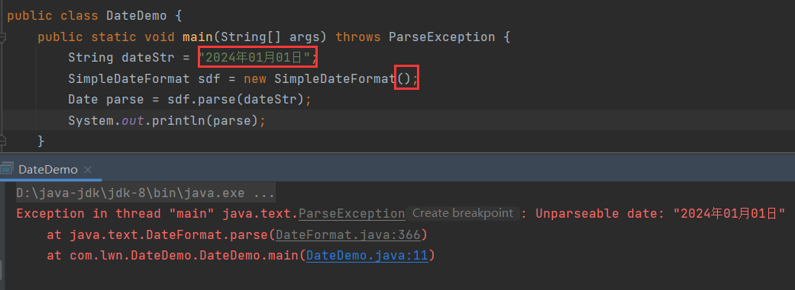

# 旧的时间API

JDK8以前的时间API，常用的有3种：

1. 【Date】
2. 【SimpleDateformat】
3. 【Calendar】


# Date类

> 日期和时间类。

【Date】的常用构造：

1. 创建一个【Date】对象，代表系统当前日期时间：

   ```java
   public Date(){};
   ```

2. 把时间毫秒值转换为【Date】对象：

   ```java
   public Date(long time){};
   ```

无参构造，获取当前系统的日期时间：



将日期毫秒值转换为【Date】对象：



## getTime()

```java
public long getTime(){};
```

> 返回从 1970-01-01 00:00:00 开始到当前时刻的毫秒值。



## setTime()

```java
public void setTime(long time){};
```

> 设置【Date】对象的日期时间，为传入的毫秒值对应的日期时间。



同：

```java
public Date(long time){};
```


# SimpleDateformat类

> 日期格式化。

【SimpleDateformat】的常用构造：

1. 无参构造，格式化模式为默认模式：

   ```java
   public SimpleDateformat(){};
   ```

2. 有参构造，格式化模式为指定模式：

   ```java
   public SimpleDateformat(String pattern){};
   ```

## format()

```java
// 最终方法，不能重写
public final String format(Date date){};
```

> 将日期格式化成日期/时间字符串。

格式化日期，按照默认格式：



使用自定义的格式进行格式化：

```java
"yyyy年MM月dd日 HH:mm:ss"
```



日期时间格式化对照表见下文：日期时间格式化对照表。

## parse()

```java
// 最终方法，不能重写
public final Date parse(String source){};
```

> 将字符串解析为日期类型，该方法会抛出【ParseException】异常。

将日期字符串转换为指定格式的【Date】，首先转换为yyyy-MM-dd：



转为yyyy-MM-dd HH:mm:ss：



转换的格式需要与被转换的日期字符串相匹配，否则就会报错：






# 案例

计算从出生日期开始到现在经过了多少天。


# 日期时间格式化对照表

| 标识符 | 含义                                                         |
| ------ | ------------------------------------------------------------ |
| a      | AM/PM(上午/下午)                                             |
| A      | 0~86399999 (一天的第A微秒)                                   |
| c/cc   | 1~7 (一周的第一天, 周天为1)                                  |
| ccc    | Sun/Mon/Tue/Wed/Thu/Fri/Sat (星期几简写)                     |
| cccc   | Sunday/Monday/Tuesday/Wednesday/Thursday/Friday/Saturday (星期几全拼) |
| d      | 1~31 (月份的第几天, 带0)                                     |
| D      | 1~366 (年份的第几天,带0)                                     |
| e      | 1~7 (一周的第几天, 带0)                                      |
| E~EEE  | Sun/Mon/Tue/Wed/Thu/Fri/Sat (星期几简写)                     |
| EEEE   | Sunday/Monday/Tuesday/Wednesday/Thursday/Friday/Saturday (星期几全拼) |
| F      | 1~5 (每月的第几周, 一周的第一天为周一)                       |
| g      | Julian Day Number (number of days since 4713 BC January 1) 未知 |
| h      | 1~12 (0 padded Hour (12hr)) 带0的时, 12小时制                |
| H      | 0~23 (0 padded Hour (24hr)) 带0的时, 24小时制                |
| k      | 1~24 (0 padded Hour (24hr) 带0的时, 24小时制                 |
| K      | 0~11 (0 padded Hour (12hr)) 带0的时, 12小时制                |
| L/LL   | 1~12 (0 padded Month) 第几月                                 |
| LLL    | Jan/Feb/Mar/Apr/May/Jun/Jul/Aug/Sep/Oct/Nov/Dec 月份简写     |
| LLLL   | January/February/March/April/May/June/July/August/September/October/November/December 月份全称 |
| m      | 0~59 (0 padded Minute) 分钟                                  |
| M/MM   | 1~12 (0 padded Month) 第几月                                 |
| MMM    | Jan/Feb/Mar/Apr/May/Jun/Jul/Aug/Sep/Oct/Nov/Dec              |
| MMMM   | January/February/March/April/May/June/July/August/September/October/November/December |
| q/qq   | 1~4 (0 padded Quarter) 第几季度                              |
| qqq    | Q1/Q2/Q3/Q4 季度简写                                         |
| qqqq   | 1st quarter/2nd quarter/3rd quarter/4th quarter 季度全拼     |
| Q/QQ   | 1~4 (0 padded Quarter) 同小写                                |
| QQQ    | Q1/Q2/Q3/Q4 同小写                                           |
| QQQQ   | 1st quarter/2nd quarter/3rd quarter/4th quarter 同小写       |
| s      | 0~59 (0 padded Second) 秒数                                  |
| S      | (rounded Sub-Second) 未知                                    |
| u      | (0 padded Year) 未知                                         |
| v~vvv  | (General GMT Timezone Abbreviation) 常规GMT时区的编写        |
| vvvv   | (General GMT Timezone Name) 常规GMT时区的名称                |
| w      | 1~53 (0 padded Week of Year, 1st day of week = Sunday, NB: 1st week of year starts from the last Sunday of last year) 一年的第几周, 一周的开始为周日,第一周从去年的最后一个周日起算 |
| W      | 1~5 (0 padded Week of Month, 1st day of week = Sunday) 一个月的第几周 |
| y/yyyy | (Full Year) 完整的年份                                       |
| yy/yyy | (2 Digits Year) 2个数字的年份                                |
| Y/YYYY | (Full Year, starting from the Sunday of the 1st week of year) 这个年份未知干嘛用的 |
| YY/YYY | (2 Digits Year, starting from the Sunday of the 1st week of year) 这个年份未知干嘛用的 |
| z~zzz  | (Specific GMT Timezone Abbreviation) 指定GMT时区的编写       |
| zzzz   | (Specific GMT Timezone Name) Z                               |
| +0000  | (RFC 822 Timezone) 指定GMT时区的名称                         |


# 常用格式化字符

| 字符格式                                                     | 日期格式                                                     |
| ------------------------------------------------------------ | ------------------------------------------------------------ |
| yyyy年MM月dd日 HH时mm分ss秒 EEEE 月份英文简写: MMM 月份英文全拼:MMMM 第q季度 a c | 2017年01月03日 10时22分32秒 Tuesday 月份英文简写: Jan 月份英文全拼:January 第1季度 AM 3 |
| yyyy-MM-dd HH:mm:ss                                          | 2017-01-02 14:06:55                                          |
| yyyy-MM-dd HH:mm                                             | 2017-01-02 14:06                                             |
| yyyy-MM-dd HH                                                | 2017-01-02 14                                                |
| yyyy-MM-dd                                                   | 2017-01-02                                                   |
| HH:mm:ss                                                     | 14:06:55                                                     |
| HH:mm                                                        | 14:06                                                        |
| yyyy年MM月dd日 HH时mm分ss秒SSS毫秒                           | 2017年01月02日 14时06分55秒135毫秒                           |
| yyyy年MM月dd日 HH时mm分ss秒                                  | 2017年01月02日 14时06分55秒                                  |
| yyyy年MM月dd日 HH时mm分                                      | 2017年01月02日 14时06分                                      |
| yyyy年MM月dd日 HH时                                          | 2017年01月02日 14时                                          |
| yyyy年MM月dd日                                               | 2017年01月02日                                               |
| HH时mm分ss秒                                                 | 14时06分55秒                                                 |
| HH时mm分                                                     | 14时06分                                                     |
| dd/MM/yyyy hh:mm:ss aaa                                      | 03/01/2017 10:13:00 AM                                       |
| yyyy-MMMM-dd GGG hh:mm aaa                                   | 017-January-03 AD 10:14 AM                                   |
| yyyy:MM:dd G 'at' HH:mm:ss zzz                               | 2017:01:03 AD at 10:17:10 GMT+8                              |