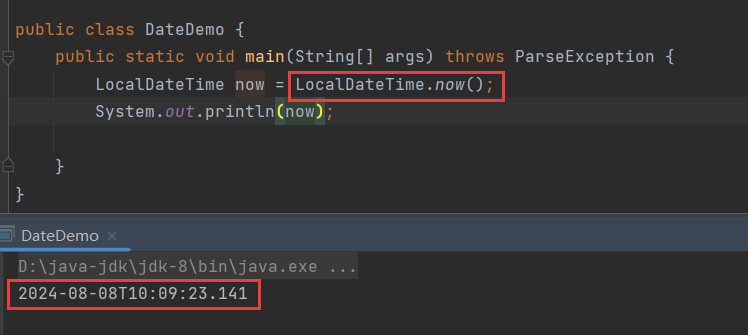
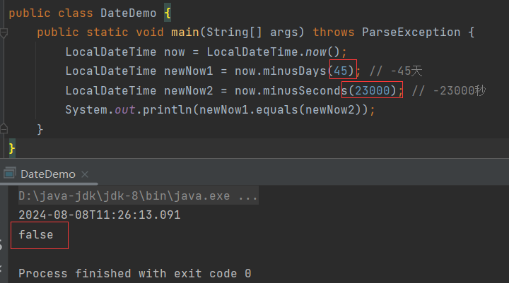

# LocalDateTime

> 代表本地**日期**、**时间**(年、月、日、星期、时、分、秒、纳秒)。

## now()

```java
public static LocalDateTime now(){};
```

> 获取系统的当前日期对应的`LocalDateTime`对象。



## of()

```java
public static LocalDateTime of(
    int year, 
    int month, 
    int dayOfMonth,
	int hour,
	int minute,
	int second){};
```

> 通过传入的年、月、日、时、分、秒获取`LocalDateTime`对象。


# LocalDate

> 代表本地**日期(**年、月、日、星期)。

## now()

```java
public static LocalDate now(){};
```

> 获取系统的当前日期对应的`LocalDate`对象。


## of()

```java
public static LocalDate of(
    int year, 
    int month, 
    int dayOfMonth){};
```

> 通过传入的年、月、日获取`LocalDate`对象。


# LocalTime

> 代表本地**时间**(时、分、秒、纳秒)。

## now()

```java
public static LocalTime now(){};
```

> 获取系统的当前日期对应的`LocalTime`对象。


## of()

```java
public static LocalDate of(
    int year, 
    int month, 
    int dayOfMonth){};
```

> 通过传入的时、分、秒获取`LocalTime`对象。


# toLocalDate()

```java
public LocalDate toLocalDate(){};
```

> `LocalDateTime`转化为`LocalDate`。


# toLocalTime()

```java
public LocalTime toLocalTime(){};
```

> `LocalDateTime`转化为`LocalTime`。


# 获取日期字段

`LocalDateTime`包含的时间范围是最广的，所有接下来只介绍`LocalDateTime`的方法，其他两个类的获取方法一致，只是范围不一样。比如，`LocalDate`只有年月日，所有它不能获取时分秒字段。

## getYear()

```java
public int getYear(){};
```

> 返回年。


## getMonth()

```java
public Month getMonth(){};
```

> 返回月，返回的是`Month`对象。


## getMonthValue()

```java
public int getMonthValue(){};
```

> 返回月，返回月份数字。


getDayOfMonth()

```java
public int getDayOfMonth(){};
```

> 返回一个月中的第几天。


## getHour()

```java
public int getHour(){};
```

> 返回小时。


## getMinute()

```java
public int getMinute(){};
```

> 返回分钟。


## getSecond()

```java
public int getSecond(){};
```

> 返回秒。


## getNano()

```java
public int getNano(){};
```

> 返回纳秒。


## getDayOfYear()

```java
public int getDayOfYear(){};
```

> 返回一年中第几天。


## getDayOfWeek()

```java
public DayOfWeek getDayOfWeek(){};
```

> 返回一周中的第几天，返回的是`DayOfWeek`对象。


可以调用`DayOfWeek`的`getValue()`，将其转换为天数。

### getValue()

```java
public int getValue(){};
```

> 将`DayOfWeek`转为为天数。


# 修改日期字段

> `LocalDateTime`、`LocalDate`、`LocalTime`是不可变对象，所以**修改后**返回的是**新对象**。

## with前缀方法

> `with前缀`的方法，以直接**修改时间**，返回新时间对象。

比如，`withHour()`：直接修改小时、`withMonth()`：直接修改月份：


## plus前缀方法

> `plus前缀`方法，在原时间基础上**加多少时间**，返回新对象。

比如，`plusYears()`：加多少年、`plusHours()`：加多少小时：


## minu前缀方法

> `minu前缀`方法，在原时间基础上**减多少时间**，返回新对象。

比如，`minusDays()`：减多少天、`minusSeconds()`：减多少秒。


## equals()

```java
public boolean equals(本地日期对象 date){};
```

> 判断2个日期对象是否相等。




## isBefore()

```java
public boolean isBefore(本地日期对象 date){};
```

> 判断时期对象是否在传入的日期对象**之前**。


## isAfter()

```java
public boolean isAfter(本地日期对象 date){};
```

> 判断时期对象是否在传入的日期对象**之后**。


