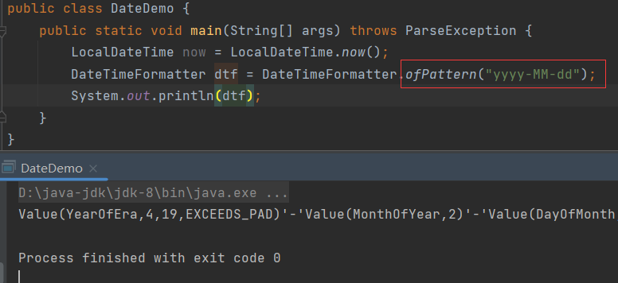
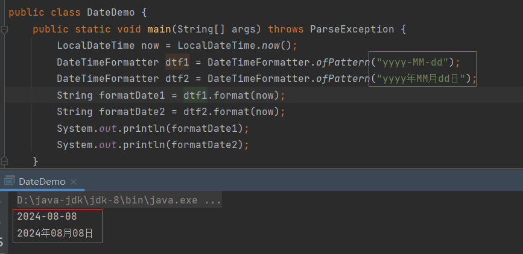
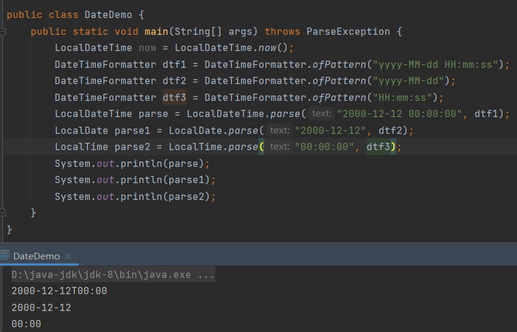
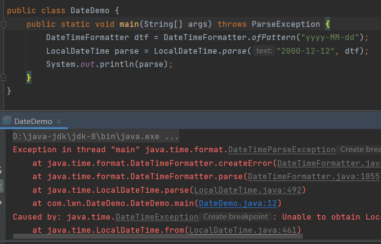
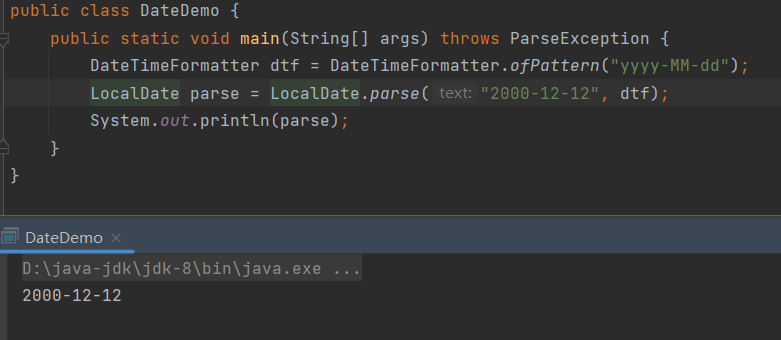

# DateTimeFormatter

> 用于时间的格式化和解析。

## ofPattern()

```java
public static DateTimeFormatter ofPattern(String pattern){};
```

> 通过指定格式返回`DateTimeFormatter`对象。

格式见"8.时间API_旧.md"。



## format()

```java
public String format(本地时间对象 date){};
```

> 按照指定格式格式化本地时间对象，返回字符串。




# parse()

```java
public LocalDateTime parse(
    CharSequence text, 
    DateTimeFormatter dtf){};

public LocalDate parse(
    CharSequence text, 
    DateTimeFormatter dtf){};

public LocalTime parse(
    CharSequence text, 
    DateTimeFormatter dtf){};
```

> 根据定义的`DateTimeFormatter`格式将日期字符串解析为本地日期对象，该方法属于本地日期对象的方法，而非`DateTimeFormatter`的方法。
>
> `CharSequence`是接口，`String`实现了该接口，故可以传入日期字符串。



细节，如果日期是"2000-12-12"，以解析成`LocalDateTime`，就会报错：



因为`LocalDateTime`包含年、月、日、时、分、秒，而此处的日期字符串只有年、月、日，`LocalDateTime`不知道该如何处理时、分、秒，因此报错。

只处理年月应该使用`LocalDate`：



需要通过日期字符串的格式灵活选择三种本地日期对象。