# Instant

> 时间戳类，用于表示时间的对象，类似`Date`。

## now()

```java
public static Instant now(){};
```

> 返回系统当前的时间戳对象，时间不一定准确，因为存在时差。

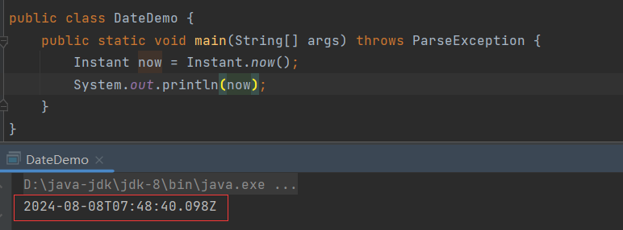

获取的时间是7:48。当前的时间为，由于时差大致的。

## atZone()

```java
public ZonedDateTime atZone(ZoneId zoneId){};
```

> 修正`now()`的时差，通过传入的时区ID对象`ZoneId`来计算准确时间，返回`ZonedDateTime`对象。

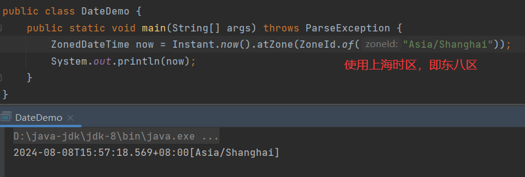

修正后，时间为15:57，当前时间同样是。

## ofEpochMilli()

```java
public Instant ofEpochMilli(long epochMilli){}
```

> 根据毫秒获取`Instant`，从时间原点开始。

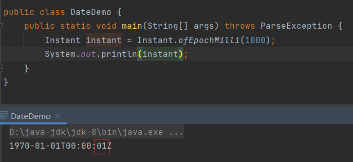

## ofEpochMilli()

```java
public Instant ofEpochSecond(long epochSecond){}
```

> 根据秒获取`Instant`，从时间原点开始。

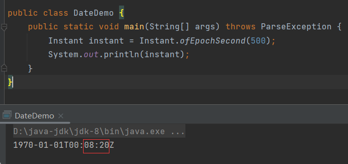

## isBefore()

```java
public boolean isBefore(Instant instant){}
```

> 判断当前时间是否在传入时间之前。

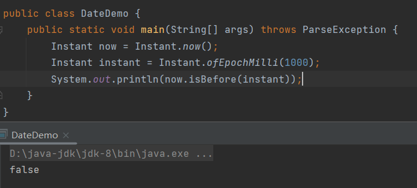

## isAfter()

```java
public boolean isAfter(Instant instant){}
```

> 判断当前时间是否在传入时间之后。

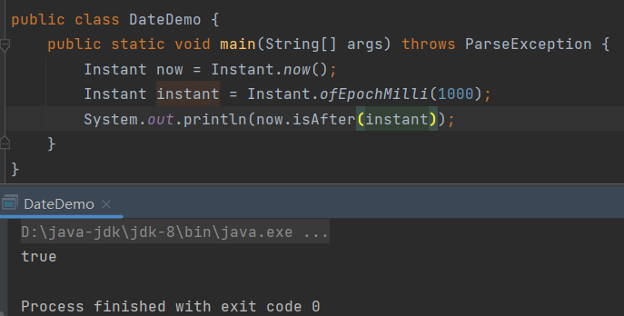

## minus前缀方法

> 在基础时间上减少多少时间，返回新的`Instant`。

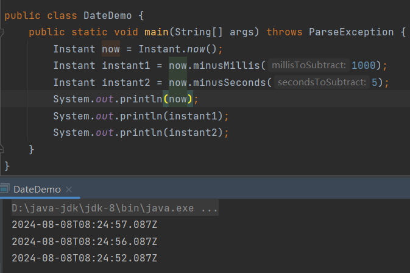

## plus前缀方法

> 在基础时间上增加多少时间，返回新的`Instant`。

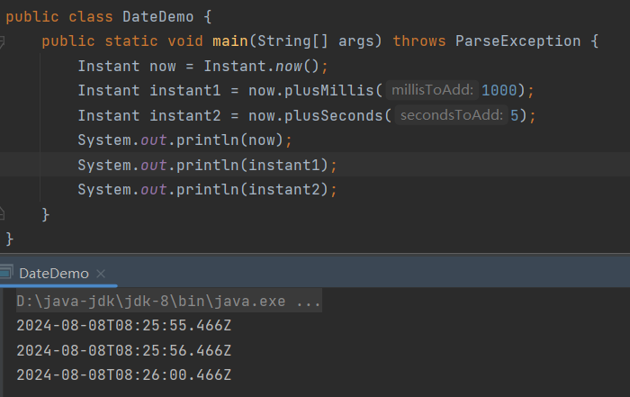


# ZoneId

> 时区类。

## getAvailableZoneIds()

```java
public static Set<String> getAvailableZoneIds(){};
```

> 查看java支持的所有时区，返回`Set\<String>`。

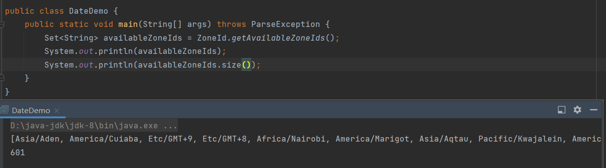

一共601个时区。

## systemDefault()

```java
public static ZoneId systemDefault(){};
```

> 获取系统默认时区，返回`ZoneId`。

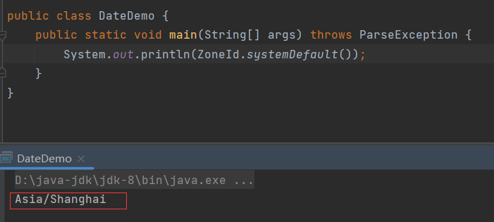

## of()

```java
public static ZoneId of(String zoneId){};
```

> 根据时区字符串，获取指定时区，返回`ZoneId`。

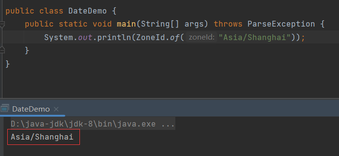


# ZonedDateTime

> 带时区的时间对象。

## now()

```java
public static ZonedDateTime now(){};
```

> 返回系统当前的时区时间。

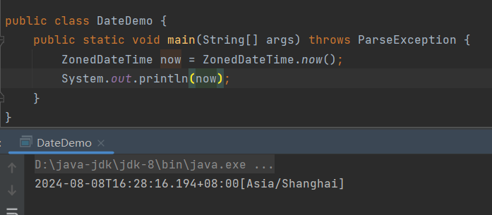

## of()

```java
public static ZonedDateTime of(
	int year,
    int month,
    int dayOfMonth,
    int hour,
    int minute,
    int Second,
    int nanoOfSecond,
    ZoneId zone
){};
```

> 根据传入的时间及时区返回时区时间。

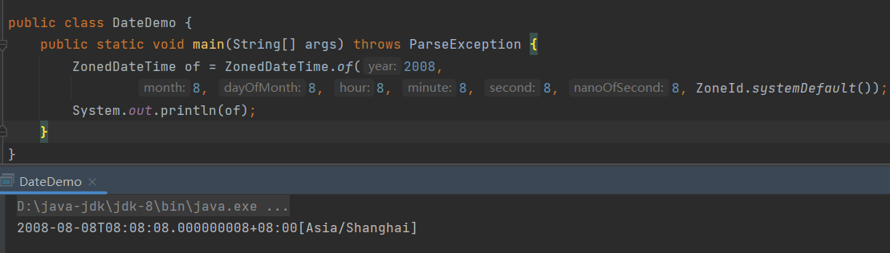

## with前缀方法

> 修改时区时间，返回新对象。

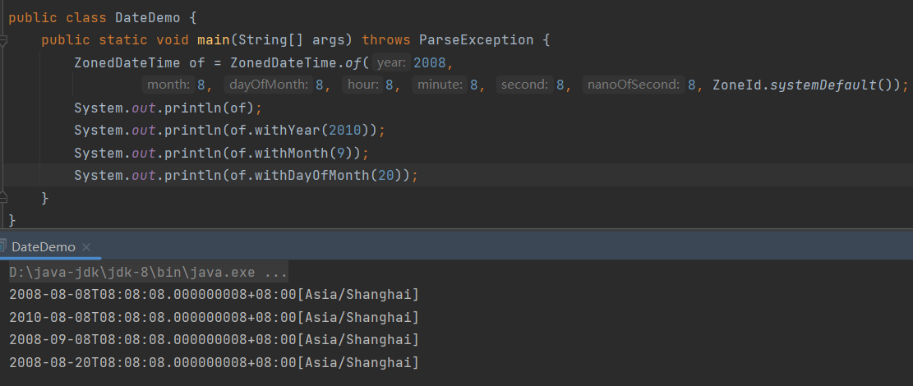

## minus前缀方法

> 在基础时间上减少多少时间，返回新的`ZonedDateTime`。

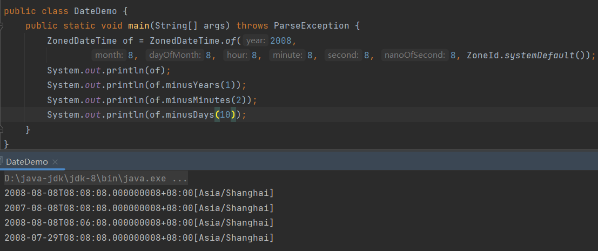

## plus前缀方法

> 在基础时间上增加多少时间，返回新的`ZonedDateTime`。

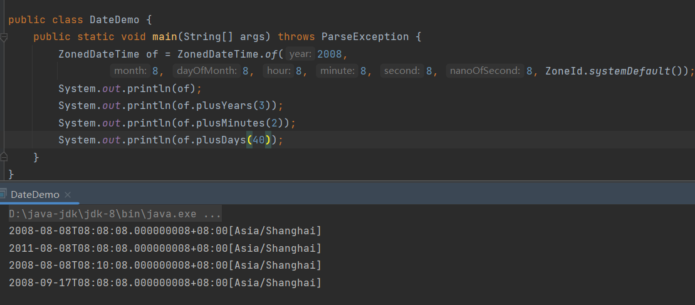