# Duration

> 用于计算两个**时间**间隔(秒，纳秒)。

## between()

```java
public static Duration between(
    Temporal date1, 
    Temporal date2){};
```

> 传两个日期对象，计算间隔，第二个时间减第一个时间，返回`Duration`。
>
> `Temporal`是接口，`LocalDateTime`、`LocalDate`、`LocalTime`是其实现类。

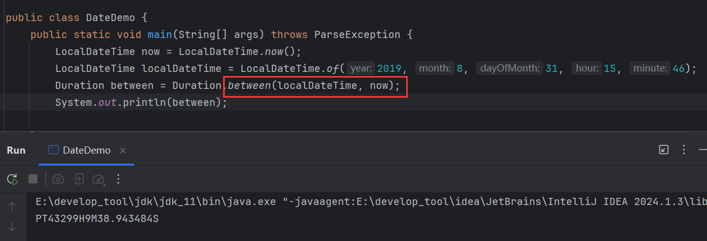

## toDays()

```java
public long toDays(){};
```

> 计算间隔后，封装成`Duration`，通过`toDays()`返回间隔天数。

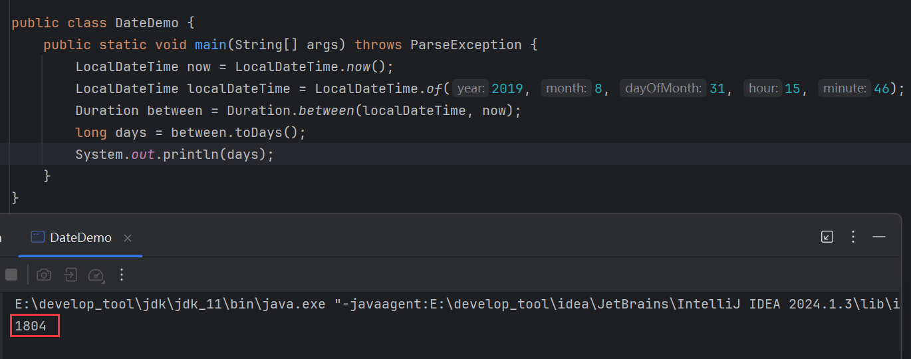

## toHours()

```java
public long toHours(){};
```

> 计算间隔后，封装成`Duration`，通过`toHours()`返回间隔小时数。

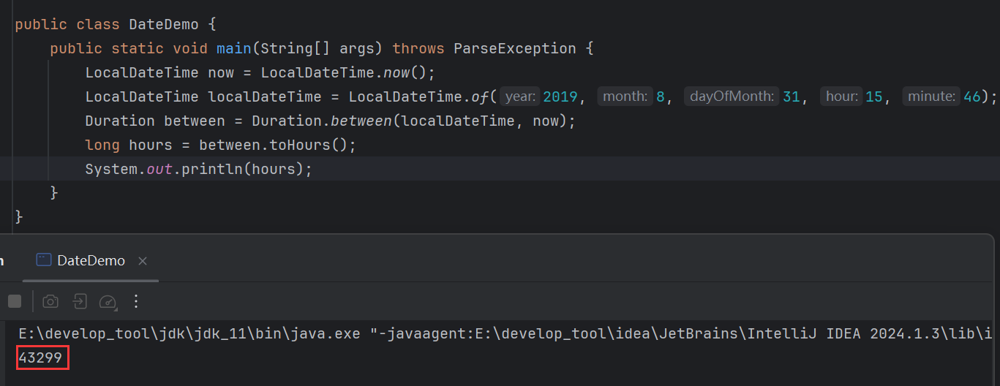

## toMinutes()

```java
public long toMinutes(){};
```

> 计算间隔后，封装成`Duration`，通过`toMinutes()`返回间隔分钟数。

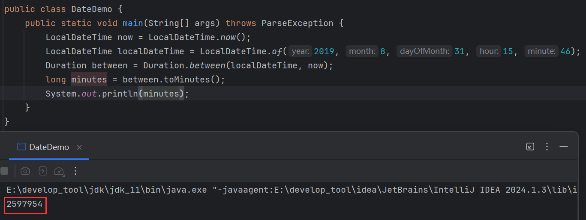

## toMillis()

```java
public long toMillis(){};
```

> 计算间隔后，封装成`Duration`，通过`toMillis()`返回间隔毫秒数。

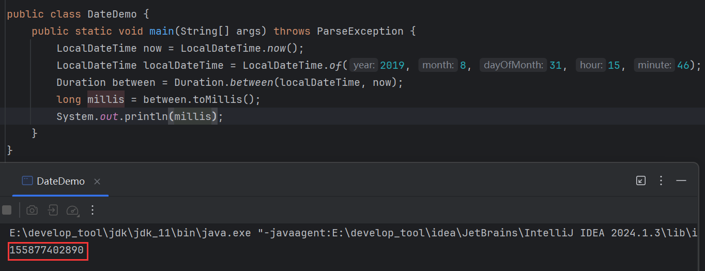

## toNanos()

```java
public long toNanos(){};
```

> 计算间隔后，封装成`Duration`，通过`toNanos()`返回间隔纳秒数。

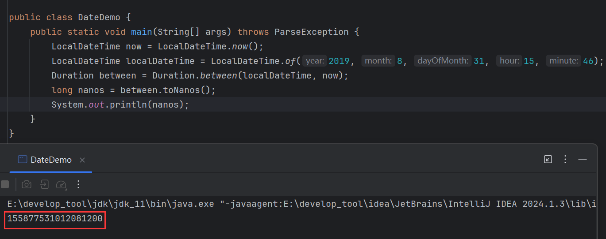


# Period

> 用于计算两个**日期**间隔(年、月、日)。

## between()

```java
public static Period between(
    LocalDate date1, 
    LocalDate date2){};
```

> 传两个`LocalDate`对象，计算间隔，第二个时间减第一个时间，返回`Period`。

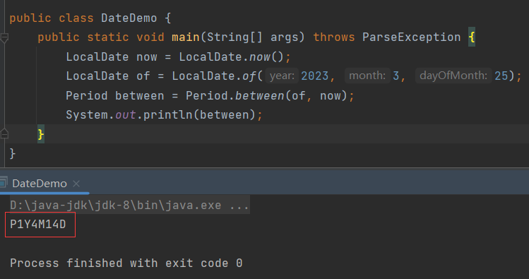

## getYears()

```java
public int getYears(){};
```

> 计算间隔后，封装成`Period`，通过`getYears()`返回间隔年份。

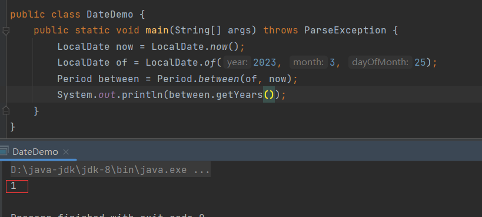

## getMonths()

```java
public int getMonths(){};
```

> 计算间隔后，封装成`Period`，通过`getMonths()`返回间隔月数。

返回的是部分月数，比如，如果`Period`对象表示 2 年 3 个月 5 天，那么将只返回 3。

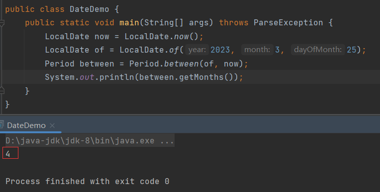

## toTotalMonths()

```java
public long toTotalMonths(){};
```

> 计算间隔后，封装成`Period`，通过`toTotalMonths()`返回间隔总月数。

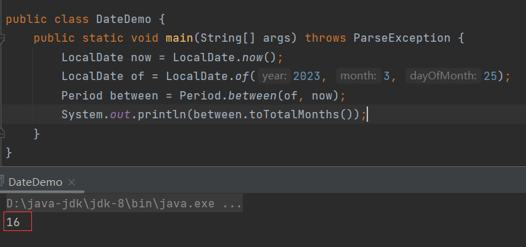

## getDays()

```java
public int getDays(){};
```

> 计算间隔后，封装成`Period`，通过`getDays()`返回间隔天数。

此方法存在局限性，它只返回一段时间中天的部分，比如如果`Period`对象表示 2 年 3 个月 5 天，那么将只返回5。

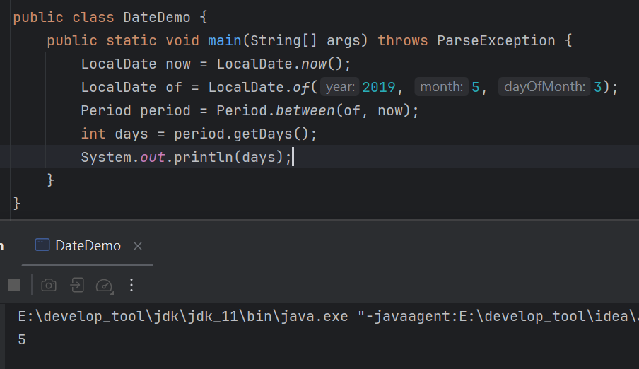


# ChronoUnit

> 用于计算两个**日期**间隔。能计算所有时间，功能最全。

`ChronoUnit`计算间隔的方式为：先获取常量，再通过常量调用`betwee()`。

`ChronoUnit`的常量返回`ChronoUnit`对象，比如返回一个封装了计算年间隔的`ChronoUnit`对象

```java
ChronoUnit c = ChronoUnit.YEARS;
```

这个对象就能用了计算年间隔。

## between()

```java
public long between(Temporal date1, Temporal date2){};
```

> 传两个日期对象，计算间隔，第二个时间减第一个时间，返回`long`。
>
> `Temporal`是接口，`LocalDateTime`、`LocalDate`、`LocalTime`是其实现类。

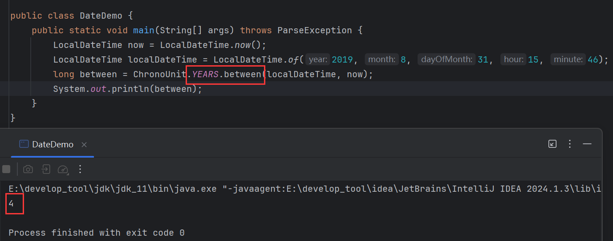

## ChronoUnit常量

| 常量      | 作用         |
| --------- | ------------ |
| YEARS     | 计算年间隔   |
| MONTHS    | 计算月间隔   |
| WEEKS     | 计算周间隔   |
| DAYS      | 计算天间隔   |
| HOURS     | 计算小时间隔 |
| MINUTES   | 计算分钟间隔 |
| SECONDS   | 计算秒间隔   |
| MILLIS    | 计算毫秒间隔 |
| MICROS    | 计算微秒间隔 |
| NANOS     | 计算纳秒间隔 |
| HALF_DAYS | 计算半天间隔 |
| DECADES   | 计算十年间隔 |
| CENTURIES | 计算世纪间隔 |
| MILLENNIA | 计算千年间隔 |
| ERAS      | 计算纪元间隔 |

计算间隔只需调用`between()`，计算不同的时间间隔，调用不同常量即可。

```java
LocalDateTime now = LocalDateTime.now();
LocalDateTime localDateTime = LocalDateTime.of(2019, 8, 31, 15, 46);

System.out.println("相差" + ChronoUnit.YEARS.between(localDateTime, now) + "年");
System.out.println("相差" + ChronoUnit.MONTHS.between(localDateTime, now) + "月");
System.out.println("相差" + ChronoUnit.WEEKS.between(localDateTime, now) + "周");
System.out.println("相差" + ChronoUnit.DAYS.between(localDateTime, now) + "天");
System.out.println("相差" + ChronoUnit.HOURS.between(localDateTime, now) + "小时");
System.out.println("相差" + ChronoUnit.MINUTES.between(localDateTime, now) + "分钟");
System.out.println("相差" + ChronoUnit.SECONDS.between(localDateTime, now) + "秒");
System.out.println("相差" + ChronoUnit.MILLIS.between(localDateTime, now) + "毫秒");
System.out.println("相差" + ChronoUnit.MICROS.between(localDateTime, now) + "微秒");
System.out.println("相差" + ChronoUnit.NANOS.between(localDateTime, now) + "纳秒");
System.out.println("相差" + ChronoUnit.HALF_DAYS.between(localDateTime, now) + "个半天");
System.out.println("相差" + ChronoUnit.DECADES.between(localDateTime, now) + "个十年");
System.out.println("相差" + ChronoUnit.CENTURIES.between(localDateTime, now) + "个世纪");
System.out.println("相差" + ChronoUnit.MILLENNIA.between(localDateTime, now) + "个千年");
System.out.println("相差" + ChronoUnit.ERAS.between(localDateTime, now) + "个纪元");
```

结果：

```java
相差4年
相差59月
相差257周
相差1804天
相差43299小时
相差2597993分钟
相差155879600秒
相差155879600605毫秒
相差155879600605844微秒
相差155879600605844000纳秒
相差3608个半天
相差0个十年
相差0个世纪
相差0个千年
相差0个纪元
```


# 案例

通过生日计算年龄。

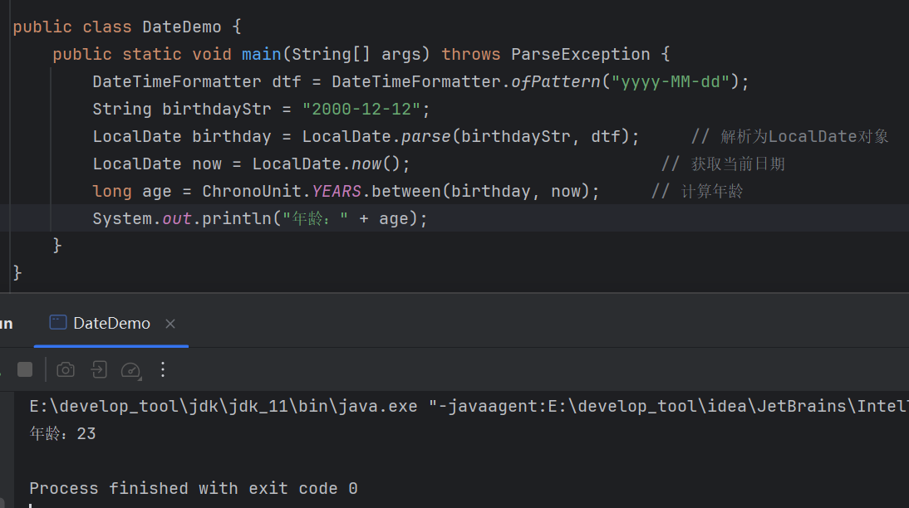