# 异常

> 指的是程序在**编译**或**运行**过程中，出现的非正常的情况或者是说错误。

常见异常，如：

```java
ArrayIndexOutOfBoundsException;
ClassCastException;
NullPointerException;
...
```

> 语法错误，不是异常。


# 查看异常

代码材料：

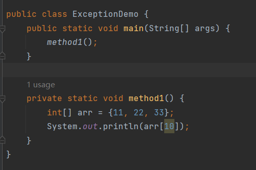

这段代码执行肯定报错：

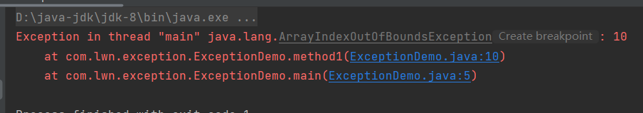

异常查看方式为从下往上看：

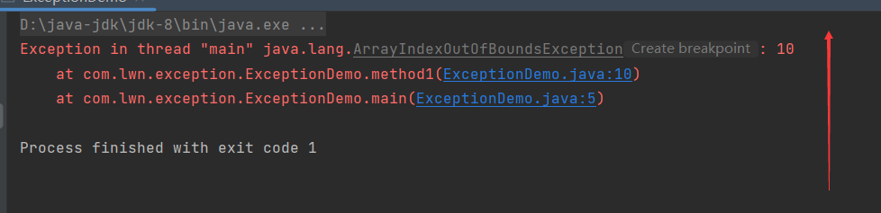

首先看最后一行：

```java
at com.lwn.exception.ExceptionDemo.main(ExceptionDemo.java:5)
```

主要看()中蓝色字体，它指出出错的地方在【ExceptionDemo】类的第5行：

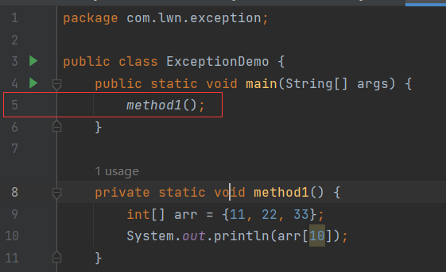

接着往上看：

```java
at com.lwn.exception.ExceptionDemo.method1(ExceptionDemo.java:10)
```

指出，出错的地方在【ExceptionDemo】类的第10行：

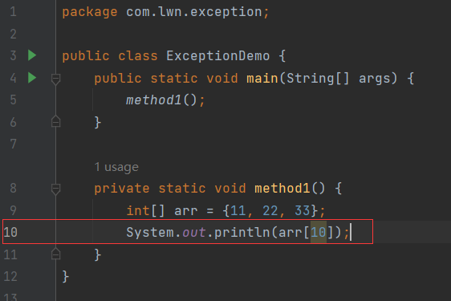

然后继续往上看，在这里指出了异常的名称：

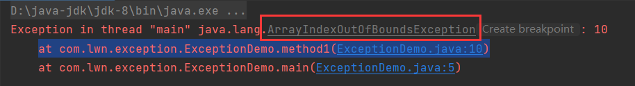

而后面，指出了出现异常的原因：

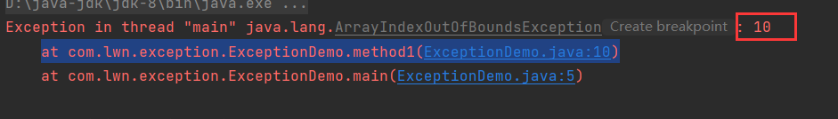

如果遇到不认识的异常，比如这段异常：

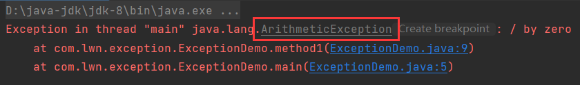

在java中，所有异常都是类，只需要找到这个类，然后去查看API，就能了解这个异常：

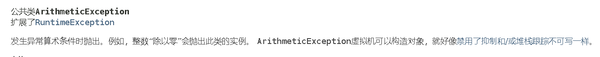

甚至，直接查看异常出现的原因，也能大致猜到这个异常类是什么异常：

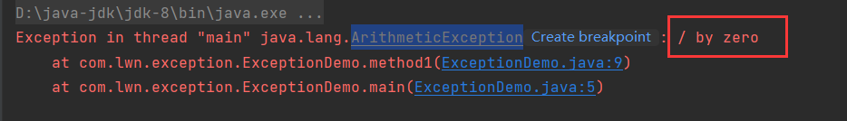


# 异常体系结构和分类

异常体系中有一个根类【Throwable】,它是所有异常的直接或间接父类。其下分为两个派生类：

1. 【Error】。
2. 【Exception】。

## Error

表示严重级别异常，常见有：

栈溢出(【StackOverflowError】)、堆溢出(【OutOfMemoryError】)，通常与系统异常有关。

## Exception

【Exception】，其下又分为两个类别：

1. 【RuntimeException】及其子类。
2. 除【RuntimeException】之外的所有异常。

### 运行时异常

> 【RuntimeException】及其子类，表示运行时异常。

**特点**：编译时不报错，运行时可能报错。

大多数异常都属于运行时异常，如【ClassCastException】、【NullPointerException】、【ArrayIndexOutOfBoundsException】等。

### 编译时异常

> 除【RuntimeException】之外的所有异常，表示编译时异常。

**特点**：在编译阶段就报错，即使语法正确。

举个例子，解析日期：

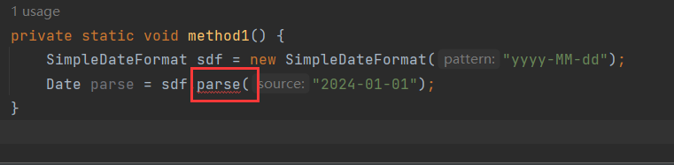

这段代码中语法是正确，可【parse()】依然报错。因为这句代码即使语法正确也可能会出现一些问题，比如非日期字符串去解析，字符串都不是日期，那必然解析不成功。因此才用编译时异常提醒开发者此处容易出现错误，请小心。

所以，编译时异常主要的目的就是起到提醒的作用。

但是编译时异常会报错，代码无法运行，所以需要开发者在编译阶段就给出解决方法。

## 体系图

异常家族的体系图：

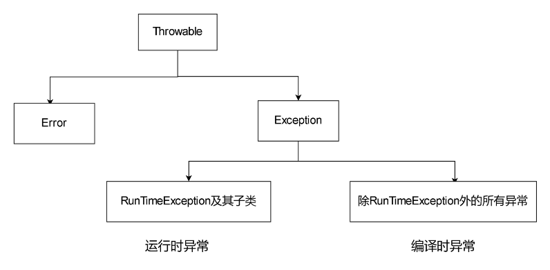