# java处理异常的默认方式

代码材料：

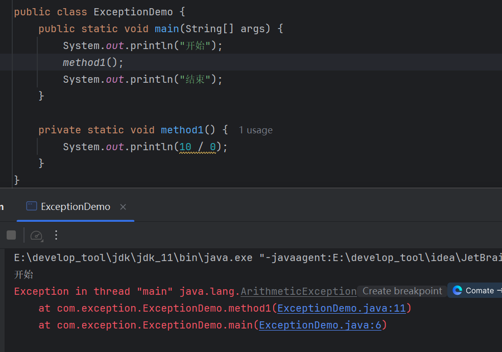

异常之前的代码能执行，异常之后不会执行。

> java处理异常的默认方式为：向上抛出。

在发生异常时，Java会创建这个异常类的对象，这个对象一旦创建就相当于在程序中点燃了一颗雷。

异常会抛给调用者，然后调用者继续抛给它的调用者，层层抛出，直至最后一层。在这个案例中，异常由`method1()`抛出，然后抛给它的调用者，也就是`main()`，`main()`再往上抛，`main()`的调用者是JVM虚拟机，于是抛给虚拟机，虚拟机的上级就是开发者，于是将错误信息打印在控制台，同时终止程序。

> java抛出异常的两个重点：
>
> 1. 层层往上抛给调用者，且终止程序。
> 2. 发生异常时，java会创建该异常类的对象。


# try...catch...

java处理异常的机制导致一旦发生异常，那么后续的代码就无法执行。如果希望发生异常后续代码可以继续执行，那么可以使用`try...catch...`语法：

```java
/*
执行try中代码，当发生异常时，try中代码终止，接着执行catch中代码，否则catch中代码不会执行。
*/
try{		
    可能出现异常的代码	
}catch(异常对象 变量名) {	
    异常处理方案
}
```

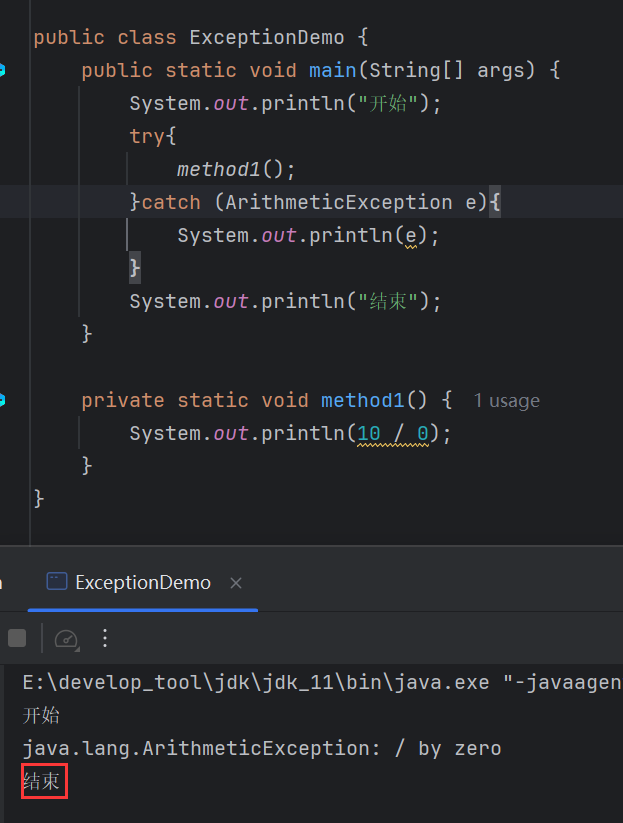

"结束"正常输出出来，同时打印了异常对象的信息。

## 捕获流程

当发生异常时，java就会创建异常对象，此处创建`ArithmeticException`，然后本来应该往上抛出，但是异常被`catch`捕获，`catch`中的变量`e`就会接受`ArithmeticException`对象，就是一个赋值的过程：

```java
ArithmeticException e = new ArithmeticException();
```

异常被捕获，`catch`中的代码就会执行，同时异常不会向上抛给虚拟机，也就不会终止程序，等待`catch`中的代码执行完成，继续执行后续代码。

如果没有发生异常，那么`catch`中的代码不会执行：

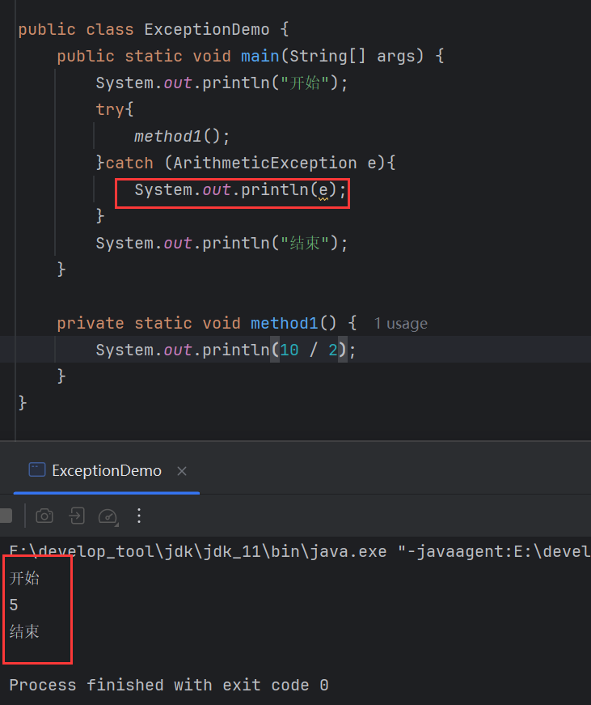

## 好处

> `try...catch...`可以捕获异常对象，异常被捕不会往上抛给虚拟机，也就不会终止程序。

## 细节

如果`try`中出现多种异常，比如数组下标越界异常：

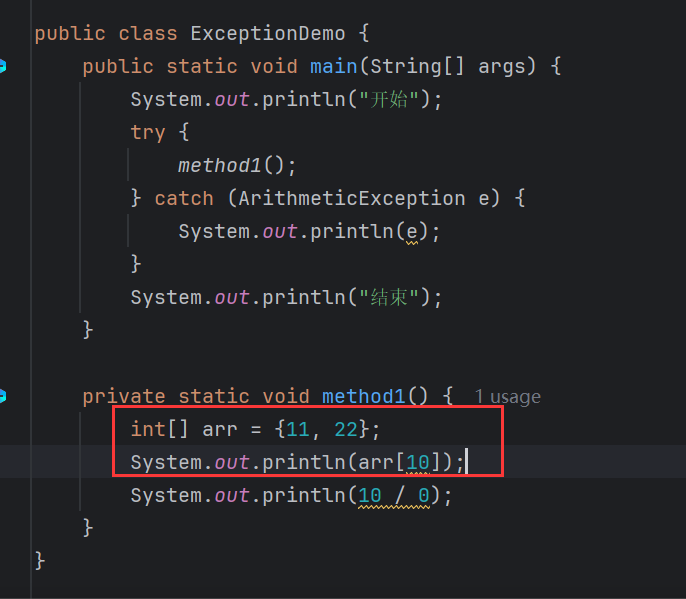

这种情况下，`catch`就无法捕获标下标越界异常：

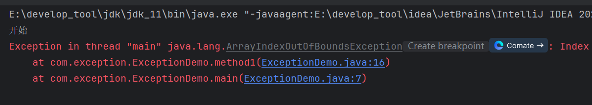

因为`catch`只声明了捕获`ArithmeticException`类型的异常，所以其无法捕获非`ArithmeticException`类型的异常，所以下标越界异常就会往上抛给虚拟机，导致程序终止。

方法1，使用多`catch`：

再声明一个`catch`捕获下标越界异常。

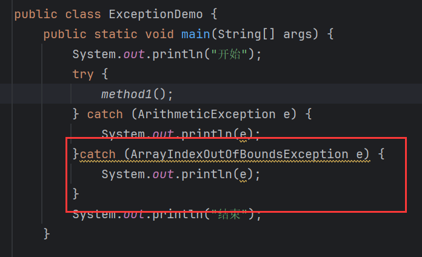

方法2，利用多态，提升捕获异常的范围：

下标越界和运算错误异常其父类都是`Exception`，因此声明捕获`Exception`就能同时捕获这两个异常：

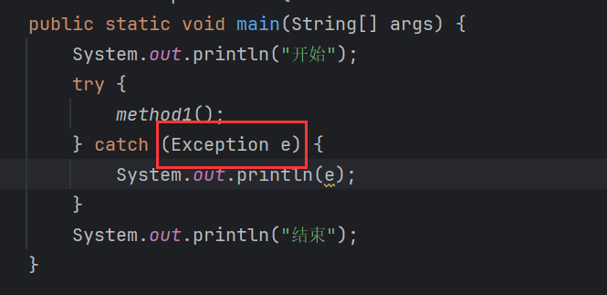

## 案例

录入姓名和年龄封装学生对象。

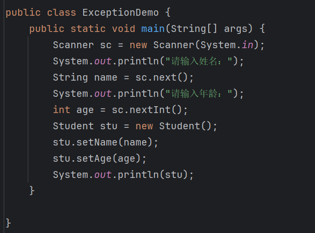

输入正常的姓名和年龄：

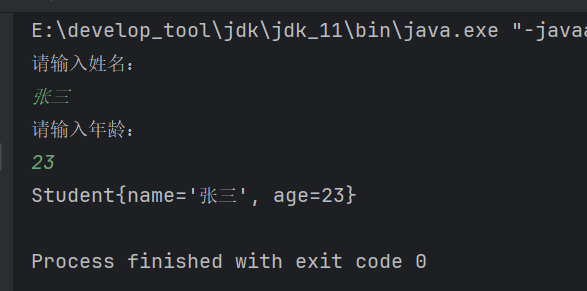

但是，如果输入不正常的年龄，就会报错：

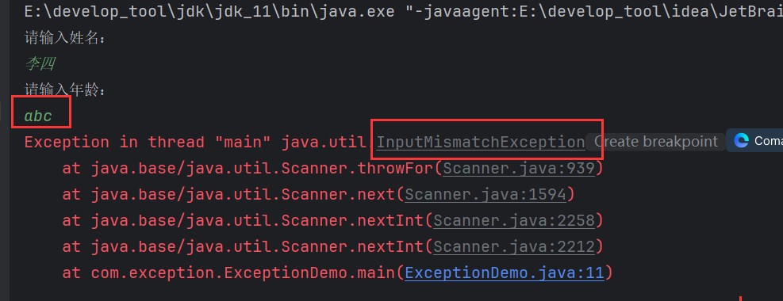

用`try...catch...`改造：

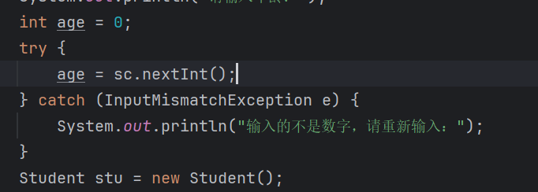

考虑到用户可能会反复输入错误的年龄，因此用`while`循环改造：

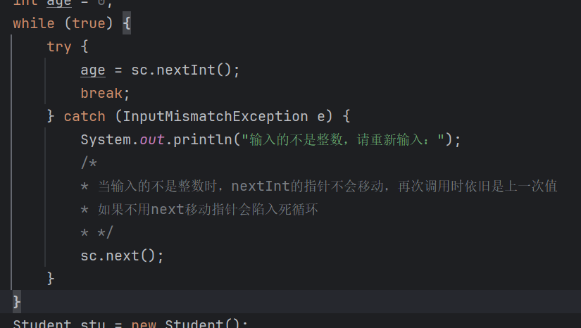

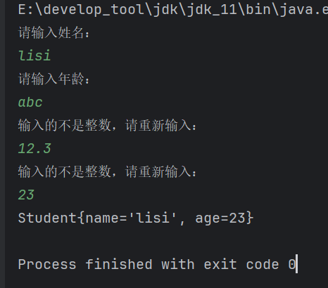


# throws抛出异常

> `throws`关键字起到声明的作用，声明该方法可能发生异常。

语法为：

```java
方法签名 throws 异常列表 {};
```

`throws`抛出异常，则方法内不会处理异常，而是将异常往上抛给调用者，由调用者来处理：

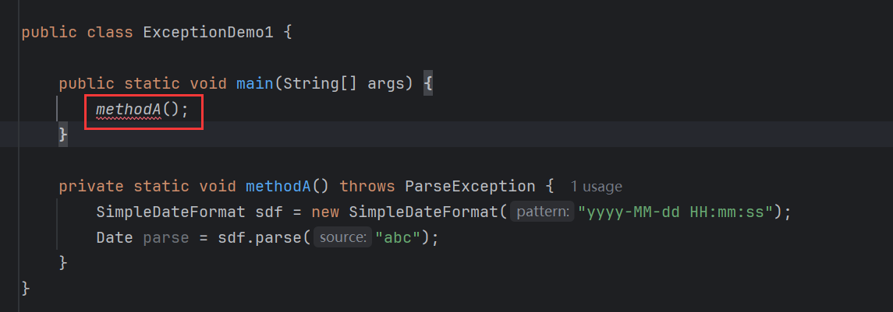

`main()`作为调用者，需要处理异常，它可以选择`try...catch...`也可以`throws`继续往上抛给虚拟机：

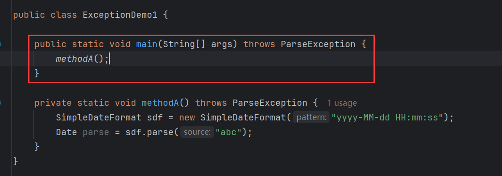

如果抛给虚拟机，最终异常现象会打印在控制台：

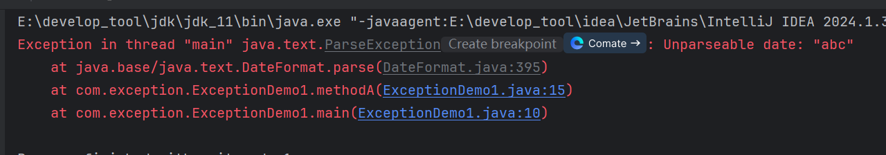

`throws`只起到生声明的作用，声明方法可能存在异常，它并不会处理异常，由于异常未被处理，那么按照java默认处理方式，异常会往上抛出。

> 一个方法声明了`throws`，那么调用该方法的其他方法要么使用`try...catch...`处理异常，要么也声明`throws`继续抛出异常。

## 细节

多个异常时，可以同时抛出：

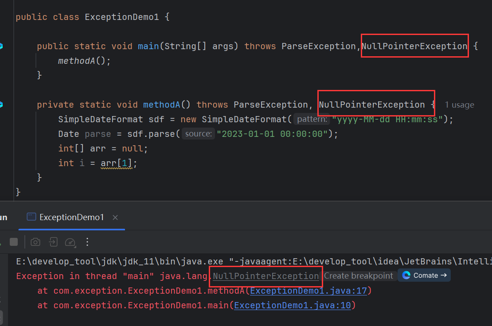

也可以提升异常的抛出范围，用一个父类异常概括：

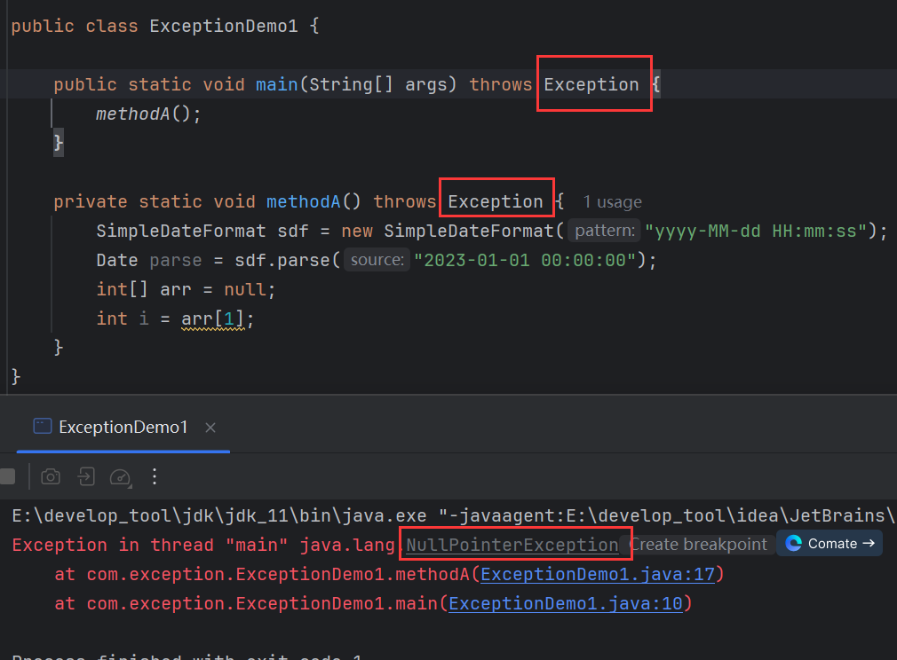


# 使用场景

`try...catch...`和`throws`的使用场景：

1. 如果异常不需要暴露出去，那么使用`try...catch...`在内部将异常处理掉。
2. 如果异常需要暴露出去，那么使用`throws`将异常抛给调用者。

什么情况下属于异常需要暴露出去？

举个例子，假设程序员正在编写一个库供其他开发者调用，其中有类`Student`，类中的`setAge()`方法用于设置学生年龄。但是有些开发在使用`setAge()`时，会传入一些非年龄值，这种情况下就需要将错误抛给开发者，让开发者知道传入这样的值是错误的，好让开发者来处理这个错误。

## thorw

> `thorw`用于手动抛出异常给调用者。会终止方法执行流程。

语法：

```java
throw new 异常类();  // 创建异常对象并抛出
```

在`setAge()`中，如果年龄不合法则抛出异常，手动创建一个异常对象，抛出这个对象，可以传入错误信息：

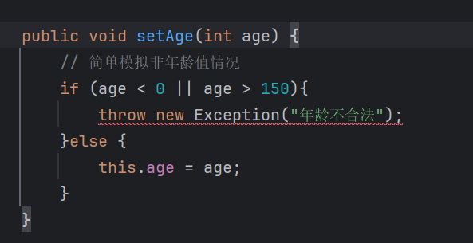

手动抛出异常后，`setAge()`中存在异常，需要声明该方法存在异常，用`throws`声明：

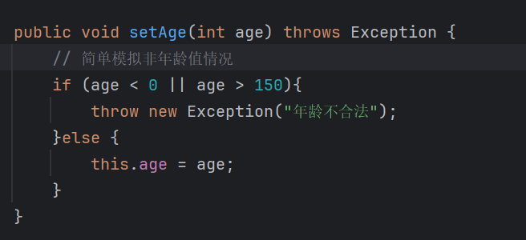

调用者在编译阶段就会提示，因为除`RuntimeException`及其子类之外的所有异常都是编译时异常，在`setAge()`抛出的正是编译时异常，因此在编译阶段就会报错提示：

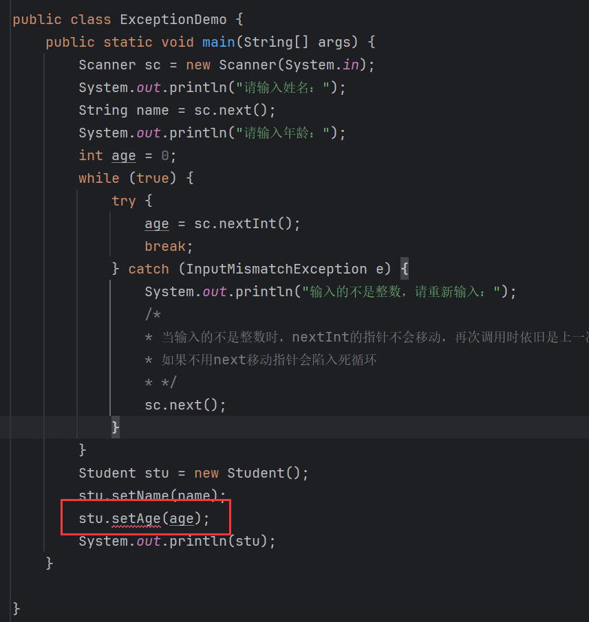

需要处理异常：

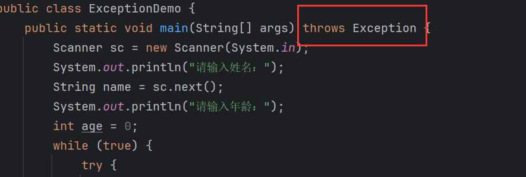

当输入不合法的年龄时：

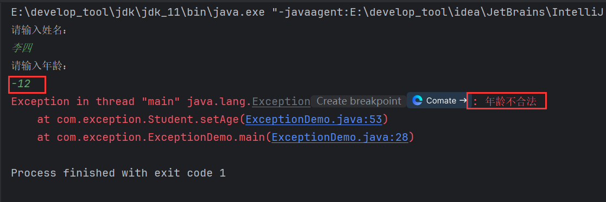

换一个角度，之前是开发者抛出异常提示另一个开发者，现在是开发者面向客户。调用这个方法的开发者收到这个异常它可以选择继续抛出，也可以选择在内部处理掉，他开发所面向的是客户，最终是由客户来操作这个界面，如果选择向上抛出，那么最终会将错误抛给客户，在大多数时候异常信息是不需要抛给客户的，即使抛出，客户也不一定能看懂，那么最好的做法就是开发者在内部将异常处理掉：

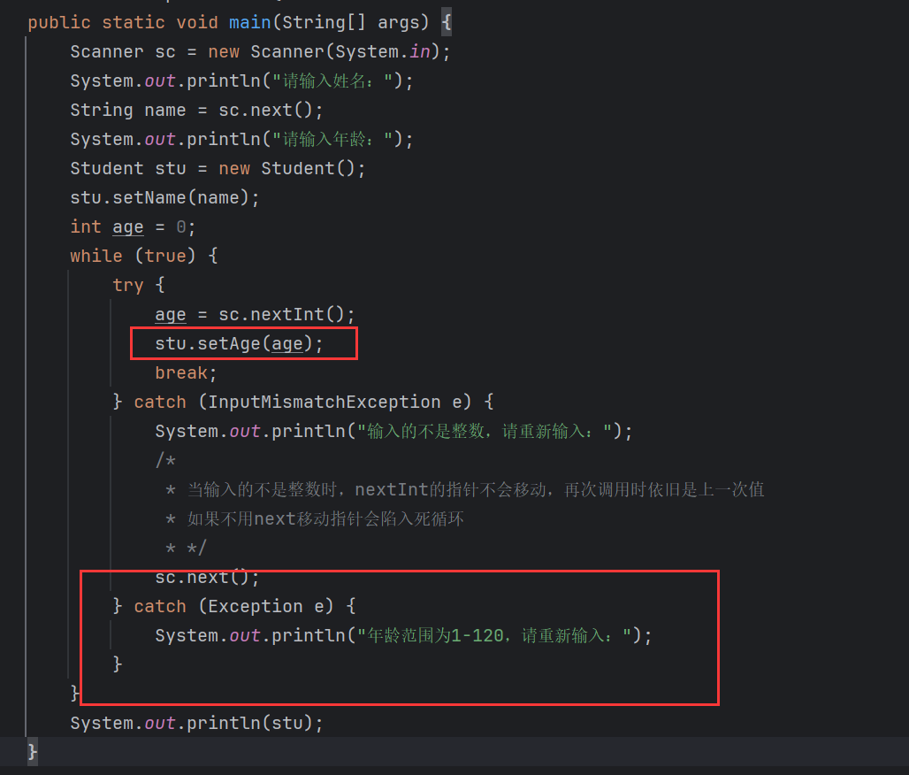

在内部捕获这个异常，然后给出提示，客户不一定能看懂异常，但一定能看到提示信息。当输入范围不合法时：

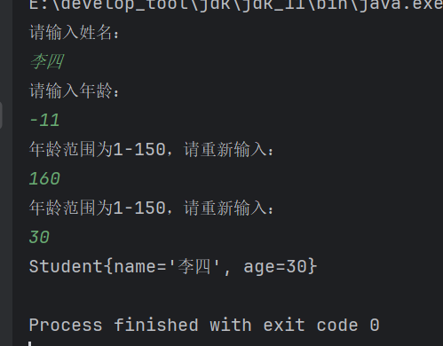

### 细节

> 抛出的是编译时异常，要求方法声明异常，如果抛出运行时异常则不需要。

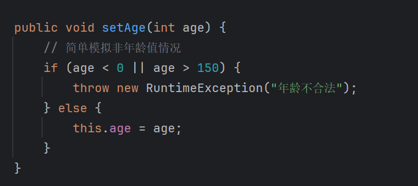

`thorw`会终止方法执行流程：

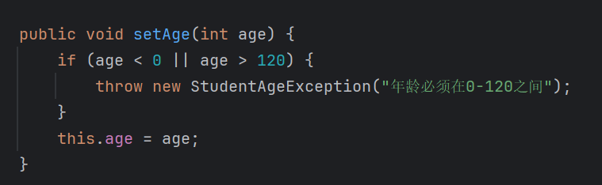

## getMessage()

```java
public String getMessage(){};
```

> 返回异常对象传入构造方法中的字符串。

异常的父类`Throwable`中有成员变量`detailMessage`：

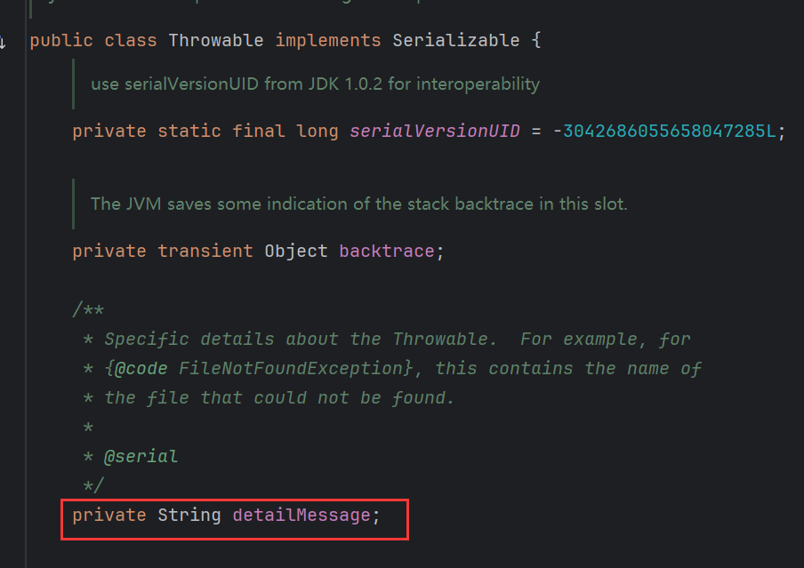

有参构造，传入字符串，给`detailMessage`赋值：

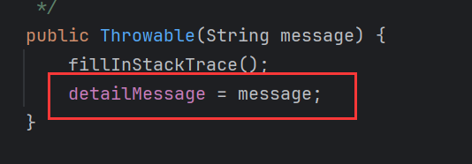

在`getMessage()`中返回`detailMessage`：

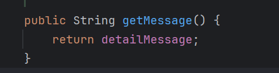

子类异常继承`Throwable`，同时继承了`getMessage()`。

所以调用`getMessage()`可以返回提前设置好的错误信息：

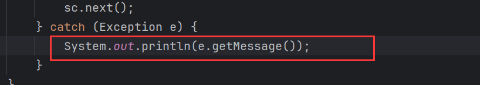

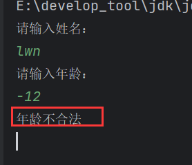