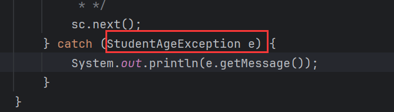

# 自定义异常

> 1. 自定义编译时异常：定义类继承`Exception`。
> 2. 自定义运行时异常：定义类继承`RunTimeException`。

## 创建流程

> 1、继承父类异常。
>
> 2、重写构造器。

比如自定义运行时异常，一般用到父类的构造，让父类构造来初始化错误信息：


## 优化案例

在`setAge()`中就不用抛出`Exception`，而是抛出自定义的异常：


`catch`中捕获这个异常，做精准处理：




这段代码还有一个缺陷，如果调用者并非通过`setAge()`来设置年龄而是通过有参构造设置年龄，那么同样可以设置非法年龄：


因此需要在设置`age`这里进行`setAge()`中的操作，直接调用`setAge()`即可，不用再`if`判断抛异常：


# Throwable常用方法

## printStackTrace()

```java
public void printStackTrace(){};
```

> 展示完整的异常错误信息，并不会终止程序。


`printStackTrace()`只是展示完整的异常错误信息，并不会终止程序：


# 继承中的异常处理

> 子类重写父类方法时，不能抛出父类没有的异常，或者比父类更大的异常。

子类可以不抛出异常：


也可以抛出与父方法一样的异常：


但不能抛出父方法中没有的异常：


也不能抛出比父方法更大范围的异常：


如果重写方法时，父方法没有异常，而子方法需要抛出异常时，那么就需要让父方法也抛出异常：


但是再重写第三方库中父方法时，其源码是只读，无法修改，也就无法在父方法中抛出异常，因此通常的做法是用`try...catch...`解决：


# 练习

需求∶编写一个学生类，属性为︰姓名，年龄，数学成绩，语文成绩，英语成绩。

1. 成绩不能为为负数，不能大于100分。
2. 年龄应控制在0～120之间。
3. 创建3个学生对象，并打印学生信息，信息都来自于键盘录入。
4. 如果出现异常，给出提示，并继续输入。

首先创建两个自定义异常，分别显示年龄范围错误和成绩范围错误：

```java
// 年龄范围错误
public class StudentAgeException extends RuntimeException{
    public StudentAgeException() {
    }

    public StudentAgeException(String message) {
        super(message);
    }
}
```

```java
// 成绩范围错误
public class ScoreException extends RuntimeException{
    public ScoreException() {
    }

    public ScoreException(String message) {
        super(message);
    }
}
```

然后定义学生类，在设置年龄和成绩时合理抛出异常：

```java
public class Student {
    private String name;
    private int age;
    private int math;
    private int english;
    public int chinese;

    public boolean validScore(int score) {
        return (score >= 0 && score <= 100);
    }

    public Student() {
    }

    public Student(String name, int age, int math, int english) {
        this.name = name;
        setAge(age);
        setMath(math);
        setEnglish(english);
        setChinese(chinese);
    }

    public String getName() {
        return name;
    }

    public void setName(String name) {
        this.name = name;
    }

    public int getAge() {
        return age;
    }

    public void setAge(int age) {
        if (age < 0 || age > 120) throw new StudentAgeException("年龄必须在0-120之间");
        this.age = age;
    }

    public int getMath() {
        return math;
    }

    public void setMath(int math) {
        if (!validScore(math)) throw new ScoreException("分数必须在0-100之间");
        this.math = math;
    }

    public int getEnglish() {
        return english;
    }

    public void setEnglish(int english) {
        if (!validScore(english)) throw new ScoreException("分数必须在0-100之间");
        this.english = english;
    }

    public int getChinese() {
        return chinese;
    }

    public void setChinese(int chinese) {
        if (!validScore(chinese)) throw new ScoreException("分数必须在0-100之间");
        this.chinese = chinese;
    }

    @Override
    public String toString() {
        return "Student{" +
                "name='" + name + '\'' +
                ", age=" + age +
                ", math=" + math +
                ", english=" + english +
                ", chinese=" + chinese +
                '}';
    }
}
```

最后的测试类：

```java
public class Demo {
    private static Scanner sc = new Scanner(System.in);

    public static void main(String[] args) {
        for (int i = 0; i < 3; i++) {
            Student student = new Student();
            System.out.println("请输入学生名称：");
            student.setName(sc.nextLine());
            System.out.println("请输入学生年龄：");
            handleAge(student);
            System.out.println("请输入学生数学成绩：");
            handleMath(student);
            System.out.println("请输入学生英语成绩：");
            handleEnglish(student);
            System.out.println("请输入学生语文成绩：");
            handleChinese(student);
            System.out.println("第" + (i + 1) + "个学生信息如下：");
            System.out.println(student);
        }
    }

    public static void handleAge(Student stu) {
        int age;
        while (true) {
            try {
                age = Integer.parseInt(sc.nextLine());
                stu.setAge(age);
                break;
            } catch (NumberFormatException e) {
                System.out.println("年龄不合法，请重新输入：");
            } catch (StudentAgeException e) {
                System.out.println(e.getMessage());
            }
        }
    }

    public static void handleMath(Student stu) {
        int score;
        while (true) {
            try {
                score = Integer.parseInt(sc.nextLine());
                stu.setMath(score);
                break;
            } catch (NumberFormatException e) {
                System.out.println("成绩不合法，请重新输入：");
            } catch (ScoreException e) {
                System.out.println(e.getMessage());
            }
        }
    }

    public static void handleEnglish(Student stu) {
        int score;
        while (true) {
            try {
                score = Integer.parseInt(sc.nextLine());
                stu.setEnglish(score);
                break;
            } catch (NumberFormatException e) {
                System.out.println("成绩不合法，请重新输入：");
            } catch (ScoreException e) {
                System.out.println(e.getMessage());
            }
        }
    }

    public static void handleChinese(Student stu) {
        int score;
        while (true) {
            try {
                score = Integer.parseInt(sc.nextLine());
                stu.setChinese(score);
                break;
            } catch (NumberFormatException e) {
                System.out.println("成绩不合法，请重新输入：");
            } catch (ScoreException e) {
                System.out.println(e.getMessage());
            }
        }
    }
}
```

