# 1.树结构

在树状结构中存储的元素叫做节点。

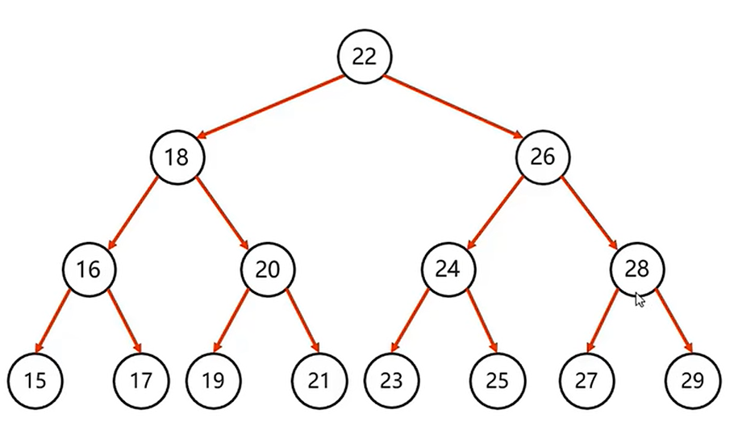

## 1.1.树的组成

树由节点组成，而节点有父节点和子节点之分。

比如16就是父节点，下面的15和17就是其子节点，15是左子节点，17是右子节点。而每个节点的内部又由以下几个部分组成：

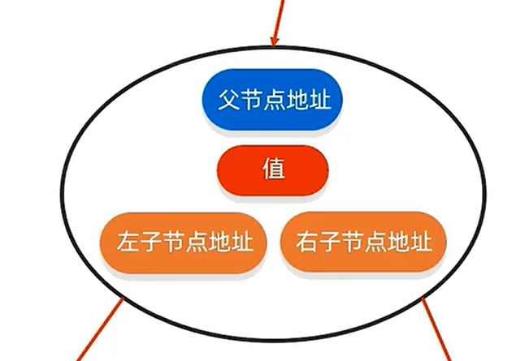

- **父节点地址**：记录父节点地址。
- **值**：记录当前节点的值。
- **左子节点地址**：记录左子节点地址。
- **右子节点地址**：记录右子节点地址。

## 1.2.概念

- **度**：每个节点的子节点数量，二叉树中任意节点度 <= 2。

- **树高**：树的层数。

  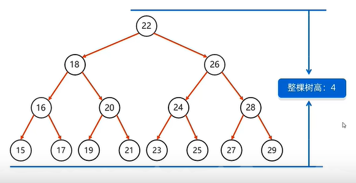

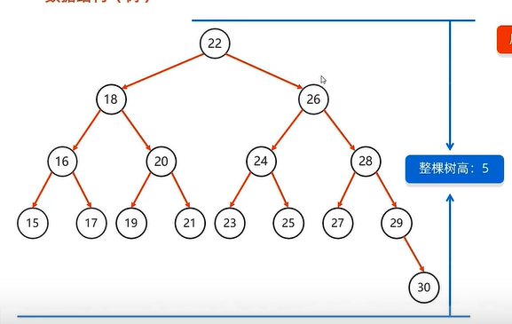

- **根节点**：最顶层的节点。
- **左子节点**：左下方的节点。
- **右子节点**：右下方的节点。
- **左子树**：蓝色虚线部分就是根节点的左子树：

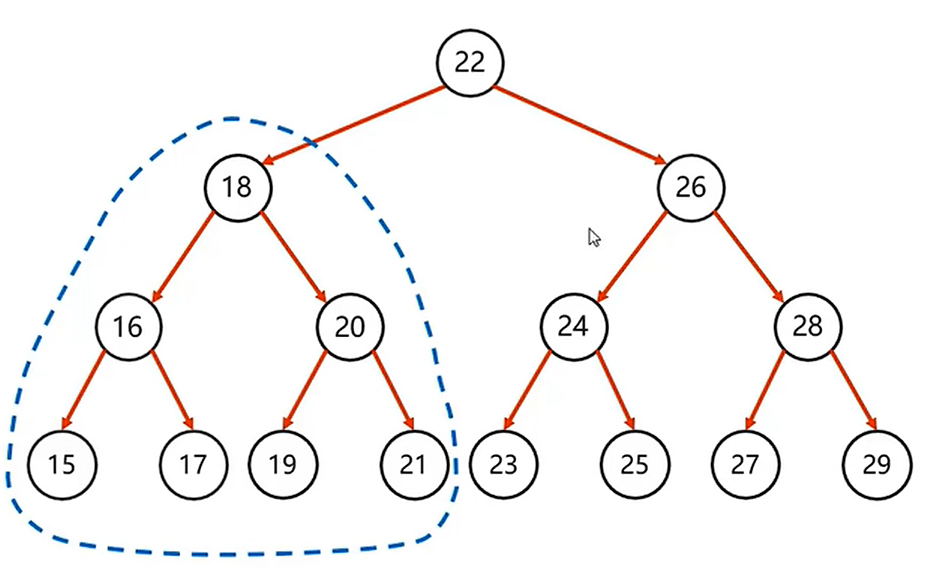

- **右子树**：绿色虚线部分就是根节点的右子树：

  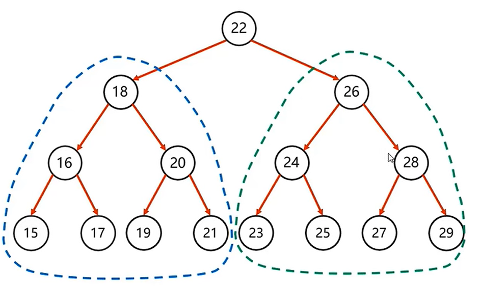

在26节点中，其左子树(蓝色虚线)和右子树(绿色虚线)：

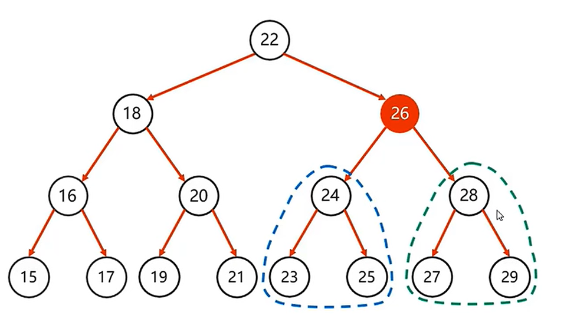

# 2.二叉树

## 2.1.普通二叉树

> 任意节点度 <= 2的树。

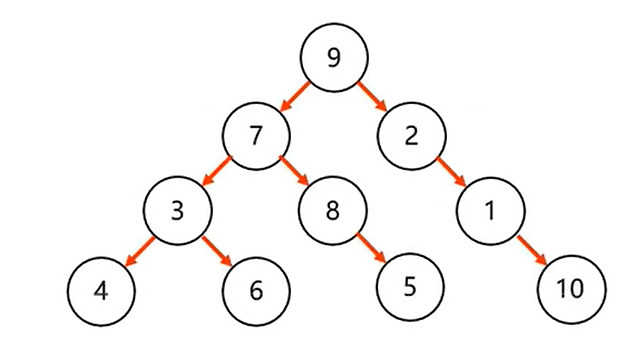

**缺点**：查询性能不行，因为数据排列是乱序的。

## 2.2.二叉查找树

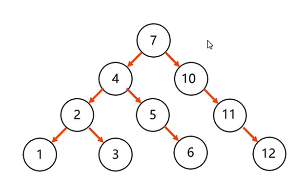

> 任意节点开始，其左子树的节点都比它小，其右子树的节点都比它大。

**优点**：查询性能较高，最多查找次数为树高。

### 2.2.1.特点

- 每个节点**最多2个**子节点。
- 任意子节点左子树的值都**小于**当前节点
- 任意子节点右子树的值都**大于**当前节点

### 2.2.2.添加节点

> 添加规则：
>
> 1. 小的存左边。
> 2. 大的存右边。
> 3. 一样的不存。

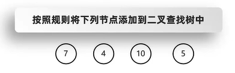

添加根节点：

添加子节点4，比根节点小，存左边：

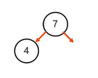

添加子节点10，比根节点大，存右边：

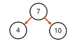

添加节点5，比根节点小，存左边，继续与4比较，比4大，存右边：

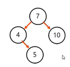

### 2.2.3.弊端

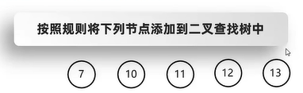

形成的树：

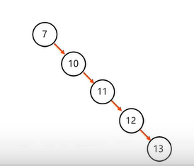

如果形成了这样一颗树，那么其查询性能就会下降。跟单向链表一样，只能一个一个查找。

如果这棵树是这样的：

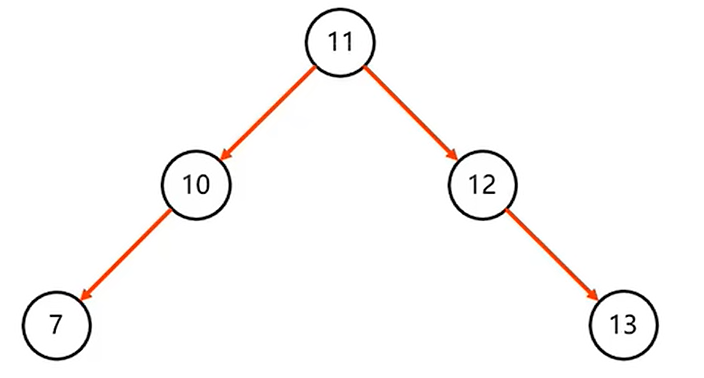

那么查询性能就能提高。这种树就是平衡二叉树。

## 2.3.平衡二叉树

> 任意节点左右子树高度差不超过1。

比如这颗树就不是平衡二叉树：

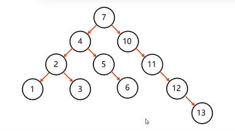

因为10节点左子树高度为0，右子树高度为3，相差大于1。

### 2.3.1.旋转机制

当前树是平衡二叉树：

可一旦添加了一个元素，就不再是平衡二叉树：

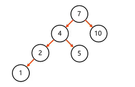

在添加一个元素后，可能导致平衡二叉树不再平衡，为了确保添加元素后，树一定是平衡状态，引入了平衡机制。

旋转机制的**触发时机**：当添加一个节点之后，该树不再是一颗平衡二叉树。

#### 2.3.1.1.左旋

当前树是平衡的：

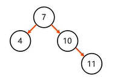

添加12后，树不再平衡：

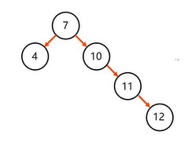

做左旋可以平衡，左旋首先确定旋转支点：

> 从添加的节点开始，不断的往父节点找不平衡的节点。

从12开始，12是平衡点，往上11也是平衡点，再往上10不是平衡点，左子节点为0，右子节点为2，相差大于1。

确定了支点后，开始旋转：

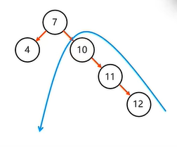

变为：

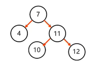