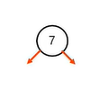
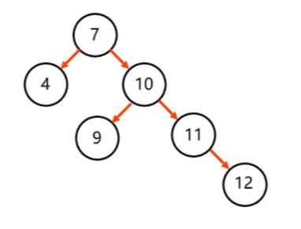
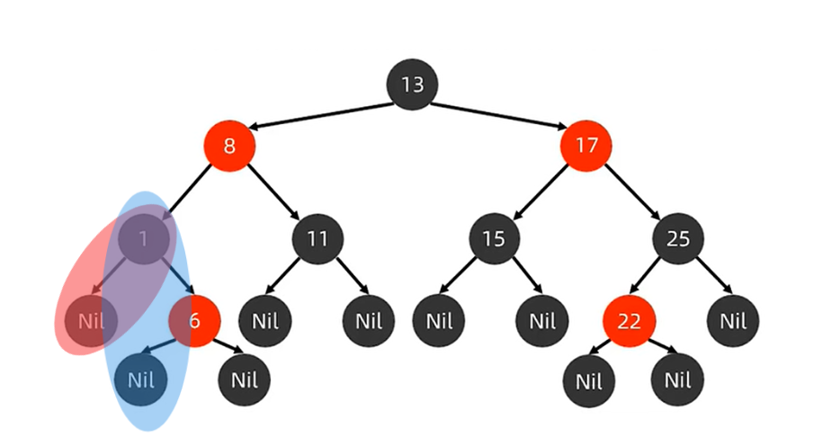
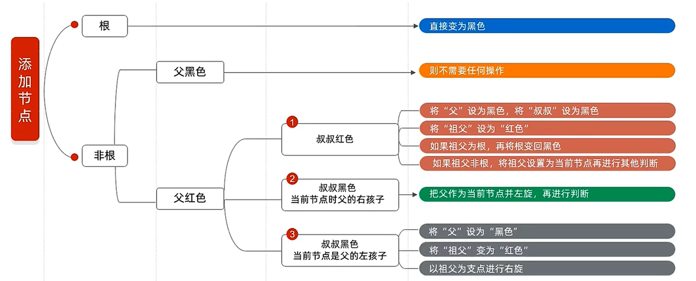
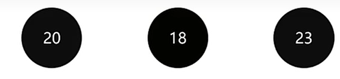
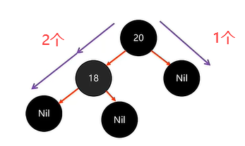
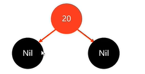
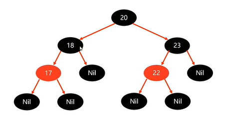

# 1.树结构

在树状结构中存储的元素叫做节点。

## 1.1.树的组成

树由节点组成，而节点有父节点和子节点之分。

比如16就是父节点，下面的15和17就是其子节点，15是左子节点，17是右子节点。而每个节点的内部又由以下几个部分组成：

- **父节点地址**：记录父节点地址。
- **值**：记录当前节点的值。
- **左子节点地址**：记录左子节点地址。
- **右子节点地址**：记录右子节点地址。

## 1.2.概念

- **度**：每个节点的子节点数量，二叉树中任意节点度 <= 2。

- **树高**：树的层数。

  

- **根节点**：最顶层的节点。
- **左子节点**：左下方的节点。
- **右子节点**：右下方的节点。
- **左子树**：蓝色虚线部分就是根节点的左子树：

- **右子树**：绿色虚线部分就是根节点的右子树：

  

在26节点中，其左子树(蓝色虚线)和右子树(绿色虚线)：

# 2.二叉树

## 2.1.普通二叉树

> 任意节点度 <= 2的树。

**缺点**：查询性能不行，因为数据排列是乱序的。

## 2.2.二叉查找树

> 任意节点开始，其左子树的节点都比它小，其右子树的节点都比它大。

**优点**：查询性能较高，最多查找次数为树高。

### 2.2.1.特点

- 每个节点**最多2个**子节点。
- 任意子节点左子树的值都**小于**当前节点
- 任意子节点右子树的值都**大于**当前节点

### 2.2.2.添加节点

> 添加规则：
>
> 1. 小的存左边。
> 2. 大的存右边。
> 3. 一样的不存。

添加根节点：

添加子节点4，比根节点小，存左边：

添加子节点10，比根节点大，存右边：

添加节点5，比根节点小，存左边，继续与4比较，比4大，存右边：

### 2.2.3.弊端

形成的树：

如果形成了这样一颗树，那么其查询性能就会下降。跟单向链表一样，只能一个一个查找。

如果这棵树是这样的：

那么查询性能就能提高。这种树就是平衡二叉树。

## 2.3.平衡二叉树

> 任意节点左右子树高度差不超过1。

比如这颗树就不是平衡二叉树：

因为10节点左子树高度为0，右子树高度为3，相差大于1。

### 2.3.1.旋转机制

当前树是平衡二叉树：

可一旦添加了一个元素，就不再是平衡二叉树：

在添加一个元素后，可能导致平衡二叉树不再平衡，为了确保添加元素后，树一定是平衡状态，引入了平衡机制。

旋转机制的**触发时机**：当添加一个节点之后，该树不再是一颗平衡二叉树。

#### 2.3.1.1.左旋

当前树是平衡的：

添加12后，树不再平衡：

做左旋可以平衡，左旋首先确定旋转支点：

> 从添加的节点开始，不断的往父节点找不平衡的节点。

从12开始，12是平衡点，往上11也是平衡点，再往上10不是平衡点，左子节点为0，右子节点为2，相差大于1。

确定了支点后，开始旋转：

变为：

这下就平衡了。

**左旋步骤**：

1. 先找到不平衡的支点。
2. 把支点左旋降级，变为左子节点。
3. 晋升原来的右子节点。
4. 原先的右子节点变成新的父节点，并把多余的左子节点出让，给已经降级的根节点当右子节点。

这颗树，也是不平衡的，支点在根节点处：

左旋，先确认支点7，然后把7左旋降级，变为左子节点，把右子节点升级：

把多余的左子节点让出，也就是9让出，给已经降级的根节点当右子节点：

如果从当11的左子节点，那么就不满足二叉查找树右子树的节点都比它大这一原则。

#### 2.3.1.2.右旋

左子树不平衡，这时候需要右旋：

也是选确定支点为4，然后4右旋降级，变为右子节点，2升级：

**右旋步骤**与左旋同理：

1. 先找到不平衡的支点。
2. 把支点右旋降级，变为右子节点。
3. 晋升原来左子节点。
4. 原先的左子节点变成新的父节点，并把多余的右子节点出让，给已经降级的父节点当左子节点。

当前节点7左子树不平衡，右旋：

7降级变为右子节点，4升级，原来多余的节点5，变为原来父节点即7的左子节点：

#### 2.3.1.3.旋转的场景

> **左左**：当根节点左子树的左子树有节点插入，导致二叉树不平衡。
>
> 做一次右旋。

根节点左子树：

的左子树：

有一个节点插入，导致不平衡：

> **左右**：当根节点左子树的右子树有节点插入，导致二叉树不平衡。
>
> 先局部左旋，再整体右旋。

左子树：

的右子树：

有一个节点插入，导致不平衡：

这种情况下，做一次右旋无法平衡：

需要先做小范围左旋，把根节点的左子树进行左旋：

然后在进行右旋：

> **右右**：当根节点右子树的右子树有节点插入，导致二叉树不平衡。
>
> 做一次左旋。

找到支点，进行左旋：

> **右左**：当根节点右子树的左子树有节点插入，导致二叉树不平衡。
>
> 先局部右旋，再整体左旋。

先局部右选，在整体左旋：

# 3 红黑树

> - 红黑树是一种自平衡的二叉查找树，是计算机科学中用到的一种数据结构。
> - 它是一种特殊的二叉查找树，红黑树的每一个节点上都有存储位表示节点的颜色。
> - 每一个节点可以是红或者黑，红黑树不是高度平衡的，它的平衡是通过"红黑规则"进行实现的

红黑树：

## 3.1 对比平衡二叉树

红黑树并不是完全平衡的二叉树，它放弃了树的完全平衡，采用红黑规则来存储数据，效率比平衡二叉树要高。

## 3.2 红黑规则

> 1. 每一个节点是红色的，或者是黑色的。
> 2. 根节点必须是黑色。
> 3. 如果一个节点没有子节点或者父节点，则该节点相应的指针属性值为【Nil】这些【Nil】视为叶子节点，每个叶子节点是黑色的。
> 4. 如果某一个节点是红色，那么它的子节点必须是黑色(不能出现两个红色节点相连的情况)。
> 5. 对每一个节点，从该节点到其所有后代叶节点的简单路径上，均包含相同数目的黑色节点。

红黑树的节点情况：

什么是叶子节点？

这是一颗红黑树：

以6来说，它没有左右子节点：

没有子节点，在红黑树中会将这些空的子节点设置为空值也就是【Nil】：

这些【Nil】就是叶子节点。规则3指出叶子节点必须是黑色的。

规则4指出，如果一个节点是红色，那么它的子节点必须是黑色，从图就能看出，没有两个红色相连的情况：

规则5指出，任意节点到其所有后代叶节点的简单路径上，均包含相同数目的黑色节点。

以根节点为例，13从左边开始任意的简单路径上都有2个黑色节点：

右边也是如此。

## 3.3 添加节点

添加规则：

> - 添加节点默认是红色的(效率高)。
> - 添加根节点，直接变黑。
> - 添加非根节点：
>   - 如果父是黑色。
>     - 不需要任何操作。
>   - 如果父是红色
>     - 如果叔节点是红色：
>       - 将父设为黑色，将叔设为黑。
>       - 将祖父设为红。
>       - 如果祖父为根，再将根变回黑。
>       - 如果祖父非根，将祖父设置为当前节点再进行其他判断
>     - 如果叔节点是黑色：
>       - 当前节点是父节点右孩子
>         - 把父作为当前节点井左旋，再进行判断。
>       - 当前节点是父节点左孩子
>         - 将父设为黑色
>         - 将祖父变为红色
>         - 以祖父为支点进行右旋

为什么默认红色效率高？

假设现在有3个黑色节点：

首先，20作为根节点存在，由于其没有子节点，那么需要填充叶子节点：

根节点必须为黑色，这里不用调整，接着添加18，18比20小，放到左子树上：

但是现在不满足规则5：

所以18需要变成红色：

接着添加23：

最终添加3个节点需要做两次变色。

如果节点默认是红色：

先放入20：

根节点必须为黑：

加入18：

加入23：

最终添加3个节点只需做1次变色。

所以默认红色节点效率高。

现在添加这些节点：

添加22：

此时添加的是非根节点，判断其父节点23为红色，其叔节点18也为红色，那么

将父设为黑色，将叔设为黑。

将祖父设为红。

如果祖父为根，再将根变回黑。

添加17：

父节点18为黑，不操作。

添加24和19：

然后添加15：

此时17为红，19也为红，那么

- 将父设为黑色，将叔设为黑。
- 将祖父设为红。
- 如果祖父为根，再将根变回黑。

最终变成这样：

如果祖父非根，将祖父设置为当前节点再进行其他判断，那么判断18，18分父节点为黑，不进行操作。

如果添加14：

14父节点15为红，叔节点【Nil】为黑，那么

- 当前节点是父节点右孩子
  - 把父作为当前节点井左旋，再进行判断。
- 当前节点是父节点左孩子
  - 将父设为黑色
  - 将祖父变为红色
  - 以祖父为支点进行右旋

14是15的左孩子，那么

- 将父设为黑色
- 将祖父变为红色
- 以祖父为支点进行右旋

祖父为支点右旋：

如果添加16：

15是红色，叔点的为黑色，且16为15的右孩子，那么

把父作为当前节点井左旋，再进行判断：

然后判断15，16是红色，叔为黑色，15是左孩子，那么

- 将父设为黑色
- 将祖父变为红色
- 以祖父为支点进行右旋

