# TreeSet

> - 底层采用红黑树。
> - 可以对集合中的元素进行排序操作。
> - 可以去重(二叉查找树的添加规则，相同的不存)。

代码材料：

完成了排序和去重：

# 如何排序

如果在`TreeSet`中添加自定义的类，那么会报错：

异常是类型转换错误：

## Comparable\<T>

报错指出`Student`不能转为`Comparable`。

> `Comparable`接口，强行对实现它的每个类的对象进行整体排序。即，如果实现了`Comparable`，那么类可以排序。
>
> 其中，`T`表示可以与此对象进行比较的那些对象的类型。

当前的`Student`还没有实现`Comparable`，所以还无法排序，也就不能存入`TreeSet`中。`TreeSet`底层使用红黑树实现，而红黑树是一个种二叉查找树，其存储时元素是需要进行比较的，一般的类没有比较的方法，如果直接存入`TreeSet`中，它底层不知道这种类如何比较来排序，所以要想存入`TreeSet`中，就需要这个类提供比较的方法，以供其底层调用来对元素进行排序。

### compareTo()

`Comparable`接口中有一个比较方法`compareTo()`，类实现这个接口，重写比较方法，该类也就拥有了比较的方法。

让`Student`实现`Comparable`，`Comparable`是一个泛型接口，要么在实现的时候指定类型，要么在定义实现类对象时指定。其中，`T`表示可以与此对象进行比较的那些对象的类型，简单来说就是A实现了`Comparable`，指定泛型为B，那么就是A与B进行比较排序

这里对象是`Student`，学生自然与学生比较，所以`T`指定为学生类型：

`compareTo()`返回`int`类型，如果返回0，表示两个对象相等：

此时`Student`能存入`TreeSet`中了。为什么只存入了第一个？

因为比较方法中返回0，0表示两个对象相等，因此，`TreeSet`通过这个排序方法判断出后面的3个学生对象与第一个相等，根据去重特点，被去除了，所以才只存入一个对象。

返回1的时候：

返回-1的时候：

## 排序图解

添加规则：

> `TreeSet`调用`add()`时，内部会自定调用被存元素的`compareTo()`，根据其返回值来决定节点的走向。

取出规则：

> `TreeSet`取出元素的顺序为左、中、右。
>
> 左：当前节点的左子节点。
>
> 中：当前节点。
>
> 右：当前节点的右子节点。

如果返回1，首先存入根节点张三，底层调用`compareTo`返回1，但是根节点没有要比较的元素，直接存入：

然后存入李四，调用`compareTo`返回1，表示李四比张三大，根据二叉查找树存入规则，大的存右边，所以：

同理，王五和赵六：

取出元素需要结合取出规则，首先判断根节点，先取出左边，张三左边没有元素，那么取中间即张三：

然后取右边，到李四这里，又判断，李四左边没有元素，取中间即李四：

然后取右边，到王五，王五又判断，左边没有元素，取中间王五：

然后取右边，到赵六，赵六又判断，左边没有元素，取中间赵六：

然后取右边，右边也没有元素，赵六取完，同时赵六是王五右边，王五也取完，同理李四，张三也取完，最终的取出顺序就是：

如果返回-1，最终的存入的元素结构图：

而取出元素的顺序：

到根节点赵六，先取左，到王五，再取左边，到李四，再取左边，到张三，再取左边，张三左边没有元素，取张三，张三取完，取右边，右边没有元素，张三取完即李四左边取完，取李四，再取李四右边，右边没有，李四取完即王五左边取完，取王五，再取右边，右边没有，王五取完即赵六左边取完，取赵六，再取右边，右边没有，结束。

## 自然排序

`TreeSet`排序的一种。

> - 类实现`Comparable`接口。
> - 重写`compareTo()`。
> - 根据返回值来组织排序规则。

比如，根据学生年龄来排序：

其中`this`表示当前节点，`o`表示与之比较的节点。

排序规则为：

- 返回值为正，存右边。
- 返回值为负，存左边。
- 返回0，不存。

与二分查找树的存储规则类似。

存储的元素：

打印出比较的年龄：

结果：

结合红黑树，其存储图为：

先存入根节点，调用比较方法，从打印结果可以看出，即便是根节点也会减去年龄，是用自己减自己，返回0，本应该不存，但是由于是根节点，所以还是存入：

根节点必须是黑色：

然后存入李四，20-18为正，存右边：

然后存入王五，先跟根节点比较19-18为正，存右边，再跟李四比较，19-20为负，存入左边：

根据红黑添加规则，当前节点19，父节点20为红色，叔叔为黑色：

以当前节点的父节为当前节点右旋：

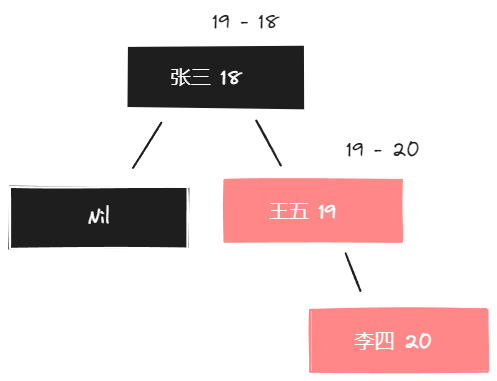

当前节点20，父节点19为红色，叔叔为黑色，20为19的右孩子：

- 将“父节点”设为“黑色”
- 将“祖父节点”设为“红色”
- 以“祖父节点”为支点进行左旋

然后添加赵六，跟根节点比较，26-19为正，存右边，跟20比较，26-20为正，存右边：

当前节点26，父节点20为红色，叔叔为红色：

取出元素：

首先判断根节点，左边有元素，取出18，再取出自己19，然后取右边，判断20左边没有元素，然后取出20，再取出右边，判断26，26左边没有元素，取中间26，再取右边，右边没有元素，结束：

如果反着减：

那么就是降序排序：

### 窍门

在`compareTo()`中：

> - `this`- `o`，升序。
> - `o`- `this`，降序。

### 复杂情况

如果只是比较年龄，那么比较逻辑就过于简单了，无法处理一些特殊情况，比如，当学生的年龄都相同时，按照`compareTo()`中的逻辑，只会存储一个学生：

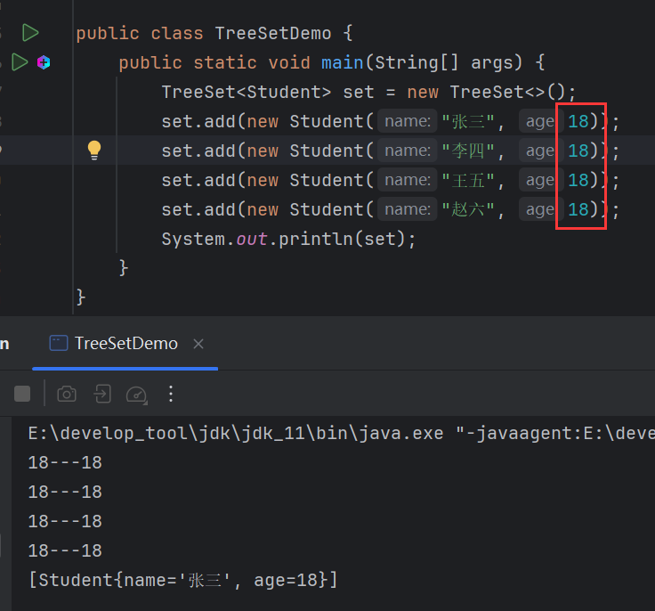

针对这种情况，就不能只比较年龄，还得比较姓名。姓名不像年龄是一个数字，可以做差，姓名是一共字符串，字符串如何比较呢？

其实`String`实现了`Comparable`，它自己定义了一套字符串比较规则：

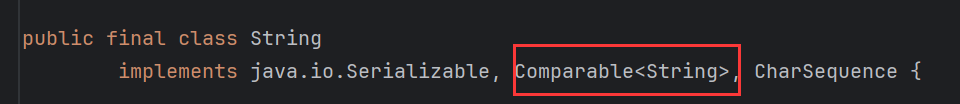

调用字符串的`compareTo()`：

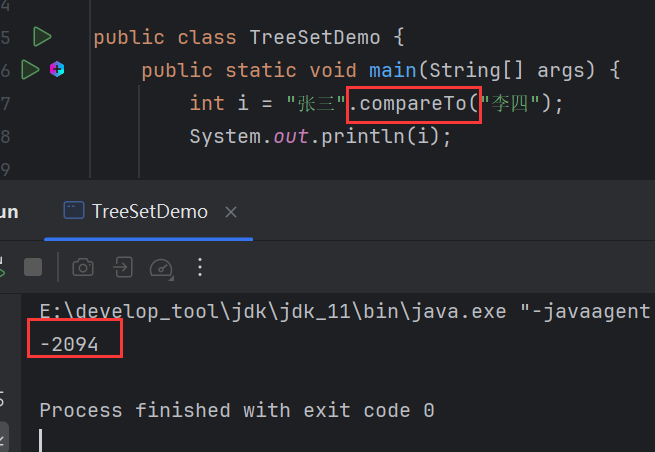

按照字符串的比较规则，在字符串`TreeSet`中，字符串的排序也是特殊的：

即按照字母表顺序排序，也按照字符个数排序，同时当个数相同时，一开始都是比较首字母，然后再比较后续字母：

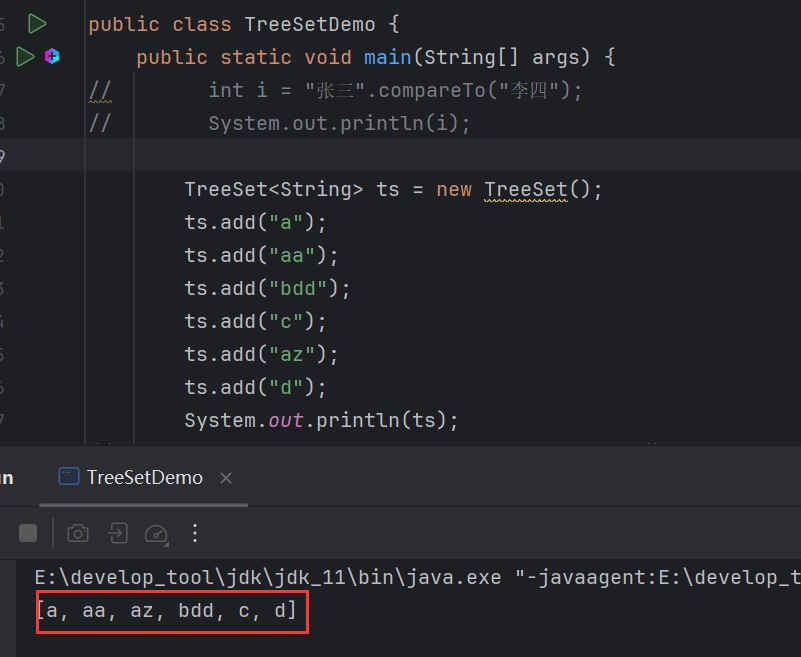

所以可以利用这个排序规则，加以改造，让学生既能比较年龄，又能比较姓名：

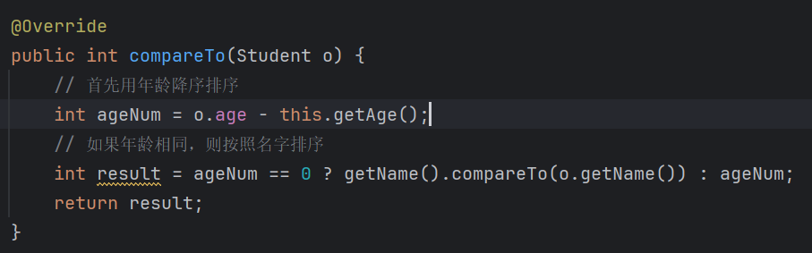

结果：

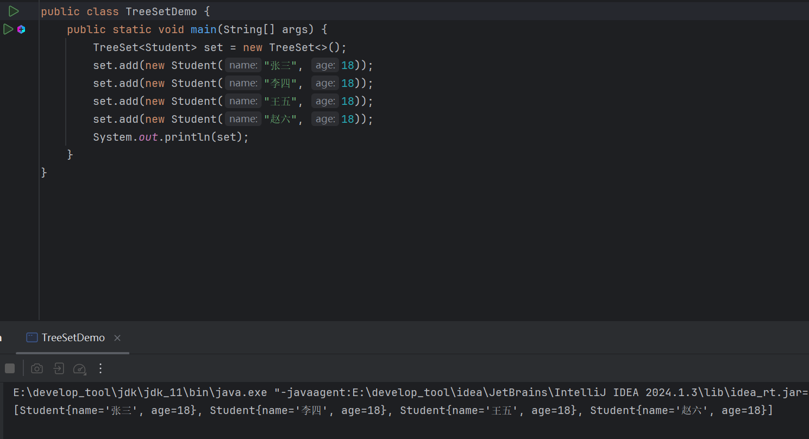

如果还存在一种极端情况，比较姓名都是一样的：

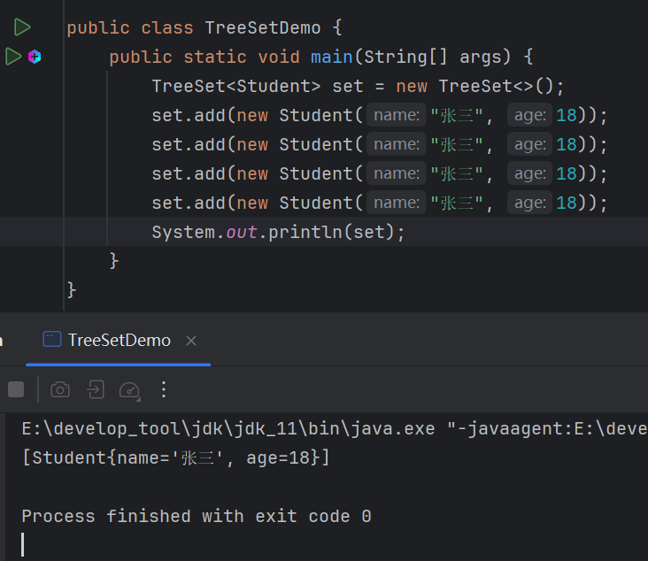

那么这时候可以这样操作，姓名一样，就是字符串的`compareTo()`返回0，那么当它返回0时作特处理即可：

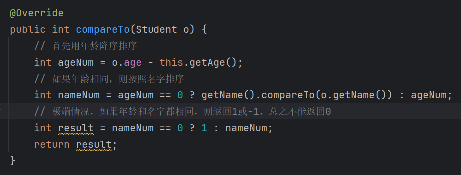

结果：

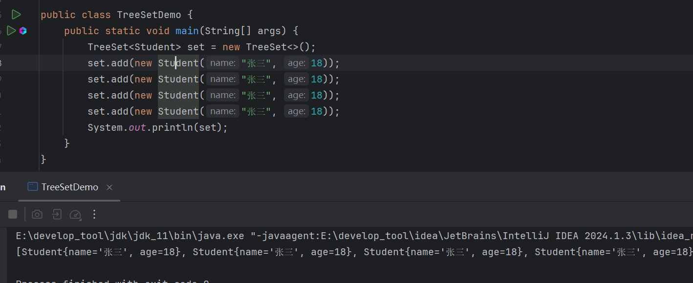

## 比较器排序

`TreeSet`除了自然排序，还有一种比较器排序。

**流程**：

> 1. 在`TreeSet`的构造方法中，传入`Compartor`接口的实现类对象。
> 2. 重写`compare()`方法。
> 3. 根据方法的返回值，来组织排序规则。

### Compartor

`Compartor`是比较器接口

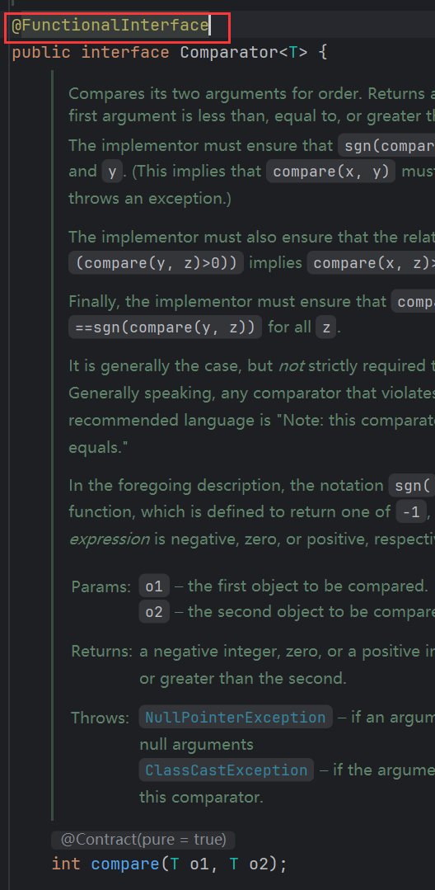

`compare()`接收两个参数，即需要比较的两个元素，如果在`TreeSet`中，使用`compare()`那么`o1`是当前节点，`o2`是上一个节点。

在`TreeSet`构造器中，创建比较器，用`lambda`来创建比较器实例，用年龄来比较：

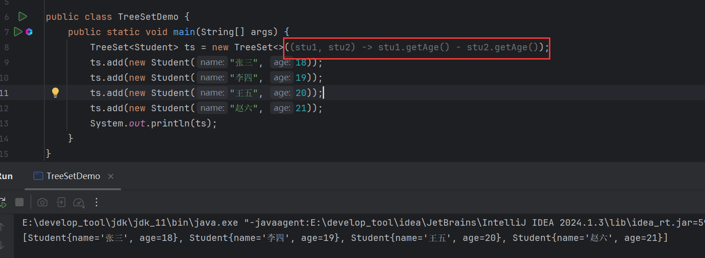

完善比较逻辑：

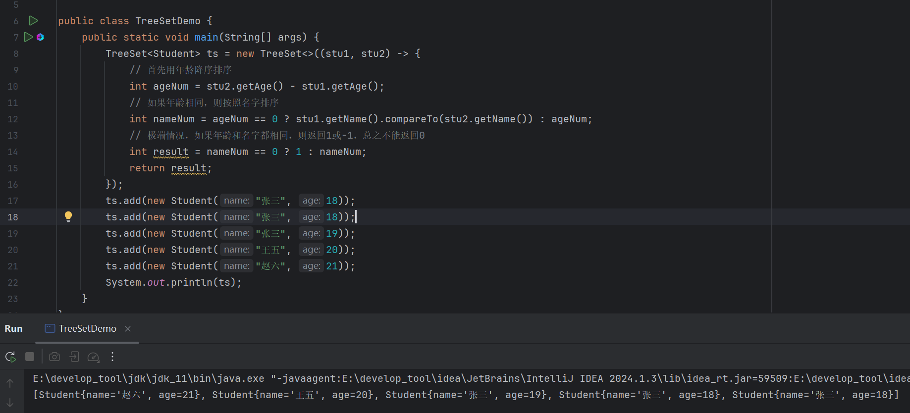

### 细节

如果改变比较器的逻辑：

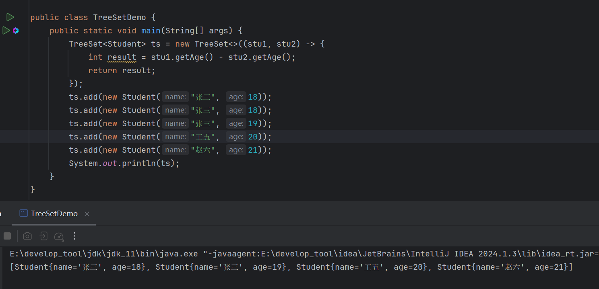

那么排序规则也会跟着变，但是需要注意的是当前的`Student`对象还有`compareTo()`自然排序规则，但是从打印结果可以看出，自然排序规则被比较器覆盖了，因此可以得出一共结论：

> 当比较器排序和自然排序**同时存在时**，**比较器**排序的比较规则**优先级更高**。

根据这个特点，如果某些情况下，对于已存在的自然排序不满意，但又无法改变自然排序，那么可以通过比较器覆盖掉自然排序的规则，比如字符串的排序：

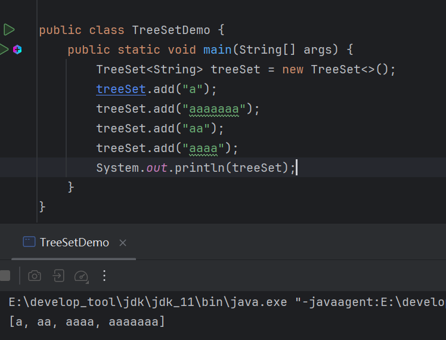

默认情况下是正序，如果要改变排序规则，就需要修改`String`的`compareTo()`，但是`String`无法修改其源码，那么可以定义比较器来覆盖掉比较规则：

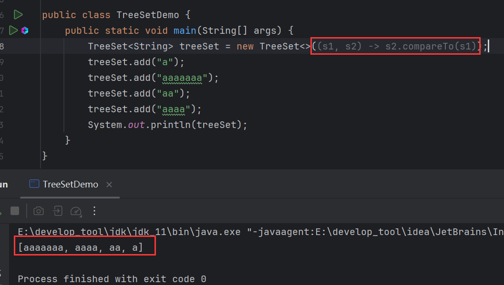