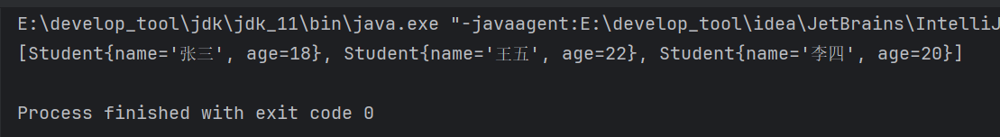
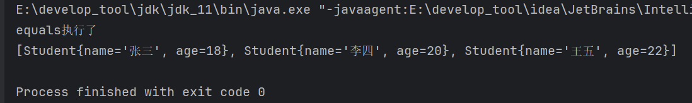
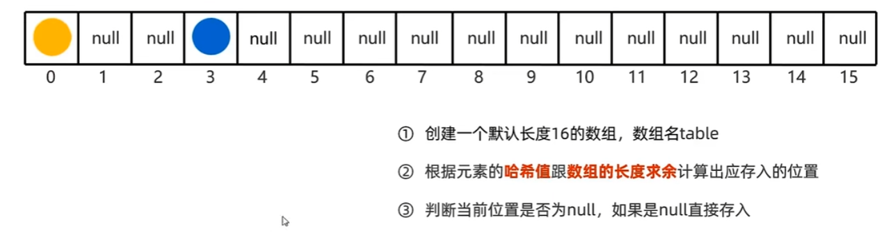
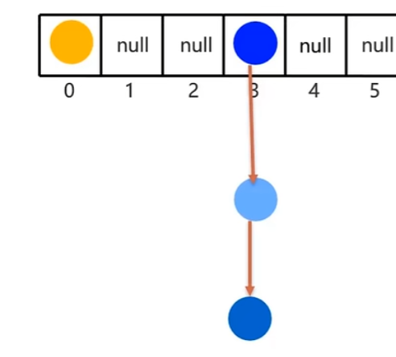
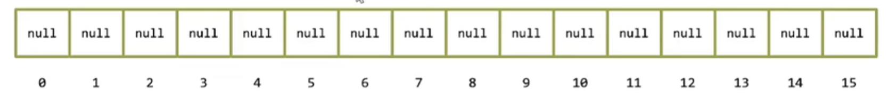

# 1 HashSet

> - 【HashSet】集合底层采取**哈希表**存储数据
> - 哈希表是一种对于增删改查数据性能都较好的结构

## 1.1 特点

> 能保证元素的唯一性。

声明字符串【HashSet】，存入重复数据：


如果存入自定义的对象如【Student】，存入重复数据：


发现并没有去重。为什么自定义的类没有去重呢？结合【new】关键字，很容易想到，这里比较的应该是对象地址值，如果要比较对象内容，那么就需要重写【equals()】。

使用idea快捷方式重写，它同时还生成了【hashCode()】，先将【hashCode()】注释起来，只保留【equals()】：


再次执行：


依然没有去重，那么放开【hashCode()】：


再次执行：



成功去重。

如果只保留【hashCode()】：


也无法去重。

> 【HashSet】中的元素如果需要去重，元素对象必须同时重写【equals()】和【hashCode()】。

## 1.2 equals()和hashCode()的配合流程

观察发现【hashCode()】返回一个【int】类型，现在将该方法改为：


然后打印【equals()】的执行：


再次执行：


添加4个元素，【equals()】执行了6次。

下面是图解：

【HashSet】底层采用哈希表结构：

- 在JDK8以前，哈希表 = 数组 + 链表。
- 在JDK8以后，哈希表 = 数组 + 链表 + 红黑树。

先看数组 + 链表的情况，当创建一个【HashSet】，底层就有一共哈希表结构，而这个哈希表一开始就是一个数组：


 当【HashSet】中添加元素时，就会自动调用元素对象的【hashCode()】来得到一个【int】值，这个值可以理解为数组的下标。当添加张三时，张三就调用会【hashCode()】，返回一个1，然后张三来到1号索引的位置上，但是它并不会真正的存入在数组中，而是存入在一个链表中，然后让这个链表挂在1号位置上：


当存入李四时，李四也会调用【hashCode()】，返回1，它也来到1号位，但是发现1号位已经有元素了，那么这时就会调用【equals()】方法来比较两者，这是【equals()】第一次被调用，张三不等于李四，那么存入李四，存储在链表中：


同理，存入王五时，也会调用【hashCode()】，返回1，来到1号位，发现有元素，与张三和李四进行比较，这是第2次和第3次调用【equals()】，比较完后，不相等，存入王五：


然后再次存入王五，调用【hashCode()】，返回1，来到1号位，发现有3个元素，于是依次比较，一共比较3次，这是第4、5、6次调用【equals()】，当比较到王五时，发现**内容一致**，而且**位置也一样**，那么这两个对象就是相等的，就不会存储这个王五。

最终集合中一共就存入3个元素，【equals()】被调用6次。

综上，流程如下：

1. 当添加对象的时候，会先调用对象的【hashCode()】计算出一个应该存入的索引位置，查看该位置上是否存在元素。
2. 如果没有元素，那么直接存入，不会调用【equals()】。
3. 如果存在元素，那么会调用【equals()】方法比较内容。
   1. 如果返回【false】，则位置一样，内容不同，可以存入。
   2. 如果返回【true】，则位置一样，内容也一样，不能存入。

上面的演示中存在一共问题，就是【hashCode()】返回的都是1，导致没有元素都会在1号位上存储，这样数组的其他位置就会浪费掉，而且同一个位置上存储也会导致链表过长，查询效率降低。

如何避免这个问题呢？就需要根据对象的属性来返回【int】值，比如返回年龄：


再次执行：



【equals()】只调用了一次，因为前3个学生的年龄不同，那么他们就会存储在不同的数组位上，只有第四个学年龄与第三个相同，所以他会来到第三个学生的位置上，发现已经有第三个学生了，于是调用【equals()】比较：


但是这样依然存在问题，如果所有学的年龄都是一样的：


那么这些元素依然会存储在同一个数组位上，【equals()】执行了6次，所以为了避免这种情况，还得将姓名也考虑进去。但是姓名是一个字符串，如何返回一个【int】值？

【Object】是所有类的父类，也是【String】的父类，那么【String】自然继承了【hashCode()】，通过【hashCode()】来返回【int】值，【String】内部重写了【hashCode()】，以字符来计算【int】值：


执行：


【equals()】只执行了1次，也就是比较两个王五那里。哪怕年龄相同，姓名不一样，【hashCode()】也不一定一样。

> 重写【hashCode()】方法时，尽量将对象的所有属性都考虑进去进行计算，因为这样**哈希值相同**的**概率**才会比**较小**。

两个字符串不一样，也可能出现哈希冲突(哈希值一样)的情况：


把所有属性都参与到计算只能是让哈希冲突的概率降低。所以才会有【equals】比较，即便哈希值一样，也就是存储的数组位置一样，也要比较内容，内容不同才会存入，否则不会存入。

使用快捷键生成的【hashCode()】就将所以属性都考虑进行计算：


# 2 原理解析

## 2.1 JDK8之前

JDK8以前，底层哈希表为数组+链表：

创建【HashSet】底层会有一个长度16的数组，数组中有默认值，都是【null】：


当添加元素时，会根据元素的**哈希值**跟**数组长度求余**计算出存储的索引位置。


并不是直接根据哈希值来存入，否则如果一个哈希值为1万左右的数，难道还要有1万长度的数组吗，这不现实。

当计算出存储索引后，就会判断索引位置上的元素是不是【null】，如果是直接存入。

比如，元素计算出的索引位置为3：


3号位上元素为【null】，直接存入：


另一个元素也是如此：




如果索引位上的元素不是【null】，表示该位置上已经存在元素，那么调用【equals()】比较。如果一样，不存，如果不一样，存入数组：


存入方法为头插法，即新元素占据老元素的位置，然后指向老元素：

首先老元素让出位置：


新元素占用这个位置：


并指向老元素：


假设新元素的索引位置还是3：


则，调用【equals()】一一比较


所有比完，都不一样，那么老元素让出位置，新元素占用位置，指向老元素：



## 2.2 JDK8之后

底层哈希表 = 数组 + 链表 + 红黑树。

当创建一个【HashSet】，底层就会存在一个长度为16的数组。【HashSet】的构造中会创建一个【HashMap】：


【HashMap】的API介绍如下：

> 使用默认初始容量(16)和默认加载因子(0.75)构造一个空【HashMap】。

可以这个长度为16的数组并非是【HashSet】创建的，而是【HashMap】创建的。

一开始，数组中的元素都是【null】：



当调用添加方法时，会通过对象的【hashCode】计算出存储位置(哈希值 % 数组长度)。

为什么要用哈希值 % 数组长度，来当作索引位，而不是直接用哈希值呢？其实上面已经解释过了，如果直接用哈希值，哈希值万一很大，就需要有足够长的数组才能存进行，否则就是数组长度越界，但是内存资源是有限的，不可能有足够长度的数组。

内部的添加方法，调用的是【HashMap】的【put()】：


在【put()】中又调用了【putVal()】：


【putVal()】中又调用了【hash()】，【e】传递到【key】参数这里，即【key】就是存入的对象，在【hash()】中：


首先判断了对象是否为【null】，如果是，则返回0，如果不是，那么调用对象的【hashCode()】返回一个哈希值，姑且叫做原始哈希值，将原始哈希值赋值给【h】，然后让原始哈希值右移16位后与原始哈希值进行异或运算，然后才将值返回。

让原始哈希值右移16位的过程叫做**哈希扰动**。

哈希扰动后的值与原始哈希值进行异或运算叫做**二次哈希**。

为什么不直接返回原始哈希值，而是要做一系列计算后再返回值？

看这段代码：


将这些数字的二进制打印出来：

```java
1000110111010100000000000000010
1000100110010110000000000000000
1000011110100110000000000000010
1100010011110010000000000000010
100001010000000000000000000010
```

观察可以发现，即便这些数相差很大，但是这些数的二进制后面部分非常相似：


如果直接用原始哈希值来与16取模：


结果：


发现，即便又多个数相差很大，但是计算出的哈希值都是一样的(2)，这导致这些数据都挂在了2号位置上，这样查询效率就会降低。

如果进行了哈希扰动和二次哈希，在与16取模：


结果：


这次的结果中，相同的哈希值就会减少，这样挂在同一个索引位上的节点就会减少，相应的，查询效率也会提高。

因为这些数的原始哈希值后16位都非常相似：


因此右移16位，清除这些相似的部分，让前面差距较大的部分来顶替这些部分，从而让哈希计算的结果尽量不一致：


> 所以进行哈希扰动和二次哈希的原因就是，让2进制数中相差较大的高位能参与到运算中，从而让计算出的哈希值出现哈希冲突的概率降低，可以一定程度的臧少链表挂载的数量。

计算索引位的时候需要将新哈希值与数组长度也就是16进行取模运算，但是在源码中，java采用了一个高效的运算：


其中，【tab】就是底层的数组，将数组长度赋值给【n】，索引位【i】数组长度(16)-1再与新哈希值进行与运算，这其实等效于新哈希值 % 16。两者计算的结果是一样的：


也就是说java并没有使用新哈希值与数组长度取余来得到索引位，而是采用等效(数组长度-1)&新哈希值。

因为&操作在二进制层面效率更高。
