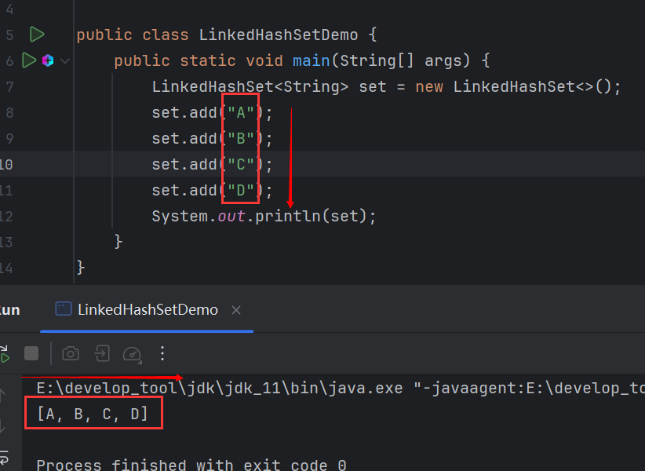
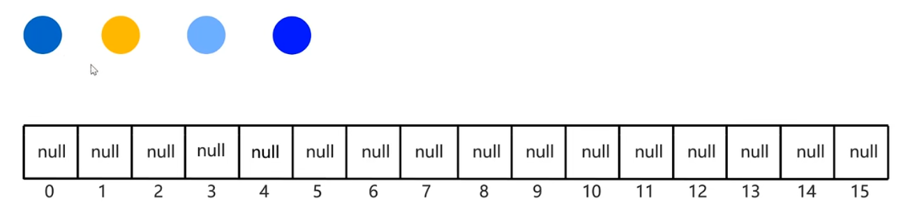
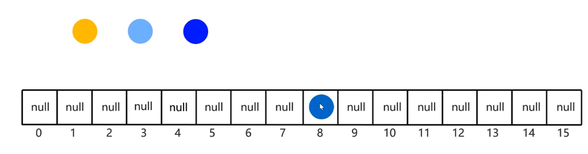
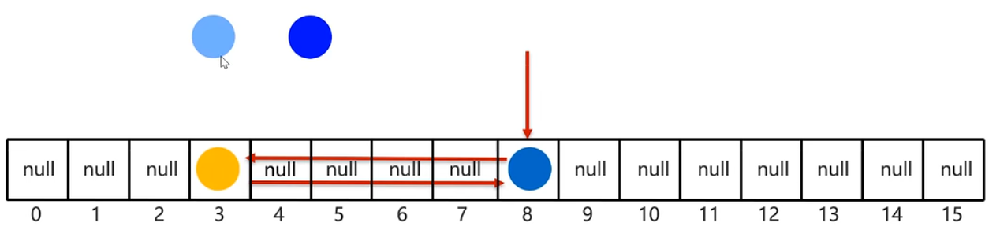
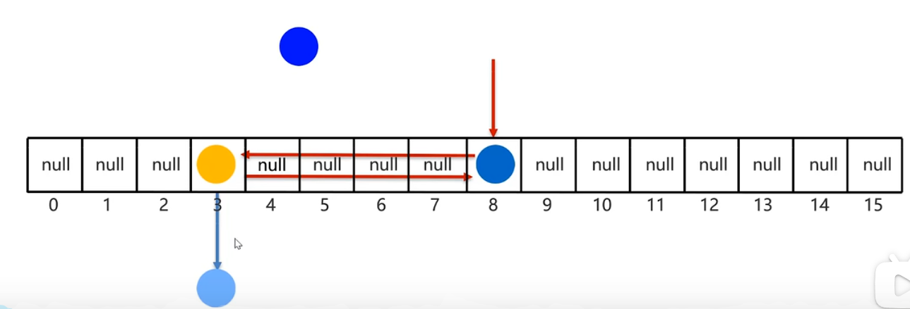
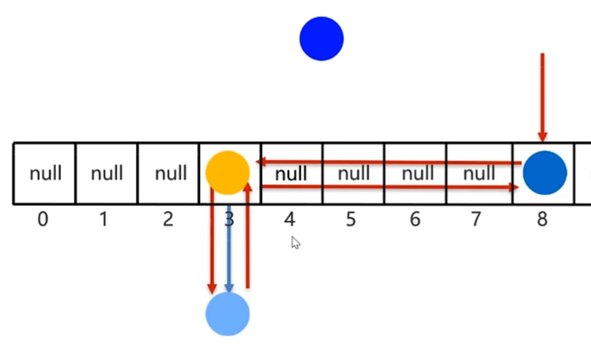
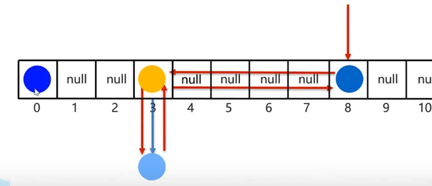
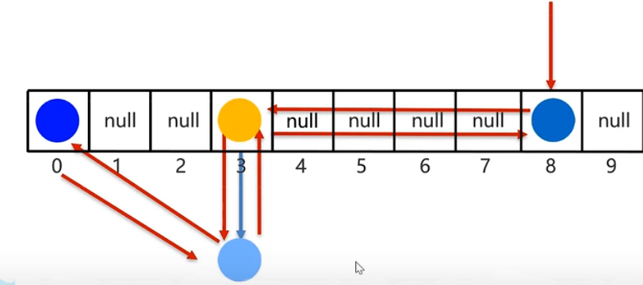

# LinkedHashSet

> **存取有序**，去重。

`LinkedHashSet`是`Set`体系下唯一一个存取有序的集合。

## 实现原理

> `LinkedHashSet`底层数据结构是依然哈希表，只是每个元素又额外的多了一个双链表的机制记录存储的顺序。

当前4个元素和哈希表：

然后添加元素，假设计算的索引位置为8：

由于每一个元素又额外的多了一个双链表的机制记录存储的顺序，因此当第二个元素会与第一个元素彼此记录：

然后是第3个元素，假设第3个元素的索引为也是3，那么他会挂在黄色元素的后面：

同时，双向链表彼此记录：

第4个添加：

然后与第3个相互指向：

有了这个双链表，就能按照顺序取出元素，这也是存取有序的原因。