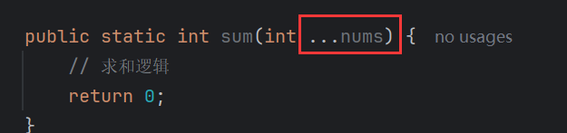
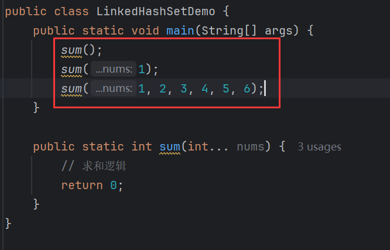
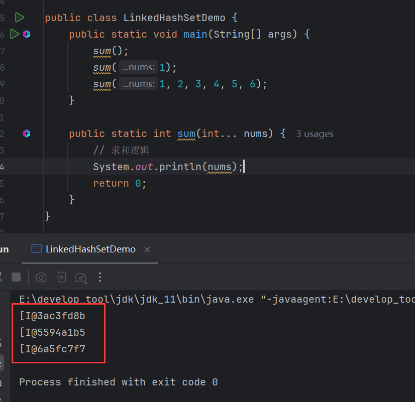
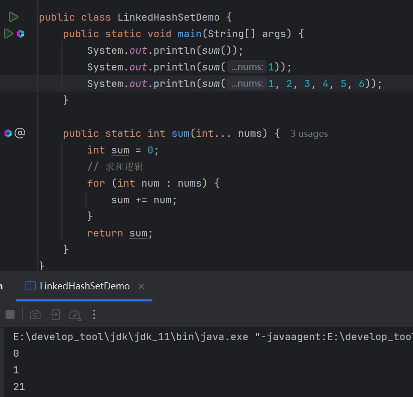
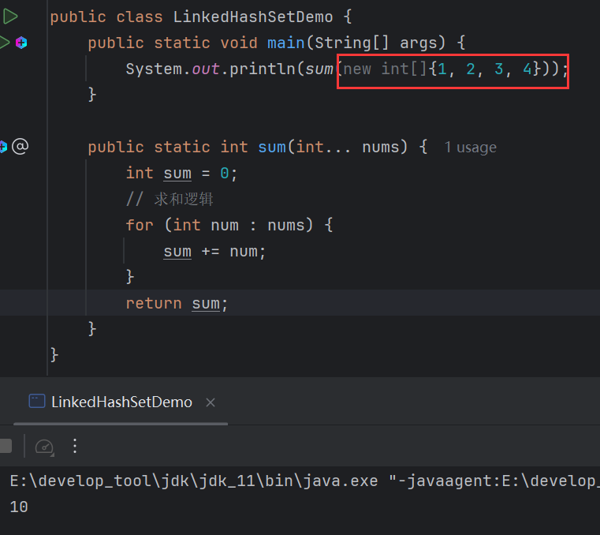
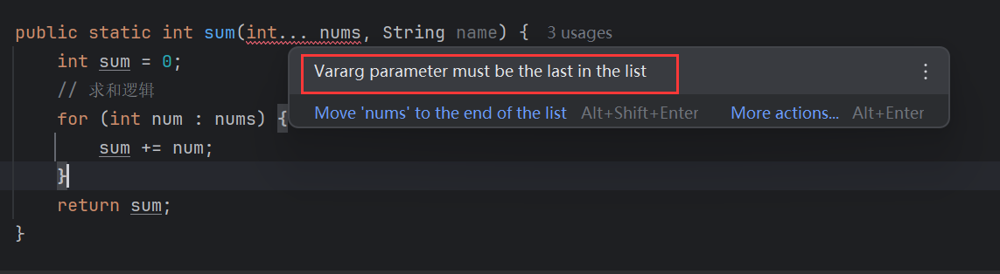
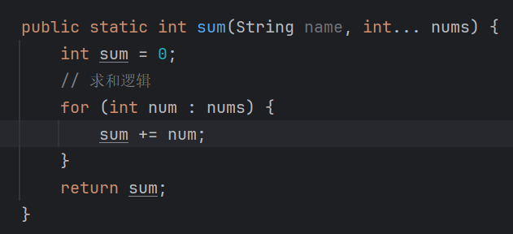
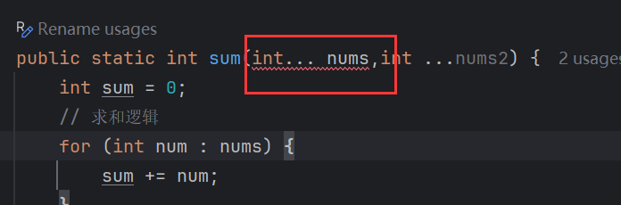

# 可变参数

## 语法

```java
方法名(数据类型 ...参数名){};
```

就是用`...`来修饰参数。

## 使用时机

当无法确定一个方法需要几个参数时，就可以使用可变参数。

比如一个求和方法：



可以不给参数、可以给一个参数、可以给多个参数：



## 本质

> 本质是一个数组，用数组来接收这些实参。

打印可变参数：



打印出了一维数组的地址值，可见，可变参数本质上就是一个数组：



可以直接传入数组：



## 注意

> 如果声明了可变参数，还要声明其他参数，那么可变参数需要放在最后。

假设可变参数是A参数，其他参数是B参数，如果放在前面，会存在起义，因为可变参数可以接受任意个数的参数，所以java不知道多少个参数以后才是B参数。





> 一个形参列表只允许一个可变参数。

