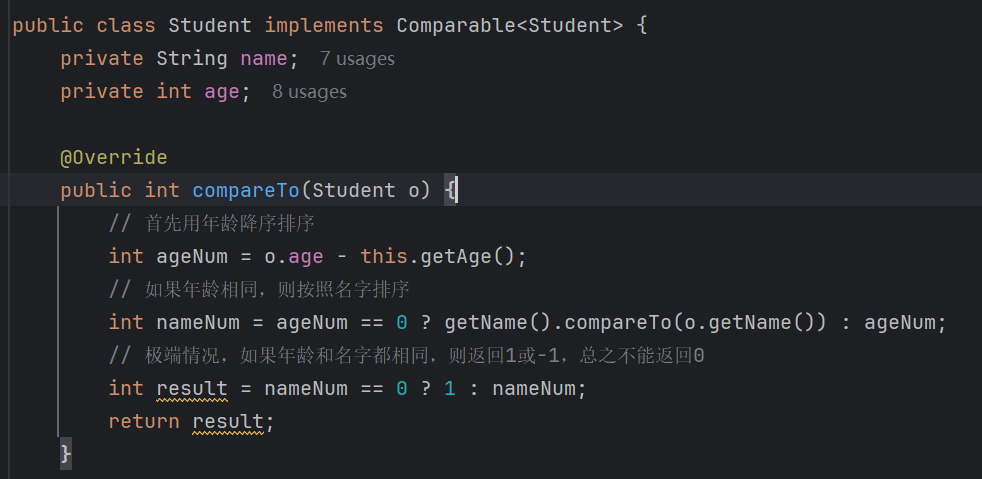

# Collections

> 非集合，而是操作集合的工具类，定位同`Arrays`。

## addAll()

```java
public static <T> boolean addAll(Collection<? super T> c, T ...elements){};
```

> 批量添加。
>
> - 第一个参数是需要操作的集合。
> - 第二个参数是可变参数，即批量添加的元素。


## shuffle()

```java
public static void shuffle(List<?> list){};
```

> 随机打乱数组中元素排序，即洗牌。


## binarySearch()

```java
public static <T> int binarySearch(List<?> list, T key){};
```

> 二分查找，前提是集合排好序。


## max()/min()

```java
public static <T extends Object & Comparable<? super T>> T max(Collection<T> coll){};
public static <T extends Object & Comparable<? super T>> T min(Collection<T> coll){};
```

> 根据**自然排序**返回最大值或最小值。
>
> 所以，如果对象内部没有比较方法，就会报错。


自定义的类，如学生类，如果直接调用`max()`会报错：


因为类没有实现`Comparable`接口：


实现后，不再报错：




## swap()

```java
public static <T> int swap(List<?> list, int i, int j){};
```

> 交换集合中的元素，传入索引位置。


## sort()

```java
public static <T> void sort(List<T> list){};
// 若不满意原来的排序规则，可以传入比较器自定义比较规则
public static <T> void sort(List<T> list, Comparator<? super T> c){};
```

> 排序，需要集合中元素有可比性，即实现`Comparable`。


默认是升序，因为`Integer`中定义的排序规则就是升序，如果要降序，则自定义比较器，覆盖掉原规则：

