# 1 Map

> - `Map`是一个接口，`Map`集合是一种双列集合，每个元素包含两个数据。
>
> - `Map`集合的每个元素的格式: `key = value`(键值对元素)。
>
>   在键值对中：
>
>   - `key`不允许重复。
>   - `value`允许重复。
>   - 键与值是一一对应关系，即一个建只能对应一个值。
>   - 键值对或称**键值对对象**，在java中用`Entry`对象表示。

## 1.1 使用场景

场景不固定，需灵活变通 。

在购物车场景中，用户购物车中的每一个商品都对应一个店铺，或者说每一个店铺都对应n个商品，这就是一个典型的键值对关系。一个商品可能有一个，也可能有多个，所以还存在单列集合关系：

```java
Map<店铺对象, List<商品对象>>
```

## 1.2 接口方法

### 1.2.1 put()

```java
public V put(K key, V value){};
```

> `Map`体系集合的添加方法，返回被覆盖的值。若`key`存在，则新值覆盖旧值。

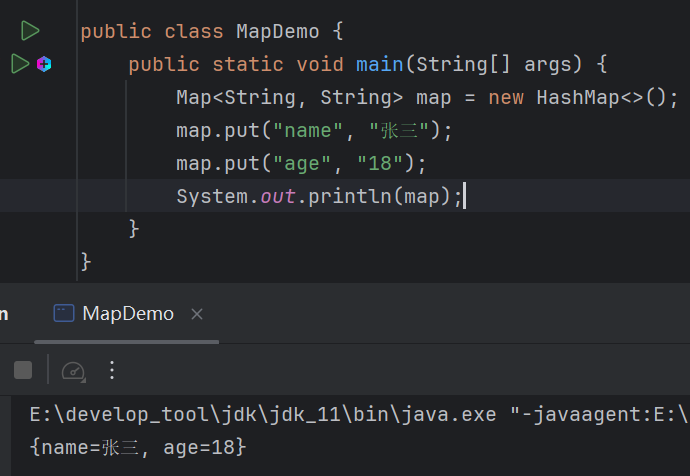

键值对中值可以重复：

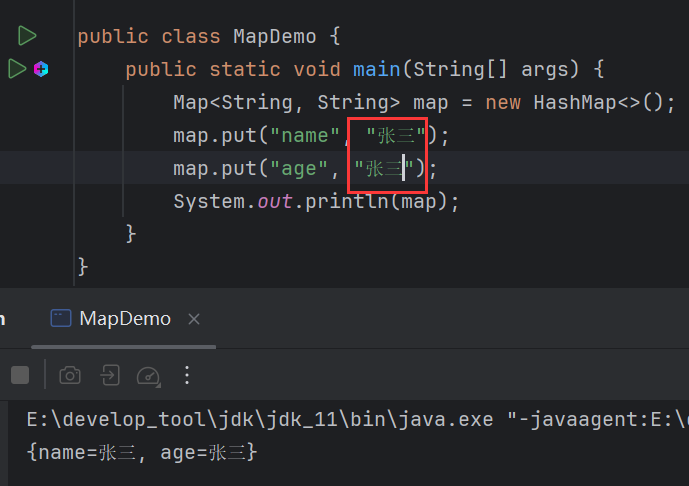

但是键不能重复：

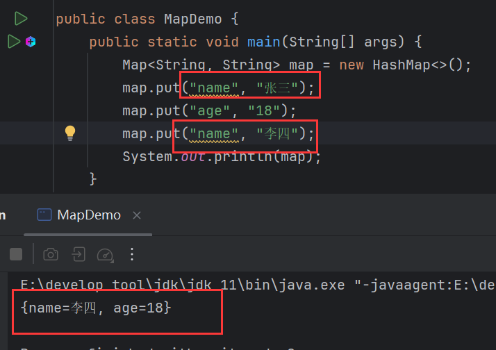

如果`key`已存在，那么`put()`会用新值覆盖旧值。新值"李四"覆盖了"张三"。 

打印返回值：

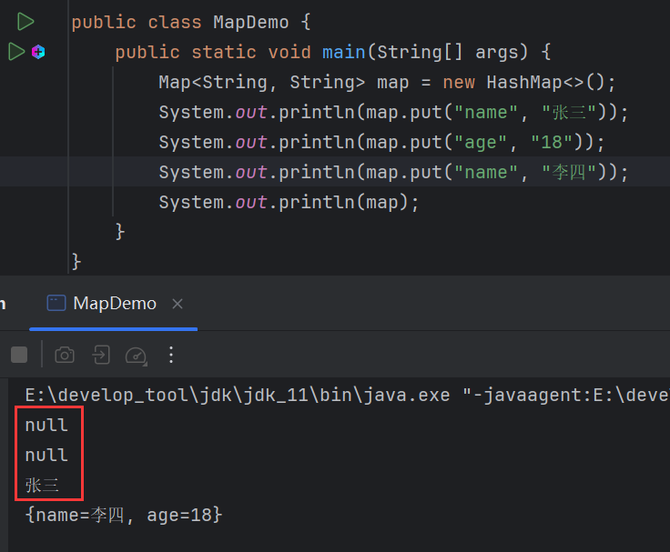

一开始还未添加时，`value`的值是`null`，当添加前两个，`null`被"张三"和"18"覆盖，当添加第3个时，`name`重复，"张三"被"李四"覆盖。

### 1.2.2 remove()

```java
public V remove(Object key){};
```

> `Map`体系集合的删除方法，通过键删除，删除整个键值对，返回键对应的值。

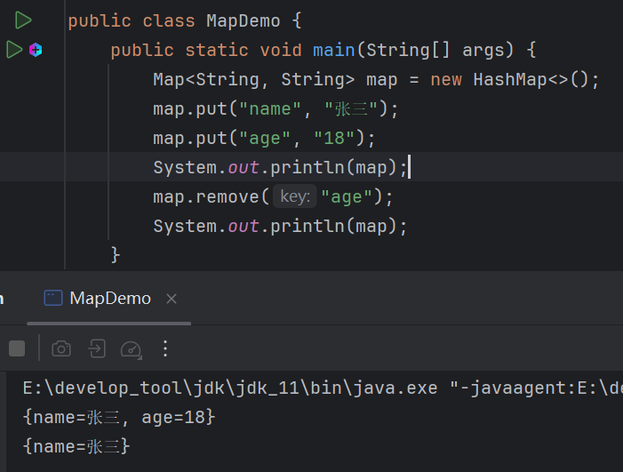

### 1.2.3 clear()

```java
public void clear(){};
```

> 删除所有键值对。

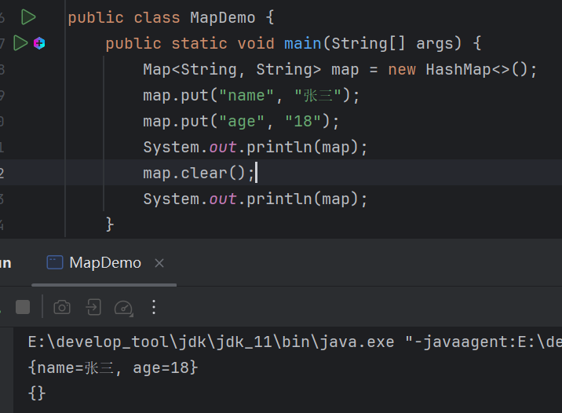

### 1.2.4 isEmpty()

```java
public boolean isEmpty(){};
```

> 判断`Map`是否为空。

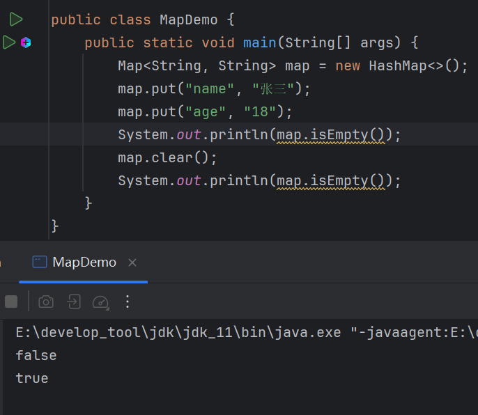

### 1.2.5 size()

```java
public int size(){};
```

> 返回`Map`中键值对个数。

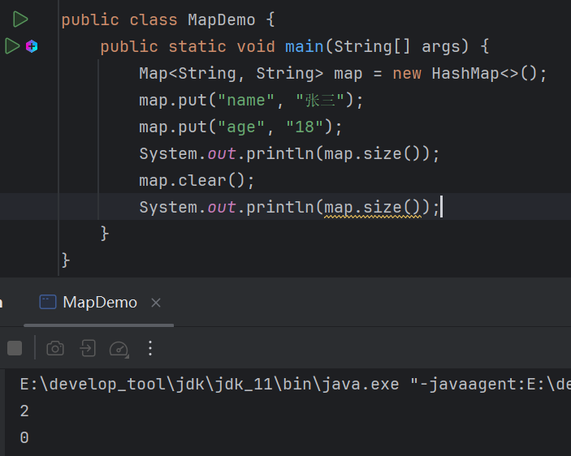

### 1.2.6 containsKey()

```java
public boolean containsKey(Object Key){};
```

> 判断`Map`中是否包含传入的键。

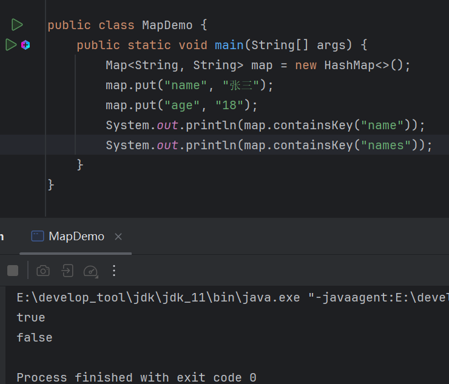

### 1.2.7 containsValue()

```java
public boolean containsValue(Object value){};
```

> 判断`Map`中是否包含传入的值。

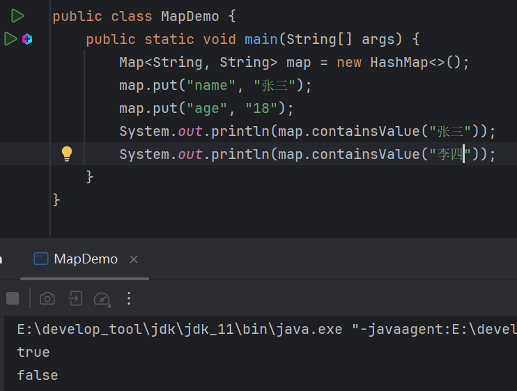


# 2 Map实现类

> `Map`中的特点只针对于**键**。
>
> - `HashMap`，保证**键**唯一。
> - `TreeMap`，保证**键**排序
> - `LinkedHashMap`，保证**键**，存取有序，且唯一。

## 2.1 HashMap

> 底层采用哈希表，同`HashSet`能保证唯一性，`Map`中的特点只针对于键，所以只能保证键唯一。

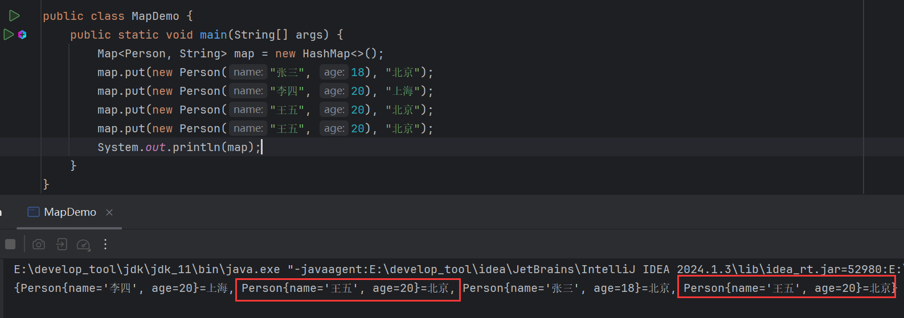

为什么会存在相同的键？结合`HashSet`去重原理，很容易想到`Person`没有重写`equals()`和`hashCode()`：

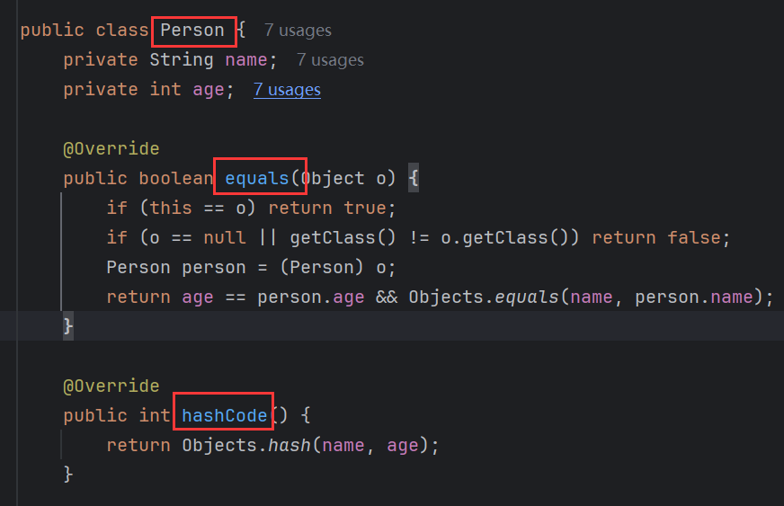

去重成功：

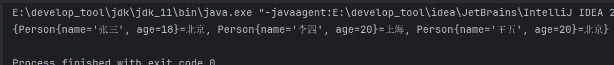

> `HashMap`保证键唯一，需要键对象重写`equals()`和`hashCode()`。

## 2.2 TreeMap

> 底层采用红黑树，同`TreeSet`能保证排序，`Map`中的特点只针对于键，所以只能保证键排序。

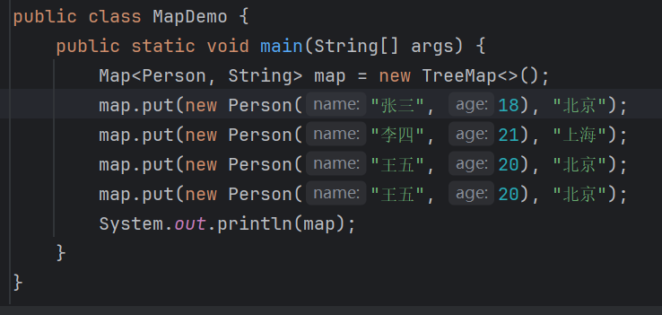

结果报错：

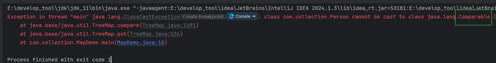

跟`TreeSet`报错一致，类没有实现`Comparable`接口：

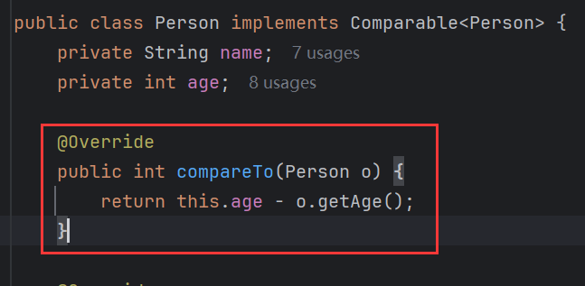

不再报错，且键(`Person`)按照年龄排序，年龄相同则不存：

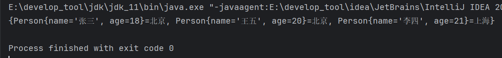

> `TreeMap`保证键排序，需要键对象重写实现`Comparable`，重写`compareTo()`。

## 2.3 LinkedHashMap

> 底层采用哈希表和双向链表，同`LinkedHashSet`能保证存取有序，且唯一，`Map`中的特点只针对于键，所以只能保证键存取有序，且唯一。

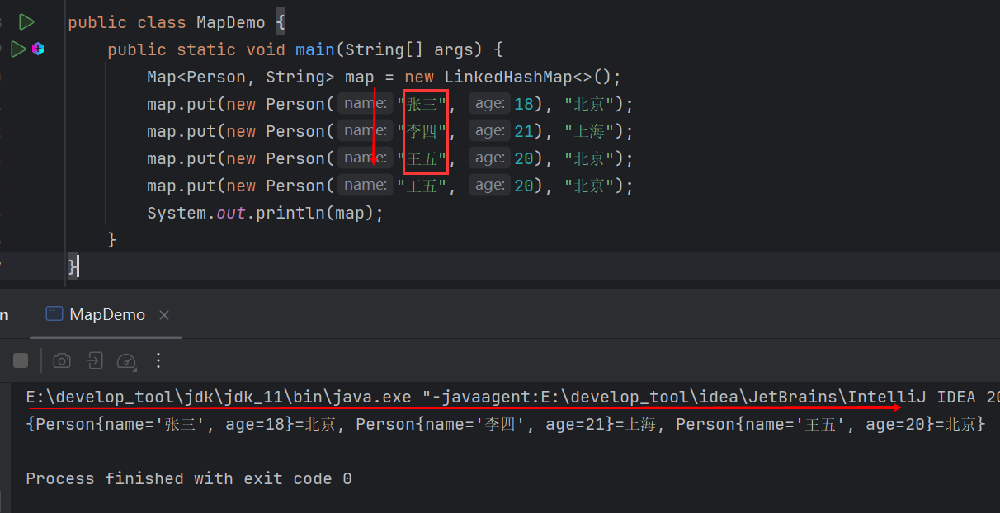

> 底层采用哈希表，所以要去重，需要键对象重写`equals()`和`hashCode()`。